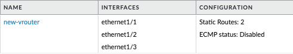
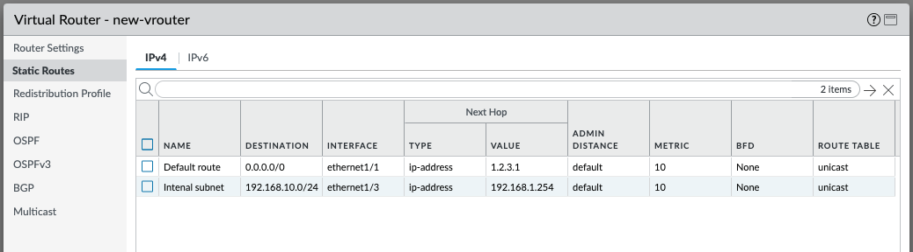

import Assumptions from "../_assumptions.md";
import LabGuidance from "/products/shared/_lab-guidance.md";
import ClosingNotes from "../_closingnotes.md";

# Configuration Tasks

With this playbook, you will create items in a PAN-OS next-generation firewall, in order to perform configuration of PAN-OS "as-code". This is one of the most common use case for Ansible in relation to PAN-OS.

<Assumptions />

<LabGuidance />

## Zones, interfaces and routes

In this tutorial, you will create a number of items related to networking. This will include a virtual router, security zones, networking interfaces, and static routes. Then you will commit the configuration to make the changes live.

## Create a virtual router and some security zones

1. Create a file called `create-vr-and-zones.yml` and paste in the following content:

```yaml
---
- name: Create VR and Zones
  hosts: "firewall"
  connection: local

  vars:
    device:
      ip_address: "{{ ip_address }}"
      username: "{{ username }}"
      password: "{{ password }}"

  collections:
    - paloaltonetworks.panos

  tasks:
    - name: Create new Virtual Router
      paloaltonetworks.panos.panos_virtual_router:
        provider: "{{ device }}"
        name: "new-vrouter"

    - name: Create zone for Internet
      paloaltonetworks.panos.panos_zone:
        provider: "{{ device }}"
        zone: "internet"
        mode: "layer3"
        enable_userid: false

    - name: Create zone for DMZ
      paloaltonetworks.panos.panos_zone:
        provider: "{{ device }}"
        zone: "dmz"
        mode: "layer3"
        enable_userid: false

    - name: Create zone for Users
      paloaltonetworks.panos.panos_zone:
        provider: "{{ device }}"
        zone: "users"
        mode: "layer3"
        enable_userid: true
```

2. Execute the playbook with the following command:

```
ansible-playbook -i inventory.txt --ask-vault-pass create-vr-and-zones.yml
```

3. The output should be something similar to this:

```
PLAY [Create VR and Zones] *******************************************************************************************************************************

TASK [Gathering Facts] ***********************************************************************************************************************************
ok: [firewall]

TASK [Create new Virtual Router] *************************************************************************************************************************
changed: [firewall]

TASK [Create zone for Internet] **************************************************************************************************************************
changed: [firewall]

TASK [Create zone for DMZ] *******************************************************************************************************************************
changed: [firewall]

TASK [Create zone for Users] *****************************************************************************************************************************
changed: [firewall]

PLAY RECAP ***********************************************************************************************************************************************
firewall                   : ok=5    changed=4    unreachable=0    failed=0    skipped=0    rescued=0    ignored=0
```

4. Login to the PAN-OS GUI and confirm that the virtual router `new-vrouter` has been created, and the three new zones `internet` `dmz` and `users` have been created.


## Configure networking interfaces and create static routes

5. Create a file called `create-interfaces-and-routes.yml` and paste in the following content:

```yaml
---
- name: Configure networking
  hosts: "firewall"
  connection: local

  vars:
    device:
      ip_address: "{{ ip_address }}"
      username: "{{ username }}"
      password: "{{ password }}"

  collections:
    - paloaltonetworks.panos

  tasks:
    - name: Configure Internet-facing interface
      paloaltonetworks.panos.panos_interface:
        provider: "{{ device }}"
        if_name: "ethernet1/1"
        vr_name: "new-vrouter"
        mode: "layer3"
        ip: ["1.2.3.5/24"]
        enable_dhcp: false
        zone_name: "internet"

    - name: Configure DMZ-facing interface
      paloaltonetworks.panos.panos_interface:
        provider: "{{ device }}"
        if_name: "ethernet1/2"
        vr_name: "new-vrouter"
        mode: "layer3"
        ip: ["172.16.18.1/24"]
        enable_dhcp: false
        zone_name: "dmz"

    - name: Configure user-facing interface
      paloaltonetworks.panos.panos_interface:
        provider: "{{ device }}"
        if_name: "ethernet1/3"
        vr_name: "new-vrouter"
        mode: "layer3"
        ip: ["192.168.1.1/24"]
        enable_dhcp: false
        zone_name: "users"

    - name: Create default route
      paloaltonetworks.panos.panos_static_route:
        provider: "{{ device }}"
        name: "Default route"
        virtual_router: "new-vrouter"
        destination: "0.0.0.0/0"
        interface: "ethernet1/1"
        nexthop: "1.2.3.1"

    - name: Create route for internal subnet
      paloaltonetworks.panos.panos_static_route:
        provider: "{{ device }}"
        name: "Internal subnet"
        virtual_router: "new-vrouter"
        destination: "192.168.10.0/24"
        interface: "ethernet1/3"
        nexthop: "192.168.1.254"
```

6. Execute the playbook with the following command:

```
ansible-playbook -i inventory.txt --ask-vault-pass create-interfaces-and-routes.yml
```

7. The output should be something similar to this:

```
PLAY [Configure interfaces and create static routes] *****************************************************************************************************

TASK [Gathering Facts] ***********************************************************************************************************************************
ok: [firewall]

TASK [Configure Internet-facing interface] ***************************************************************************************************************
changed: [firewall]

TASK [Configure DMZ-facing interface] ********************************************************************************************************************
changed: [firewall]

TASK [Configure user-facing interface] *******************************************************************************************************************
changed: [firewall]

TASK [Create default route] ******************************************************************************************************************************
changed: [firewall]

TASK [Create route for internal subnet] ******************************************************************************************************************
changed: [firewall]

PLAY RECAP ***********************************************************************************************************************************************
firewall                   : ok=6    changed=5    unreachable=0    failed=0    skipped=0    rescued=0    ignored=0
```

8. Login to the PAN-OS GUI and confirm that `new-vrouter` now has three network interfaces, and that two static routes have been created.






## Commit the configuration

9. Create a file called `commit-firewall.yml` and paste in the following content:

```yaml
---
- name: Commit firewall candidate configuration
  hosts: "firewall"
  connection: local

  vars:
    device:
      ip_address: "{{ ip_address }}"
      username: "{{ username }}"
      password: "{{ password }}"

  collections:
    - paloaltonetworks.panos

  tasks:
    - name: Commit candidate configuration
      paloaltonetworks.panos.panos_commit_firewall:
        provider: "{{ device }}"
      register: results
    - debug:
        msg: "Commit with Job ID: {{ results.jobid }} had output: {{ results.details }}"
```

10. Execute the playbook with the following command:

```
ansible-playbook -i inventory.txt --ask-vault-pass commit-firewall.yml
```

11. The output should be something similar to this:

```
PLAY [Commit firewall candidate configuration] *************************************************************************************************************************************

TASK [Gathering Facts] *************************************************************************************************************************************************************
ok: [firewall]

TASK [Commit candidate configuration] **********************************************************************************************************************************************
changed: [firewall]

TASK [debug] ***********************************************************************************************************************************************************************
ok: [firewall] => {
    "msg": "Commit with Job ID: 5410 had output: ['Configuration committed successfully']"
}

PLAY RECAP *************************************************************************************************************************************************************************
firewall                   : ok=3    changed=1    unreachable=0    failed=0    skipped=0    rescued=0    ignored=0
```

<ClosingNotes />
