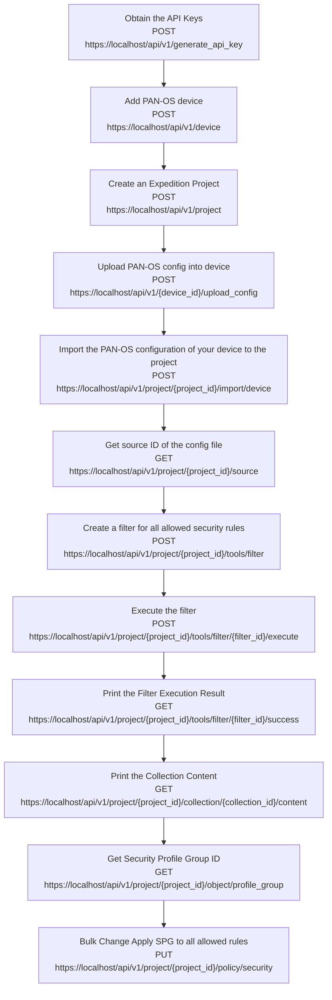

import Tabs from '@theme/Tabs';
import TabItem from '@theme/TabItem';
import Link from "@docusaurus/Link";
export function SetLanguage (lang) {
if (typeof window !== 'undefined'){
localStorage.setItem('defaultLanguage', lang)
window.location.reload()
}
}

<br/>

In this section we present a workflow example for bulk change apply Security Profile group to all allowed security rules in a PAN-OS configuration. The sample script is stored in /policies folder of the Expedition-API script container. 

Below flowchart demo the workflow and the related API calls in each of the steps:



<br/>  


### Step 1. Obtain the API Keys

Refer to [Obtaining the API Keys](creating_credentials.mdx) section to obtain a valid API key stored in the `hed` variable.

### Step 2. Add PAN-OS Device

Making a POST call to the Device route, we can create a Device with a desired name.
Notice that we attach the credentials `hed` in the CURL headers to present our credentials and verify we have permission to create a device.

API syntax for creating a new device :

| Method  | Route                                            | Request Body Parameters                                                                                                                                    |
| ------- | ------------------------------------------------ | ---------------------------------------------------------------------------------------------------------------------------------------------------------- |
| POST    | `https://localhost/api/v1/device` | \{**"name"**: devicename, **"serial"**: serialnumber,**"hostname"**: panosip,**"type"**: devicetype,**"description"**: pandescription,<br/>\} |
| Example | `https://localhost/api/v1/device` | \{**"name"**:"mypanorama", **"serial"**:"123456789",**"hostname"**:"pan1",**"type"**:"vm-panorama"**"description"**:"Project for testing"\}   |

:::info
**The supported device "type" are below:**

            "m100",
            "m500",
            "m600",
            "vm-panorama",
            "pa200",
            "pa220",
            "pa500",
            "pa800",
            "pa3000",
            "pa3200",
            "pa4000",
            "pa5000",
            "pa5200",
            "pa7000",
            "vm-series"

:::

<Tabs defaultValue={null}
values={[
{ label: 'Python', value: 'python', },
]
}>  
<TabItem value="python">

```python
print("*****Add a new PAN-OS device\n")
panosip = '1.1.1.1'
serialnumber = '123412'
devicetype = "pa220"
pandescription = 'test'
url = "https://localhost/api/v1/device"
data = {
    "name": devicename,
    "serial": serialnumber,
    "hostname": panosip,
    "type": devicetype,
    "description": pandescription,
    "port":device_port
}
r = requests.post(url, data=data, verify=False, headers=hed)
response = r.json()
success = json.dumps(response["success"])
if success == "true":
    print("New device created successfully" + " \n")
    DeviceId = json.dumps(response['data']['id'])
    print("Your Device-ID is " + str(DeviceId) + " \n")
else:
    print("Unable to create the device")
print("*****Upload PAN-OS config into device*****\n")
```

</TabItem>
</Tabs>  

### Step 3. Create an Expedition Project

In the large amount of automation cases, we will require having an Expedition project. Making a POST call to the project route, we can create a project with a desired name.

API syntax for creating a new project:

| Method  | Route                                             | Parameters                                                                                        |
| ------- | ------------------------------------------------- | ------------------------------------------------------------------------------------------------- |
| POST    | `https://localhost/api/v1/project` | _in url_<br/>\{ **"project"**:"project1", **"description"**:"Project for testing" \} |
| example | `https://localhost/api/v1/project` | \{"project":"MyLittleProject", "description":"A migration project"\}                 |

<Tabs defaultValue={null}
values={[
{ label: 'Python', value: 'python', },
]
}>  
<TabItem value="python">

```python
print("***** Create new project *****\n")

url = "https://localhost/api/v1/project"
data = {
    "name": PROJECT_NAME,
    "description": PROJECT_DESCRIPTION,
    "device_id[0]": DeviceId,
}
r = requests.post(url, data=data, verify=False, headers=hed)
response = r.json()
success = json.dumps(response["success"])
if success == "true":
    print("New project created successfully" + " \n")
    ProjectId = int(json.dumps(response['data']['id']))
    print("Your Project-ID is " + str(ProjectId) + " \n")
else:
    print("Unable to create the project")

```

</TabItem>
</Tabs>

### Step 4. Upload PAN-OS config into device

After device has been created , the next step will be uploading your pan-os config to associate with the device.

API syntax for upload PAN-OS config into device :

| Method  | Route                                                                      | Path Parameters                           |
| ------- | -------------------------------------------------------------------------- | ----------------------------------------- |
| POST    | "https://localhost/api/v1/device/{device_id}/upload_config" | **"device_id"**: device_Id |
| Example | "https://localhost/api/v1/device/23/upload_config"          |                                           |

<Tabs defaultValue={null}
values={[
{ label: 'Python', value: 'python', },
]
}>  
<TabItem value="python">

```python
print("*****Upload PAN-OS config into device*****\n")
Vendorfile = open(PANOS_CONFIG_PATH, 'rb')
files = {'config': Vendorfile}
url= 'https://localhost/api/v1/device/'+str(DeviceId)+'/upload_config'
r = requests.post(url, files=files, data=data, verify=False, headers=hed)
response = r.json()
success = json.dumps(response["success"])
if success == "true":
    print("Upload configuration successfully" + " \n")
else:
    print("Unable to upload the configuration")
    print(response)
```

</TabItem>
</Tabs>


### Step 5. Import the PAN-OS configuration of your device to the project

This step will associate the device with project. The API response will contain a job ID , you can then use API call to check job status. Please refer to checking job status [Checking Job Status](managing_jobs.mdx#checking-job-status) section .

API syntax for the step:

| Method  | Route                                                                        | Parameters                                                                                             |
| ------- | ---------------------------------------------------------------------------- | ------------------------------------------------------------------------------------------------------ |
| POST    | `https://localhost/api/v1/project/\{project_id\}/import/device` | _in url_<br/> **"project_id"**:project_Id<br/>in_body<br/> \{**"device_id"**:device_Id \} |
| example | `https://localhost/api/v1/project/22/import/device`           | \{"device_id":"23""\}                                                                     |

<Tabs defaultValue={null}
values={[
{ label: 'Python', value: 'python', },
]
}>  
<TabItem value="python">

```python
print("*****Import the PAN-OS configuration of your device to the project\n")
url = 'https://localhost/api/v1/project/'+str(ProjectId)+'/import/device'
data = {
    "device_id": DeviceId,
}
r = requests.post(url, verify=False, headers=hed, data=data)
response = r.json()
success = json.dumps(response["success"])
if success == "true":
    jobId =  json.dumps(response['data']['job_id'])
    print("Job id: "+jobId)
    print("***** Wait for job to finish *****")
    wait_for_job(EXPEDITION_URL+"job/" + jobId + "?complete=true", jobId, hed)

else:
    print(response)
    print("Unable to import configuration ")

```

</TabItem>
</Tabs>

### Step 6. Get Source ID of the config file

In this step, we will make a API call to get **source_id** of the config file that's been imported to the project. After this API call, you will parse the response that contains **source_id**. The **source_id** represent the pan-os config file that you would like to work on, and it will be used in the subsequent API calls.

API syntax for the step:

| Method  | Route                                                                 | Parameters                                                                                             |
| ------- | --------------------------------------------------------------------- | ------------------------------------------------------------------------------------------------------ |
| GET     | `https://localhost/api/v1/project/\{project_id\}/source` | _in url_<br/> **"project_id"**:project_Id<br/>in_body<br/> \{**"device_id"**:device_Id\}  |
| example | `https://localhost/api/v1/project/22/source`           | \{**"device_id"**: 23\}                                                                   |

<Tabs defaultValue={null}
values={[
{ label: 'Python', value: 'python', },
]
}>  
<TabItem value="python">

```python
print("Get Source_ID of the config file")
url = 'https://localhost/api/v1/project/'+str(ProjectId)+'/source'
r = requests.get(url, verify=False, headers=hed)
response = r.json()
success = json.dumps(response["success"])
if success == "true":
    sourceId =  json.dumps(response['data']['source'][0]['id'])
    print("Source id: "+sourceId)

else:
    print("Unable to get sources ")
```

</TabItem>
</Tabs>


### Step 7. Create a filter for all allowed security rules

In this step, we will create a filter for all security rules that have action "allowed" . Please refer to the [Expedition-API Filters ](expedition_workflow_filters.md) section for details on filters. In this specific example, we are sending the request body contains below data, In the json response, you will get a filter_id , this filter_id will be used in the subsequent steps.

```json
data = {
     "name": "all allowed rules",
     "reference": "all allowed rules",
     "filter": "[security_rule] action equals  \"allow\"",
     "source": sourceId
    }
```

API syntax for the step:

| Method  | Route                                                                       | Parameters                                                                                                              |
| ------- | --------------------------------------------------------------------------- | ----------------------------------------------------------------------------------------------------------------------- |
| POST    | `https://localhost/api/v1/project/\{project_id\}/tools/filter` | _in url_<br/> **"project_id"**:project_Id<br/>in_body<br/> \{**"name"**:filter_name,**"filter"**:filter, **"reference"**:filter_reference,**"source"**:sourceId, \}  |
| example | `https://localhost/api/v1/project/22/tools/filter`           | \{**"name"**: "all allowed rules", **"filter"** : "[security_rule] action equals \"allow\"",**"reference"**: "all allowed rules", **"source"** :4486 \}              |

<Tabs defaultValue={null}
values={[
{ label: 'Python', value: 'python', },
]
}>  
<TabItem value="python">

```python
print("***** create a filter *****")
#Filter Variables
FILTER_NAME="allallowedrules"
FILTER_DESC="All Security Policy with allowed action"
FILTER_OBJECT="[security_rule] action equals  \"allow\""
url='https://localhost/api/v1/project/'+str(ProjectId)+'/tools/filter'
data = {
     "name": FILTER_NAME,
     "reference": FILTER_NAME,
     "description" : FILTER_DESC,   
     "filter": FILTER_OBJECT,
     "source":sourceId
    }
r = requests.post(url, data=data, verify=False, headers=hed)
response = r.json()
print(response)
FILTER_ID = json.dumps(response['data']['last_history_entry']['filter_id'])
FILTER_ID=FILTER_ID.replace('"', '')
print('Your Filter ID is :'+FILTER_ID)
```

</TabItem>
</Tabs>

### Step 8. Execute the filter

After create a filter, we will execute the filter based on filter_Id , in the request body, you will need to provide "source_id" obtained from the previous step as required parameter.

API syntax for the step:

| Method  | Route                                                                                           | Parameters                                                                                                                                                   |
| ------- | ----------------------------------------------------------------------------------------------- | ------------------------------------------------------------------------------------------------------------------------------------------------------------ |
| POST    | `https://localhost/api/v1/project/\{project_id\}/tools/filter/{filter_id}/execute` | _in url_<br/> **"project_id"**:project_Id, **"filter_id"**:filter_Id<br/>in_body<br/> \{**"source_id"**: source_id of the PAN-OS config file\}  |
| example | `https://localhost/api/v1/project/22/tools/filter/1/execute`                     | \{**"source_id"**: "23564"\}                                                                                                                    |

<Tabs defaultValue={null}
values={[
{ label: 'Python', value: 'python', },
]
}>  
<TabItem value="python">

```python
print("***** Execute a filter *****")
url='https://localhost/api/v1/project/'+str(ProjectId)+'/tools/filter/'+FILTER_ID+'/execute'
data={"source_id": sourceId}
r = requests.post(url, data=data, verify=False, headers=hed)
response = r.json()
jobId = json.dumps(response["data"]["job_id"])
success = json.dumps(response["success"])
if success == "true":
    jobId =  json.dumps(response['data']['job_id'])
    print("Job id: "+jobId)
    print("***** Wait for job to finish *****")
    wait_for_job(EXPEDITION_URL+"job/" + jobId + "?complete=true", jobId, hed)

else:
    print(response)
    print("Unable to execute filter ")
```

</TabItem>
</Tabs>

### Step 9. Print the filter execution result

After the filter is executed , we can view the result using below API call. The result should contain all the objects that matches with the filter. From the response, you will parse the **collection_Id** to be used in the subsequent API call.

API syntax for the step:

| Method  | Route                                                                                          | Parameters                                                                          |
| ------- | ---------------------------------------------------------------------------------------------- | ----------------------------------------------------------------------------------- |
| GET     | `https://localhost/api/v1/project/{project_id}/tools/filter/{filter_id}/success` | _in url_<br/> **"project_id"**:project_Id, **"filter_id"**:filter_Id |
| example | `https://localhost/api/v1/project/22/tools/filter/1/success`                     |                                                                                     |

<Tabs defaultValue={null}
values={[
{ label: 'Python', value: 'python', },
]
}>  
<TabItem value="python">

```python
print("***** Print the Filter Execution Result *****")
url = 'https://localhost/api/v1/project/'+'project/'+str(ProjectId)+'/tools/filter/'+FILTER_ID+'/success'
r = requests.get(url, verify=False, headers=hed)
response = r.json()
print(response)
#Print the Collection ID
Collection_ID = json.dumps(response["data"]["id"])
print('Your Collection ID is :'+Collection_ID)
```

</TabItem>
</Tabs>  

### Step 10. Print the Collection Content

After the filter is executed , we can print the collection content using below API call.

API syntax for the step:

| Method  | Route                                                                                             | Parameters                                                                                  |
| ------- | ------------------------------------------------------------------------------------------------- | ------------------------------------------------------------------------------------------- |
| GET     | `https://localhost/api/v1/project/{project_id}/collection/{Collection_Id}/content` | _in url_<br/> **"project_id"**:project_Id, **"collection_id"**:collection_Id |
| example | `https://localhost/api/v1/project/22/collection/20793/content`                     |                                                                                             |

<Tabs defaultValue={null}
values={[
{ label: 'Python', value: 'python', },
]
}>  
<TabItem value="python">

```python
print("***** Print the Collection that contain unused objects *****")
url = 'https://localhost/api/v1/project/'+str(ProjectId) + '/collection/'+Collection_ID+'/content'
r = requests.get(url, verify=False, headers=hed)
response=r.json()
print(response)
```

</TabItem>
</Tabs>  


### Step 11. Get Security Profile Group ID

In order to apply the security profile group to the security policy, we will need to find out the object ID of the security profile group first. In the example, we will parse the first object ID from the response.

API syntax for the step:

| Method  | Route                                                                               | Parameters                                                |
| ------- | ----------------------------------------------------------------------------------- | --------------------------------------------------------- |
| GET     | `https://localhost/api/v1/project/{project_id}/object/profile_group` | _in url_<br/> **"project_id"**:project_Id  |
| example | `https://localhost/api/v1/project/22/object/profile_group`           |                                                           |

<Tabs defaultValue={null}
values={[
{ label: 'Python', value: 'python', },
]
}>  
<TabItem value="python">

```python
print("***** Get Security Profile group ID *****")
url = 'https://localhost/api/v1/project/'+str(ProjectId)+ "/object/profile_group"
r = requests.get(url,verify=False, headers=hed)
response=r.json()
SPG_ID=json.dumps(response["data"]["profile_group"][0]["id"])
print(SPG_ID)
```

</TabItem>
</Tabs>

### Step 12. Bulk Change Apply SPG to all allowed rules

The final step we perform a bulk change to apply the security profile group to all allowed rules.

API syntax for the step:

| Method  | Route                                                                          | Parameters                                                                                                                                         |
| ------- | ------------------------------------------------------------------------------ | --------------------------------------------------------------------------------------------------------------------------------------------\{**"add[profile][0]"**: object_id of the SPG, **"id"**: collection_id\}  |
| example | `https://localhost/api/v1/project/22/policy/security`           | \{**"add[profile][0]"**: "11714", **"id"**:"20793"\}                                                                                  |

<Tabs defaultValue={null}
values={[
{ label: 'Python', value: 'python', },
]
}>  
<TabItem value="python">

```python
print("Bulk Change Apply SPG to all allowed rules")
url = 'https://localhost/api/v1/project/'+str(ProjectId)+ "/policy/security"
data = {"add[profile][0]": int(SPG_ID), "id": int(Collection_ID)}
r = requests.put(url, data=data, verify=False, headers=hed)
response = r.json()
print(response)
```

</TabItem>
</Tabs>
