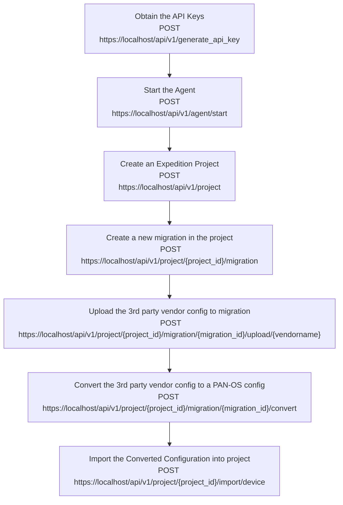

import Tabs from '@theme/Tabs';
import TabItem from '@theme/TabItem';
import Link from "@docusaurus/Link";
export function SetLanguage (lang) {
if (typeof window !== 'undefined'){
localStorage.setItem('defaultLanguage', lang)
window.location.reload()
}
}

In this section we present a workflow example to migrate a third party vendor configuration into a PANOS configuration.

Below flowhart demo the workflow and the related API calls in each of the steps:



### Step 1. Obtain the API Keys

Refer to [Obtaining the API Keys](creating_credentials.mdx) section to obtain a valid API key stored in the `hed` variable.

### Step 2. Start the Expedition Agent

Refer to [Managing Expedition's Agent](/expedition/docs/managing_expedition_agent) section to start the agent and be able to perform imports into a project.

### Step 3. Create an Expedition project

In the large amount of automation cases, we will require having an Expedition project. Making a POST call to the project route, we can create a project with a desired name.
By default, the creator of a project is as well one of the project administrators.
Notice that this time we attach the credentials `hed` in the CURL headers to present our credentials and verify we have permission to create a project.

API syntax for creating a new project:

| Method  | EndPoint                                          | Parameters                                                                                                      |
| ------- | ------------------------------------------------- | --------------------------------------------------------------------------------------------------------------- |
| POST    | <small>`https://localhost/api/v1/project`</small> | <small>_in url_<br/>{ **"project"**:Name of the project, **"description"**:Description of the project }</small> |
| example | <small>`https://localhost/api/v1/project`</small> | <small>{"project":"MyLittleProject", "description":"A migration project"}</small>                               |

<Tabs defaultValue={typeof window !== 'undefined' && localStorage.getItem('defaultLanguage') ? localStorage.getItem('defaultLanguage') : 'python'}
values={[
{ label: 'Python', value: 'python', },
{ label: 'Php', value: 'php', },
]
}>  
<TabItem value="python">

```python
print("*****Create a new Expedition Project*****\n")
projectName = "vendormigration"
print(" \n")
data = {"name": projectName}
r = requests.post(
    "https://" + ip + "/api/v1/project", data=data, verify=False, headers=hed
)
response = r.json()
success = json.dumps(response["success"])
if success == "true":
    print("New project created successfully" + " \n")
    projectId = json.dumps(response['data']['id'])
    print("Your project-ID is", str(projectId) + " \n")
print("\n")
```

</TabItem> 
<TabItem value="php">

```php

echo "\n";
echo "CREATE NEW PROJECT\n";
$data = ["project"=> $projectName];
$url = 'https://'.$ip.'/api/v1/project';
$curl = curl_init($url);
curl_setopt($curl, CURLOPT_RETURNTRANSFER, TRUE);
curl_setopt($curl, CURLOPT_HTTPHEADER,$hed);
curl_setopt($curl,CURLOPT_POST, TRUE);
curl_setopt($curl,CURLOPT_POSTFIELDS, $data);
curl_setopt($curl, CURLOPT_SSL_VERIFYHOST, FALSE);
curl_setopt($curl, CURLOPT_SSL_VERIFYPEER, FALSE);
$response = curl_exec($curl);
$jsonResponse = json_decode($response);
$success = $jsonResponse->Contents->success;
if ($success=='true'){
    print_r($response);
    $projectId = $jsonResponse->Contents->response->data->content->id;
    print_r($jsonResponse->Contents->response->{'response-messages'}->messages[0]->message);
}
echo "\n";
```

</TabItem>
</Tabs>

### Step 4. Create a new migration in the project

This step will creat a new migration in the project. In the request body parameters, you will need to specify **projectID** from previous step , and the PAN-OS device type you want to merge the source file with. There are two options:

**1. panorama**  
**2. firewall**

The API response will contain **migration_id** and **device_id**. Those IDs will be used in the subsequent API calls throughout the workflow.

API syntax for the step:

| Method  | EndPoint                                                                 | Parameters                                                                                                             |
| ------- | ------------------------------------------------------------------------ | ---------------------------------------------------------------------------------------------------------------------- |
| POST    | <small>`https://localhost/api/v1/project/{project_id}/migration`</small> | <small>_in url_<br/> **"project_id"**:"ProjectId"<br/>in_body<br/> {**"device_type"**:"panorama or firewall" }</small> |
| example | <small>`https://localhost/api/v1/project/22/migration`</small>           | <small>{"device_type":"panorama"}</small>                                                                              |

<Tabs defaultValue={typeof window !== 'undefined' && localStorage.getItem('defaultLanguage') ? localStorage.getItem('defaultLanguage') : 'python'}
values={[
{ label: 'Python', value: 'python', },
]
}>  
<TabItem value="python">

```python
print("*****Create a new migration in the project*****\n")
url = "https://" + ip + "/api/v1/project/{0}/migration".format(int(projectId))
print(url)
data = {"name": "my first migration","device_type": "panorama"}
r = requests.post(url, data=data, verify=False, headers=hed)
response = r.json()
migrationId = json.dumps(response["data"]["id"])
deviceId = json.dumps(response["data"]["device_id"])
```

</TabItem>
</Tabs>

### Step 5. Upload the 3rd party vendor (source) configuration to migration

The migration process would require to upload one of more configuration files to be migrated.
A minimum one would be the original vendor configuration file. In below example, we use a sample config called "ciscoasa.txt" stored in the user's local drive path "/Users/username/Downloads/ciscoasa.txt"

API syntax for the step:

| Method  | EndPoint                                                                                                    | Parameters                                                                                                                                                                                               |
| ------- | ----------------------------------------------------------------------------------------------------------- | -------------------------------------------------------------------------------------------------------------------------------------------------------------------------------------------------------- |
| POST    | <small>`https://localhost/api/v1/project/{project_id}/migration/{migration_id}/upload/{vendorname}`</small> | <small>_in url_<br/> **"project_id"**:"projectId"<br/> **"migration_id"**:"migrationId"<br/> **"vendorname"**:"vendorname"<br/>in_body<br/> {**"name"**:"configname",**"config"**:"configfile" }</small> |
| example | <small>`https://localhost/api/v1/project/22/migration/25/cisco_asa`</small>                                 | <small>{**"name"**:"cisco",**"config"**:cisco_config}</small>                                                                                                                                            |

:::info
Available vendorname parameter can be used in the path are below:

**cisco_asa**  
**checkpoint** (For checkpoint config < v. R80)  
**checkpoint_r80** (For checkpoint config >= v. R80)  
**fortinet**  
**srx**  
**netscreen**  
**stonesoft**  
:::

<Tabs defaultValue={typeof window !== 'undefined' && localStorage.getItem('defaultLanguage') ? localStorage.getItem('defaultLanguage') : 'python'}
values={[
{ label: 'Python', value: 'python', },
]
}>  
<TabItem value="python">

```python

print("*****Upload CISCO config to migration*****\n")
url = "https://" + ip + "/api/v1/project/"+projectId+"/migration/"+migrationId+"/upload/cisco_asa"
print(url)
file = '/Users/username/Downloads/ciscoasa.txt'
cisco_config = open(file, "rb")
files = {"config": cisco_config}
data = {"name": "cisco"}
r = requests.post(url, data=data, verify=False, files=files, headers=hed)
response = r.json()
```

</TabItem>
</Tabs>

### Step 6. Convert the 3rd party configuration to a PAN-OS configuration

This step will convert the 3rd party configuration that you uplaoded from previous step to a PAN-OS config. The sucessfully response will contain a **job_id** for you to track the status , please refer to the checking job status [Checking Job Status](managing_jobs.mdx#checking-job-status) section

API syntax for Converting 3rd party vendors' configurations:

| Method  | URL                                                                                             | Parameters                                                                                  |
| ------- | ----------------------------------------------------------------------------------------------- | ------------------------------------------------------------------------------------------- |
| POST    | <small>`https://localhost/api/v1/project/{project_id}/migration/{migration_Id}/convert`</small> | <small>_in url_<br/> **"project_id"**:projectId<br/> **"migration_id"**:migrationId</small> |
| example | <small>`https://localhost/api/v1/project/22/migration/25/convert`</small>                       | <small>_in url_<br/>**"project_Id"**: 22,<br/> **"migration_id"**: 25 </small>              |

<Tabs defaultValue={typeof window !== 'undefined' && localStorage.getItem('defaultLanguage') ? localStorage.getItem('defaultLanguage') : 'python'}
values={[
{ label: 'Python', value: 'python', },
]
}>  
<TabItem value="python">

```python
print("*****Converting the 3rd party vendor config to a PAN-OS config*****\n")
url = "https://" + ip + "/api/v1/project/"+projectId+"/migration/"+migrationId+"/convert"
print(url)
r = requests.post(url, data=data, verify=False, files=files, headers=hed)
response = r.json()
print("CHECK migration status...........")
jobId = json.dumps(response["data"]["job_id"])
wait_for_job(jobId)
```

</TabItem>
</Tabs>

### Step 7. Import the Converted Configuration into project

Once the conversion has done, we can import the resulting XML config file into an existing project for later configuration manipulations, such as delete unused objects, rename zones, etc.

The API syntax for Importing the converted PAN-OS Configuration into the project:

| Method  | EndPoint                                                                     | Parameters                                                                                                    |
| ------- | ---------------------------------------------------------------------------- | ------------------------------------------------------------------------------------------------------------- |
| POST    | <small>`https://localhost/api/v1/project/{project_id}/import/device`</small> | <small>_in url_<br/>**"project"**: "projectID"<br/><br/>_in body_<br/>{ **"device_id"**: "deviceId" }</small> |
| example | <small>`https://localhost/api/v1/project/22/import/device`</small>           | <small>_in url_<br/>project=22<br/><br/>_in body_<br/>{ "device_id": "23" }</small>                           |

<Tabs defaultValue={typeof window !== 'undefined' && localStorage.getItem('defaultLanguage') ? localStorage.getItem('defaultLanguage') : 'python'}
values={[
{ label: 'Python', value: 'python', },
]
}>  
<TabItem value="python">

```python
print("*****Import Configuration to project*****")
url = "https://" + ip + "/api/v1/project/{0}/import/device".format(int(projectId))
print(url)
data = {"device_id": deviceId}
r = requests.post(url, data=data, verify=False, headers=hed)
response = r.json()
jobId = json.dumps(response["data"]["job_id"])
print("CHECK configuration upload status...........")
wait_for_job(jobId)
```

</TabItem>
</Tabs>
