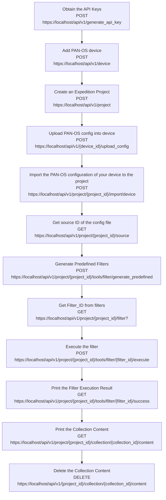

import Tabs from '@theme/Tabs';
import TabItem from '@theme/TabItem';
import Link from "@docusaurus/Link";
export function SetLanguage (lang) {
if (typeof window !== 'undefined'){
localStorage.setItem('defaultLanguage', lang)
window.location.reload()
}
}
<br/>

In this section we present a workflow example to remove unused address, address group, service and service group objects in a PAN-OS configuration.  In the Expedition API script container, the sample jupyter notebooks are stored in /Filters folder.

Below flowchart demo the workflow and the related API calls in each of the steps:


<br/>  

### Step 1. Obtain the API Keys

Refer to [Obtaining the API Keys](creating_credentials.mdx) section to obtain a valid API key stored in the `hed` variable.


### Step 2. Add PAN-OS Device

Making a POST call to the Device route, we can create a Device with a desired name.
Notice that we attach the credentials `hed` in the CURL headers to present our credentials and verify we have permission to create a device.

API syntax for creating a new device :

| Method  | Route                                            | Request Body Parameters                                                                                                                                    |
| ------- | ------------------------------------------------ | ---------------------------------------------------------------------------------------------------------------------------------------------------------- |
| POST    | <small>`https://localhost/api/v1/device`</small> | <small>{**"name"**: devicename, **"serial"**: serialnumber,**"hostname"**: panosip,**"type"**: devicetype,**"description"**: pandescription,<br/>}</small> |
| Example | <small>`https://localhost/api/v1/device`</small> | <small>{**"name"**:"mypanorama", **"serial"**:"123456789",**"hostname"**:"pan1",**"type"**:"vm-panorama"**"description"**:"Project for testing"}</small>   |

:::info
**The supported device "type" are below:**

            "m100",
            "m500",
            "m600",
            "vm-panorama",
            "pa200",
            "pa220",
            "pa500",
            "pa800",
            "pa3000",
            "pa3200",
            "pa4000",
            "pa5000",
            "pa5200",
            "pa7000",
            "vm-series"

:::

<Tabs defaultValue={null}
values={[
{ label: 'Python', value: 'python', },
]
}>  
<TabItem value="python">

```python
print("*****Add a new PAN-OS device\n")
panosip = '1.1.1.1'
serialnumber = '123412'
devicetype = "pa220"
pandescription = 'test'
url = "https://localhost/api/v1/device"
data = {
    "name": devicename,
    "serial": serialnumber,
    "hostname": panosip,
    "type": devicetype,
    "description": pandescription,
    "port":device_port
}
r = requests.post(url, data=data, verify=False, headers=hed)
response = r.json()
success = json.dumps(response["success"])
if success == "true":
    print("New device created successfully" + " \n")
    DeviceId = json.dumps(response['data']['id'])
    print("Your Device-ID is " + str(DeviceId) + " \n")
else:
    print("Unable to create the device")
print("*****Upload PAN-OS config into device*****\n")
```

</TabItem>
</Tabs>  

### Step 3. Create an Expedition Project

In the large amount of automation cases, we will require having an Expedition project. Making a POST call to the project route, we can create a project with a desired name.

API syntax for creating a new project:

| Method  | Route                                             | Parameters                                                                                        |
| ------- | ------------------------------------------------- | ------------------------------------------------------------------------------------------------- |
| POST    | <small>`https://localhost/api/v1/project`</small> | <small>_in url_<br/>{ **"project"**:"project1", **"description"**:"Project for testing" }</small> |
| example | <small>`https://localhost/api/v1/project`</small> | <small>{"project":"MyLittleProject", "description":"A migration project"}</small>                 |

<Tabs defaultValue={null}
values={[
{ label: 'Python', value: 'python', },
]
}>  
<TabItem value="python">

```python
print("***** Create new project *****\n")

url = "https://localhost/api/v1/project"
data = {
    "name": PROJECT_NAME,
    "description": PROJECT_DESCRIPTION,
    "device_id[0]": DeviceId,
}
r = requests.post(url, data=data, verify=False, headers=hed)
response = r.json()
success = json.dumps(response["success"])
if success == "true":
    print("New project created successfully" + " \n")
    ProjectId = int(json.dumps(response['data']['id']))
    print("Your Project-ID is " + str(ProjectId) + " \n")
else:
    print("Unable to create the project")

```

</TabItem>
</Tabs>

### Step 4. Upload PAN-OS config into device

After device has been created , the next step will be uploading your pan-os config to associate with the device.

API syntax for upload PAN-OS config into device :

| Method  | Route                                                                      | Path Parameters                           |
| ------- | -------------------------------------------------------------------------- | ----------------------------------------- |
| POST    | <small>"https://localhost/api/v1/device/{device_id}/upload_config"</small> | <small>**"device_id"**: device_Id</small> |
| Example | <small>"https://localhost/api/v1/device/23/upload_config"</small>          |                                           |

<Tabs defaultValue={null}
values={[
{ label: 'Python', value: 'python', },
]
}>  
<TabItem value="python">

```python
print("*****Upload PAN-OS config into device*****\n")
Vendorfile = open(PANOS_CONFIG_PATH, 'rb')
files = {'config': Vendorfile}
url= 'https://localhost/api/v1/device/'+str(DeviceId)+'/upload_config'
r = requests.post(url, files=files, data=data, verify=False, headers=hed)
response = r.json()
success = json.dumps(response["success"])
if success == "true":
    print("Upload configuration successfully" + " \n")
else:
    print("Unable to upload the configuration")
    print(response)
```

</TabItem>
</Tabs>


### Step 5. Import the PAN-OS configuration of your device to the project

This step will associate the device with project. The API response will contain a job ID , you can then use API call to check job status. Please refer to checking job status [Checking Job Status](managing_jobs.mdx#checking-job-status) section .

API syntax for the step:

| Method  | Route                                                                        | Parameters                                                                                             |
| ------- | ---------------------------------------------------------------------------- | ------------------------------------------------------------------------------------------------------ |
| POST    | <small>`https://localhost/api/v1/project/{project_id}/import/device`</small> | <small>_in url_<br/> **"project_id"**:project_Id<br/>in_body<br/> {**"device_id"**:device_Id }</small> |
| example | <small>`https://localhost/api/v1/project/22/import/device`</small>           | <small>{"device_id":"23""}</small>                                                                     |

<Tabs defaultValue={null}
values={[
{ label: 'Python', value: 'python', },
]
}>  
<TabItem value="python">

```python
print("*****Import the PAN-OS configuration of your device to the project\n")
url = 'https://localhost/api/v1/project/'+str(ProjectId)+'/import/device'
data = {
    "device_id": DeviceId,
}
r = requests.post(url, verify=False, headers=hed, data=data)
response = r.json()
success = json.dumps(response["success"])
if success == "true":
    jobId =  json.dumps(response['data']['job_id'])
    print("Job id: "+jobId)
    print("***** Wait for job to finish *****")
    wait_for_job(EXPEDITION_URL+"job/" + jobId + "?complete=true", jobId, hed)

else:
    print(response)
    print("Unable to import configuration ")

```

</TabItem>
</Tabs>

### Step 6. Get Source ID of the config file

In this step, we will make a API call to get **source_id** of the config file that's been imported to the project. After this API call, you will parse the response that contains **source_id**. The **source_id** represent the pan-os config file that you would like to work on, and it will be used in the subsequent API calls.

API syntax for the step:

| Method  | Route                                                                 | Parameters                                                                                             |
| ------- | --------------------------------------------------------------------- | ------------------------------------------------------------------------------------------------------ |
| GET     | <small>`https://localhost/api/v1/project/{project_id}/source`</small> | <small>_in url_<br/> **"project_id"**:project_Id<br/>in_body<br/> {**"device_id"**:device_Id} </small> |
| example | <small>`https://localhost/api/v1/project/22/source`</small>           | <small>{**"device_id"**: 23}</small>                                                                   |

<Tabs defaultValue={null}
values={[
{ label: 'Python', value: 'python', },
]
}>  
<TabItem value="python">

```python
print("Get Source_ID of the config file")
url = 'https://localhost/api/v1/project/'+str(ProjectId)+'/source'
r = requests.get(url, verify=False, headers=hed)
response = r.json()
success = json.dumps(response["success"])
if success == "true":
    sourceId =  json.dumps(response['data']['source'][0]['id'])
    print("Source id: "+sourceId)

else:
    print("Unable to get sources ")
```

</TabItem>
</Tabs>

### Step 7. Generate Predefined Filters

In this step, we will generate predefined filters in Expedition . Please refer to the [Expedition-API Filters ](expedition_workflow_filters.md) section for details on filters.


API syntax for the step:

| Method  | Route                                                                       | Parameters                                                                                                                    |
| ------- | --------------------------------------------------------------------------- | ----------------------------------------------------------------------------------------------------------------------------- |
| POST    | <small>`https://localhost/api/v1/project/{project_id}/tools/filter/generate_predefined`</small> | <small>_in url_<br/> **"project_id"**:project_Id<br/>in_body<br/> {**"type"**:filter_type,**"source"**:sourceId} </small>       |
| example | <small>`https://localhost/api/v1/project/22/tools/filter/generate_predefined`</small>           | <small>{**"type"**: "basic", **"source"** : sourceId} </small> |

<Tabs defaultValue={null}
values={[
{ label: 'Python', value: 'python', },
]
}>  
<TabItem value="python">

```python
print("***** Generate predefined filters *****")
url='https://localhost/api/v1/project/'+str(ProjectId)+'/tools/filter/generate_predefined'
data = {
     "type": "basic",
     "source": sourceId
    }
r = requests.post(url, data=data, verify=False, headers=hed)
response = r.json()
```

</TabItem>
</Tabs> 

### Step 8. Get Filter_ID from Filters

After generate the predefined filters, we will search through the predefined filters by query "unused%20objects' and get the filter_id.

API syntax for the step:

| Method  | Route                                                                                           | Parameters                                                                                                                                                   |
| ------- | ----------------------------------------------------------------------------------------------- | ------------------------------------------------------------------------------------------------------------------------------------------------------------ |
| GET   | <small>`https://localhost/api/v1/project/{project_id}/tools/filter?type={filter_type}&query={string to search}` </small> | <small>_in url_<br/> **"project_id"**:project_Id, **"type"**:filter_type,**"query"**:string to search </small> |
| example | <small>`https://localhost/api/v1/project/22/tools/filter?type=predefined&query=unused%20objects`</small>                     |                                                                                                              |

<Tabs defaultValue={null}
values={[
{ label: 'Python', value: 'python', },
]
}>  
<TabItem value="python">

```python
print("***** list filters *****")
url=https://localhost/api/v1/project/'+str(ProjectId)+'/tools/filter?type=predefined&query=unused%20objects'
r = requests.get(url, verify=False, headers=hed)
response = r.json()
if len(response['data']['filter']) > 1:
    print("Search query results in multiple filter objects. Check the below response to update the query to get a single filter")
    print(response)
elif len(response['data']['filter']) == 1:
    FILTER_ID=json.dumps(response['data']['filter'][0]['id'])
    print(FILTER_ID)
else:
    print("Cannot find filter based on the specified query")
```

</TabItem>
</Tabs>

### Step 9. Execute Filter

Once we get the filter_ID, we can then execute the filter. 

API syntax for the step:

| Method  | Route                                                                                           | Parameters                                                                                                                                                   |
| ------- | ----------------------------------------------------------------------------------------------- | ------------------------------------------------------------------------------------------------------------------------------------------------------------ |
| POST    | <small>`https://localhost/api/v1/project/{project_id}/tools/filter/{filter_id}/execute`</small> | <small>_in url_<br/> **"project_id"**:project_Id, **"filter_id"**:FILTER_ID</small> |
| example | <small>`https://localhost/api/v1/project/22/tools/filter/1/execute`</small>                     | |

<Tabs defaultValue={null}
values={[
{ label: 'Python', value: 'python', },
]
}>  
<TabItem value="python">

```python
print("***** Execute a filter *****")
url='https://localhost/api/v1/project/'+str(ProjectId)+'/tools/filter/'+FILTER_ID+'/execute'
data={"source_id": sourceId}
r = requests.post(url, data=data, verify=False, headers=hed)
response = r.json()
jobId = json.dumps(response["data"]["job_id"])
success = json.dumps(response["success"])
if success == "true":
    jobId =  json.dumps(response['data']['job_id'])
    print("Job id: "+jobId)
    print("***** Wait for job to finish *****")
    wait_for_job(EXPEDITION_URL+"job/" + jobId + "?complete=true", jobId, hed)

else:
    print(response)
    print("Unable to execute filter ")ta"]["task"][0]["statusMessage"])
    print(statusmessage)
```

</TabItem>
</Tabs>

### Step 10. Print the filter result

After the filter is executed , we can view the result using below API call. The result should contain all the objects that matches with the filter. From the response, you will parse the **collection_Id** to be used in the next API call.

API syntax for the step:

| Method  | Route                                                                                          | Parameters                                                                          |
| ------- | ---------------------------------------------------------------------------------------------- | ----------------------------------------------------------------------------------- |
| GET     | <small>`https://localhost/api/v1/project/{project_id}/tools/filter/{filter_id}/success`</small> | <small>_in url_<br/> **"project_id"**:project_Id, **"filter_id"**:filter_Id</small> |
| example | <small>`https://localhost/api/v1/project/22/tools/filter/1/success`</small>                     |                                                                                     |

<Tabs defaultValue={null}
values={[
{ label: 'Python', value: 'python', },
]
}>  
<TabItem value="python">

```python
print("***** Print the Filter Execution Result *****")
url = 'https://localhost/api/v1/project/'+str(ProjectId)+'/tools/filter/'+FILTER_ID+'/success'
r = requests.get(url, verify=False, headers=hed)
response = r.json()
#Print the Collection ID
Collection_ID = json.dumps(response["data"]["id"])
print('Your Collection ID is :'+Collection_ID)
```

</TabItem>
</Tabs>

### Step 11. Print the Collection Content

After the filter is executed , we can print the collection content using below API call.

API syntax for the step:

| Method  | Route                                                                                             | Parameters                                                                                  |
| ------- | ------------------------------------------------------------------------------------------------- | ------------------------------------------------------------------------------------------- |
| GET     | <small>`https://localhost/api/v1/project/{project_id}/collection/{Collection_Id}/content`</small> | <small>_in url_<br/> **"project_id"**:project_Id, **"collection_id"**:collection_Id</small> |
| example | <small>`https://localhost/api/v1/project/22/collection/20793/content`</small>                     |                                                                                             |

<Tabs defaultValue={null}
values={[
{ label: 'Python', value: 'python', },
]
}>  
<TabItem value="python">

```python
print("***** Print the Collection that contain unused objects *****")
url = 'https://localhost/api/v1/project/'+str(ProjectId) + '/collection/'+Collection_ID+'/content'
r = requests.get(url, verify=False, headers=hed)
response=r.json()
print(response)
```

</TabItem>
</Tabs>

### Step 12. Delete the Collection Content

This step we will delete the collection content, which will remove all unused address, address group, service, service group objects in the configuration file.

API syntax for the step:

| Method  | Route                                                                                             | Parameters                                                                                  |
| ------- | ------------------------------------------------------------------------------------------------- | ------------------------------------------------------------------------------------------- |
| DELETE  | <small>`https://localhost/api/v1/project/{project_id}/collection/{collection_id}/content`</small> | <small>_in url_<br/> **"project_id"**:project_Id, **"collection_id"**:collection_Id</small> |
| example | <small>`https://localhost/api/v1/project/22/collection/20793/content`</small>                     |                                                                                             |

<Tabs defaultValue={null}
values={[
{ label: 'Python', value: 'python', },
]
}>  
<TabItem value="python">

```python
print("***** Delete the Collection that contain unused objects ***** ")
url = 'httos://localhost/api/v1/project/'+str(ProjectId) + '/collection/'+Collection_ID+'/content'
r = requests.delete(url, verify=False, headers=hed)
response=r.json()
statusmessage=json.dumps(response["messages"][0]["message"])
print(statusmessage)
```

</TabItem>
</Tabs>
