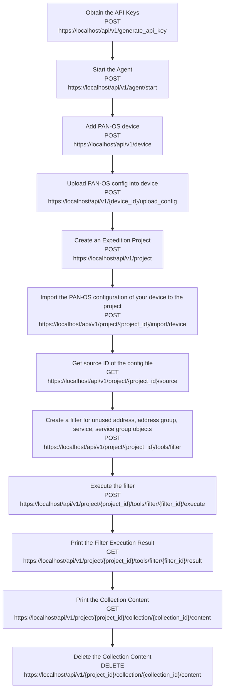

import Tabs from '@theme/Tabs';
import TabItem from '@theme/TabItem';
import Link from "@docusaurus/Link";
export function SetLanguage (lang) {
if (typeof window !== 'undefined'){
localStorage.setItem('defaultLanguage', lang)
window.location.reload()
}
}
<br/>

In this section we present a workflow example to remove unused address, address group, service and service group objects in a PAN-OS configuration.

Below flowchart demo the workflow and the related API calls in each of the steps:



### Step 1. Obtain the API Keys

Refer to [Obtaining the API Keys](creating_credentials.mdx) section to obtain a valid API key stored in the `hed` variable.

### Step 2. Start the Expedition Agent

Refer to [Managing Expedition's Agent](/expedition/docs/managing_expedition_agent) section to start the agent and be able to perform imports into a project.

### Step 3. Add PAN-OS Device

Making a POST call to the Device route, we can create a Device with a desired name.
Notice that we attach the credentials `hed` in the CURL headers to present our credentials and verify we have permission to create a device.

API syntax for creating a new device :

| Method  | Route                                            | Request Body Parameters                                                                                                                                    |
| ------- | ------------------------------------------------ | ---------------------------------------------------------------------------------------------------------------------------------------------------------- |
| POST    | <small>`https://localhost/api/v1/device`</small> | <small>{**"name"**: devicename, **"serial"**: serialnumber,**"hostname"**: panosip,**"type"**: devicetype,**"description"**: pandescription,<br/>}</small> |
| Example | <small>`https://localhost/api/v1/device`</small> | <small>{**"name"**:"mypanorama", **"serial"**:"123456789",**"hostname"**:"pan1",**"type"**:"vm-panorama"**"description"**:"Project for testing"}</small>   |

:::info
**The supported device "type" are below:**

            "m100",
            "m500",
            "m600",
            "vm-panorama",
            "pa200",
            "pa220",
            "pa500",
            "pa800",
            "pa3000",
            "pa3200",
            "pa4000",
            "pa5000",
            "pa5200",
            "pa7000",
            "vm-series"

:::

<Tabs defaultValue={typeof window !== 'undefined' && localStorage.getItem('defaultLanguage') ? localStorage.getItem('defaultLanguage') : 'python'}
values={[
{ label: 'Python', value: 'python', },
]
}>  
<TabItem value="python">

```python
print("*****Add a new PAN-OS device\n")
panosip = '1.1.1.1'
serialnumber = '123412'
devicetype = "pa220"
pandescription = 'test'
url = "https://" + ip + "/api/v1/device"
data = {
    "name": devicename,
    "serial": serialnumber,
    "hostname": panosip,
    "type": devicetype,
    "description": pandescription,
}
r = requests.post(url, data=data, verify=False, headers=hed)
response = r.json()
success = json.dumps(response["success"])
if success == "true":
    print("New device created successfully" + " \n")
    DeviceId = json.dumps(response['data']['id'])
    print("Your Device-ID is " + str(DeviceId) + " \n")
else:
    print("Unable to create the device")
print("*****Upload PAN-OS config into device*****\n")
```

</TabItem>
</Tabs>

### Step 4. Upload PAN-OS config into device

After device has been created , the next step will be uploading your pan-os config to associate with the device.

API syntax for upload PAN-OS config into device :

| Method  | Route                                                                      | Path Parameters                           |
| ------- | -------------------------------------------------------------------------- | ----------------------------------------- |
| POST    | <small>"https://localhost/api/v1/device/{device_id}/upload_config"</small> | <small>**"device_id"**: device_Id</small> |
| Example | <small>"https://localhost/api/v1/device/23/upload_config"</small>          |                                           |

<Tabs defaultValue={typeof window !== 'undefined' && localStorage.getItem('defaultLanguage') ? localStorage.getItem('defaultLanguage') : 'python'}
values={[
{ label: 'Python', value: 'python', },
]
}>  
<TabItem value="python">

```python
print("*****Upload PAN-OS config into device*****\n")
file = '/Users/user1/Downloads/panoramabase.xml'
panosconfig = open(file, "rb")
files = {"config": panosconfig}
url = 'https://' + ip + '/api/v1/device/{0}/upload_config'.format(int(DeviceId))
r = requests.post(url, files=files, verify=False, headers=hed)
response = r.json()
success = json.dumps(response["success"])
if success == "true":
    print("Pan-OS config uploaded to the device successfully\n")
else:
    result = json.dumps(response["messages"][0]["message"])
    print(result)
```

</TabItem>
</Tabs>

### Step 5. Create an Expedition Project

In the large amount of automation cases, we will require having an Expedition project. Making a POST call to the project route, we can create a project with a desired name.

API syntax for creating a new project:

| Method  | Route                                             | Parameters                                                                                        |
| ------- | ------------------------------------------------- | ------------------------------------------------------------------------------------------------- |
| POST    | <small>`https://localhost/api/v1/project`</small> | <small>_in url_<br/>{ **"project"**:"project1", **"description"**:"Project for testing" }</small> |
| example | <small>`https://localhost/api/v1/project`</small> | <small>{"project":"MyLittleProject", "description":"A migration project"}</small>                 |

<Tabs defaultValue={typeof window !== 'undefined' && localStorage.getItem('defaultLanguage') ? localStorage.getItem('defaultLanguage') : 'python'}
values={[
{ label: 'Python', value: 'python', },
]
}>  
<TabItem value="python">

```python
print("*****Create a new Expedition Project*****\n")
projectName = input("Please enter project name: (Needs to start with letters): ")
print(" \n")
data = {"name": projectName, "device_id[0]": DeviceId}
url="https://" + ip + "/api/v1/project"
r = requests.post(url,data=data, verify=False, headers=hed)
response = r.json()
success = json.dumps(response["success"])
if success == "true":
    print("New project created successfully" + " \n")
    projectId = json.dumps(response['data']['id'])
    print("Your project-ID is", str(projectId) + " \n")
print("\n")
```

</TabItem>
</Tabs>

### Step 6. Import the PAN-OS configuration of your device to the project

This step will associate the device with project. The API response will contain a job ID , you can then use API call to check job status. Please refer to checking job status [Checking Job Status](managing_jobs.mdx#checking-job-status) section .

API syntax for the step:

| Method  | Route                                                                        | Parameters                                                                                             |
| ------- | ---------------------------------------------------------------------------- | ------------------------------------------------------------------------------------------------------ |
| POST    | <small>`https://localhost/api/v1/project/{project_id}/import/device`</small> | <small>_in url_<br/> **"project_id"**:project_Id<br/>in_body<br/> {**"device_id"**:device_Id }</small> |
| example | <small>`https://localhost/api/v1/project/22/import/device`</small>           | <small>{"device_id":"23""}</small>                                                                     |

<Tabs defaultValue={typeof window !== 'undefined' && localStorage.getItem('defaultLanguage') ? localStorage.getItem('defaultLanguage') : 'python'}
values={[
{ label: 'Python', value: 'python', },
]
}>  
<TabItem value="python">

```python
print("*****Import the PAN-OS configuration of your device to the project\n")
url = "https://" + ip + "/api/v1/project/{0}/import/device".format(int(projectId))
print(url)
data = {"device_id": DeviceId}
r = requests.post(url, data=data, verify=False, headers=hed)
response = r.json()
jobId = json.dumps(response["data"]["job_id"])
jobFinished = False
print("CHECK configuration upload status...........")
r = requests.get(
    "https://" + ip + "/api/v1/job/" + jobId + "?complete=true",
    verify=False,
    headers=hed,
)
response = r.json()
jobState = json.dumps(response["data"]["state"])
percentage = float(jobState) * 100
print(
    "Import PAN-OS configuration from device to Project: "
    + str(round(percentage, 2))
    + "%\n"
)
# Wait until job is done
while jobState != "1":
    sleep(5)
    r = requests.get(
        "https://" + ip + "/api/v1/job/" + jobId + "?complete=true",
        verify=False,
        headers=hed,
    )
    response = r.json()
    jobState = json.dumps(response["data"]["state"])
    percentage = float(jobState) * 100
    print(
        "PAN-OS configuration has been imported to Project: "
        + str(round(percentage, 2))
        + "%\n"
    )
response = r.json()
statusmessage = json.dumps(response["data"]["task"][0]["statusMessage"])
print(statusmessage)
```

</TabItem>
</Tabs>

### Step 7. Get Source ID of the config file

In this step, we will make a API call to get **source_id** of the config file that's been imported to the project. After this API call, you will parse the response that contains **source_id**. The **source_id** represent the pan-os config file that you would like to work on, and it will be used in the subsequent API calls.

API syntax for the step:

| Method  | Route                                                                 | Parameters                                                                                             |
| ------- | --------------------------------------------------------------------- | ------------------------------------------------------------------------------------------------------ |
| GET     | <small>`https://localhost/api/v1/project/{project_id}/source`</small> | <small>_in url_<br/> **"project_id"**:project_Id<br/>in_body<br/> {**"device_id"**:device_Id} </small> |
| example | <small>`https://localhost/api/v1/project/22/source`</small>           | <small>{**"device_id"**: 23}</small>                                                                   |

<Tabs defaultValue={typeof window !== 'undefined' && localStorage.getItem('defaultLanguage') ? localStorage.getItem('defaultLanguage') : 'python'}
values={[
{ label: 'Python', value: 'python', },
]
}>  
<TabItem value="python">

```python
print("Get Source_ID of the config file")
url = "https://" + ip + "/api/v1/project/" + projectId + "/source"
r = requests.get(url, data=data, verify=False, headers=hed)
response = r.json()
print(response)
source_id = json.dumps(response["data"]["source"][0]["id"])
print("PAN-OS config source_id is: " + source_id)
```

</TabItem>
</Tabs>

### Step 8. Create a filter for unused objects

In this step, we will create a filter for unused address & address group objects . Please refer to the [Expedition-API Filters ](expedition_workflow_filters.md) section for details on filters. In this specific example, we are sending the request body contains below data, this filter will filter on address, address group , service and service group objects that's are not being referenced in security policy and NAT policy. In the json response, you will get a filter_id , this filter_id will be used in the subsequent steps.

```json
data = {
     "name": "unused_objects",
     "filter": "[address, address_group, service, service_group] is not used",
    }
```

API syntax for the step:

| Method  | Route                                                                       | Parameters                                                                                                                    |
| ------- | --------------------------------------------------------------------------- | ----------------------------------------------------------------------------------------------------------------------------- |
| POST    | <small>`https://localhost/api/v1/project/{project_id}/tools/filter`</small> | <small>_in url_<br/> **"project_id"**:project_Id<br/>in_body<br/> {**"name"**:filter_name,**"filter"**:filter} </small>       |
| example | <small>`https://localhost/api/v1/project/22/tools/filter`</small>           | <small>{**"name"**: "unused_objects", **"filter"** : "[address, address_group, service, service_group] is not used"} </small> |

<Tabs defaultValue={typeof window !== 'undefined' && localStorage.getItem('defaultLanguage') ? localStorage.getItem('defaultLanguage') : 'python'}
values={[
{ label: 'Python', value: 'python', },
]
}>  
<TabItem value="python">

```python
def Filter():
    print("create a filter for unused address, address group,service, service group objects")
    url = "https://" + ip + "/api/v1/project/" + projectId + "/tools/filter"
    data = {
     "name": "unused_objects",
     "filter": "[address, address_group, service, service_group] is not used",
}
    r = requests.post(url, data=data, verify=False, headers=hed)
    response = r.json()
    print(response)
    global filterID
    filterID = json.dumps(response["data"]["last_history_entry"]["filter_id"])
    print("your filter ID is " + filterID)
```

</TabItem>
</Tabs>

### Step 9. Execute the filter

After create a filter, we will execute the filter based on filter_Id , in the request body, you will need to provide "source_id" obtained from the previous step as required parameter.

API syntax for the step:

| Method  | Route                                                                                           | Parameters                                                                                                                                                   |
| ------- | ----------------------------------------------------------------------------------------------- | ------------------------------------------------------------------------------------------------------------------------------------------------------------ |
| POST    | <small>`https://localhost/api/v1/project/{project_id}/tools/filter/{filter_id}/execute`</small> | <small>_in url_<br/> **"project_id"**:project_Id, **"filter_id"**:filter_Id<br/>in_body<br/> {**"source_id"**: source_id of the PAN-OS config file} </small> |
| example | <small>`https://localhost/api/v1/project/22/tools/filter/1/execute`</small>                     | <small>{**"source_id"**: "23564"} </small>                                                                                                                   |

<Tabs defaultValue={typeof window !== 'undefined' && localStorage.getItem('defaultLanguage') ? localStorage.getItem('defaultLanguage') : 'python'}
values={[
{ label: 'Python', value: 'python', },
]
}>  
<TabItem value="python">

```python
def ExecuteFilter():
    print("execute the filter")
    data = {"source_id": source_id}
    url = (
     "https://"
        + ip
        + "/api/v1/project/"
        + projectId
        + "/tools/filter/"
        + filterID
        + "/execute"
    )
    r = requests.post(url, data=data, verify=False, headers=hed)
    response = r.json()
    print(response)
    jobId = json.dumps(response["data"]["job_id"])
    jobFinished = False
    print("CHECK filter execute status...........")
    r = requests.get(
    "https://" + ip + "/api/v1/job/" + jobId + "?complete=true",
    verify=False,
    headers=hed,
    )
    response = r.json()
    print(response)
    jobState = json.dumps(response["data"]["state"])
    percentage = float(jobState) * 100
    print("Execute filter........: " + str(round(percentage, 2)) + "%\n")

    # Wait until job is done
    while jobState != "1":
        sleep(5)
        r = requests.get(
         "https://" + ip + "/api/v1/job/" + jobId + "?complete=true",
            verify=False,
            headers=hed,
        )
        response = r.json()
        print(response)
        jobState = json.dumps(response["data"]["state"])
        print(jobState)
        percentage = float(jobState) * 100
        print("Filter execute...... " + str(round(percentage, 2)) + "%\n")
    response = r.json()
    print(response)
    statusmessage = json.dumps(response["data"]["task"][0]["statusMessage"])
    print(statusmessage)
```

</TabItem>
</Tabs>

### Step 10. Print the filter result

After the filter is executed , we can view the result using below API call. The result should contain all the objects that matches with the filter. From the response, you will parse the **collection_Id** to be used in the next API call.

API syntax for the step:

| Method  | Route                                                                                          | Parameters                                                                          |
| ------- | ---------------------------------------------------------------------------------------------- | ----------------------------------------------------------------------------------- |
| GET     | <small>`https://localhost/api/v1/project/{project_id}/tools/filter/{filter_id}/result`</small> | <small>_in url_<br/> **"project_id"**:project_Id, **"filter_id"**:filter_Id</small> |
| example | <small>`https://localhost/api/v1/project/22/tools/filter/1/result`</small>                     |                                                                                     |

<Tabs defaultValue={typeof window !== 'undefined' && localStorage.getItem('defaultLanguage') ? localStorage.getItem('defaultLanguage') : 'python'}
values={[
{ label: 'Python', value: 'python', },
]
}>  
<TabItem value="python">

```python
print("Print the Filter Execution Result")
    url = (
        "https://"
        + ip
        + "/api/v1/project/"
        + projectId
        + "/tools/filter/"
        + filterID
        + "/result"
    )
    r = requests.get(url, verify=False, headers=hed)
    response = r.json()
    print(response)
    global Collection_ID
    Collection_ID = json.dumps(response["data"]["id"])
```

</TabItem>
</Tabs>

### Step 11. Print the Collection Content

After the filter is executed , we can print the collection content using below API call.

API syntax for the step:

| Method  | Route                                                                                             | Parameters                                                                                  |
| ------- | ------------------------------------------------------------------------------------------------- | ------------------------------------------------------------------------------------------- |
| GET     | <small>`https://localhost/api/v1/project/{project_id}/collection/{Collection_Id}/content`</small> | <small>_in url_<br/> **"project_id"**:project_Id, **"collection_id"**:collection_Id</small> |
| example | <small>`https://localhost/api/v1/project/22/collection/20793/content`</small>                     |                                                                                             |

<Tabs defaultValue={typeof window !== 'undefined' && localStorage.getItem('defaultLanguage') ? localStorage.getItem('defaultLanguage') : 'python'}
values={[
{ label: 'Python', value: 'python', },
]
}>  
<TabItem value="python">

```python
print("Print the Collection Content")
    url = "https://" + ip + "/api/v1/project/" + projectId + "/collection/" + Collection_ID + "/content"
    print(url)
    r = requests.get(url, verify=False, headers=hed)
    response = r.json()
    print(response)
```

</TabItem>
</Tabs>

### Step 12. Delete the Collection Content

This step we will delete the collection content, which will remove all unused address, address group, service, service group objects in the configuration file.

API syntax for the step:

| Method  | Route                                                                                             | Parameters                                                                                  |
| ------- | ------------------------------------------------------------------------------------------------- | ------------------------------------------------------------------------------------------- |
| DELETE  | <small>`https://localhost/api/v1/project/{project_id}/collection/{collection_id}/content`</small> | <small>_in url_<br/> **"project_id"**:project_Id, **"collection_id"**:collection_Id</small> |
| example | <small>`https://localhost/api/v1/project/22/collection/20793/content`</small>                     |                                                                                             |

<Tabs defaultValue={typeof window !== 'undefined' && localStorage.getItem('defaultLanguage') ? localStorage.getItem('defaultLanguage') : 'python'}
values={[
{ label: 'Python', value: 'python', },
]
}>  
<TabItem value="python">

```python
print("Delete the Collection")
url = "https://" + ip + "/api/v1/project/" + projectId + "/collection/" + Collection_ID + "/content"
print(url)
r = requests.delete(url, verify=False, headers=hed)
response=r.json()
print(response)
```

</TabItem>
</Tabs>
