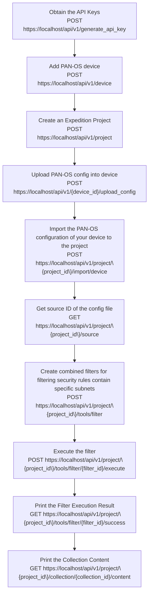

import Tabs from '@theme/Tabs';
import TabItem from '@theme/TabItem';
import Link from "@docusaurus/Link";
export function SetLanguage (lang) {
if (typeof window !== 'undefined'){
localStorage.setItem('defaultLanguage', lang)
window.location.reload()
}
}

<br/>

In this section we present a workflow example for filtering security rules containing a specific subnet in a PAN-OS configuration.

Below flowchart demo the workflow and the related API calls in each of the steps:



<br/>  

### Step 1. Obtain the API Keys

Refer to [Obtaining the API Keys](creating_credentials.mdx) section to obtain a valid API key stored in the `hed` variable.

### Step 2. Add PAN-OS Device

Making a POST call to the Device route, we can create a Device with a desired name.
Notice that we attach the credentials `hed` in the CURL headers to present our credentials and verify we have permission to create a device.

API syntax for creating a new device :

| Method  | Route                                            | Request Body Parameters                                                                                                                                    |
| ------- | ------------------------------------------------ | ---------------------------------------------------------------------------------------------------------------------------------------------------------- |
| POST    | <small>`https://localhost/api/v1/device`</small> | <small>\{**"name"**: devicename, **"serial"**: serialnumber,**"hostname"**: panosip,**"type"**: devicetype,**"description"**: pandescription,<br/>\}</small> |
| Example | <small>`https://localhost/api/v1/device`</small> | <small>\{**"name"**:"mypanorama", **"serial"**:"123456789",**"hostname"**:"pan1",**"type"**:"vm-panorama"**"description"**:"Project for testing"\}</small>   |

:::info
**The supported device "type" are below:**

            "m100",
            "m500",
            "m600",
            "vm-panorama",
            "pa200",
            "pa220",
            "pa500",
            "pa800",
            "pa3000",
            "pa3200",
            "pa4000",
            "pa5000",
            "pa5200",
            "pa7000",
            "vm-series"

:::

<Tabs defaultValue={null}
values={[
{ label: 'Python', value: 'python', },
]
}>  
<TabItem value="python">

```python
print("*****Add a new PAN-OS device\n")
panosip = '1.1.1.1'
serialnumber = '123412'
devicetype = "pa220"
pandescription = 'test'
url = "https://localhost/api/v1/device"
data = {
    "name": devicename,
    "serial": serialnumber,
    "hostname": panosip,
    "type": devicetype,
    "description": pandescription,
    "port":device_port
}
r = requests.post(url, data=data, verify=False, headers=hed)
response = r.json()
success = json.dumps(response["success"])
if success == "true":
    print("New device created successfully" + " \n")
    DeviceId = json.dumps(response['data']['id'])
    print("Your Device-ID is " + str(DeviceId) + " \n")
else:
    print("Unable to create the device")
print("*****Upload PAN-OS config into device*****\n")
```

</TabItem>
</Tabs>  

### Step 3. Create an Expedition Project

In the large amount of automation cases, we will require having an Expedition project. Making a POST call to the project route, we can create a project with a desired name.

API syntax for creating a new project:

| Method  | Route                                             | Parameters                                                                                        |
| ------- | ------------------------------------------------- | ------------------------------------------------------------------------------------------------- |
| POST    | <small>`https://localhost/api/v1/project`</small> | <small>_in url_<br/>\{ **"project"**:"project1", **"description"**:"Project for testing" \}</small> |
| example | <small>`https://localhost/api/v1/project`</small> | <small>\{"project":"MyLittleProject", "description":"A migration project"\}</small>                 |

<Tabs defaultValue={null}
values={[
{ label: 'Python', value: 'python', },
]
}>  
<TabItem value="python">

```python
print("***** Create new project *****\n")

url = "https://localhost/api/v1/project"
data = {
    "name": PROJECT_NAME,
    "description": PROJECT_DESCRIPTION,
    "device_id[0]": DeviceId,
}
r = requests.post(url, data=data, verify=False, headers=hed)
response = r.json()
success = json.dumps(response["success"])
if success == "true":
    print("New project created successfully" + " \n")
    ProjectId = int(json.dumps(response['data']['id']))
    print("Your Project-ID is " + str(ProjectId) + " \n")
else:
    print("Unable to create the project")

```

</TabItem>
</Tabs>

### Step 4. Upload PAN-OS config into device

After device has been created , the next step will be uploading your pan-os config to associate with the device.

API syntax for upload PAN-OS config into device :

| Method  | Route                                                                      | Path Parameters                           |
| ------- | -------------------------------------------------------------------------- | ----------------------------------------- |
| POST    | <small>"https://localhost/api/v1/device/\{device_id\}/upload_config"</small> | <small>**"device_id"**: device_Id</small> |
| Example | <small>"https://localhost/api/v1/device/23/upload_config"</small>          |                                           |

<Tabs defaultValue={null}
values={[
{ label: 'Python', value: 'python', },
]
}>  
<TabItem value="python">

```python
print("*****Upload PAN-OS config into device*****\n")
Vendorfile = open(PANOS_CONFIG_PATH, 'rb')
files = {'config': Vendorfile}
url= 'https://localhost/api/v1/device/'+str(DeviceId)+'/upload_config'
r = requests.post(url, files=files, data=data, verify=False, headers=hed)
response = r.json()
success = json.dumps(response["success"])
if success == "true":
    print("Upload configuration successfully" + " \n")
else:
    print("Unable to upload the configuration")
    print(response)
```

</TabItem>
</Tabs>


### Step 5. Import the PAN-OS configuration of your device to the project

This step will associate the device with project. The API response will contain a job ID , you can then use API call to check job status. Please refer to checking job status [Checking Job Status](managing_jobs.mdx#checking-job-status) section .

API syntax for the step:

| Method  | Route                                                                        | Parameters                                                                                             |
| ------- | ---------------------------------------------------------------------------- | ------------------------------------------------------------------------------------------------------ |
| POST    | <small>`https://localhost/api/v1/project/\{project_id\}/import/device`</small> | <small>_in url_<br/> **"project_id"**:project_Id<br/>in_body<br/> \{**"device_id"**:device_Id \}</small> |
| example | <small>`https://localhost/api/v1/project/22/import/device`</small>           | <small>\{"device_id":"23""\}</small>                                                                     |

<Tabs defaultValue={null}
values={[
{ label: 'Python', value: 'python', },
]
}>  
<TabItem value="python">

```python
print("*****Import the PAN-OS configuration of your device to the project\n")
url = 'https://localhost/api/v1/project/'+str(ProjectId)+'/import/device'
data = {
    "device_id": DeviceId,
}
r = requests.post(url, verify=False, headers=hed, data=data)
response = r.json()
success = json.dumps(response["success"])
if success == "true":
    jobId =  json.dumps(response['data']['job_id'])
    print("Job id: "+jobId)
    print("***** Wait for job to finish *****")
    wait_for_job(EXPEDITION_URL+"job/" + jobId + "?complete=true", jobId, hed)

else:
    print(response)
    print("Unable to import configuration ")

```

</TabItem>
</Tabs>

### Step 6. Get Source ID of the config file

In this step, we will make a API call to get **source_id** of the config file that's been imported to the project. After this API call, you will parse the response that contains **source_id**. The **source_id** represent the pan-os config file that you would like to work on, and it will be used in the subsequent API calls.

API syntax for the step:

| Method  | Route                                                                 | Parameters                                                                                             |
| ------- | --------------------------------------------------------------------- | ------------------------------------------------------------------------------------------------------ |
| GET     | <small>`https://localhost/api/v1/project/\{project_id\}/source`</small> | <small>_in url_<br/> **"project_id"**:project_Id<br/>in_body<br/> \{**"device_id"**:device_Id\} </small> |
| example | <small>`https://localhost/api/v1/project/22/source`</small>           | <small>\{**"device_id"**: 23\}</small>                                                                   |

<Tabs defaultValue={null}
values={[
{ label: 'Python', value: 'python', },
]
}>  
<TabItem value="python">

```python
print("Get Source_ID of the config file")
url = 'https://localhost/api/v1/project/'+str(ProjectId)+'/source'
r = requests.get(url, verify=False, headers=hed)
response = r.json()
success = json.dumps(response["success"])
if success == "true":
    sourceId =  json.dumps(response['data']['source'][0]['id'])
    print("Source id: "+sourceId)

else:
    print("Unable to get sources ")
```

</TabItem>
</Tabs>  

### Step 7. Create combined filters for security rules contain specific subnet

In this step, we will create total 6 filters to filter all security rules that contain subnet 10.0. Please refer to the [Expedition-API Filters ](expedition_workflow_filters.md) section for details on filters.

Here are the Filter variables used in creating each of the filter:  

```json
# Filter variables
FILTER_NAME_1 = 'Addressobject_with_specific_subnet'
FILTER_DESCRIPTION_1 = 'addressobject_with_subnet_10.1.'
FILTER_OBJECT_1 = "[address] ipaddress contains \"10.1\""
FILTER_NAME_2 = 'Addressgroupobject_with_specific_subnet'
FILTER_DESCRIPTION_2 = 'addressgroupobject_with_subnet_10.1.'
FILTER_OBJECT_2 = "[address_group] member contains filter Addressobject_with_specific_subnet.success "
FILTER_NAME_3 = 'combinefilter1and2'
FILTER_DESCRIPTION_3 = 'address/addressgroupobject_with_subnet_10.1.'
FILTER_OBJECT_3 = "filter Addressobject_with_specific_subnet.success or filter Addressgroupobject_with_specific_subnet.success"
FILTER_NAME_4 = 'securityrule_with_specific_source_subnet'
FILTER_DESCRIPTION_4 = 'securityrule_with_src_subnet_10.1'
FILTER_OBJECT_4 = "[security_rule] source_address contains filter combinefilter1and2.success "
FILTER_NAME_5 = 'securityrule_with_specific_dst_subnet'
FILTER_DESCRIPTION_5 = 'securityrule_with_dst_subnet_10.1'
FILTER_OBJECT_5 = "[security_rule] destination_address contains filter combinefilter1and2.success "
FILTER_NAME_6 = 'Combinefilter4_5'
FILTER_DESCRIPTION_6 = 'securityrule_with_source_or_destination_contain_subnet_10.1'
FILTER_OBJECT_6 = "filter securityrule_with_specific_source_subnet.success or filter securityrule_with_specific_dst_subnet.success "
```


#### 1st Filter

In this specific example, we are going to create the first filter that filter address objects contain ip address "10.1" in the value. Sending the request body contains below data:

```json
data = {
    "name":FILTER_NAME_1,
    "reference":FILTER_NAME_1,
    "description": FILTER_DESCRIPTION_1,
    "filter": FILTER_OBJECT_1,
    "source":sourceId
    }
```

API syntax for the step:

| Method  | Route                                                                       | Parameters                                                                                                              |
| ------- | --------------------------------------------------------------------------- | ----------------------------------------------------------------------------------------------------------------------- |
| POST    | <small>`https://localhost/api/v1/project/\{project_id\}/tools/filter`</small> | <small>_in url_<br/> **"project_id"**:project_Id<br/>in_body<br/> \{**"name"**:filter_name,**"filter"**:filter, **"reference"**:filter_reference,**"source"**:sourceId\}</small> |
| example | <small>`https://localhost/api/v1/project/22/tools/filter`</small>           | <small>\{**"name"**: "all allowed rules", **"filter"** : "[address] ipaddress contains \"10.1\"",**"reference"**: "all allowed rules", **"source"** :4486\} </small>               |

<Tabs defaultValue={null}
values={[
{ label: 'Python', value: 'python', },
]
}>  
<TabItem value="python">

```python
print("Create filter to search addresses with specific value \n")
url = f"https://localhost/api/v1/project/{str(projectId)}/tools/filter"
data = {
    "name": FILTER_NAME_1,
    "reference": FILTER_NAME_1,
    "description": FILTER_DESCRIPTION_1,
    "filter": FILTER_OBJECT_1,
    "source": sourceId
}
r = requests.post(url, data=data, verify=False, headers=hed)
response = r.json()
print(response)
filter_id_1 = json.dumps(int(response['data']['last_history_entry']['filter_id']))
print('Your Filter ID is :' + filter_id_1)
```

</TabItem>
</Tabs>

#### 2nd Filter

In this specific example, we are going to create the 2nd filter that filter address group objects contain member match first filter result.  
Sending the request body contains below data:

```json
data = {
    "name":FILTER_NAME_2,
    "reference":FILTER_NAME_2,
    "description": FILTER_DESCRIPTION_2,
    "filter": FILTER_OBJECT_2,
    "source":sourceId
    }
```

<Tabs defaultValue={null}
values={[
{ label: 'Python', value: 'python', },
]
}>  
<TabItem value="python">

```python
# Create filter to filter address-group with member contain first filter
print("Create filter to filter address-group with member contain first filter\n")
url = f"https://localhost/api/v1/project/{str(projectId)}/tools/filter"
data = {
    "name": FILTER_NAME_2,
    "reference": FILTER_NAME_2,
    "description": FILTER_DESCRIPTION_2,
    "filter": FILTER_OBJECT_2,
    "source": sourceId
}
r = requests.post(url, data=data, verify=False, headers=hed)
response = r.json()
print(response)
filter_id_2 = json.dumps(int(response['data']['last_history_entry']['filter_id']))
print('Your Filter ID is :' + filter_id_2)
```

</TabItem>
</Tabs>

#### 3rd Filter

In this specific example, we are going to create the 3rd filter that combine 1st and 2nd filter we created in the previous steps.
Sending the request body contains below data:

```json
data = {

    "name":FILTER_NAME_3,
    "reference":FILTER_NAME_3,
    "description": FILTER_DESCRIPTION_3,
    "filter": FILTER_OBJECT_3,
    "source":sourceId

    }

```

When we combine two single filters , we will use syntax below:

**<i>filter</i>** filter_name1.success **or** **<i>filter</i>** filter_name2.success  


<Tabs defaultValue={null}
values={[
{ label: 'Python', value: 'python', },
]
}>  
<TabItem value="python">

```python
# combinefilter1&2
print("Combine filter1 and filter 2\n")
url = f"https://localhost/api/v1/project/{str(projectId)}/tools/filter"
data = {
    "name": FILTER_NAME_3,
    "reference": FILTER_NAME_3,
    "description": FILTER_DESCRIPTION_3,
    "filter": FILTER_OBJECT_3,
    "source": sourceId
}
r = requests.post(url, data=data, verify=False, headers=hed)
response = r.json()
print(response)
filter_id_3 = json.dumps(int(response['data']['last_history_entry']['filter_id']))
print('Your Filter ID is :' + filter_id_3)

```

</TabItem>
</Tabs>

#### 4th Filter

We are going to create the 4th filter to filter any security rules contain source address match 3rd filter

Sending the request body contains below data:

```json
data = {

    "name":FILTER_NAME_4,
    "reference":FILTER_NAME_4,
    "description": FILTER_DESCRIPTION_4,
    "filter": FILTER_OBJECT_4,
    "source":sourceId

    }
```

<Tabs defaultValue={null}
values={[
{ label: 'Python', value: 'python', },
]
}>  
<TabItem value="python">

```python
# Filter security rules source contains filter 3
print("Create filter to filter security rules source match filter 3\n")
url = f"https://localhost/api/v1/project/{str(projectId)}/tools/filter"
data = {
    "name": FILTER_NAME_4,
    "reference": FILTER_NAME_4,
    "description": FILTER_DESCRIPTION_4,
    "filter": FILTER_OBJECT_4,
    "source": sourceId
}
r = requests.post(url, data=data, verify=False, headers=hed)
response = r.json()
print(response)
filter_id_4 = json.dumps(int(response['data']['last_history_entry']['filter_id']))
print('Your Filter ID is :' + filter_id_4)

```

</TabItem>
</Tabs>

#### 5th Filter

We are going to create the 5th filter to filter any security rules contain destination address match 3rd filter
Sending the request body contains below data:

```json
data = {

    "name": FILTER_NAME_5,
    "reference": FILTER_NAME_5,
    "description": FILTER_DESCRIPTION_5,
    "filter": FILTER_OBJECT_5,
    "source": sourceId

    }
```

<Tabs defaultValue={null}
values={[
{ label: 'Python', value: 'python', },
]
}>  
<TabItem value="python">

```python
# Filter security rules destination contains filter 3
print("Create filter to filter security rules destination match filter 3\n")
url = f"https://localhost/api/v1/project/{str(projectId)}/tools/filter"
data = {
    "name": FILTER_NAME_5,
    "reference": FILTER_NAME_5,
    "description": FILTER_DESCRIPTION_5,
    "filter": FILTER_OBJECT_5,
    "source": sourceId
}
r = requests.post(url, data=data, verify=False, headers=hed)
response = r.json()
print(response)
filter_id_5 = json.dumps(int(response['data']['last_history_entry']['filter_id']))
print('Your Filter ID is :' + filter_id_5)

```

</TabItem>
</Tabs>

#### 6th Filter

We are going to create our final filter to combine filter 4 & 5, which will filter all security rules contain either source address or destination address that contain 10.1.
Sending the request body contains below data:

```json
data = {  

    "name": FILTER_NAME_6,
    "reference": FILTER_NAME_6,
    "description": FILTER_DESCRIPTION_6,
    "filter": FILTER_OBJECT_6,
    "source": sourceId

    }
```

<Tabs defaultValue={null}
values={[
{ label: 'Python', value: 'python', },
]
}>  
<TabItem value="python">

```python
# Combine filter4 with filter5
print("Combine filter4 and filter 5\n")
url = f"https://localhost/api/v1/project/{str(projectId)}/tools/filter"
data = {
    "name": FILTER_NAME_6,
    "reference": FILTER_NAME_6,
    "description": FILTER_DESCRIPTION_6,
    "filter": FILTER_OBJECT_6,
    "source": sourceId
}
r = requests.post(url, data=data, verify=False, headers=hed)
response = r.json()
print(response)
filter_id_6 = json.dumps(int(response['data']['last_history_entry']['filter_id']))
print('Your Filter ID is :' + filter_id_6)

```

</TabItem>
</Tabs>

### Step 8. Execute the final filter

After create the final filter, we will execute the filter based on filter_Id ,in our example , filter_Id will be "6" in the request body, you will need to provide "source_id" obtained from the previous step as required parameter.

API syntax for the step:

| Method  | Route                                                                                           | Parameters                                                                                                                                                   |
| ------- | ----------------------------------------------------------------------------------------------- | ------------------------------------------------------------------------------------------------------------------------------------------------------------ |
| POST    | <small>`https://localhost/api/v1/project/\{project_id\}/tools/filter/\{filter_id\}/execute`</small> | <small>_in url_<br/> **"project_id"**:project_Id, **"filter_id"**:filter_Id<br/>in_body<br/> \{**"source_id"**: source_id of the PAN-OS config file\} </small> |
| example | <small>`https://localhost/api/v1/project/22/tools/filter/6/execute`</small>                     | <small>\{**"source_id"**: "23564"\} </small>                                                                                                                   |

<Tabs defaultValue={null}
values={[
{ label: 'Python', value: 'python', },
]
}>  
<TabItem value="python">

```python
print("***** Execute filter 6 ")
url = f"https://localhost/api/v1/project/{str(projectId)}/tools/filter/{str(filter_id_6)}/execute"
data = {"source_id": sourceId}
r = requests.post(url, data=data, verify=False, headers=hed)
response = r.json()
jobId = json.dumps(response["data"]["job_id"])
success = json.dumps(response["success"])
if success == "true":
    jobId = json.dumps(response['data']['job_id'])
    print("Job id: " + jobId)
    print("***** Wait for job to finish *****")
    wait_for_job(EXPEDITION_URL+"job/" + jobId + "?complete=true", jobId, hed)
else:
    print(response)
    print("Unable to execute filter ")
    raise RuntimeError("Unable to execute filter ")
```

</TabItem>
</Tabs>

### Step 9. Print the filter execution result

After the filter is executed , we can view the result using below API call. The result should contain all the objects that matches with the filter. From the response, you will parse the **collection_Id** to be used in the subsequent API call.

API syntax for the step:

| Method  | Route                                                                                          | Parameters                                                                          |
| ------- | ---------------------------------------------------------------------------------------------- | ----------------------------------------------------------------------------------- |
| GET     | <small>`https://localhost/api/v1/project/\{project_id\}/tools/filter/{filter_id}/success`</small> | <small>_in url_<br/> **"project_id"**:project_Id, **"filter_id"**:filter_Id</small> |
| example | <small>`https://localhost/api/v1/project/22/tools/filter/6/success`</small>                     |                                                                                     |

<Tabs defaultValue={null}
values={[
{ label: 'Python', value: 'python', },
]
}>  
<TabItem value="python">

```python
# Get filter result
print("Print the Filter Execution Result")
url = f"https://localhost/api/v1/project/{str(projectId)}/tools/filter/{str(filter_id_6)}/success"
r = requests.get(url, verify=False, headers=hed)
response = r.json()
print(response)
Collection_ID = json.dumps(response["data"]["id"])
print('Your Collection ID is :' + Collection_ID)
```

</TabItem>
</Tabs>

### Step 10. Print the Collection Content

After the filter is executed , we can print the collection content using below API call.

API syntax for the step:

| Method  | Route                                                                                             | Parameters                                                                                  |
| ------- | ------------------------------------------------------------------------------------------------- | ------------------------------------------------------------------------------------------- |
| GET     | <small>`https://localhost/api/v1/project/\{project_id\}/collection/{Collection_Id}/content`</small> | <small>_in url_<br/> **"project_id"**:project_Id, **"collection_id"**:collection_Id</small> |
| example | <small>`https://localhost/api/v1/project/22/collection/20793/content`</small>                     |                                                                                             |

<Tabs defaultValue={null}
values={[
{ label: 'Python', value: 'python', },
]
}>  
<TabItem value="python">

```python
# Print the Collection Content
print("***** Print the Collection that contain rules with specific subnets *****")
url = f"https://{EXPEDITION_IP}/api/v1/project/{str(projectId)}/collection/{Collection_ID}/content"
r = requests.get(url, verify=False, headers=hed)
response = r.json()
print(response)
```

</TabItem>
</Tabs>

The response will be similar to below which listed all security rules with source or destination address containing 10.1 .

```json
***** Print the Collection that contain rules with specific subnets *****
{'data': {'id': 4982, 'editable': False, 'filter_id': 16, 'type': 'filter', 'content': [{'object_id': 4926, 'name': 'Testrule1', 'object_type': 'security_rule', 'vsys_name': 'vsys1', 'vsys': 4802, 'source_name': 'pa220running-config', 'source': 4800}, {'object_id': 4927, 'name': 'Testrule2', 'object_type': 'security_rule', 'vsys_name': 'vsys1', 'vsys': 4802, 'source_name': 'pa220running-config', 'source': 4800}, {'object_id': 4928, 'name': 'Testrule2-1', 'object_type': 'security_rule', 'vsys_name': 'vsys1', 'vsys': 4802, 'source_name': 'pa220running-config', 'source': 4800}], 'name': 'success', 'description': 'Collection to store success objects from task Combinefilter4_5'}, 'messages': [], 'success': True}
```
