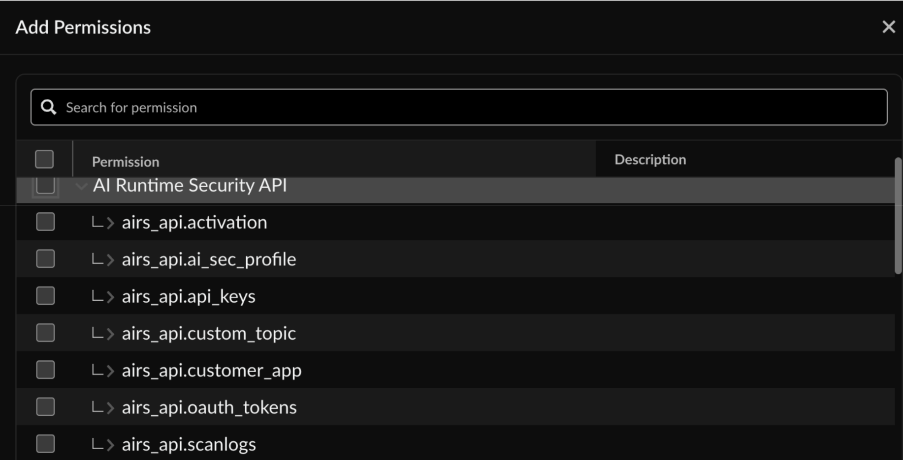
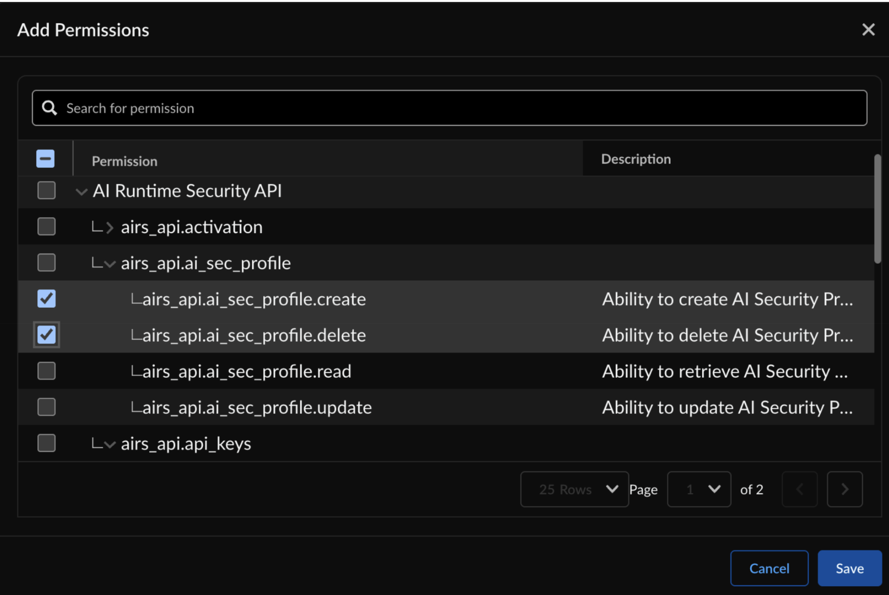

Role-Based Access Control (RBAC) in Strata Cloud Manager now allows you to enforce granular permissions for the Prisma AIRS AI Runtime APIs. For a comprehensive overview of Strata Cloud Manager roles, refer to the [Roles Overview](https://pan.dev/scm/docs/roles-overview/) document.

The primary roles relevant to Prisma AIRS AI Runtime API are:

| User Role | Permission |
| --- | --- |
| Superuser | Has full access to all API endpoints, including the ability to perform CRUD (Create, Read, Update, Delete) operations on API keys, security profiles, and custom topics. |
| View Only Administrator | Provides read-only access to entities like security profiles, API keys, and custom applications. |
| CUSTOM ROLES: (custom-role-name) | Allows administrators to define a custom role with specific permissions. You can assign granular permissions for Prisma AIRS AI Runtime APIs by selecting from a list of permissions such as `airs_api.ai_sec_profile`, `airs_api.api_keys`, `airs_api.custom_topic`, and more. Create a custom role with specific permissions for each entity, allowing you to assign granular CRUD (Create, Read, Update, Delete) operations.   **Note**: These custom roles are specifically for managing Prisma AIRS resources through management APIs, not the Strata Cloud Manager web interface.    To create a custom role:    * Navigate to **Strata Cloud Manager > Identity & Access > Roles > Custom Roles**.    * Select **Add Custom Role**, and then select the **API** tab.    Select the permissions for the AI Runtime Security API endpoints and the CRUD operations for each.      |
