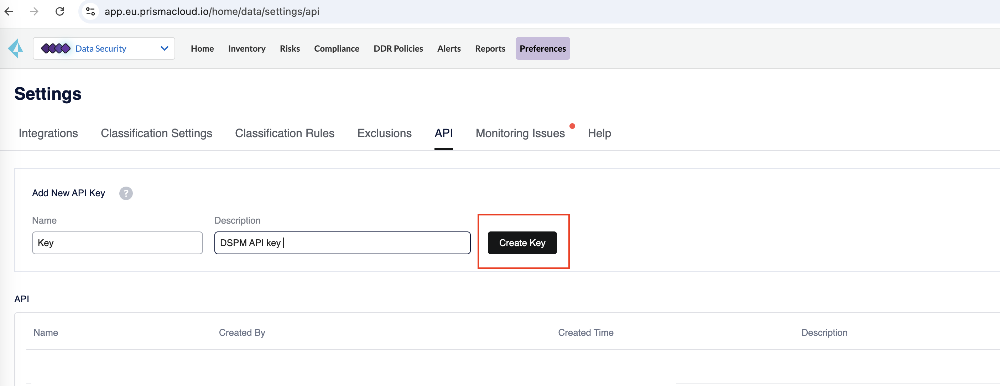
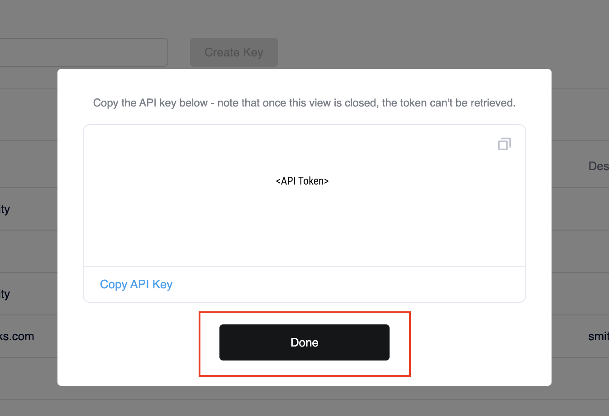

### Generate an API key

To generate a DSPM API key, you must first obtain your DSPM Console address.

1. In the Prisma Cloud `Data Security` dropdown menu, select the `Preferences` tab, then navigate to the `API` tab.
   

2. In the `Add New API Key` section, enter a meaningful `Name` and `Description` for your API key, and click `Create Key`.

3. A pop-up will display the generated API key. Click on `Copy API Key` to copy it, and press `Done`.
   

4. The `API section` of the page will display the name and other details of the generated key.

Congratulations! You've successfully generated your first API key!

### Authenticate your API

Once you've generate an API key, you're ready to authenticate and make your first API call!

* To authenticate, include your Prisma Cloud DSPM API key in the API headers using the format: `dig-api-key:'YOUR_KEY'`

To test the setup, attempt to call any DSPM endpoint, such as: https://api.dig.security/v1/assets. 

Note: Ensure you use https:// and not http:// for all API calls.

For more information on the Prisma Console and the API URL, refer to [API URLs](./api-urls.md) page.

