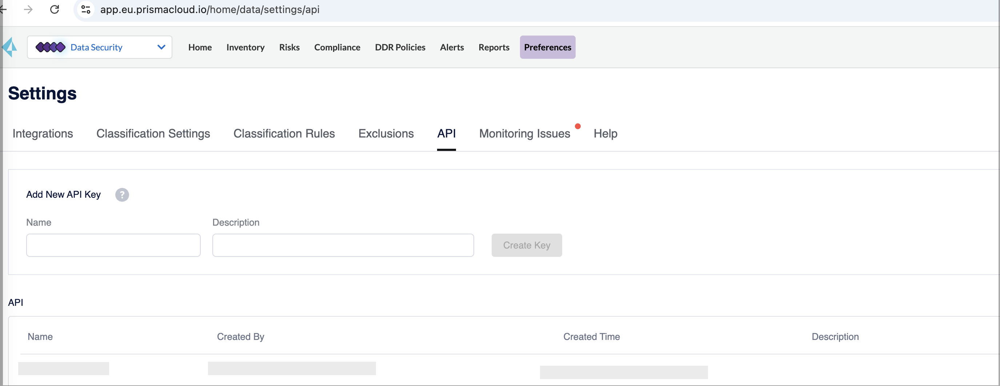
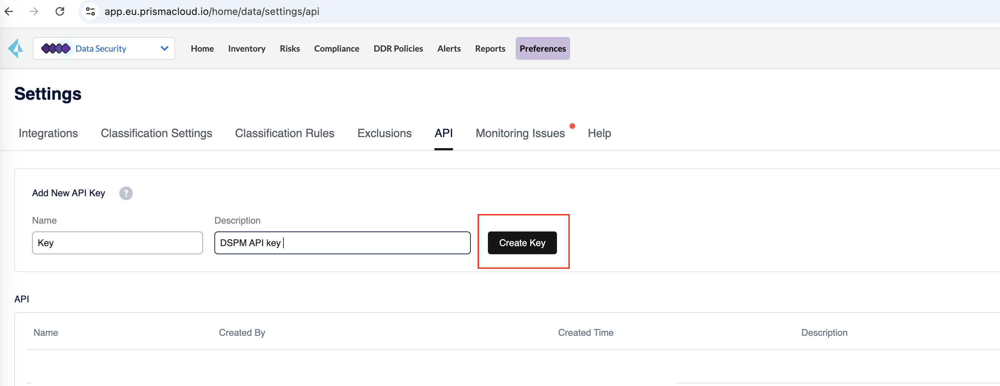
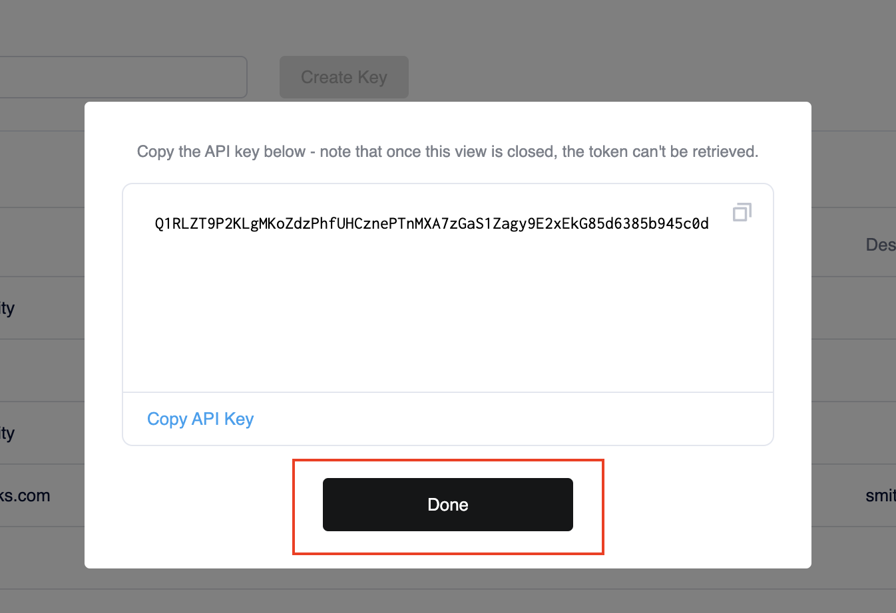

### 1. Generate the API Key

To generate a DSPM API key, you must first obtain your DSPM Console address.

a. In the Prisma Cloud `Data Security` dropdown menu, select the `Preferences` tab, then navigate to the `API` tab.
   

b. In the `Add New API Key` section, enter a meaningful `Name` and `Description` for your API key, and click `Create Key`.

c. A pop-up will display the generated API key. Click on `Copy API Key` to copy it, and press `Done`.
   

d. The `API section` of the page will display the name and other details of the generated key.

Congratulations! You've successfully generated your first API key!

### 2. Identify the base URL

The URL for the Prisma Cloud service varies depending on the cluster on which your tenant is deployed. Your order fulfillment email includes the URL for your Prisma Cloud service tenant. The admin console URLs and corresponding API URLs are in the table below.

| Prisma Cloud Admin Console URL   | Prisma Cloud API URL             |
| -------------------------------- | -------------------------------- |
| <https://app.prismacloud.io>     | <https://api.use1.dig.security/> |
| <https://app2.prismacloud.io>    | <https://api.use1.dig.security/> |
| <https://app3.prismacloud.io>    | <https://api.use1.dig.security/> |
| <https://app4.prismacloud.io>    | <https://api.use1.dig.security/> |
| <https://app.ca.prismacloud.io>  | <https://api.use1.dig.security/> |
| <https://app.anz.prismacloud.io> | <https://api.dig.security/>      |
| <https://app.eu.prismacloud.io>  | <https://api.dig.security/>      |
| <https://app2.eu.prismacloud.io> | <https://api.dig.security/>      |
| <https://app.sg.prismacloud.io>  | <https://api.dig.security/>      |
| <https://app.uk.prismacloud.io>  | <https://api.dig.security/>      |
| <https://app.ind.prismacloud.io> | <https://api.dig.security/>      |
| <https://app.jp.prismacloud.io>  | <https://api.dig.security/>      |
| <https://app.fr.prismacloud.io>  | <https://api.dig.security/>      |
| <https://app.id.prismacloud.io>  | <https://api.dig.security/>      |

### 3. Authenticate your API

Once you've generate an API key, you're ready to authenticate and make your first API call!

* To authenticate, include your Prisma Cloud DSPM API key in the API headers using the format: `dig-api-key:'YOUR_KEY'`

To test the setup, attempt to call any DSPM endpoint, such as: https://api.dig.security/v1/assets. 

Note: Ensure you use https:// and not http:// for all the standard HTTP methods, such as GET, POST, PUT, and DELETE.

## Stay Up to Date
Check the [status notifications](https://status.paloaltonetworks.com/) for the Prisma Cloud release schedule to stay up to date with the new features and functionality.
