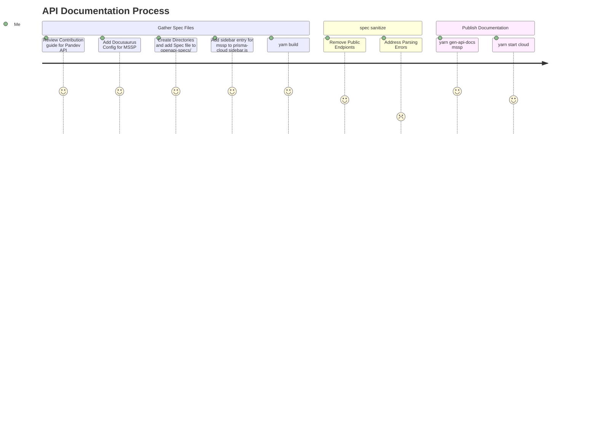

- [Hello MSSP: This is a Test Page](#hello-mssp-this-is-a-test-page)
  - [Code Example](#code-example)
  - [Admonitions](#admonitions)
  - [Example Section 1](#example-section-1)
    - [Example Subsection 1 a](#example-subsection-1-a)
    - [Example Subsection 1 b](#example-subsection-1-b)
  - [Diagrams](#diagrams)
- [Hello, world!](#hello-world)

# Hello MSSP: This is a Test Page

Mollit ipsum eu excepteur ea enim ut nisi irure commodo enim reprehenderit sint reprehenderit. Ipsum ad sit tempor aliquip esse ex reprehenderit veniam. Minim sunt anim aliquip consectetur qui et consequat. Cupidatat ex do proident nulla sunt aliqua voluptate eu nostrud proident consequat. Cupidatat voluptate est proident nulla ullamco labore laboris non ea dolore exercitation proident nisi. Ullamco quis ad exercitation esse fugiat eiusmod quis cillum pariatur nisi.

import Tabs from '@theme/Tabs';
import TabItem from '@theme/TabItem';

<Tabs>
  <TabItem value="apple" label="Apple" default>
    This is an apple 🍎
  </TabItem>
  <TabItem value="orange" label="Orange">
    This is an orange 🍊
  </TabItem>
  <TabItem value="banana" label="Banana">
    This is a banana 🍌
  </TabItem>
</Tabs>

## Code Example

```py

import random

def generate_random_string(length):
    characters = 'abcdefghijklmnopqrstuvwxyzABCDEFGHIJKLMNOPQRSTUVWXYZ0123456789'
    random_string = ''.join(random.choice(characters) for _ in range(length))
    return random_string

random_string = generate_random_string(10)
print(f"Random string: {random_string}")

```

## Admonitions

:::note

Some **content** with _Markdown_ `syntax`. Check [this `api`](#).

:::

:::::info[Parent]

Parent content

::::danger[Child]

Child content

:::tip[Deep Child]

Deep child content

:::

::::

:::::


:::tip

Some **content** with _Markdown_ `syntax`. Check [this `api`](#).

:::

:::info

Some **content** with _Markdown_ `syntax`. Check [this `api`](#).

:::

:::warning

Some **content** with _Markdown_ `syntax`. Check [this `api`](#).

:::

:::danger

Some **content** with _Markdown_ `syntax`. Check [this `api`](#).

:::

## Example Section 1
Lorem ipsum

### Example Subsection 1 a
Lorem ipsum

#### Example subsubsection 1 a I
#### Example subsubsection 1 a II
#### Example subsubsection 1 a III

### Example Subsection 1 b
Lorem ipsum

#### Example subsubsection 1 b I
#### Example subsubsection 1 b II
Ad nostrud ipsum magna nostrud Lorem cillum esse duis aliqua enim eu aute. Laboris in adipisicing officia ea occaecat ut nisi ut nulla dolore irure veniam. Nisi reprehenderit et duis fugiat ea. Excepteur Lorem aliqua cillum incididunt aliqua occaecat nulla proident ipsum proident in incididunt aute.


## Diagrams



---

```mermaid
  gantt
      title Git Issues - days since last update
      dateFormat X
      axisFormat %s
      section Issue19062
      71   : 0, 71
      section Issue19401
      36   : 0, 36
      section Issue193
      34   : 0, 34
      section Issue7441
      9    : 0, 9
      section Issue1300
      5    : 0, 5
```




# Hello, world!

Below is an example of markdown in JSX.

<div style={{backgroundColor: 'violet', padding: '1rem'}}>
  Try and change the background color to `tomato`.
</div>