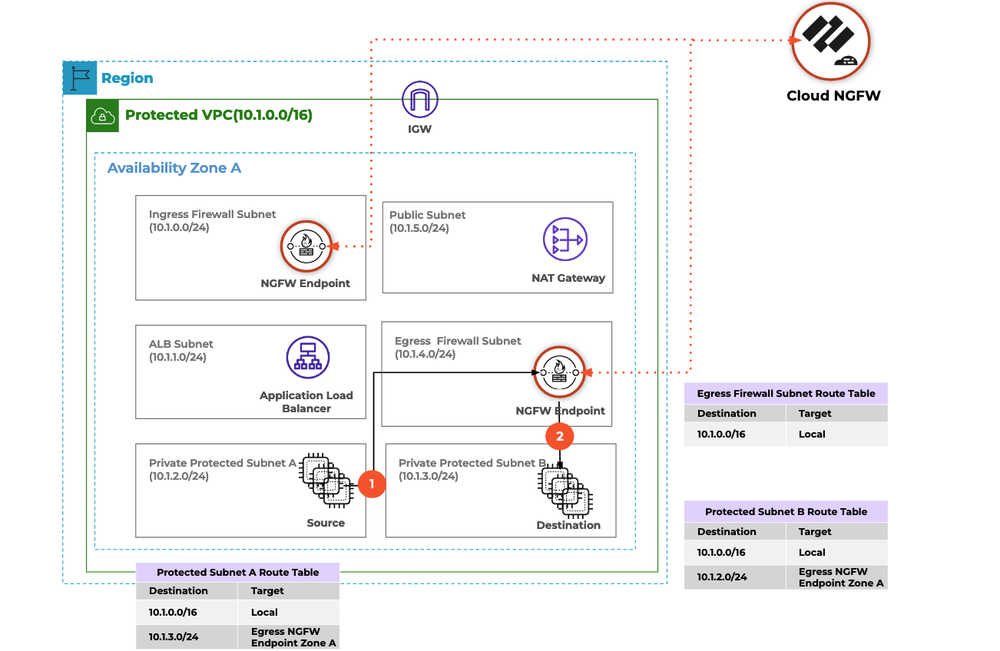

import Assumptions from "../_assumptions.md";
import LabGuidance from "/products/shared/_lab-guidance.md";

# Deploying Cloud NGFW using Terraform

:::important
This is a multi-section tutorial, with dependencies between each section. Please perform each section in order, per the links on the left-hand sidebar.
:::

## Objective

The objective of this multi-section tutorial is to deploy Cloud NGFW into AWS with Terraform. The sections are divided as follows:

1. This introduction
2. Prepare AWS infrastructure
3. Subscribe to and prepare Cloud NGFW
4. Create a Cloud NFGW rulestack and rules
5. Commit the Cloud NFGW rulestack and rules
6. Create Cloud NFGW resources

There are many ways to architect Cloud NGFW into your AWS infrastructure. This tutorial uses one of the [reference architecture designs from Palo Alto Networks](https://live.paloaltonetworks.com/t5/cloud-ngfw-articles/cloud-ngfw-for-aws-deployment-architectures/ta-p/475919), described in the "Protect Traffic between TWO subnets in a VPC" section and shown in Figure 6. Using this design pattern, you will deploy Cloud NGFW into a single VPC in a single availability zone, and protect traffic between two hosts deployed into two separate DMZ subnets. The endpoints used to steer traffic into Cloud NGFW Will be [service-managed](https://docs.paloaltonetworks.com/cloud-ngfw/aws/cloud-ngfw-on-aws/create-cloud-ngfw-instances-and-endpoints).

This tutorial follows the convention of splitting up Terraform code into separate files, namely:

- `providers.tf` - definition and configuration of Terraform providers to be used
- `variables.tf` - declaration of variables which will be used
- `terraform.tfvars` - when required, defines values for variables
- `main.tf` - definition and creation of resources (for example, AWS infrastructure, Cloud NGFW rules, etc)
- `outputs.tf` - declaration of values to be presented back after Terraform finishes executing

<Assumptions />

<LabGuidance />
