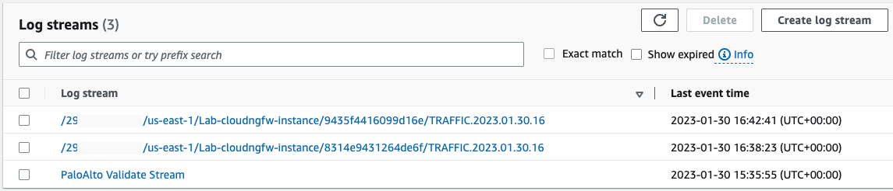
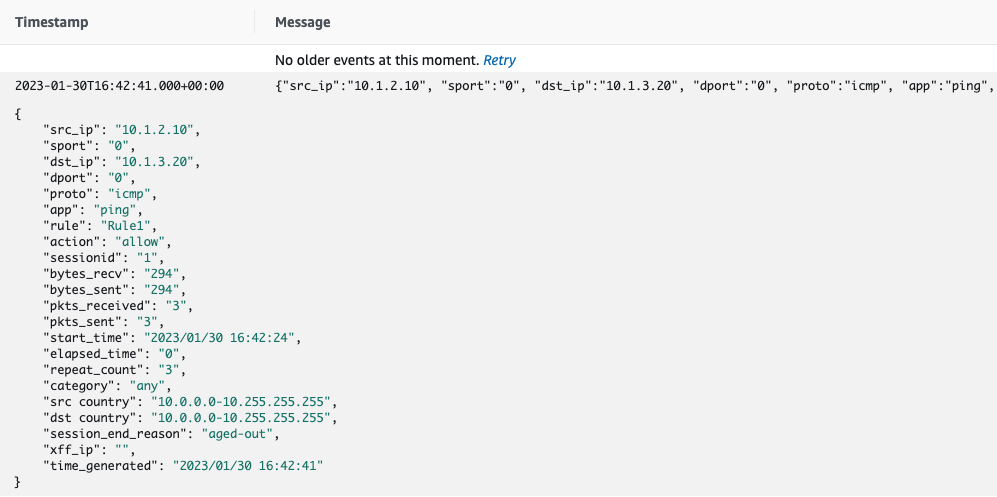

# Tutorial Review

:::important
This is a multi-section tutorial, with dependencies between each section. Please perform each section in order, per the links on the left-hand sidebar.
:::

## Testing Cloud NGFW

Assuming you followed all the sections of the tutorial so far, it's time to test and prove Cloud NGFW has been deployed successfully.

Return to the `00_aws_infra/` directory and perform a `terraform refresh` command. The output should include the public and private IP addresses of the two test hosts:

```hcl
.
.
host1_private_ip = "10.1.2.10"
host1_public_ip = "3.23.23.23"
host2_private_ip = "10.1.3.20"
host2_public_ip = "52.44.184.41"
.
.
```

Terraform created and stored an SSH key in the `00_aws_infra/` directory for logging into the hosts, and before it can be used the permissions need changing, so execute `chmod 0700 ssh_private_key.pem`.

Now SSH into test host1, for example: `ssh -i ssh_private_key.pem ubuntu@3.23.23.23`

Then ping host2 using its private IP address, for example: `ping -c 5 10.1.3.20`, and the pings should be successful:

```bash
ubuntu@ip-10-1-2-10:~$ ping -c 5 10.1.3.20
PING 10.1.3.20 (10.1.3.20) 56(84) bytes of data.
64 bytes from 10.1.3.20: icmp_seq=1 ttl=64 time=0.335 ms
64 bytes from 10.1.3.20: icmp_seq=2 ttl=64 time=0.264 ms
64 bytes from 10.1.3.20: icmp_seq=3 ttl=64 time=0.261 ms
64 bytes from 10.1.3.20: icmp_seq=4 ttl=64 time=0.264 ms
64 bytes from 10.1.3.20: icmp_seq=5 ttl=64 time=0.267 ms

--- 10.1.3.20 ping statistics ---
5 packets transmitted, 5 received, 0% packet loss, time 4094ms
rtt min/avg/max/mdev = 0.261/0.278/0.335/0.028 ms
```

SSH should not work, because the rules created on your Cloud NGFW were for the application `ping` only. Try executing `ssh -o ConnectTimeout=5 ubuntu@10.1.3.20`, it should timeout:

```bash
ubuntu@ip-10-1-2-10:~$ ssh -o ConnectTimeout=5 ubuntu@10.1.3.20
ssh: connect to host 10.1.3.20 port 22: Connection timed out
```

All of the above tests can also be performed on host2 towards host1 as well, because the rules created included a rule for each direction.

## Viewing Cloud NGFW Logs

The testing above proves Cloud NGFW is now enforcing rules between the two subnets where the hosts reside. The final confirmation comes from observing firewall logs. For this lab tutorial the logs were sent to AWS CloudWatch.

Head to [CloudWatch in the AWS Console](https://console.aws.amazon.com/cloudwatch), on the left-hand menu select Logs -> Log Groups. From the list of Log groups presented, click on the one named `PaloAltoCloudNGFW`. AWS will present you with a list of Log streams (Cloud NGFW is delivered with resilient resources, with each resource providing its own stream, so you will observe multiple streams):


Clicking on one of the "TRAFFIC" streams will display a list of logs, and each log entry can be expanded to get a full view of the session's details:


## Ongoing Cloud NGFW Operations with Terraform

During this tutorial, several Terraform plans were created, each in their own directory. Whilst this is a tutorial designed to provide a working lab-style example of a deployment, here is a summary of the ongoing lifecycle of each directory and plan:

- `00_aws_infra`: Here you created example AWS infrastructure, into which you inserted Cloud NGFW, and placed a security enforcement point between two subnets. This is design to be a very simplified mimic of a real-life AWS infrastructure you may already have deployed today, so you would likely continue to maintain your AWS infrastructure as you already had been doing. The key item deployed on top of generic AWS infrastructure, was the IAM Role used to perform Cloud NGFW operations.
- `01_cloudngfw_rulestacks_rules`: Here you created a rulestack, with rules to control traffic between two subnets. As your rules and DMZ subnets grew over time, you would maintain the rules here.
- `02_cloudngfw_resources`: Here you created the Cloud NGFW resources themselves, which included VPC endpoint creation because you selected the service-managed option. The Cloud NGFW resources can only be created once the relevant rulestack is created from the previous rulestacks plan, and committed from the commit plan, hence their separation. You also used this plan to create the routing which steered traffic into the Cloud NGFWs, and you would maintain all of these going forward as your deployment grew.
- `10_cloudngfw_commit`: Here you performed commit for the rulestack, to make rule changes live. As you continued to make changes to the rules in your rulestacks, you would re-use this separate plan over and over, to perform commit operations after making changes to the rulestacks and/or rules.

## Summary

If you followed this tutorial in entirety, you:

- built a simple AWS infrastructure (VPC, subnets, hosts, etc), with Terraform
- inserted Cloud NGFW between two subnets, with no changes required to the subnets, only routing changes on the existing route tables, all with Terraform
- controlled and inspected traffic between two live hosts


We have only scratched the surface of Cloud NGFW's capabilites as a next-generation firewall, we specifically focused on deploying Cloud NGFW using Terraform. For much more information about Cloud NGFW's features and functionality, including discussion of other architecture patterns and deployment styles, please visit [the website](https://docs.paloaltonetworks.com/cloud-ngfw/aws).
