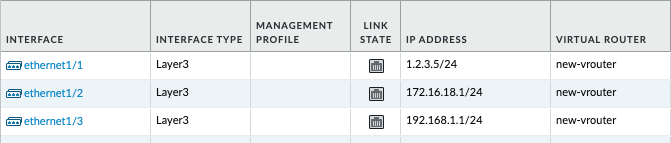
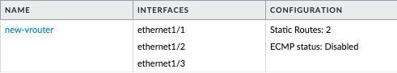
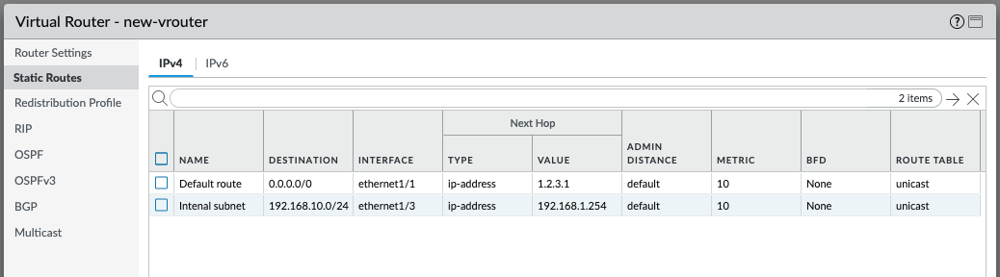
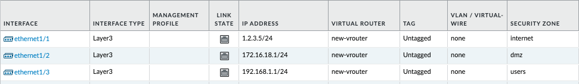

import Assumptions from "../_assumptions.md";
import LabGuidance from "/products/shared/_lab-guidance.md";
import ClosingNotes from "../_closingnotes.md";
import TutorialInit from "./_tutorial-init.md";

# Configuring Networking

With this Terraform code, you will create a number of items related to networking. This will include a virtual router, security zones, networking interfaces, and static routes.

<Assumptions />

<LabGuidance />

## Get Terraform ready for configuration

In the first section, you will create a Terraform file, and initialize Terraform so it is ready to perform configuration operations.

1. Create a file called `networking.tf` and paste in the following content:

<TutorialInit />

## Configure Network Interfaces

This Terraform code will configure three network interfaces, which you will later attach to security zones and a virtual router.

1. Add the following code to the bottom of the existing `networking.tf` file:

```hcl
resource "panos_ethernet_interface" "e1" {
  vsys        = "vsys1"
  name        = "ethernet1/1"
  mode        = "layer3"
  static_ips  = ["1.2.3.5/24"]
  enable_dhcp = false

  lifecycle {
    create_before_destroy = true
  }
}

resource "panos_ethernet_interface" "e2" {
  vsys        = "vsys1"
  name        = "ethernet1/2"
  mode        = "layer3"
  static_ips  = ["172.16.18.1/24"]
  enable_dhcp = false

  lifecycle {
    create_before_destroy = true
  }
}

resource "panos_ethernet_interface" "e3" {
  vsys        = "vsys1"
  name        = "ethernet1/3"
  mode        = "layer3"
  static_ips  = ["192.168.1.1/24"]
  enable_dhcp = false

  lifecycle {
    create_before_destroy = true
  }
}
```

2. Instruct Terraform to inspect the firewall, and calculate the changes it will need to make in future, based on the Terraform code:

```
terraform plan
```

3. The output should look something like this:

```hcl
Terraform used the selected providers to generate the following execution plan. Resource actions are indicated with the following symbols:
  + create

Terraform will perform the following actions:

  # panos_ethernet_interface.e1 will be created
  + resource "panos_ethernet_interface" "e1" {
      + enable_dhcp = false
      + id          = (known after apply)
      + mode        = "layer3"
      + name        = "ethernet1/1"
      + static_ips  = [
          + "1.2.3.5/24",
        ]
      + vsys        = "vsys1"
    }

  # panos_ethernet_interface.e2 will be created
  + resource "panos_ethernet_interface" "e2" {
      + enable_dhcp = false
      + id          = (known after apply)
      + mode        = "layer3"
      + name        = "ethernet1/2"
      + static_ips  = [
          + "172.16.18.1/24",
        ]
      + vsys        = "vsys1"
    }

  # panos_ethernet_interface.e3 will be created
  + resource "panos_ethernet_interface" "e3" {
      + enable_dhcp = false
      + id          = (known after apply)
      + mode        = "layer3"
      + name        = "ethernet1/3"
      + static_ips  = [
          + "192.168.1.1/24",
        ]
      + vsys        = "vsys1"
    }

Plan: 3 to add, 0 to change, 0 to destroy.
```

4. Instruct Terraform to inspect the firewall, calculate the changes it will need to make (based on the Terraform code), and execute the changes:

```
terraform apply
```

5. When prompted, say `yes` to confirm you are happy to make these changes

```
Do you want to perform these actions?
  Terraform will perform the actions described above.
  Only 'yes' will be accepted to approve.

  Enter a value:
```

6. The output should look something like this:

```hcl
panos_ethernet_interface.e3: Creating...
panos_ethernet_interface.e2: Creating...
panos_ethernet_interface.e1: Creating...
panos_ethernet_interface.e2: Creation complete after 3s [id=vsys1:ethernet1/2]
panos_ethernet_interface.e3: Creation complete after 3s [id=vsys1:ethernet1/3]
panos_ethernet_interface.e1: Creation complete after 3s [id=vsys1:ethernet1/1]

Apply complete! Resources: 3 added, 0 changed, 0 destroyed.
```

7. Login to the PAN-OS GUI and confirm that the three network interfaces have been configured.



## Create a Virtual Router

This Terraform code will configure a virtual router, to which we will attach the three network interfaces you created in the previous step.

1. Add the following code to the bottom of the existing `networking.tf` file:

```hcl
resource "panos_virtual_router" "vr1" {
  name = "new-vrouter"
  interfaces = [
    panos_ethernet_interface.e1.name,
    panos_ethernet_interface.e2.name,
    panos_ethernet_interface.e3.name,
  ]

  lifecycle {
    create_before_destroy = true
  }
}
```

2. Instruct Terraform to inspect the firewall, and calculate the changes it will need to make in future, based on the Terraform code:

```
terraform plan
```

3. The output should look something like this (note the default values passed in by the PAN-OS provider for various routing protocols):

```hcl
Terraform used the selected providers to generate the following execution plan. Resource actions are indicated with the following symbols:
  + create

Terraform will perform the following actions:

  # panos_virtual_router.vr1 will be created
  + resource "panos_virtual_router" "vr1" {
      + ebgp_dist        = 20
      + ibgp_dist        = 200
      + id               = (known after apply)
      + interfaces       = [
          + "ethernet1/1",
          + "ethernet1/2",
          + "ethernet1/3",
        ]
      + name             = "new-vrouter"
      + ospf_ext_dist    = 110
      + ospf_int_dist    = 30
      + ospfv3_ext_dist  = 110
      + ospfv3_int_dist  = 30
      + rip_dist         = 120
      + static_dist      = 10
      + static_ipv6_dist = 10
    }

Plan: 1 to add, 0 to change, 0 to destroy.
```

4. Instruct Terraform to inspect the firewall, calculate the changes it will need to make (based on the Terraform code), and execute the changes:

```
terraform apply
```

5. When prompted, say `yes` to confirm you are happy to make these changes

```
Do you want to perform these actions?
  Terraform will perform the actions described above.
  Only 'yes' will be accepted to approve.

  Enter a value:
```

6. The output should look something like this:

```hcl
panos_virtual_router.vr1: Creating...
panos_virtual_router.vr1: Creation complete after 1s [id=:::new-vrouter]

Apply complete! Resources: 1 added, 0 changed, 0 destroyed.
```

7. Login to the PAN-OS GUI and confirm that the virtual router has been created, with three imported network interfaces.



## Create Static Routes

This Terraform code will configure static routes within the virtual router you just created. You will add a default route to the Internet, and an internal route too.

1. Add the following code to the bottom of the existing `networking.tf` file:

```hcl
resource "panos_static_route_ipv4" "defaultroute" {
  name           = "defaultroute"
  virtual_router = panos_virtual_router.vr1.name
  destination    = "0.0.0.0/0"
  interface      = "ethernet1/1"
  next_hop       = "1.2.3.1"

  lifecycle {
    create_before_destroy = true
  }
}

resource "panos_static_route_ipv4" "internalroute" {
  name           = "Internal subnet"
  virtual_router = panos_virtual_router.vr1.name
  destination    = "192.168.10.0/24"
  interface      = "ethernet1/3"
  next_hop       = "192.168.1.254"

  lifecycle {
    create_before_destroy = true
  }
}
```

2. Instruct Terraform to inspect the firewall, and calculate the changes it will need to make in future, based on the Terraform code:

```
terraform plan
```

3. The output should look something like this:

```hcl
Terraform used the selected providers to generate the following execution plan. Resource actions are indicated with the following symbols:
  + create

Terraform will perform the following actions:

  # panos_static_route_ipv4.defaultroute will be created
  + resource "panos_static_route_ipv4" "defaultroute" {
      + destination    = "0.0.0.0/0"
      + id             = (known after apply)
      + interface      = "ethernet1/1"
      + metric         = 10
      + name           = "defaultroute"
      + next_hop       = "1.2.3.1"
      + route_table    = "unicast"
      + type           = "ip-address"
      + virtual_router = "new-vrouter"
    }

  # panos_static_route_ipv4.internalroute will be created
  + resource "panos_static_route_ipv4" "internalroute" {
      + destination    = "192.168.10.0/24"
      + id             = (known after apply)
      + interface      = "ethernet1/3"
      + metric         = 10
      + name           = "Internal subnet"
      + next_hop       = "192.168.1.254"
      + route_table    = "unicast"
      + type           = "ip-address"
      + virtual_router = "new-vrouter"
    }

Plan: 2 to add, 0 to change, 0 to destroy.
```

4. Instruct Terraform to inspect the firewall, calculate the changes it will need to make (based on the Terraform code), and execute the changes:

```
terraform apply
```

5. When prompted, say `yes` to confirm you are happy to make these changes

```
Do you want to perform these actions?
  Terraform will perform the actions described above.
  Only 'yes' will be accepted to approve.

  Enter a value:
```

6. The output should look something like this:

```hcl
panos_static_route_ipv4.internalroute: Creating...
panos_static_route_ipv4.defaultroute: Creating...
panos_static_route_ipv4.internalroute: Creation complete after 1s [id=new-vrouter:Internal subnet]
panos_static_route_ipv4.defaultroute: Creation complete after 1s [id=new-vrouter:defaultroute]

Apply complete! Resources: 2 added, 0 changed, 0 destroyed.
```

7. Login to the PAN-OS GUI and confirm that the two new static routes have been created inside the virtual router.



## Create and assign security zones

This Terraform code will create three security zones, and assign them to the three network interfaces previously created.

1. Add the following code to the bottom of the existing `networking.tf` file:

```hcl
resource "panos_zone" "internet" {
  name = "internet"
  mode = "layer3"
  interfaces = [
    panos_ethernet_interface.e1.name,
  ]
  enable_user_id = false

  lifecycle {
    create_before_destroy = true
  }
}

resource "panos_zone" "dmz" {
  name = "dmz"
  mode = "layer3"
  interfaces = [
    panos_ethernet_interface.e2.name,
  ]
  enable_user_id = true

  lifecycle {
    create_before_destroy = true
  }
}

resource "panos_zone" "users" {
  name = "users"
  mode = "layer3"
  interfaces = [
    panos_ethernet_interface.e3.name,
  ]
  enable_user_id = true

  lifecycle {
    create_before_destroy = true
  }
}
```

2. Instruct Terraform to inspect the firewall, and calculate the changes it will need to make in future, based on the Terraform code:

```
terraform plan
```

3. The output should look something like this:

```hcl
Terraform used the selected providers to generate the following execution plan. Resource actions are indicated with the following symbols:
  + create

Terraform will perform the following actions:

  # panos_zone.dmz will be created
  + resource "panos_zone" "dmz" {
      + enable_user_id = true
      + id             = (known after apply)
      + interfaces     = [
          + "ethernet1/2",
        ]
      + mode           = "layer3"
      + name           = "dmz"
      + vsys           = "vsys1"
    }

  # panos_zone.internet will be created
  + resource "panos_zone" "internet" {
      + enable_user_id = false
      + id             = (known after apply)
      + interfaces     = [
          + "ethernet1/1",
        ]
      + mode           = "layer3"
      + name           = "internet"
      + vsys           = "vsys1"
    }

  # panos_zone.users will be created
  + resource "panos_zone" "users" {
      + enable_user_id = true
      + id             = (known after apply)
      + interfaces     = [
          + "ethernet1/3",
        ]
      + mode           = "layer3"
      + name           = "users"
      + vsys           = "vsys1"
    }

Plan: 3 to add, 0 to change, 0 to destroy.
```

4. Instruct Terraform to inspect the firewall, calculate the changes it will need to make (based on the Terraform code), and execute the changes:

```
terraform apply
```

5. When prompted, say `yes` to confirm you are happy to make these changes

```
Do you want to perform these actions?
  Terraform will perform the actions described above.
  Only 'yes' will be accepted to approve.

  Enter a value:
```

6. The output should look something like this:

```hcl
panos_zone.users: Creating...
panos_zone.internet: Creating...
panos_zone.dmz: Creating...
panos_zone.dmz: Creation complete after 1s [id=::vsys1:dmz]
panos_zone.internet: Creation complete after 1s [id=::vsys1:internet]
panos_zone.users: Creation complete after 1s [id=::vsys1:users]

Apply complete! Resources: 3 added, 0 changed, 0 destroyed.
```

7. Login to the PAN-OS GUI and confirm that the three new zones have been have been created, and they have been assigned to network interfaces.




## Committing Configuration Changes

Please note that, due to how Terraform operates, in-band commits for PAN-OS are currently not possible. Therefore the changes you made with the steps above will be present only in the candidate configuration. A commit can performed out of band, either manually or through the approach discussed [here](/terraform/docs/panos/guides/commits).

## Final code

Putting all the sections together, the code in entirety looks like this:

```hcl
# Define required Terraform providers
terraform {
  required_providers {
    panos = {
      source  = "paloaltonetworks/panos"
      version = "~> 1.11.0"
    }
  }
}

# Configure the PAN-OS provider for Terraform
provider "panos" {
  hostname = var.panos_hostname
  username = var.panos_username
  password = var.panos_password
}

variable "panos_hostname" {
  type    = string
  default = "vm-series-test.jamoi.xyz"
}

variable "panos_username" {
  type    = string
  default = "admin"
}

variable "panos_password" {
  type    = string
  default = "Commit123!"
}

# Configure interfaces
resource "panos_ethernet_interface" "e1" {
  vsys        = "vsys1"
  name        = "ethernet1/1"
  mode        = "layer3"
  static_ips  = ["1.2.3.5/24"]
  enable_dhcp = false

  lifecycle {
    create_before_destroy = true
  }
}

resource "panos_ethernet_interface" "e2" {
  vsys        = "vsys1"
  name        = "ethernet1/2"
  mode        = "layer3"
  static_ips  = ["172.16.18.1/24"]
  enable_dhcp = false

  lifecycle {
    create_before_destroy = true
  }
}

resource "panos_ethernet_interface" "e3" {
  vsys        = "vsys1"
  name        = "ethernet1/3"
  mode        = "layer3"
  static_ips  = ["192.168.1.1/24"]
  enable_dhcp = false

  lifecycle {
    create_before_destroy = true
  }
}

# Create a virtual router
resource "panos_virtual_router" "vr1" {
  name = "new-vrouter"
  interfaces = [
    panos_ethernet_interface.e1.name,
    panos_ethernet_interface.e2.name,
    panos_ethernet_interface.e3.name,
  ]

  lifecycle {
    create_before_destroy = true
  }
}

# Create routes

resource "panos_static_route_ipv4" "defaultroute" {
  name           = "defaultroute"
  virtual_router = panos_virtual_router.vr1.name
  destination    = "0.0.0.0/0"
  interface      = "ethernet1/1"
  next_hop       = "1.2.3.1"

  lifecycle {
    create_before_destroy = true
  }
}

resource "panos_static_route_ipv4" "internalroute" {
  name           = "Internal subnet"
  virtual_router = panos_virtual_router.vr1.name
  destination    = "192.168.10.0/24"
  interface      = "ethernet1/3"
  next_hop       = "192.168.1.254"

  lifecycle {
    create_before_destroy = true
  }
}

# Configure security zones
resource "panos_zone" "internet" {
  name = "internet"
  mode = "layer3"
  interfaces = [
    panos_ethernet_interface.e1.name,
  ]
  enable_user_id = false

  lifecycle {
    create_before_destroy = true
  }
}

resource "panos_zone" "dmz" {
  name = "dmz"
  mode = "layer3"
  interfaces = [
    panos_ethernet_interface.e2.name,
  ]
  enable_user_id = true

  lifecycle {
    create_before_destroy = true
  }
}

resource "panos_zone" "users" {
  name = "users"
  mode = "layer3"
  interfaces = [
    panos_ethernet_interface.e3.name,
  ]
  enable_user_id = true

  lifecycle {
    create_before_destroy = true
  }
}
```

<ClosingNotes />
