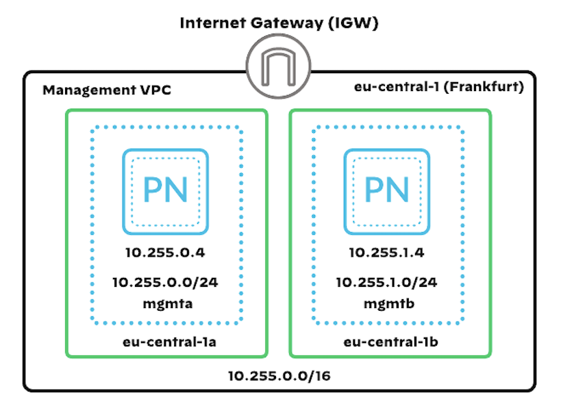

# Palo Alto Networks Panorama example

A Terraform example for deploying a one or more instances of Panorama in one or more VPCs in AWS Cloud.

**NOTE:**
Panorama will take a serveral minutes to bootup during the initial setup.

[](https://github.com/PaloAltoNetworks/terraform-aws-swfw-modules/tree/main/examples/panorama_standalone) [](https://registry.terraform.io/modules/PaloAltoNetworks/swfw-modules/aws/latest/examples/panorama_standalone)

## Topology

The topology consists of :
 - VPC with 2 subnets in 2 availability zones
 - 2 Panorama instances with a public IP addresses and static private IP addresses



## PAN-OS software version

Example was prepared for PAN-OS in **10.2.3** version as described in [AWS Deployment Guide](https://www.paloaltonetworks.com/resources/guides/panorama-on-aws-deployment-guide). For more information about recommended software versions see [Support PAN-OS Software Release Guidance](https://pandocs.tech/fw/184p-link3).

## Prerequisites

1. Prepare [panorama license](https://support.paloaltonetworks.com/)
2. Configure the Terraform [AWS provider](https://registry.terraform.io/providers/hashicorp/aws/latest/docs)

## Usage

1. Access AWS CloudShell or any other environment which has access to your AWS account
2. Clone the repository: `git clone https://github.com/PaloAltoNetworks/terraform-aws-swfw-modules`
3. Go to Panorama example: `cd terraform-aws-swfw-modules/examples/panorama_standalone`
4. Copy `example.tfvars` into `terraform.tfvars`
5. Review `terraform.tfvars` file, especially with lines commented by ` # TODO: update here`
6. Initialize Terraform: `terraform init`
7. Prepare plan: `terraform plan`
8. Deploy infrastructure: `terraform apply -auto-approve`
9. Destroy infrastructure if needed: `terraform destroy -auto-approve`

## Configuration

1. Get public IP for each Panorama instance(s): `terraform output panorama_public_ips`
2. Connect to the Panorama instance(s) via SSH using your associated private key: `ssh admin@x.x.x.x -i /PATH/TO/YOUR/KEY/id_rsa`
3. Set `admin` password:

```
> configure
# set mgt-config users admin password
```

## Access Panorama

Use a web browser to access https://x.x.x.x and login with admin and your previously configured password

## Reference
<!-- BEGIN_TF_DOCS -->
### Requirements

| Name | Version |
|------|---------|
| <a name="requirement_terraform"></a> [terraform](#requirement\_terraform) | >= 1.5.0, < 2.0.0 |
| <a name="requirement_aws"></a> [aws](#requirement\_aws) | ~> 5.17 |

### Providers

| Name | Version |
|------|---------|
| <a name="provider_aws"></a> [aws](#provider\_aws) | ~> 5.17 |

### Modules

| Name | Source | Version |
|------|--------|---------|
| <a name="module_panorama"></a> [panorama](#module\_panorama) | ../../modules/panorama | n/a |
| <a name="module_subnet_sets"></a> [subnet\_sets](#module\_subnet\_sets) | ../../modules/subnet_set | n/a |
| <a name="module_vpc"></a> [vpc](#module\_vpc) | ../../modules/vpc | n/a |
| <a name="module_vpc_routes"></a> [vpc\_routes](#module\_vpc\_routes) | ../../modules/vpc_route | n/a |

### Resources

| Name | Type |
|------|------|
| [aws_iam_instance_profile.this](https://registry.terraform.io/providers/hashicorp/aws/latest/docs/resources/iam_instance_profile) | resource |
| [aws_iam_role.this](https://registry.terraform.io/providers/hashicorp/aws/latest/docs/resources/iam_role) | resource |
| [aws_iam_role_policy.this](https://registry.terraform.io/providers/hashicorp/aws/latest/docs/resources/iam_role_policy) | resource |
| [aws_caller_identity.this](https://registry.terraform.io/providers/hashicorp/aws/latest/docs/data-sources/caller_identity) | data source |
| [aws_partition.this](https://registry.terraform.io/providers/hashicorp/aws/latest/docs/data-sources/partition) | data source |

### Inputs

| Name | Description | Type | Default | Required |
|------|-------------|------|---------|:--------:|
| <a name="input_global_tags"></a> [global\_tags](#input\_global\_tags) | Global tags configured for all provisioned resources | `map(any)` | `{}` | no |
| <a name="input_name_prefix"></a> [name\_prefix](#input\_name\_prefix) | Prefix used in names for the resources (VPCs, EC2 instances, autoscaling groups etc.) | `string` | `""` | no |
| <a name="input_panoramas"></a> [panoramas](#input\_panoramas) | A map defining Panorama instances<br/><br/>Following properties are available:<br/>- `instances`: map of Panorama instances with attributes:<br/>  - `az`: name of the Availability Zone<br/>  - `private_ip_address`: private IP address for management interface<br/>- `panos_version`: PAN-OS version used for Panorama<br/>- `network`: definition of network settings in object with attributes:<br/>  - `vpc`: name of the VPC (needs to be one of the keys in map `vpcs`)<br/>  - `subnet_group` - key of the subnet group<br/>  - `security_group`: security group assigned to ENI used by Panorama<br/>  - `create_public_ip`: true, if public IP address for management should be created<br/>- `ebs`: EBS settings defined in object with attributes:<br/>  - `volumes`: list of EBS volumes attached to each instance<br/>  - `kms_key_alias`: KMS key alias used for encrypting Panorama EBS<br/>- `iam`: IAM settings in object with attrbiutes:<br/>  - `create_role`: enable creation of IAM role<br/>  - `role_name`: name of the role to create or use existing one<br/>- `enable_imdsv2`: whether to enable IMDSv2 on the EC2 instance<br/><br/>Example:<pre>{<br/>  panorama\_ha\_pair = {<br/>    instances = {<br/>      "primary" = {<br/>        az                 = "eu-central-1a"<br/>        private\_ip\_address = "10.255.0.4"<br/>      }<br/>      "secondary" = {<br/>        az                 = "eu-central-1b"<br/>        private\_ip\_address = "10.255.1.4"<br/>      }<br/>    }<br/><br/>    panos\_version = "10.2.3"<br/><br/>    network = {<br/>      vpc              = "management\_vpc"<br/>      subnet\_group     = "mgmt"<br/>      security\_group   = "panorama\_mgmt"<br/>      create\_public\_ip = true<br/>    }<br/><br/>    ebs = {<br/>      volumes = [<br/>        {<br/>          name            = "ebs-1"<br/>          ebs\_device\_name = "/dev/sdb"<br/>          ebs\_size        = "2000"<br/>          ebs\_encrypted   = true<br/>        },<br/>        {<br/>          name            = "ebs-2"<br/>          ebs\_device\_name = "/dev/sdc"<br/>          ebs\_size        = "2000"<br/>          ebs\_encrypted   = true<br/>        }<br/>      ]<br/>      kms\_key\_alias = "aws/ebs"<br/>    }<br/><br/>    iam = {<br/>      create\_role = true<br/>      role\_name   = "panorama"<br/>    }<br/><br/>    enable\_imdsv2 = false<br/>  }<br/>}</pre> | <pre>map(object({<br/>    instances = map(object({<br/>      az                 = string<br/>      private\_ip\_address = string<br/>    }))<br/><br/>    panos\_version = string<br/><br/>    network = object({<br/>      vpc              = string<br/>      subnet\_group     = string<br/>      security\_group   = string<br/>      create\_public\_ip = bool<br/>    })<br/><br/>    ebs = object({<br/>      volumes = list(object({<br/>        name            = string<br/>        ebs\_device\_name = string<br/>        ebs\_size        = string<br/>      }))<br/>      encrypted     = bool<br/>      kms\_key\_alias = string<br/>    })<br/><br/>    iam = object({<br/>      create\_role = bool<br/>      role\_name   = string<br/>    })<br/><br/>    enable\_imdsv2 = bool<br/>  }))</pre> | `{}` | no |
| <a name="input_region"></a> [region](#input\_region) | AWS region used to deploy whole infrastructure | `string` | n/a | yes |
| <a name="input_ssh_key_name"></a> [ssh\_key\_name](#input\_ssh\_key\_name) | Name of the SSH key pair existing in AWS key pairs and used to authenticate to VM-Series or test boxes | `string` | n/a | yes |
| <a name="input_vpcs"></a> [vpcs](#input\_vpcs) | A map defining VPCs with security groups and subnets.<br/><br/>Following properties are available:<br/>- `name`: VPC name<br/>- `cidr`: CIDR for VPC<br/>- `security_groups`: map of security groups<br/>- `subnets`: map of subnets with properties:<br/>   - `az`: availability zone<br/>   - `subnet_group`: identity of the same purpose subnets group such as management<br/>- `routes`: map of routes with properties:<br/>   - `vpc`: key of VPC<br/>   - `subnet_group` - key of the subnet group<br/>   - `to_cidr`: destination IP range<br/>   - `next_hop_key`: must match keys use to create TGW attachment, IGW, GWLB endpoint or other resources<br/>   - `next_hop_type`: internet\_gateway, nat\_gateway, transit\_gateway\_attachment or gwlbe\_endpoint<br/><br/>Example:<pre>{<br/>  security\_vpc = {<br/>    name = "security-vpc"<br/>    cidr = "10.100.0.0/16"<br/>    security\_groups = {<br/>      panorama\_mgmt = {<br/>        name = "panorama\_mgmt"<br/>        rules = {<br/>          all\_outbound = {<br/>            description = "Permit All traffic outbound"<br/>            type        = "egress", from\_port = "0", to\_port = "0", protocol = "-1"<br/>            cidr\_blocks = ["0.0.0.0/0"]<br/>          }<br/>          https = {<br/>            description = "Permit HTTPS"<br/>            type        = "ingress", from\_port = "443", to\_port = "443", protocol = "tcp"<br/>            cidr\_blocks = ["130.41.247.0/24"]<br/>          }<br/>          ssh = {<br/>            description = "Permit SSH"<br/>            type        = "ingress", from\_port = "22", to\_port = "22", protocol = "tcp"<br/>            cidr\_blocks = ["130.41.247.0/24"]<br/>          }<br/>        }<br/>      }<br/>    }<br/>    subnets = {<br/>      "10.100.0.0/24"  = { az = "eu-central-1a", subnet\_group = "mgmt" }<br/>      "10.100.64.0/24" = { az = "eu-central-1b", subnet\_group = "mgmt" }<br/>    }<br/>    routes = {<br/>      mgmt\_default = {<br/>        vpc           = "security\_vpc<br/>        subnet\_group  = "mgmt"<br/>        to\_cidr       = "0.0.0.0/0"<br/>        next\_hop\_key  = "security\_vpc"<br/>        next\_hop\_type = "internet\_gateway"<br/>      }<br/>    }<br/>  }<br/>}</pre> | <pre>map(object({<br/>    name = string<br/>    cidr = string<br/>    nacls = map(object({<br/>      name = string<br/>      rules = map(object({<br/>        rule\_number = number<br/>        egress      = bool<br/>        protocol    = string<br/>        rule\_action = string<br/>        cidr\_block  = string<br/>        from\_port   = optional(string)<br/>        to\_port     = optional(string)<br/>      }))<br/>    }))<br/>    security\_groups = map(object({<br/>      name = string<br/>      rules = map(object({<br/>        description = string<br/>        type        = string<br/>        from\_port   = string<br/>        to\_port     = string<br/>        protocol    = string<br/>        cidr\_blocks = list(string)<br/>      }))<br/>    }))<br/>    subnets = map(object({<br/>      az                      = string<br/>      subnet\_group            = string<br/>      nacl                    = optional(string)<br/>      create\_subnet           = optional(bool, true)<br/>      create\_route\_table      = optional(bool, true)<br/>      existing\_route\_table\_id = optional(string)<br/>      associate\_route\_table   = optional(bool, true)<br/>      route\_table\_name        = optional(string)<br/>      local\_tags              = optional(map(string), {})<br/>    }))<br/>    routes = map(object({<br/>      vpc           = string<br/>      subnet\_group  = string<br/>      to\_cidr       = string<br/>      next\_hop\_key  = string<br/>      next\_hop\_type = string<br/>    }))<br/>  }))</pre> | `{}` | no |

### Outputs

| Name | Description |
|------|-------------|
| <a name="output_panorama_private_ips"></a> [panorama\_private\_ips](#output\_panorama\_private\_ips) | Map of private IPs for Panorama instances. |
| <a name="output_panorama_public_ips"></a> [panorama\_public\_ips](#output\_panorama\_public\_ips) | Map of public IPs for Panorama instances. |
| <a name="output_panorama_urls"></a> [panorama\_urls](#output\_panorama\_urls) | Map of URLs for Panorama instances. |
<!-- END_TF_DOCS -->