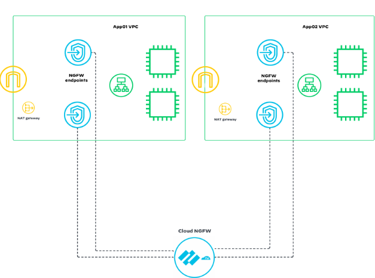

# Reference Architecture with Terraform: CloudNGFW in AWS, Isolated Design Model
- Same Firewall Cluster(s) to inspect applications in multiple VPCs.
- Transparently insert inspection in your application VPCs for both Ingress and Egress Traffic.
- No TGW resource is required.



[](https://github.com/PaloAltoNetworks/terraform-aws-swfw-modules/tree/main/examples/cloudngfw_isolated_design) [](https://registry.terraform.io/modules/PaloAltoNetworks/swfw-modules/aws/latest/examples/cloudngfw_isolated_design)

## Prerequsite
- Enable Programmatic Access
To use the Terraform provider, you must first enable the Programmatic Access for your Cloud NGFW tenant. You can check this by navigating to the Settings section of the Cloud NGFW console. The steps to do this can be found [here](https://pan.dev/cloudngfw/aws/api/).
- Cloud NGFW assuming role
You will authenticate against your Cloud NGFW by assuming roles in your AWS account that are allowed to make API calls to the AWS API Gateway service. The associated tags with the roles dictate the type of Cloud NGFW programmatic access granted — Firewall Admin, RuleStack Admin, or Global Rulestack Admin.
```
resource "aws_iam_role" "ngfw_role" {
  name = "CloudNGFWRole"

  inline_policy {
    name = "apigateway_policy"

    policy = jsonencode({
      "Version" : "2012-10-17",
      "Statement" : [
        {
          "Effect" : "Allow",
          "Action" : [
            "execute-api:Invoke",
            "execute-api:ManageConnections"
          ],
          "Resource" : "arn:aws:execute-api:*:*:*"
        }
      ]
    })
  }

  assume_role_policy = jsonencode({
    "Version" : "2012-10-17",
    "Statement" : [
      {
        "Sid" : "",
        "Effect" : "Allow",
        "Principal" : {
          "Service" : "apigateway.amazonaws.com"
        },
        "Action" : "sts:AssumeRole"
      },
      {
        "Sid" : "",
        "Effect" : "Allow",
        "Principal" : {
          "AWS" : [
            <your assume role ARN>
          ]
        },
        "Action" : "sts:AssumeRole"
      }
    ]
  })

  tags = {
    CloudNGFWRulestackAdmin       = "Yes"
    CloudNGFWFirewallAdmin        = "Yes"
    CloudNGFWGlobalRulestackAdmin = "Yes"
  }
}

```
- Update appriopate values for terraform variables ```var.provider_account``` and ``var.provider_role``.

## Spoke VMs

For the proposed example, the Spoke VMs are supporting ssm-agent. In addition, the VM ```user_data``` contains an installation of httpd service.</br>
To enable access from the session manager, the Internet connection for a public endpoint is required.

## Reference 
<!-- BEGIN_TF_DOCS -->
### Requirements

| Name | Version |
|------|---------|
| <a name="requirement_terraform"></a> [terraform](#requirement\_terraform) | >= 1.5.0, < 2.0.0 |
| <a name="requirement_aws"></a> [aws](#requirement\_aws) | ~> 5.17 |
| <a name="requirement_cloudngfwaws"></a> [cloudngfwaws](#requirement\_cloudngfwaws) | 2.0.6 |
| <a name="requirement_time"></a> [time](#requirement\_time) | 0.11.1 |

### Providers

| Name | Version |
|------|---------|
| <a name="provider_aws"></a> [aws](#provider\_aws) | ~> 5.17 |

### Modules

| Name | Source | Version |
|------|--------|---------|
| <a name="module_cloudngfw"></a> [cloudngfw](#module\_cloudngfw) | ../../modules/cloudngfw | n/a |
| <a name="module_gwlbe_endpoint"></a> [gwlbe\_endpoint](#module\_gwlbe\_endpoint) | ../../modules/gwlb_endpoint_set | n/a |
| <a name="module_natgw_set"></a> [natgw\_set](#module\_natgw\_set) | ../../modules/nat_gateway_set | n/a |
| <a name="module_public_alb"></a> [public\_alb](#module\_public\_alb) | ../../modules/alb | n/a |
| <a name="module_public_nlb"></a> [public\_nlb](#module\_public\_nlb) | ../../modules/nlb | n/a |
| <a name="module_subnet_sets"></a> [subnet\_sets](#module\_subnet\_sets) | ../../modules/subnet_set | n/a |
| <a name="module_vpc"></a> [vpc](#module\_vpc) | ../../modules/vpc | n/a |
| <a name="module_vpc_routes"></a> [vpc\_routes](#module\_vpc\_routes) | ../../modules/vpc_route | n/a |

### Resources

| Name | Type |
|------|------|
| [aws_iam_instance_profile.spoke_vm_iam_instance_profile](https://registry.terraform.io/providers/hashicorp/aws/latest/docs/resources/iam_instance_profile) | resource |
| [aws_iam_role.spoke_vm_ec2_iam_role](https://registry.terraform.io/providers/hashicorp/aws/latest/docs/resources/iam_role) | resource |
| [aws_iam_role_policy_attachment.spoke_vm_iam_instance_policy](https://registry.terraform.io/providers/hashicorp/aws/latest/docs/resources/iam_role_policy_attachment) | resource |
| [aws_instance.spoke_vms](https://registry.terraform.io/providers/hashicorp/aws/latest/docs/resources/instance) | resource |
| [aws_ami.this](https://registry.terraform.io/providers/hashicorp/aws/latest/docs/data-sources/ami) | data source |
| [aws_caller_identity.current](https://registry.terraform.io/providers/hashicorp/aws/latest/docs/data-sources/caller_identity) | data source |
| [aws_ebs_default_kms_key.current](https://registry.terraform.io/providers/hashicorp/aws/latest/docs/data-sources/ebs_default_kms_key) | data source |
| [aws_kms_key.current](https://registry.terraform.io/providers/hashicorp/aws/latest/docs/data-sources/kms_key) | data source |

### Inputs

| Name | Description | Type | Default | Required |
|------|-------------|------|---------|:--------:|
| <a name="input_cloudngfws"></a> [cloudngfws](#input\_cloudngfws) | A map defining Cloud NGFWs.<br/><br/>Following properties are available:<br/>- `name`       : name of CloudNGFW<br/>- `vpc_subnet` : key of the VPC and subnet connected by '-' character<br/>- `vpc`        : key of the VPC<br/>- `description`: Use for internal purposes.<br/>- `security_rules`: Security Rules definition.<br/>- `log_profiles`: Log Profile definition.<br/><br/>Example:<pre>cloudngfws = {<br/>  cloudngfws\_security = {<br/>    name        = "cloudngfw01"<br/>    vpc\_subnet  = "app\_vpc-app\_gwlbe"<br/>    vpc         = "app\_vpc"<br/>    description = "description"<br/>    security\_rules = <br/>    { <br/>      rule\_1 = { <br/>        rule\_list                   = "LocalRule"<br/>        priority                    = 3<br/>        name                        = "tf-security-rule"<br/>        description                 = "Also configured by Terraform"<br/>        source\_cidrs                = ["any"]<br/>        destination\_cidrs           = ["0.0.0.0/0"]<br/>        negate\_destination          = false<br/>        protocol                    = "application-default"<br/>        applications                = ["any"]<br/>        category\_feeds              = null<br/>        category\_url\_category\_names = null<br/>        action                      = "Allow"<br/>        logging                     = true<br/>        audit\_comment               = "initial config"<br/>      }<br/>    }<br/>    log\_profiles = {  <br/>      dest\_1 = {<br/>        create\_cw        = true<br/>        name             = "PaloAltoCloudNGFW"<br/>        destination\_type = "CloudWatchLogs"<br/>        log\_type         = "THREAT"<br/>      }<br/>      dest\_2 = {<br/>        create\_cw        = true<br/>        name             = "PaloAltoCloudNGFW"<br/>        destination\_type = "CloudWatchLogs"<br/>        log\_type         = "TRAFFIC"<br/>      }<br/>      dest\_3 = {<br/>        create\_cw        = true<br/>        name             = "PaloAltoCloudNGFW"<br/>        destination\_type = "CloudWatchLogs"<br/>        log\_type         = "DECRYPTION"<br/>      }<br/>    }<br/>    profile\_config = {<br/>      anti\_spyware  = "BestPractice"<br/>      anti\_virus    = "BestPractice"<br/>      vulnerability = "BestPractice"<br/>      file\_blocking = "BestPractice"<br/>      url\_filtering = "BestPractice"<br/>    }<br/>  }<br/>}</pre> | <pre>map(object({<br/>    name           = string<br/>    vpc\_subnet     = string<br/>    vpc            = string<br/>    description    = string<br/>    security\_rules = map(any)<br/>    log\_profiles   = map(any)<br/>    profile\_config = map(any)<br/>  }))</pre> | `{}` | no |
| <a name="input_global_tags"></a> [global\_tags](#input\_global\_tags) | Global tags configured for all provisioned resources | `any` | n/a | yes |
| <a name="input_gwlb_endpoints"></a> [gwlb\_endpoints](#input\_gwlb\_endpoints) | A map defining GWLB endpoints.<br/><br/>Following properties are available:<br/>- `name`: name of the GWLB endpoint<br/>- `vpc`: key of VPC<br/>- `vpc_subnet`: key of the VPC and subnet connected by '-' character<br/>- `act_as_next_hop`: set to `true` if endpoint is part of an IGW route table e.g. for inbound traffic<br/>- `to_vpc_subnets`: subnets to which traffic from IGW is routed to the GWLB endpoint<br/>- `delay`: number of seconds between adding endpoint to routing table<br/>- `cloudngfw`: key of the cloudngfw correspond with the endpoints<br/><br/>Example:<pre>gwlb\_endpoints = {<br/>  security\_gwlb\_eastwest = {<br/>    name            = "eastwest-gwlb-endpoint"<br/>    vpc             = "security\_vpc"<br/>    vpc\_subnet      = "security\_vpc-gwlbe\_eastwest"<br/>    act\_as\_next\_hop = false<br/>    to\_vpc\_subnets  = null<br/>    delay           = 60<br/>    cloudngfw       = "cloudngfw"<br/>  }<br/>}</pre> | <pre>map(object({<br/>    name            = string<br/>    vpc             = string<br/>    vpc\_subnet      = string<br/>    act\_as\_next\_hop = bool<br/>    to\_vpc\_subnets  = string<br/>    delay           = number<br/>    cloudngfw       = string<br/>  }))</pre> | `{}` | no |
| <a name="input_name_prefix"></a> [name\_prefix](#input\_name\_prefix) | Prefix used in names for the resources (VPCs, EC2 instances, autoscaling groups etc.) | `string` | n/a | yes |
| <a name="input_natgws"></a> [natgws](#input\_natgws) | A map defining NAT Gateways.<br/><br/>Following properties are available:<br/>- `name`: name of NAT Gateway<br/>- `vpc_subnet`: key of the VPC and subnet connected by '-' character<br/><br/>Example:<pre>natgws = {<br/>  security\_nat\_gw = {<br/>    name       = "natgw"<br/>    vpc\_subnet = "security\_vpc-natgw"<br/>  }<br/>}</pre> | <pre>map(object({<br/>    name       = string<br/>    vpc\_subnet = string<br/>  }))</pre> | `{}` | no |
| <a name="input_provider_account"></a> [provider\_account](#input\_provider\_account) | The AWS Account where the resources should be deployed. | `string` | n/a | yes |
| <a name="input_provider_role"></a> [provider\_role](#input\_provider\_role) | The predifined AWS assumed role for CloudNGFW. | `string` | n/a | yes |
| <a name="input_region"></a> [region](#input\_region) | AWS region used to deploy whole infrastructure | `string` | n/a | yes |
| <a name="input_spoke_albs"></a> [spoke\_albs](#input\_spoke\_albs) | A map defining Application Load Balancers deployed in spoke VPCs.<br/><br/>Following properties are available:<br/>- `rules`: Rules defining the method of traffic balancing<br/>- `vms`: Instances to be the target group for ALB<br/>- `vpc`: The VPC in which the load balancer is to be run<br/>- `vpc_subnet`: The subnets in which the Load Balancer is to be run<br/>- `security_gropus`: Security Groups to be associated with the ALB<pre></pre> | <pre>map(object({<br/>    rules           = any<br/>    vms             = list(string)<br/>    vpc             = string<br/>    vpc\_subnet      = string<br/>    security\_groups = string<br/>  }))</pre> | n/a | yes |
| <a name="input_spoke_nlbs"></a> [spoke\_nlbs](#input\_spoke\_nlbs) | A map defining Network Load Balancers deployed in spoke VPCs.<br/><br/>Following properties are available:<br/>- `vpc_subnet`: key of the VPC and subnet connected by '-' character<br/>- `vms`: keys of spoke VMs<br/><br/>Example:<pre>spoke\_lbs = {<br/>  "app1-nlb" = {<br/>    vpc\_subnet = "app1\_vpc-app1\_lb"<br/>    vms        = ["app1\_vm01", "app1\_vm02"]<br/>  }<br/>}</pre> | <pre>map(object({<br/>    vpc\_subnet = string<br/>    vms        = list(string)<br/>  }))</pre> | `{}` | no |
| <a name="input_spoke_vms"></a> [spoke\_vms](#input\_spoke\_vms) | A map defining VMs in spoke VPCs.<br/><br/>Following properties are available:<br/>- `az`: name of the Availability Zone<br/>- `vpc`: name of the VPC (needs to be one of the keys in map `vpcs`)<br/>- `vpc_subnet`: key of the VPC and subnet connected by '-' character<br/>- `security_group`: security group assigned to ENI used by VM<br/>- `type`: EC2 type VM<br/><br/>Example:<pre>spoke\_vms = {<br/>  "app1\_vm01" = {<br/>    az             = "eu-central-1a"<br/>    vpc            = "app1\_vpc"<br/>    vpc\_subnet     = "app1\_vpc-app1\_vm"<br/>    security\_group = "app1\_vm"<br/>    type           = "t3.micro"<br/>  }<br/>}</pre> | <pre>map(object({<br/>    az             = string<br/>    vpc            = string<br/>    vpc\_subnet     = string<br/>    security\_group = string<br/>    type           = string<br/>  }))</pre> | `{}` | no |
| <a name="input_ssh_key_name"></a> [ssh\_key\_name](#input\_ssh\_key\_name) | Name of the SSH key pair existing in AWS key pairs and used to authenticate to VM-Series or test boxes | `string` | n/a | yes |
| <a name="input_vpcs"></a> [vpcs](#input\_vpcs) | A map defining VPCs with security groups and subnets.<br/><br/>Following properties are available:<br/>- `name`: VPC name<br/>- `cidr`: CIDR for VPC<br/>- `nacls`: map of network ACLs<br/>- `security_groups`: map of security groups<br/>- `subnets`: map of subnets with properties:<br/>   - `az`: availability zone<br/>   - `set`: internal identifier referenced by main.tf<br/>   - `nacl`: key of NACL (can be null)<br/>- `routes`: map of routes with properties:<br/>   - `vpc_subnet` - built from key of VPCs concatenate with `-` and key of subnet in format: `VPCKEY-SUBNETKEY`<br/>   - `next_hop_key` - must match keys use to create TGW attachment, IGW, GWLB endpoint or other resources<br/>   - `next_hop_type` - internet\_gateway, nat\_gateway, transit\_gateway\_attachment or gwlbe\_endpoint<br/><br/>Example:<pre>vpcs = {<br/>  example\_vpc = {<br/>    name = "example-spoke-vpc"<br/>    cidr = "10.104.0.0/16"<br/>    nacls = {<br/>      trusted\_path\_monitoring = {<br/>        name               = "trusted-path-monitoring"<br/>        rules = {<br/>          allow\_inbound = {<br/>            rule\_number = 300<br/>            egress      = false<br/>            protocol    = "-1"<br/>            rule\_action = "allow"<br/>            cidr\_block  = "0.0.0.0/0"<br/>            from\_port   = null<br/>            to\_port     = null<br/>          }<br/>        }<br/>      }<br/>    }<br/>    security\_groups = {<br/>      example\_vm = {<br/>        name = "example\_vm"<br/>        rules = {<br/>          all\_outbound = {<br/>            description = "Permit All traffic outbound"<br/>            type        = "egress", from\_port = "0", to\_port = "0", protocol = "-1"<br/>            cidr\_blocks = ["0.0.0.0/0"]<br/>          }<br/>        }<br/>      }<br/>    }<br/>    subnets = {<br/>      "10.104.0.0/24"   = { az = "eu-central-1a", set = "vm", nacl = null }<br/>      "10.104.128.0/24" = { az = "eu-central-1b", set = "vm", nacl = null }<br/>    }<br/>    routes = {<br/>      vm\_default = {<br/>        vpc\_subnet    = "app1\_vpc-app1\_vm"<br/>        to\_cidr       = "0.0.0.0/0"<br/>        next\_hop\_key  = "app1"<br/>        next\_hop\_type = "transit\_gateway\_attachment"<br/>      }<br/>    }<br/>  }<br/>}</pre> | <pre>map(object({<br/>    name = string<br/>    cidr = string<br/>    nacls = map(object({<br/>      name = string<br/>      rules = map(object({<br/>        rule\_number = number<br/>        egress      = bool<br/>        protocol    = string<br/>        rule\_action = string<br/>        cidr\_block  = string<br/>        from\_port   = string<br/>        to\_port     = string<br/>      }))<br/>    }))<br/>    security\_groups = any<br/>    subnets = map(object({<br/>      az   = string<br/>      set  = string<br/>      nacl = string<br/>    }))<br/>    routes = map(object({<br/>      vpc\_subnet    = string<br/>      to\_cidr       = string<br/>      next\_hop\_key  = string<br/>      next\_hop\_type = string<br/>    }))<br/>  }))</pre> | `{}` | no |

### Outputs

| Name | Description |
|------|-------------|
| <a name="output_application_load_balancers"></a> [application\_load\_balancers](#output\_application\_load\_balancers) | FQDNs of Application Load Balancers |
| <a name="output_cloudngfws"></a> [cloudngfws](#output\_cloudngfws) | n/a |
| <a name="output_network_load_balancers"></a> [network\_load\_balancers](#output\_network\_load\_balancers) | FQDNs of Network Load Balancers. |
<!-- END_TF_DOCS -->