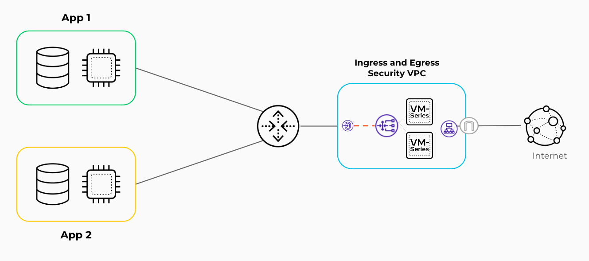

# Reference Architecture with Terraform: VM-Series in AWS, Centralized Design Model, Common NGFW Option

Palo Alto Networks produces several [validated reference architecture design and deployment documentation guides](https://www.paloaltonetworks.com/resources/reference-architectures), which describe well-architected and tested deployments. When deploying VM-Series in a public cloud, the reference architectures guide users toward the best security outcomes, whilst reducing rollout time and avoiding common integration efforts.
The Terraform code presented here will deploy Palo Alto Networks VM-Series firewalls in AWS based on the centralized design; for a discussion of other options, please see the design guide from [the reference architecture guides](https://www.paloaltonetworks.com/resources/reference-architectures).

[](https://github.com/PaloAltoNetworks/terraform-aws-swfw-modules/tree/main/examples/centralized_design) [](https://registry.terraform.io/modules/PaloAltoNetworks/swfw-modules/aws/latest/examples/centralized_design)

## Reference Architecture Design



This code implements:
- a _centralized design_, which secures outbound, inbound, and east-west traffic flows using an AWS transit gateway (dTGW). Application resources are segmented across multiple VPCs that connect in a hub-and-spoke topology, with a dedicated VPC for security services where the VM-Series are deployed

## Detailed Architecture and Design

### Centralized Design
This design supports interconnecting a large number of VPCs, with a scalable solution to secure outbound, inbound, and east-west traffic flows using a transit gateway to connect the VPCs. The centralized design model offers the benefits of a highly scalable design for multiple VPCs connecting to a central hub for inbound, outbound, and VPC-to-VPC traffic control and visibility. In the Centralized design model, you segment application resources across multiple VPCs that connect in a hub-and-spoke topology. The hub of the topology, or transit gateway, is the central point of connectivity between VPCs and Prisma Access or enterprise network resources attached through a VPN or AWS Direct Connect. This model has a dedicated VPC for security services where you deploy VM-Series firewalls for traffic inspection and control. The security VPC does not contain any application resources. The security VPC centralizes resources that multiple workloads can share. The TGW ensures that all spoke-to-spoke and spoke-to-enterprise traffic transits the VM-Series.


## Prerequisites

The following steps should be followed before deploying the Terraform code presented here.

1. Deploy Panorama e.g. by using [Panorama example](https://registry.terraform.io/modules/PaloAltoNetworks/swfw-modules/aws/latest/examples/panorama_standalone)
2. Prepare device group, template, template stack in Panorama
3. Download and install plugin `sw_fw_license` for managing licenses
4. Configure bootstrap definition and license manager
5. Configure [license API key](https://docs.paloaltonetworks.com/vm-series/10-1/vm-series-deployment/license-the-vm-series-firewall/install-a-license-deactivation-api-key)
6. Configure security rules and NAT rules for outbound traffic
7. Configure interface management profile to enable health checks from GWLB
8. Configure network interfaces and subinterfaces, zones and virtual router in template

In example VM-Series are licensed using [Panorama-Based Software Firewall License Management `sw_fw_license`](https://docs.paloaltonetworks.com/vm-series/10-2/vm-series-deployment/license-the-vm-series-firewall/use-panorama-based-software-firewall-license-management), from which after configuring license manager values of `panorama-server`, `auth-key`, `dgname`, `tplname` can be used in `terraform.tfvars` file. Another way to bootstrap and license VM-Series is using [VM Auth Key](https://docs.paloaltonetworks.com/vm-series/10-2/vm-series-deployment/bootstrap-the-vm-series-firewall/generate-the-vm-auth-key-on-panorama). This approach requires preparing license (auth code) in file stored in S3 bucket or putting it in `authcodes` option. More information can be found in [document describing how to choose a bootstrap method](https://docs.paloaltonetworks.com/vm-series/10-2/vm-series-deployment/bootstrap-the-vm-series-firewall/choose-a-bootstrap-method). Please note, that other bootstrapping methods may requires additional changes in example code (e.g. adding options `vm-auth-key`, `authcodes`) and/or creating additional resources (e.g. S3 buckets).

## Spoke VMs

For the proposed example, the Spoke VMs are supporting ssm-agent. In addition, the VM ```user_data``` contains an installation of httpd service.</br>
To enable access from the session manager, the Internet connection for a public endpoint is required.

## Usage

1. Copy `example.tfvars` into `terraform.tfvars`
2. Review `terraform.tfvars` file, especially with lines commented by ` # TODO: update here`
3. Initialize Terraform: `terraform init`
5. Prepare plan: `terraform plan`
6. Deploy infrastructure: `terraform apply -auto-approve`
7. Destroy infrastructure if needed: `terraform destroy -auto-approve`

## Reference
<!-- BEGIN_TF_DOCS -->
### Requirements

| Name | Version |
|------|---------|
| <a name="requirement_terraform"></a> [terraform](#requirement\_terraform) | >= 1.5.0, < 2.0.0 |
| <a name="requirement_aws"></a> [aws](#requirement\_aws) | ~> 5.17 |
| <a name="requirement_local"></a> [local](#requirement\_local) | ~> 2.4.0 |

### Providers

| Name | Version |
|------|---------|
| <a name="provider_aws"></a> [aws](#provider\_aws) | ~> 5.17 |

### Modules

| Name | Source | Version |
|------|--------|---------|
| <a name="module_app_lb"></a> [app\_lb](#module\_app\_lb) | ../../modules/nlb | n/a |
| <a name="module_gwlb"></a> [gwlb](#module\_gwlb) | ../../modules/gwlb | n/a |
| <a name="module_gwlbe_endpoint"></a> [gwlbe\_endpoint](#module\_gwlbe\_endpoint) | ../../modules/gwlb_endpoint_set | n/a |
| <a name="module_natgw_set"></a> [natgw\_set](#module\_natgw\_set) | ../../modules/nat_gateway_set | n/a |
| <a name="module_public_alb"></a> [public\_alb](#module\_public\_alb) | ../../modules/alb | n/a |
| <a name="module_public_nlb"></a> [public\_nlb](#module\_public\_nlb) | ../../modules/nlb | n/a |
| <a name="module_subnet_sets"></a> [subnet\_sets](#module\_subnet\_sets) | ../../modules/subnet_set | n/a |
| <a name="module_transit_gateway"></a> [transit\_gateway](#module\_transit\_gateway) | ../../modules/transit_gateway | n/a |
| <a name="module_transit_gateway_attachment"></a> [transit\_gateway\_attachment](#module\_transit\_gateway\_attachment) | ../../modules/transit_gateway_attachment | n/a |
| <a name="module_vmseries"></a> [vmseries](#module\_vmseries) | ../../modules/vmseries | n/a |
| <a name="module_vpc"></a> [vpc](#module\_vpc) | ../../modules/vpc | n/a |
| <a name="module_vpc_routes"></a> [vpc\_routes](#module\_vpc\_routes) | ../../modules/vpc_route | n/a |

### Resources

| Name | Type |
|------|------|
| [aws_ec2_transit_gateway_route.from_security_to_panorama](https://registry.terraform.io/providers/hashicorp/aws/latest/docs/resources/ec2_transit_gateway_route) | resource |
| [aws_ec2_transit_gateway_route.from_spokes_to_security](https://registry.terraform.io/providers/hashicorp/aws/latest/docs/resources/ec2_transit_gateway_route) | resource |
| [aws_iam_instance_profile.spoke_vm_iam_instance_profile](https://registry.terraform.io/providers/hashicorp/aws/latest/docs/resources/iam_instance_profile) | resource |
| [aws_iam_instance_profile.vm_series_iam_instance_profile](https://registry.terraform.io/providers/hashicorp/aws/latest/docs/resources/iam_instance_profile) | resource |
| [aws_iam_role.spoke_vm_ec2_iam_role](https://registry.terraform.io/providers/hashicorp/aws/latest/docs/resources/iam_role) | resource |
| [aws_iam_role.vm_series_ec2_iam_role](https://registry.terraform.io/providers/hashicorp/aws/latest/docs/resources/iam_role) | resource |
| [aws_iam_role_policy.vm_series_ec2_iam_policy](https://registry.terraform.io/providers/hashicorp/aws/latest/docs/resources/iam_role_policy) | resource |
| [aws_iam_role_policy_attachment.spoke_vm_iam_instance_policy](https://registry.terraform.io/providers/hashicorp/aws/latest/docs/resources/iam_role_policy_attachment) | resource |
| [aws_instance.spoke_vms](https://registry.terraform.io/providers/hashicorp/aws/latest/docs/resources/instance) | resource |
| [aws_lb_target_group_attachment.this](https://registry.terraform.io/providers/hashicorp/aws/latest/docs/resources/lb_target_group_attachment) | resource |
| [aws_ami.this](https://registry.terraform.io/providers/hashicorp/aws/latest/docs/data-sources/ami) | data source |
| [aws_caller_identity.this](https://registry.terraform.io/providers/hashicorp/aws/latest/docs/data-sources/caller_identity) | data source |
| [aws_ebs_default_kms_key.current](https://registry.terraform.io/providers/hashicorp/aws/latest/docs/data-sources/ebs_default_kms_key) | data source |
| [aws_kms_key.current](https://registry.terraform.io/providers/hashicorp/aws/latest/docs/data-sources/kms_key) | data source |
| [aws_partition.this](https://registry.terraform.io/providers/hashicorp/aws/latest/docs/data-sources/partition) | data source |

### Inputs

| Name | Description | Type | Default | Required |
|------|-------------|------|---------|:--------:|
| <a name="input_global_tags"></a> [global\_tags](#input\_global\_tags) | Global tags configured for all provisioned resources | `any` | n/a | yes |
| <a name="input_gwlb_endpoints"></a> [gwlb\_endpoints](#input\_gwlb\_endpoints) | A map defining GWLB endpoints.<br/><br/>Following properties are available:<br/>- `name`: name of the GWLB endpoint<br/>- `gwlb`: key of GWLB<br/>- `vpc`: key of VPC<br/>- `subnet_group`: key of the subnet\_group<br/>- `act_as_next_hop`: set to `true` if endpoint is part of an IGW route table e.g. for inbound traffic<br/>- `from_igw_to_vpc`: VPC to which traffic from IGW is routed to the GWLB endpoint<br/>- `from_igw_to_subnet_group` : subnet\_group to which traffic from IGW is routed to the GWLB endpoint<br/><br/>Example:<pre>gwlb\_endpoints = {<br/>  security\_gwlb\_eastwest = {<br/>    name            = "eastwest-gwlb-endpoint"<br/>    gwlb            = "security\_gwlb"<br/>    vpc             = "security\_vpc"<br/>    subnet\_group    = "gwlbe\_eastwest"<br/>    act\_as\_next\_hop = false<br/>  }<br/>}</pre> | <pre>map(object({<br/>    name                     = string<br/>    gwlb                     = string<br/>    vpc                      = string<br/>    subnet\_group             = string<br/>    act\_as\_next\_hop          = bool<br/>    from\_igw\_to\_vpc          = optional(string)<br/>    from\_igw\_to\_subnet\_group = optional(string)<br/>  }))</pre> | `{}` | no |
| <a name="input_gwlbs"></a> [gwlbs](#input\_gwlbs) | A map defining Gateway Load Balancers.<br/><br/>Following properties are available:<br/>- `name`: name of the GWLB<br/>- `vpc`: key of the VPC<br/>- `subnet_group`: key of the subnet\_group<br/><br/>Example:<pre>gwlbs = {<br/>  security\_gwlb = {<br/>    name   = "security-gwlb"<br/>    vpc    = "security\_vpc"<br/>    subnet\_group = "gwlb"<br/>  }<br/>}</pre> | <pre>map(object({<br/>    name         = string<br/>    vpc          = string<br/>    subnet\_group = string<br/>  }))</pre> | `{}` | no |
| <a name="input_name_prefix"></a> [name\_prefix](#input\_name\_prefix) | Prefix used in names for the resources (VPCs, EC2 instances, autoscaling groups etc.) | `string` | n/a | yes |
| <a name="input_natgws"></a> [natgws](#input\_natgws) | A map defining NAT Gateways.<br/><br/>Following properties are available:<br/>- `name`: name of NAT Gateway<br/>- `vpc`: key of the VPC<br/>- `subnet_group`: key of the subnet\_group<br/><br/>Example:<pre>natgws = {<br/>  security\_nat\_gw = {<br/>    name   = "natgw"<br/>    vpc    = "security\_vpc"<br/>    subnet\_group = "natgw"<br/>  }<br/>}</pre> | <pre>map(object({<br/>    name         = string<br/>    vpc          = string<br/>    subnet\_group = string<br/>  }))</pre> | `{}` | no |
| <a name="input_panorama_attachment"></a> [panorama\_attachment](#input\_panorama\_attachment) | A object defining TGW attachment and CIDR for Panorama.<br/><br/>Following properties are available:<br/>- `transit_gateway_attachment_id`: ID of attachment for Panorama<br/>- `vpc_cidr`: CIDR of the VPC, where Panorama is deployed<br/><br/>Example:<pre>panorama = {<br/>  transit\_gateway\_attachment\_id = "tgw-attach-123456789"<br/>  vpc\_cidr                      = "10.255.0.0/24"<br/>}</pre> | <pre>object({<br/>    transit\_gateway\_attachment\_id = string<br/>    vpc\_cidr                      = string<br/>  })</pre> | `null` | no |
| <a name="input_region"></a> [region](#input\_region) | AWS region used to deploy whole infrastructure | `string` | n/a | yes |
| <a name="input_spoke_lbs"></a> [spoke\_lbs](#input\_spoke\_lbs) | A map defining Network Load Balancers deployed in spoke VPCs.<br/><br/>Following properties are available:<br/>- `vpc`: key of the VPC<br/>- `subnet_group`: key of the subnet\_group<br/>- `vms`: keys of spoke VMs<br/><br/>Example:<pre>spoke\_lbs = {<br/>  "app1-nlb" = {<br/>    vpc    = "app1\_vpc"<br/>    subnet\_group = "app1\_lb"<br/>    vms    = ["app1\_vm01", "app1\_vm02"]<br/>  }<br/>}</pre> | <pre>map(object({<br/>    vpc          = string<br/>    subnet\_group = string<br/>    vms          = list(string)<br/>  }))</pre> | `{}` | no |
| <a name="input_spoke_vms"></a> [spoke\_vms](#input\_spoke\_vms) | A map defining VMs in spoke VPCs.<br/><br/>Following properties are available:<br/>- `az`: name of the Availability Zone<br/>- `vpc`: name of the VPC (needs to be one of the keys in map `vpcs`)<br/>- `subnet_group`: key of the subnet\_group<br/>- `security_group`: security group assigned to ENI used by VM<br/>- `type`: EC2 type VM<br/><br/>Example:<pre>spoke\_vms = {<br/>  "app1\_vm01" = {<br/>    az             = "eu-central-1a"<br/>    vpc            = "app1\_vpc"<br/>    subnet\_group   = "app1\_vm"<br/>    security\_group = "app1\_vm"<br/>    type           = "t2.micro"<br/>  }<br/>}</pre> | <pre>map(object({<br/>    az             = string<br/>    vpc            = string<br/>    subnet\_group   = string<br/>    security\_group = string<br/>    type           = string<br/>  }))</pre> | `{}` | no |
| <a name="input_ssh_key_name"></a> [ssh\_key\_name](#input\_ssh\_key\_name) | Name of the SSH key pair existing in AWS key pairs and used to authenticate to VM-Series or test boxes | `string` | n/a | yes |
| <a name="input_tgw"></a> [tgw](#input\_tgw) | A object defining Transit Gateway.<br/><br/>Following properties are available:<br/>- `create`: set to false, if existing TGW needs to be reused<br/>- `id`:  id of existing TGW or null<br/>- `name`: name of TGW to create or use<br/>- `asn`: ASN number<br/>- `route_tables`: map of route tables<br/>- `attachments`: map of TGW attachments<br/><br/>Example:<pre>tgw = {<br/>  create = true<br/>  id     = null<br/>  name   = "tgw"<br/>  asn    = "64512"<br/>  route\_tables = {<br/>    "from\_security\_vpc" = {<br/>      create = true<br/>      name   = "from\_security"<br/>    }<br/>  }<br/>  attachments = {<br/>    security = {<br/>      name                = "vmseries"<br/>      vpc = "security\_vpc"<br/>      subnet\_group          = "tgw\_attach"<br/>      route\_table         = "from\_security\_vpc"<br/>      propagate\_routes\_to = ["from\_spoke\_vpc"]<br/>    }<br/>  }<br/>}</pre> | <pre>object({<br/>    create = bool<br/>    id     = string<br/>    name   = string<br/>    asn    = string<br/>    route\_tables = map(object({<br/>      create = bool<br/>      name   = string<br/>    }))<br/>    attachments = map(object({<br/>      name                = string<br/>      vpc                 = string<br/>      subnet\_group        = string<br/>      route\_table         = string<br/>      propagate\_routes\_to = list(string)<br/>    }))<br/>  })</pre> | n/a | yes |
| <a name="input_vmseries"></a> [vmseries](#input\_vmseries) | A map defining VM-Series instances<br/><br/>Following properties are available:<br/>- `instances`: map of VM-Series instances<br/>- `bootstrap_options`: VM-Seriess bootstrap options used to connect to Panorama<br/>- `panos_version`: PAN-OS version used for VM-Series<br/>- `ebs_kms_id`: alias for AWS KMS used for EBS encryption in VM-Series<br/>- `vpc`: key of VPC<br/>- `gwlb`: key of GWLB<br/>- `subinterfaces`: configuration of network subinterfaces used to map with GWLB endpoints<br/>- `system_services`: map of system services<br/>- `application_lb`: ALB placed in front of the Firewalls' public interfaces<br/>- `network_lb`: NLB placed in front of the Firewalls' public interfaces<br/><br/>Example:<pre>vmseries = {<br/>  vmseries = {<br/>    instances = {<br/>      "01" = { az = "eu-central-1a" }<br/>      "02" = { az = "eu-central-1b" }<br/>    }<br/><br/>    # Value of `panorama-server`, `auth-key`, `dgname`, `tplname` can be taken from plugin `sw\_fw\_license`<br/>    bootstrap\_options = {<br/>      mgmt-interface-swap         = "enable"<br/>      plugin-op-commands          = "panorama-licensing-mode-on,aws-gwlb-inspect:enable,aws-gwlb-overlay-routing:enable"<br/>      dhcp-send-hostname          = "yes"<br/>      dhcp-send-client-id         = "yes"<br/>      dhcp-accept-server-hostname = "yes"<br/>      dhcp-accept-server-domain   = "yes"<br/>    }<br/><br/>    panos\_version = "10.2.3"        # TODO: update here<br/>    ebs\_kms\_id    = "alias/aws/ebs" # TODO: update here<br/><br/>    # Value of `vpc` must match key of objects stored in `vpcs`<br/>    vpc = "security\_vpc"<br/><br/>    # Value of `gwlb` must match key of objects stored in `gwlbs`<br/>    gwlb = "security\_gwlb"<br/><br/>    interfaces = {<br/>      private = {<br/>        device\_index      = 0<br/>        security\_group    = "vmseries\_private"<br/>        vpc               = "security\_vpc"<br/>        subnet\_group            = "private"<br/>        create\_public\_ip  = false<br/>        source\_dest\_check = false<br/>      }<br/>      mgmt = {<br/>        device\_index      = 1<br/>        security\_group    = "vmseries\_mgmt"<br/>        vpc               = "security\_vpc"<br/>        subnet\_group            = "mgmt"<br/>        create\_public\_ip  = true<br/>        source\_dest\_check = true<br/>      }<br/>      public = {<br/>        device\_index      = 2<br/>        security\_group    = "vmseries\_public"<br/>        vpc               = "security\_vpc"<br/>        subnet\_group            = "public"<br/>        create\_public\_ip  = true<br/>        source\_dest\_check = false<br/>      }<br/>    }<br/><br/>    # Value of `gwlb\_endpoint` must match key of objects stored in `gwlb\_endpoints`<br/>    subinterfaces = {<br/>      inbound = {<br/>        app1 = {<br/>          gwlb\_endpoint = "app1\_inbound"<br/>          subinterface  = "ethernet1/1.11"<br/>        }<br/>        app2 = {<br/>          gwlb\_endpoint = "app2\_inbound"<br/>          subinterface  = "ethernet1/1.12"<br/>        }<br/>      }<br/>      outbound = {<br/>        only\_1\_outbound = {<br/>          gwlb\_endpoint = "security\_gwlb\_outbound"<br/>          subinterface  = "ethernet1/1.20"<br/>        }<br/>      }<br/>      eastwest = {<br/>        only\_1\_eastwest = {<br/>          gwlb\_endpoint = "security\_gwlb\_eastwest"<br/>          subinterface  = "ethernet1/1.30"<br/>        }<br/>      }<br/>    }<br/><br/>    system\_services = {<br/>      dns\_primary = "4.2.2.2"      # TODO: update here<br/>      dns\_secondy = null           # TODO: update here<br/>      ntp\_primary = "pool.ntp.org" # TODO: update here<br/>      ntp\_secondy = null           # TODO: update here<br/>    }<br/><br/>    application\_lb = null<br/>    network\_lb     = null<br/>  }<br/>}</pre> | <pre>map(object({<br/>    instances = map(object({<br/>      az = string<br/>    }))<br/><br/>    bootstrap\_options = object({<br/>      mgmt-interface-swap                   = string<br/>      plugin-op-commands                    = string<br/>      panorama-server                       = string<br/>      auth-key                              = optional(string)<br/>      vm-auth-key                           = optional(string)<br/>      dgname                                = string<br/>      tplname                               = optional(string)<br/>      dhcp-send-hostname                    = string<br/>      dhcp-send-client-id                   = string<br/>      dhcp-accept-server-hostname           = string<br/>      dhcp-accept-server-domain             = string<br/>      authcodes                             = optional(string)<br/>      vm-series-auto-registration-pin-id    = optional(string)<br/>      vm-series-auto-registration-pin-value = optional(string)<br/>    })<br/><br/>    panos\_version = string<br/>    ebs\_kms\_id    = string<br/><br/>    vpc  = string<br/>    gwlb = string<br/><br/>    interfaces = map(object({<br/>      device\_index      = number<br/>      security\_group    = string<br/>      vpc               = string<br/>      subnet\_group      = string<br/>      create\_public\_ip  = bool<br/>      source\_dest\_check = bool<br/>    }))<br/><br/>    subinterfaces = map(map(object({<br/>      gwlb\_endpoint = string<br/>      subinterface  = string<br/>    })))<br/><br/>    system\_services = object({<br/>      dns\_primary = string<br/>      dns\_secondy = string<br/>      ntp\_primary = string<br/>      ntp\_secondy = string<br/>    })<br/><br/>    application\_lb = object({<br/>      name           = string<br/>      subnet\_group   = string<br/>      security\_group = string<br/>      rules          = any<br/>    })<br/><br/>    network\_lb = object({<br/>      name         = string<br/>      subnet\_group = string<br/>      rules        = any<br/>    })<br/>  }))</pre> | `{}` | no |
| <a name="input_vpcs"></a> [vpcs](#input\_vpcs) | A map defining VPCs with security groups and subnets.<br/><br/>Following properties are available:<br/>- `name`: VPC name<br/>- `cidr`: CIDR for VPC<br/>- `security_groups`: map of security groups<br/>- `subnets`: map of subnets with properties:<br/>   - `az`: availability zone<br/>   - `subnet_group`: identity of the same purpose subnets group such as management<br/>- `routes`: map of routes with properties:<br/>   - `vpc - key of the VPC<br/>   - `subnet\_group` - key of the subnet group<br/>   - `next\_hop\_key` - must match keys use to create TGW attachment, IGW, GWLB endpoint or other resources<br/>   - `next\_hop\_type` - internet_gateway, nat_gateway, transit_gateway_attachment or gwlbe_endpoint<br/><br/>Example:<br/>`<pre>vpcs = {<br/>  example\_vpc = {<br/>    name = "example-spoke-vpc"<br/>    cidr = "10.104.0.0/16"<br/>    nacls = {<br/>      trusted\_path\_monitoring = {<br/>        name               = "trusted-path-monitoring"<br/>        rules = {<br/>          allow\_inbound = {<br/>            rule\_number = 300<br/>            egress      = false<br/>            protocol    = "-1"<br/>            rule\_action = "allow"<br/>            cidr\_block  = "0.0.0.0/0"<br/>            from\_port   = null<br/>            to\_port     = null<br/>          }<br/>        }<br/>      }<br/>    }<br/>    security\_groups = {<br/>      example\_vm = {<br/>        name = "example\_vm"<br/>        rules = {<br/>          all\_outbound = {<br/>            description = "Permit All traffic outbound"<br/>            type        = "egress", from\_port = "0", to\_port = "0", protocol = "-1"<br/>            cidr\_blocks = ["0.0.0.0/0"]<br/>          }<br/>        }<br/>      }<br/>    }<br/>    subnets = {<br/>      "10.104.0.0/24"   = { az = "eu-central-1a", subnet\_group = "vm", nacl = null }<br/>      "10.104.128.0/24" = { az = "eu-central-1b", subnet\_group = "vm", nacl = null }<br/>    }<br/>    routes = {<br/>      vm\_default = {<br/>        vpc           = "app1\_vpc"<br/>        subnet\_group        = "app1\_vm"<br/>        to\_cidr       = "0.0.0.0/0"<br/>        next\_hop\_key  = "app1"<br/>        next\_hop\_type = "transit\_gateway\_attachment"<br/>      }<br/>    }<br/>  }<br/>}</pre> | <pre>map(object({<br/>    name = string<br/>    cidr = string<br/>    nacls = map(object({<br/>      name = string<br/>      rules = map(object({<br/>        rule\_number = number<br/>        egress      = bool<br/>        protocol    = string<br/>        rule\_action = string<br/>        cidr\_block  = string<br/>        from\_port   = string<br/>        to\_port     = string<br/>      }))<br/>    }))<br/>    security\_groups = any<br/>    subnets = map(object({<br/>      az           = string<br/>      subnet\_group = string<br/>      nacl         = string<br/>    }))<br/>    routes = map(object({<br/>      vpc           = string<br/>      subnet\_group  = string<br/>      to\_cidr       = string<br/>      next\_hop\_key  = string<br/>      next\_hop\_type = string<br/>    }))<br/>  }))</pre> | `{}` | no |

### Outputs

| Name | Description |
|------|-------------|
| <a name="output_app_inspected_dns_name"></a> [app\_inspected\_dns\_name](#output\_app\_inspected\_dns\_name) | FQDN of App Internal Load Balancer.<br/>Can be used in VM-Series configuration to balance traffic between the application instances. |
| <a name="output_public_alb_dns_name"></a> [public\_alb\_dns\_name](#output\_public\_alb\_dns\_name) | FQDN of VM-Series External Application Load Balancer used in centralized design. |
| <a name="output_public_nlb_dns_name"></a> [public\_nlb\_dns\_name](#output\_public\_nlb\_dns\_name) | FQDN of VM-Series External Network Load Balancer used in centralized design. |
| <a name="output_vmseries_public_ips"></a> [vmseries\_public\_ips](#output\_vmseries\_public\_ips) | Map of public IPs created within `vmseries` module instances. |
<!-- END_TF_DOCS -->