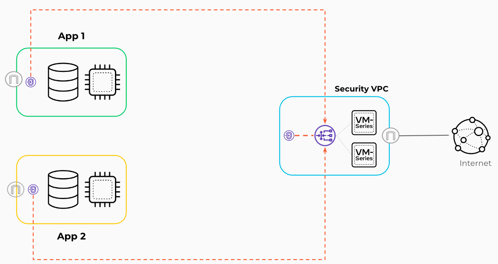
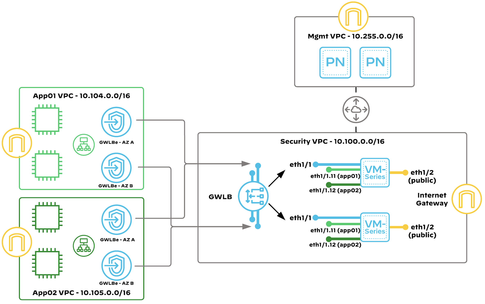

# Reference Architecture with Terraform: VM-Series in AWS, Isolated Design Model, Common NGFW option

Palo Alto Networks produces several [validated reference architecture design and deployment documentation guides](https://www.paloaltonetworks.com/resources/reference-architectures), which describe well-architected and tested deployments. When deploying VM-Series in a public cloud, the reference architectures guide users toward the best security outcomes, whilst reducing rollout time and avoiding common integration efforts.
The Terraform code presented here will deploy Palo Alto Networks VM-Series firewalls in AWS based on the centralized design; for a discussion of other options, please see the design guide from [the reference architecture guides](https://www.paloaltonetworks.com/resources/reference-architectures).

[](https://github.com/PaloAltoNetworks/terraform-aws-swfw-modules/tree/main/examples/isolated_design) [](https://registry.terraform.io/modules/PaloAltoNetworks/swfw-modules/aws/latest/examples/isolated_design)

## Reference Architecture Design




This code implements:
- an _isolated design_, which secures outbound and inbound traffic flows using AWS Gateway Load Balancer (GWLB). Application resources are segmented across multiple VPCs that distribute traffic to the dedicated VPC for security services where the VM-Series are deployed.


## Detailed Architecture and Design

### Isolated Design
The Isolated Design model centralizes the security instances in a dedicated security VPC, while providing one or more isolated VPCs inbound and outbound security services. This design leverages a VPC dedicated to security. In the security VPC, you deploy the VM-Series firewalls, in separate availability zones, and a GWLB to distribute traffic to the firewalls. This design uses overlay routing for outbound security on the VM-Series firewalls. Outbound traffic from instances in the isolated VPCs uses the PrivateLink connections from GWLB endpoints in the applications. VPCs to the GWLB in the security VPC to egress the AWS environment through the VM-Series firewalls. 


Inbound traffic originates outside the VPC and is destined to applications or services hosted within your VPCs, such as web servers. This design uses the GWLB and VM-Series firewalls in the security VPC, with GWLB endpoints in the application VPCs for the transparent inspection of inbound traffic.





## Prerequisites

The following steps should be followed before deploying the Terraform code presented here.

1. Deploy Panorama e.g. by using [Panorama example](https://registry.terraform.io/modules/PaloAltoNetworks/swfw-modules/aws/latest/examples/panorama_standalone)
2. Prepare device group, template, template stack in Panorama
3. Download and install plugin `sw_fw_license` for managing licenses
4. Configure bootstrap definition and license manager
5. Configure [license API key](https://docs.paloaltonetworks.com/vm-series/10-1/vm-series-deployment/license-the-vm-series-firewall/install-a-license-deactivation-api-key)
6. Configure security rules and NAT rules for outbound traffic
7. Configure interface management profile to enable health checks from GWLB
8. Configure network interfaces and subinterfaces, zones and virtual router in template

In example VM-Series are licensed using [Panorama-Based Software Firewall License Management `sw_fw_license`](https://docs.paloaltonetworks.com/vm-series/10-2/vm-series-deployment/license-the-vm-series-firewall/use-panorama-based-software-firewall-license-management), from which after configuring license manager values of `panorama-server`, `auth-key`, `dgname`, `tplname` can be used in `terraform.tfvars` file. Another way to bootstrap and license VM-Series is using [VM Auth Key](https://docs.paloaltonetworks.com/vm-series/10-2/vm-series-deployment/bootstrap-the-vm-series-firewall/generate-the-vm-auth-key-on-panorama). This approach requires preparing license (auth code) in file stored in S3 bucket or putting it in `authcodes` option. More information can be found in [document describing how to choose a bootstrap method](https://docs.paloaltonetworks.com/vm-series/10-2/vm-series-deployment/bootstrap-the-vm-series-firewall/choose-a-bootstrap-method). Please note, that other bootstrapping methods may requires additional changes in example code (e.g. adding options `vm-auth-key`, `authcodes`) and/or creating additional resources (e.g. S3 buckets).

## Spoke VMs

For the proposed example, the Spoke VMs are supporting ssm-agent. In addition, the VM ```user_data``` contains an installation of httpd service.</br>
To enable access from the session manager, the Internet connection for a public endpoint is required.

## Usage

1. Copy `example.tfvars` into `terraform.tfvars`
2. Review `terraform.tfvars` file, especially with lines commented by ` # TODO: update here`
3. Initialize Terraform: `terraform init`
5. Prepare plan: `terraform plan`
6. Deploy infrastructure: `terraform apply -auto-approve`
7. Destroy infrastructure if needed: `terraform destroy -auto-approve`

## Reference
<!-- BEGIN_TF_DOCS -->
### Requirements

| Name | Version |
|------|---------|
| <a name="requirement_terraform"></a> [terraform](#requirement\_terraform) | >= 1.5.0, < 2.0.0 |
| <a name="requirement_aws"></a> [aws](#requirement\_aws) | ~> 5.17 |

### Providers

| Name | Version |
|------|---------|
| <a name="provider_aws"></a> [aws](#provider\_aws) | ~> 5.17 |

### Modules

| Name | Source | Version |
|------|--------|---------|
| <a name="module_app_alb"></a> [app\_alb](#module\_app\_alb) | ../../modules/alb | n/a |
| <a name="module_app_nlb"></a> [app\_nlb](#module\_app\_nlb) | ../../modules/nlb | n/a |
| <a name="module_gwlb"></a> [gwlb](#module\_gwlb) | ../../modules/gwlb | n/a |
| <a name="module_gwlbe_endpoint"></a> [gwlbe\_endpoint](#module\_gwlbe\_endpoint) | ../../modules/gwlb_endpoint_set | n/a |
| <a name="module_natgw_set"></a> [natgw\_set](#module\_natgw\_set) | ../../modules/nat_gateway_set | n/a |
| <a name="module_subnet_sets"></a> [subnet\_sets](#module\_subnet\_sets) | ../../modules/subnet_set | n/a |
| <a name="module_vmseries"></a> [vmseries](#module\_vmseries) | ../../modules/vmseries | n/a |
| <a name="module_vpc"></a> [vpc](#module\_vpc) | ../../modules/vpc | n/a |
| <a name="module_vpc_routes"></a> [vpc\_routes](#module\_vpc\_routes) | ../../modules/vpc_route | n/a |

### Resources

| Name | Type |
|------|------|
| [aws_iam_instance_profile.spoke_vm_iam_instance_profile](https://registry.terraform.io/providers/hashicorp/aws/latest/docs/resources/iam_instance_profile) | resource |
| [aws_iam_instance_profile.vm_series_iam_instance_profile](https://registry.terraform.io/providers/hashicorp/aws/latest/docs/resources/iam_instance_profile) | resource |
| [aws_iam_role.spoke_vm_ec2_iam_role](https://registry.terraform.io/providers/hashicorp/aws/latest/docs/resources/iam_role) | resource |
| [aws_iam_role.vm_series_ec2_iam_role](https://registry.terraform.io/providers/hashicorp/aws/latest/docs/resources/iam_role) | resource |
| [aws_iam_role_policy.vm_series_ec2_iam_policy](https://registry.terraform.io/providers/hashicorp/aws/latest/docs/resources/iam_role_policy) | resource |
| [aws_iam_role_policy_attachment.spoke_vm_iam_instance_policy](https://registry.terraform.io/providers/hashicorp/aws/latest/docs/resources/iam_role_policy_attachment) | resource |
| [aws_instance.spoke_vms](https://registry.terraform.io/providers/hashicorp/aws/latest/docs/resources/instance) | resource |
| [aws_lb_target_group_attachment.this](https://registry.terraform.io/providers/hashicorp/aws/latest/docs/resources/lb_target_group_attachment) | resource |
| [aws_vpc_peering_connection.this](https://registry.terraform.io/providers/hashicorp/aws/latest/docs/resources/vpc_peering_connection) | resource |
| [aws_ami.this](https://registry.terraform.io/providers/hashicorp/aws/latest/docs/data-sources/ami) | data source |
| [aws_caller_identity.this](https://registry.terraform.io/providers/hashicorp/aws/latest/docs/data-sources/caller_identity) | data source |
| [aws_ebs_default_kms_key.current](https://registry.terraform.io/providers/hashicorp/aws/latest/docs/data-sources/ebs_default_kms_key) | data source |
| [aws_kms_key.current](https://registry.terraform.io/providers/hashicorp/aws/latest/docs/data-sources/kms_key) | data source |
| [aws_partition.this](https://registry.terraform.io/providers/hashicorp/aws/latest/docs/data-sources/partition) | data source |

### Inputs

| Name | Description | Type | Default | Required |
|------|-------------|------|---------|:--------:|
| <a name="input_global_tags"></a> [global\_tags](#input\_global\_tags) | Global tags configured for all provisioned resources | `any` | n/a | yes |
| <a name="input_gwlb_endpoints"></a> [gwlb\_endpoints](#input\_gwlb\_endpoints) | A map defining GWLB endpoints.<br/><br/>Following properties are available:<br/>- `name`: name of the GWLB endpoint<br/>- `custom_names`: Optional map of names of the VPC Endpoints, used to override the default naming generated from the input `name`.<br/>  Each key is the Availability Zone identifier, for example `us-east-1b`.<br/>- `gwlb`: key of GWLB. Required when GWLB Endpoint must connect to GWLB's service name<br/>- `vpc`: key of VPC<br/>- `subnet_group`: key of the subnet\_group<br/>- `act_as_next_hop`: set to `true` if endpoint is part of an IGW route table e.g. for inbound traffic<br/>- `from_igw_to_vpc`: VPC to which traffic from IGW is routed to the GWLB endpoint<br/>- `from_igw_to_subnet_group` : subnet\_group to which traffic from IGW is routed to the GWLB endpoint<br/>- `cloudngfw_key`(optional): Key of the Cloud NGFW. Required when GWLB Endpoint must connect to Cloud NGFW's service name<br/><br/>Example:<pre>gwlb\_endpoints = {<br/>  security\_gwlb\_eastwest = {<br/>    name            = "eastwest-gwlb-endpoint"<br/>    gwlb            = "security\_gwlb"<br/>    vpc             = "security\_vpc"<br/>    subnet\_group    = "gwlbe\_eastwest"<br/>    act\_as\_next\_hop = false<br/>  }<br/>}</pre> | <pre>map(object({<br/>    name                     = string<br/>    custom\_names             = optional(map(string), {})<br/>    gwlb                     = optional(string)<br/>    vpc                      = string<br/>    subnet\_group             = string<br/>    act\_as\_next\_hop          = bool<br/>    from\_igw\_to\_vpc          = optional(string)<br/>    from\_igw\_to\_subnet\_group = optional(string)<br/>    delay                    = optional(number, 0)<br/>    tags                     = optional(map(string))<br/>    cloudngfw\_key            = optional(string)<br/>  }))</pre> | `{}` | no |
| <a name="input_gwlbs"></a> [gwlbs](#input\_gwlbs) | A map defining Gateway Load Balancers.<br/><br/>Following properties are available:<br/>- `name`: name of the GWLB<br/>- `vpc`: key of the VPC<br/>- `subnet_group`: key of the subnet\_group<br/><br/>Example:<pre>gwlbs = {<br/>  security\_gwlb = {<br/>    name   = "security-gwlb"<br/>    vpc    = "security\_vpc"<br/>    subnet\_group = "gwlb"<br/>  }<br/>}</pre> | <pre>map(object({<br/>    name         = string<br/>    vpc          = string<br/>    subnet\_group = string<br/>    tg\_name      = optional(string)<br/>    target\_instances = optional(map(object({<br/>      id = string<br/>    })), {})<br/>    acceptance\_required           = optional(bool, false)<br/>    allowed\_principals            = optional(list(string), [])<br/>    deregistration\_delay          = optional(number)<br/>    health\_check\_enabled          = optional(bool)<br/>    health\_check\_interval         = optional(number, 5)<br/>    health\_check\_matcher          = optional(string)<br/>    health\_check\_path             = optional(string)<br/>    health\_check\_port             = optional(number, 80)<br/>    health\_check\_protocol         = optional(string)<br/>    health\_check\_timeout          = optional(number)<br/>    healthy\_threshold             = optional(number, 3)<br/>    unhealthy\_threshold           = optional(number, 3)<br/>    stickiness\_type               = optional(string)<br/>    rebalance\_flows               = optional(string, "no\_rebalance")<br/>    lb\_tags                       = optional(map(string), {})<br/>    lb\_target\_group\_tags          = optional(map(string), {})<br/>    endpoint\_service\_tags         = optional(map(string), {})<br/>    enable\_lb\_deletion\_protection = optional(bool)<br/>  }))</pre> | `{}` | no |
| <a name="input_name_prefix"></a> [name\_prefix](#input\_name\_prefix) | Prefix used in names for the resources (VPCs, EC2 instances, autoscaling groups etc.) | `string` | n/a | yes |
| <a name="input_natgws"></a> [natgws](#input\_natgws) | A map defining NAT Gateways.<br/><br/>Following properties are available:<br/>- `nat_gateway_names`: A map, where each key is an Availability Zone name, for example "eu-west-1b". <br/>  Each value in the map is a custom name of a NAT Gateway in that Availability Zone.<br/>- `vpc`: key of the VPC<br/>- `subnet_group`: key of the subnet\_group<br/>- `nat_gateway_tags`: A map containing NAT GW tags<br/>- `create_eip`: Defaults to true, uses a data source to find EIP when set to false<br/>- `eips`: Optional map of Elastic IP attributes. Each key must be an Availability Zone name. <br/><br/>Example:<pre>natgws = {<br/>  sec\_natgw = {<br/>    vpc = "security\_vpc"<br/>    subnet\_group = "natgw"<br/>    nat\_gateway\_names = {<br/>      "eu-west-1a" = "nat-gw-1"<br/>      "eu-west-1b" = "nat-gw-2"<br/>    }<br/>    eips ={<br/>      "eu-west-1a" = { <br/>        name = "natgw-1-pip"<br/>      }<br/>    }<br/>  }<br/>}</pre> | <pre>map(object({<br/>    create\_nat\_gateway = optional(bool, true)<br/>    nat\_gateway\_names  = optional(map(string), {})<br/>    vpc                = string<br/>    subnet\_group       = string<br/>    nat\_gateway\_tags   = optional(map(string), {})<br/>    create\_eip         = optional(bool, true)<br/>    eips = optional(map(object({<br/>      name      = optional(string)<br/>      public\_ip = optional(string)<br/>      id        = optional(string)<br/>      eip\_tags  = optional(map(string), {})<br/>    })), {})<br/>  }))</pre> | `{}` | no |
| <a name="input_panorama_connection"></a> [panorama\_connection](#input\_panorama\_connection) | A object defining VPC peering and CIDR for Panorama.<br/><br/>Following properties are available:<br/>- `security_vpc`: key of the security VPC<br/>- `peering_vpc_id`: ID of the VPC for Panorama<br/>- `vpc_cidr`: CIDR of the VPC, where Panorama is deployed<br/><br/>Example:<pre>panorama = {<br/>  security\_vpc   = "security\_vpc"<br/>  peering\_vpc\_id = "vpc-1234567890"<br/>  vpc\_cidr       = "10.255.0.0/24"<br/>}</pre> | <pre>object({<br/>    security\_vpc   = string<br/>    peering\_vpc\_id = string<br/>    vpc\_cidr       = string<br/>  })</pre> | <pre>{<br/>  "peering\_vpc\_id": null,<br/>  "security\_vpc": "security\_vpc",<br/>  "vpc\_cidr": "10.255.0.0/24"<br/>}</pre> | no |
| <a name="input_region"></a> [region](#input\_region) | AWS region used to deploy whole infrastructure | `string` | n/a | yes |
| <a name="input_spoke_albs"></a> [spoke\_albs](#input\_spoke\_albs) | A map defining Application Load Balancers deployed in spoke VPCs.<br/><br/>Following properties are available:<br/>- `rules`: Rules defining the method of traffic balancing<br/>- `vms`: Instances to be the target group for ALB<br/>- `vpc`: The VPC in which the load balancer is to be run<br/>- `subnet_group`: The subnets in which the Load Balancer is to be run<br/>- `security_gropus`: Security Groups to be associated with the ALB<pre></pre> | <pre>map(object({<br/>    rules = map(object({<br/>      protocol              = optional(string, "HTTP")<br/>      port                  = optional(number, 80)<br/>      health\_check\_port     = optional(string, "80")<br/>      health\_check\_matcher  = optional(string, "200")<br/>      health\_check\_path     = optional(string, "/")<br/>      health\_check\_interval = optional(number, 10)<br/>      listener\_rules = map(object({<br/>        target\_protocol = string<br/>        target\_port     = number<br/>        path\_pattern    = list(string)<br/>      }))<br/>    }))<br/>    vms             = list(string)<br/>    vpc             = string<br/>    subnet\_group    = string<br/>    security\_groups = string<br/>  }))</pre> | `{}` | no |
| <a name="input_spoke_nlbs"></a> [spoke\_nlbs](#input\_spoke\_nlbs) | A map defining Network Load Balancers deployed in spoke VPCs.<br/><br/>Following properties are available:<br/>- `name`: Name of the NLB<br/>- `vpc`: key of the VPC<br/>- `subnet_group`: key of the subnet\_group<br/>- `vms`: keys of spoke VMs<br/>- `internal_lb`(optional): flag to switch between internet\_facing and internal NLB<br/>- `balance_rules` (optional): Rules defining the method of traffic balancing <br/><br/>Example:<pre>spoke\_lbs = {<br/>  "app1-nlb" = {<br/>    vpc    = "app1\_vpc"<br/>    subnet\_group = "app1\_lb"<br/>    vms    = ["app1\_vm01", "app1\_vm02"]<br/>  }<br/>}</pre> | <pre>map(object({<br/>    name         = string<br/>    vpc          = string<br/>    subnet\_group = string<br/>    vms          = list(string)<br/>    internal\_lb  = optional(bool, false)<br/>    balance\_rules = map(object({<br/>      protocol   = string<br/>      port       = string<br/>      stickiness = optional(bool, true)<br/>    }))<br/>  }))</pre> | `{}` | no |
| <a name="input_spoke_vms"></a> [spoke\_vms](#input\_spoke\_vms) | A map defining VMs in spoke VPCs.<br/><br/>Following properties are available:<br/>- `az`: name of the Availability Zone<br/>- `vpc`: name of the VPC (needs to be one of the keys in map `vpcs`)<br/>- `subnet_group`: key of the subnet\_group<br/>- `security_group`: security group assigned to ENI used by VM<br/>- `type`: EC2 VM type<br/><br/>Example:<pre>spoke\_vms = {<br/>  "app1\_vm01" = {<br/>    az             = "eu-central-1a"<br/>    vpc            = "app1\_vpc"<br/>    subnet\_group         = "app1\_vm"<br/>    security\_group = "app1\_vm"<br/>    type           = "t3.micro"<br/>  }<br/>}</pre> | <pre>map(object({<br/>    az             = string<br/>    vpc            = string<br/>    subnet\_group   = string<br/>    security\_group = string<br/>    type           = optional(string, "t3.micro")<br/>  }))</pre> | `{}` | no |
| <a name="input_ssh_key_name"></a> [ssh\_key\_name](#input\_ssh\_key\_name) | Name of the SSH key pair existing in AWS key pairs and used to authenticate to VM-Series or test boxes | `string` | `""` | no |
| <a name="input_vmseries"></a> [vmseries](#input\_vmseries) | A map defining VM-Series instances<br/><br/>Following properties are available:<br/>- `instances`: map of VM-Series instances<br/>- `bootstrap_options`: VM-Seriess bootstrap options used to connect to Panorama<br/>- `panos_version`: PAN-OS version used for VM-Series<br/>- `ebs_kms_id`: alias for AWS KMS used for EBS encryption in VM-Series<br/>- `vpc`: key of VPC<br/>- `gwlb`: key of GWLB<br/>- `subinterfaces`: configuration of network subinterfaces used to map with GWLB endpoints<br/>- `system_services`: map of system services<br/>- `application_lb`: ALB placed in front of the Firewalls' public interfaces<br/>- `network_lb`: NLB placed in front of the Firewalls' public interfaces<br/><br/>Example:<pre>vmseries = {<br/>  vmseries = {<br/>    instances = {<br/>      "01" = { az = "eu-central-1a" }<br/>      "02" = { az = "eu-central-1b" }<br/>    }<br/><br/>    # Value of `panorama-server`, `auth-key`, `dgname`, `tplname` can be taken from plugin `sw\_fw\_license`<br/>    bootstrap\_options = {<br/>      mgmt-interface-swap         = "enable"<br/>      plugin-op-commands          = "panorama-licensing-mode-on,aws-gwlb-inspect:enable,aws-gwlb-overlay-routing:enable"<br/>      dhcp-send-hostname          = "yes"<br/>      dhcp-send-client-id         = "yes"<br/>      dhcp-accept-server-hostname = "yes"<br/>      dhcp-accept-server-domain   = "yes"<br/>    }<br/><br/>    panos\_version = "10.2.3"        # TODO: update here<br/>    ebs\_kms\_id    = "alias/aws/ebs" # TODO: update here<br/><br/>    # Value of `vpc` must match key of objects stored in `vpcs`<br/>    vpc = "security\_vpc"<br/><br/>    # Value of `gwlb` must match key of objects stored in `gwlbs`<br/>    gwlb = "security\_gwlb"<br/><br/>    interfaces = {<br/>      private = {<br/>        device\_index      = 0<br/>        security\_group    = "vmseries\_private"<br/>        vpc               = "security\_vpc"<br/>        subnet\_group            = "private"<br/>        create\_public\_ip  = false<br/>        source\_dest\_check = false<br/>      }<br/>      mgmt = {<br/>        device\_index      = 1<br/>        security\_group    = "vmseries\_mgmt"<br/>        vpc               = "security\_vpc"<br/>        subnet\_group            = "mgmt"<br/>        create\_public\_ip  = true<br/>        source\_dest\_check = true<br/>      }<br/>      public = {<br/>        device\_index      = 2<br/>        security\_group    = "vmseries\_public"<br/>        vpc               = "security\_vpc"<br/>        subnet\_group            = "public"<br/>        create\_public\_ip  = true<br/>        source\_dest\_check = false<br/>      }<br/>    }<br/><br/>    # Value of `gwlb\_endpoint` must match key of objects stored in `gwlb\_endpoints`<br/>    subinterfaces = {<br/>      inbound = {<br/>        app1 = {<br/>          gwlb\_endpoint = "app1\_inbound"<br/>          subinterface  = "ethernet1/1.11"<br/>        }<br/>        app2 = {<br/>          gwlb\_endpoint = "app2\_inbound"<br/>          subinterface  = "ethernet1/1.12"<br/>        }<br/>      }<br/>      outbound = {<br/>        only\_1\_outbound = {<br/>          gwlb\_endpoint = "security\_gwlb\_outbound"<br/>          subinterface  = "ethernet1/1.20"<br/>        }<br/>      }<br/>      eastwest = {<br/>        only\_1\_eastwest = {<br/>          gwlb\_endpoint = "security\_gwlb\_eastwest"<br/>          subinterface  = "ethernet1/1.30"<br/>        }<br/>      }<br/>    }<br/><br/>    system\_services = {<br/>      dns\_primary = "4.2.2.2"      # TODO: update here<br/>      dns\_secondy = null           # TODO: update here<br/>      ntp\_primary = "pool.ntp.org" # TODO: update here<br/>      ntp\_secondy = null           # TODO: update here<br/>    }<br/>  }<br/>}</pre> | <pre>map(object({<br/>    instances = map(object({<br/>      az   = string<br/>      name = optional(string)<br/>    }))<br/><br/>    bootstrap\_options = object({<br/>      hostname                              = optional(string)<br/>      mgmt-interface-swap                   = string<br/>      plugin-op-commands                    = string<br/>      op-command-modes                      = optional(string)<br/>      panorama-server                       = string<br/>      panorama-server-2                     = optional(string)<br/>      auth-key                              = optional(string)<br/>      vm-auth-key                           = optional(string)<br/>      dgname                                = string<br/>      tplname                               = optional(string)<br/>      cgname                                = optional(string)<br/>      dns-primary                           = optional(string)<br/>      dns-secondary                         = optional(string)<br/>      dhcp-send-hostname                    = optional(string)<br/>      dhcp-send-client-id                   = optional(string)<br/>      dhcp-accept-server-hostname           = optional(string)<br/>      dhcp-accept-server-domain             = optional(string)<br/>      authcodes                             = optional(string)<br/>      vm-series-auto-registration-pin-id    = optional(string)<br/>      vm-series-auto-registration-pin-value = optional(string)<br/>    })<br/><br/>    panos\_version                          = string<br/>    vmseries\_ami\_id                        = optional(string)<br/>    vmseries\_product\_code                  = optional(string, "6njl1pau431dv1qxipg63mvah")<br/>    include\_deprecated\_ami                 = optional(bool, false)<br/>    instance\_type                          = optional(string, "m5.xlarge")<br/>    ebs\_encrypted                          = optional(bool, true)<br/>    ebs\_kms\_id                             = optional(string, "alias/aws/ebs")<br/>    enable\_instance\_termination\_protection = optional(bool, false)<br/>    enable\_monitoring                      = optional(bool, false)<br/>    fw\_license\_type                        = optional(string, "byol")<br/><br/>    vpc  = string<br/>    gwlb = optional(string)<br/><br/>    interfaces = map(object({<br/>      device\_index       = number<br/>      name               = optional(string)<br/>      description        = optional(string)<br/>      security\_group     = string<br/>      subnet\_group       = string<br/>      create\_public\_ip   = optional(bool, false)<br/>      eip\_allocation\_id  = optional(string)<br/>      source\_dest\_check  = optional(bool, false)<br/>      private\_ips        = optional(list(string))<br/>      ipv6\_address\_count = optional(number, null)<br/>      public\_ipv4\_pool   = optional(string)<br/>    }))<br/><br/>    subinterfaces = map(map(object({<br/>      gwlb\_endpoint = string<br/>      subinterface  = string<br/>    })))<br/><br/>    tags = optional(map(string))<br/><br/>    system\_services = object({<br/>      dns\_primary = string<br/>      dns\_secondy = optional(string)<br/>      ntp\_primary = string<br/>      ntp\_secondy = optional(string)<br/>    })<br/><br/>    application\_lb = optional(object({<br/>      name           = optional(string)<br/>      subnet\_group   = optional(string)<br/>      security\_group = optional(string)<br/>      rules          = optional(any)<br/>    }), {})<br/><br/>    network\_lb = optional(object({<br/>      name         = optional(string)<br/>      subnet\_group = optional(string)<br/>      rules        = optional(any)<br/>    }), {})<br/>  }))</pre> | `{}` | no |
| <a name="input_vpcs"></a> [vpcs](#input\_vpcs) | A map defining VPCs with security groups and subnets.<br/><br/>Following properties are available:<br/>- `name`: VPC name<br/>- `cidr`: CIDR for VPC<br/>- `security_groups`: map of security groups<br/>- `subnets`: map of subnets with properties:<br/>    - `az`: availability zone<br/>    - `subnet_group`: identity of the same purpose subnets group such as management<br/>- `routes`: map of routes with properties:<br/>    - `vpc`: key of the VPC<br/>    - `subnet_group`: key of the subnet group<br/>    - `next_hop_key`: must match keys use to create TGW attachment, IGW, GWLB endpoint or other resources<br/>    - `next_hop_type`: internet\_gateway, nat\_gateway, transit\_gateway\_attachment or gwlbe\_endpoint<br/><br/>Example:<pre>vpcs = {<br/>  example\_vpc = {<br/>    name = "example-spoke-vpc"<br/>    cidr = "10.104.0.0/16"<br/>    nacls = {<br/>      trusted\_path\_monitoring = {<br/>        name               = "trusted-path-monitoring"<br/>        rules = {<br/>          allow\_inbound = {<br/>            rule\_number = 300<br/>            egress      = false<br/>            protocol    = "-1"<br/>            rule\_action = "allow"<br/>            cidr\_block  = "0.0.0.0/0"<br/>            from\_port   = null<br/>            to\_port     = null<br/>          }<br/>        }<br/>      }<br/>    }<br/>    security\_groups = {<br/>      example\_vm = {<br/>        name = "example\_vm"<br/>        rules = {<br/>          all\_outbound = {<br/>            description = "Permit All traffic outbound"<br/>            type        = "egress", from\_port = "0", to\_port = "0", protocol = "-1"<br/>            cidr\_blocks = ["0.0.0.0/0"]<br/>          }<br/>        }<br/>      }<br/>    }<br/>    subnets = {<br/>      "10.104.0.0/24"   = { az = "eu-central-1a", subnet\_group = "vm", nacl = null }<br/>      "10.104.128.0/24" = { az = "eu-central-1b", subnet\_group = "vm", nacl = null }<br/>    }<br/>    routes = {<br/>      vm\_default = {<br/>        vpc           = "app1\_vpc"<br/>        subnet\_group        = "app1\_vm"<br/>        to\_cidr       = "0.0.0.0/0"<br/>        next\_hop\_key  = "app1"<br/>        next\_hop\_type = "transit\_gateway\_attachment"<br/>      }<br/>    }<br/>  }<br/>}</pre> | <pre>map(object({<br/>    name                             = string<br/>    create\_vpc                       = optional(bool, true)<br/>    cidr                             = string<br/>    secondary\_cidr\_blocks            = optional(list(string), [])<br/>    assign\_generated\_ipv6\_cidr\_block = optional(bool)<br/>    use\_internet\_gateway             = optional(bool, false)<br/>    name\_internet\_gateway            = optional(string)<br/>    create\_internet\_gateway          = optional(bool, true)<br/>    route\_table\_internet\_gateway     = optional(string)<br/>    create\_vpn\_gateway               = optional(bool, false)<br/>    vpn\_gateway\_amazon\_side\_asn      = optional(string)<br/>    name\_vpn\_gateway                 = optional(string)<br/>    route\_table\_vpn\_gateway          = optional(string)<br/>    enable\_dns\_hostnames             = optional(bool, true)<br/>    enable\_dns\_support               = optional(bool, true)<br/>    instance\_tenancy                 = optional(string, "default")<br/>    nacls = optional(map(object({<br/>      name = string<br/>      rules = map(object({<br/>        rule\_number = number<br/>        egress      = bool<br/>        protocol    = string<br/>        rule\_action = string<br/>        cidr\_block  = string<br/>        from\_port   = optional(number)<br/>        to\_port     = optional(number)<br/>      }))<br/>    })), {})<br/>    security\_groups = optional(map(object({<br/>      name = string<br/>      rules = map(object({<br/>        description            = optional(string)<br/>        type                   = string<br/>        cidr\_blocks            = optional(list(string))<br/>        ipv6\_cidr\_blocks       = optional(list(string))<br/>        from\_port              = string<br/>        to\_port                = string<br/>        protocol               = string<br/>        prefix\_list\_ids        = optional(list(string))<br/>        source\_security\_groups = optional(list(string))<br/>        self                   = optional(bool)<br/>      }))<br/>    })), {})<br/>    subnets = optional(map(object({<br/>      name                    = optional(string, "")<br/>      az                      = string<br/>      subnet\_group            = string<br/>      nacl                    = optional(string)<br/>      create\_subnet           = optional(bool, true)<br/>      create\_route\_table      = optional(bool, true)<br/>      existing\_route\_table\_id = optional(string)<br/>      route\_table\_name        = optional(string)<br/>      associate\_route\_table   = optional(bool, true)<br/>      local\_tags              = optional(map(string), {})<br/>      map\_public\_ip\_on\_launch = optional(bool, false)<br/>    })), {})<br/>    routes = optional(map(object({<br/>      vpc                    = string<br/>      subnet\_group           = string<br/>      to\_cidr                = string<br/>      next\_hop\_key           = string<br/>      next\_hop\_type          = string<br/>      destination\_type       = optional(string, "ipv4")<br/>      managed\_prefix\_list\_id = optional(string)<br/>    })), {})<br/>    create\_dhcp\_options = optional(bool, false)<br/>    domain\_name         = optional(string)<br/>    domain\_name\_servers = optional(list(string))<br/>    ntp\_servers         = optional(list(string))<br/>    vpc\_tags            = optional(map(string), {})<br/>  }))</pre> | `{}` | no |

### Outputs

| Name | Description |
|------|-------------|
| <a name="output_application_load_balancers"></a> [application\_load\_balancers](#output\_application\_load\_balancers) | FQDNs of Application Load Balancers |
| <a name="output_network_load_balancers"></a> [network\_load\_balancers](#output\_network\_load\_balancers) | FQDNs of Network Load Balancers. |
| <a name="output_vmseries_public_ips"></a> [vmseries\_public\_ips](#output\_vmseries\_public\_ips) | Map of public IPs created within `vmseries` module instances. |
<!-- END_TF_DOCS -->