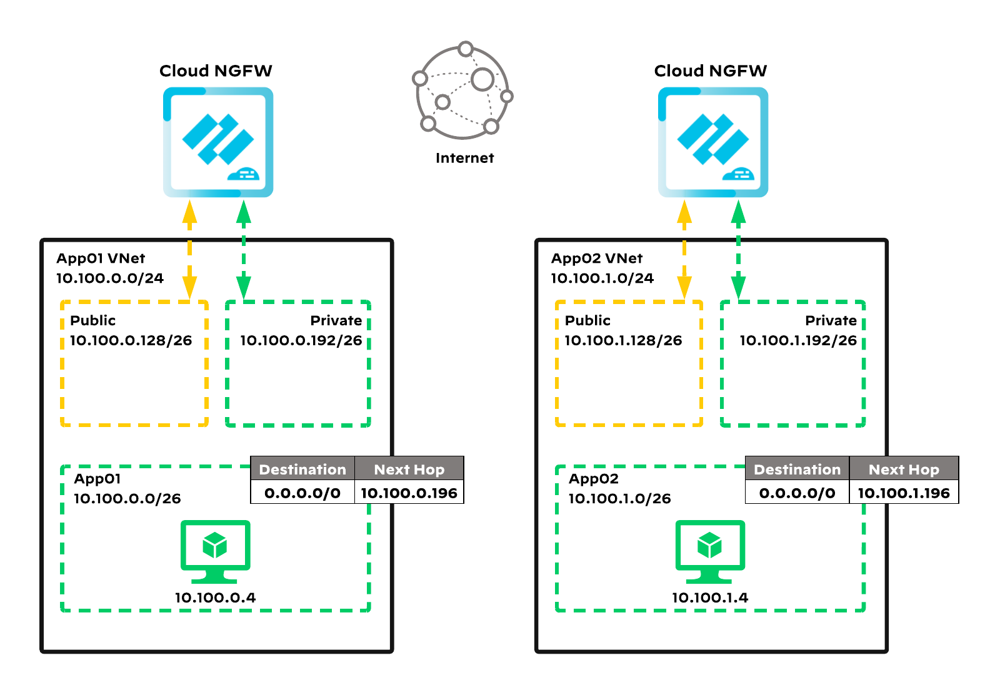

# Reference Architecture with Terraform: Cloud NGFW in Azure, Distributed Design Model.

Palo Alto Networks produces several [validated reference architecture design and deployment documentation guides](https://www.paloaltonetworks.com/resources/reference-architectures), which describe well-architected and tested deployments.
When deploying Cloud NGFWs in a public cloud, the reference architecturesguide users toward the best security outcomes,
whilst reducing rollout time and avoiding common integration efforts.

The Terraform code presented here will deploy Palo Alto Networks Cloud NGFW firewall in Azure based on a distributed virtual network design model with common Cloud NGFW for all traffic; for a discussion of other options, please see the design guide from
[the reference architecture guides](https://www.paloaltonetworks.com/resources/reference-architectures).

[](https://github.com/PaloAltoNetworks/terraform-azurerm-swfw-modules/tree/main/examples/cloudngfw_distributed) [](https://registry.terraform.io/modules/PaloAltoNetworks/swfw-modules/azurerm/latest/examples/cloudngfw_distributed)

## Detailed Architecture and Design

### Distributed Virtual Network Design

This code implements:

- a *distributed virtual network design*, a distributed topology where each VNet contains a separate Cloud NGFW to inspect all inbound, outbound, east-west, and enterprise traffic.

Application functions and resources are deployed across multiple VNets that are not connected with each other by any means. You integrate a separate Cloud NGFW with each VNet, handling all types of traffic for this specific VNet. Please see the [Cloud NGFW design guide](https://www.paloaltonetworks.com/apps/pan/public/downloadResource?pagePath=/content/pan/en_US/resources/guides/securing-apps-with-cloud-ngfw-for-azure-design-guide).



This reference architecture consists of:

- 2 Cloud NGFW, each:
  - with 2 network interfaces: public, private
  - with 2 public IP addresses assigned to public interface
  - Destination Network Address Translation rules
- test workloads with accompanying infrastructure:
  - 2 Spoke VNETs with Cloud NGFW dedicated Subnets (private and public), Route Tables and Network Security Groups
  - 2 Spoke VMs serving as WordPress-based web servers
  - 2 Azure Bastion managed jump hosts

## Prerequisites

A list of requirements might vary depending on the platform used to deploy the infrastructure but a minimum one includes:

- _(in case of non cloud shell deployment)_ credentials and (optionally) tools required to authenticate against Azure Cloud,
  see [AzureRM provider documentation for details](https://registry.terraform.io/providers/hashicorp/azurerm/latest/docs#authenticating-to-azure)
- [supported](#requirements) version of [`Terraform`](<https://developer.hashicorp.com/terraform/downloads>)

**NOTE!**
- after the deployment the firewalls remain not configured and not licensed
- to manage Cloud NGFW via Panorama, an existing Panorama instance is required. Please see the [Panorama integration guide](https://docs.paloaltonetworks.com/cloud-ngfw/azure/cloud-ngfw-for-azure/panorama-policy-management/panorama-integration-overview).

## Usage

### Deployment Steps

- checkout the code locally (if you haven't done so yet)
- copy the [`example.tfvars`](./example.tfvars) file, rename it to `terraform.tfvars` and adjust it to your needs
  (take a closer look at the `TODO` markers)
- _(optional)_ authenticate to AzureRM, switch to the Subscription of your choice
- provide `subscription_id` either by creating an environment variable named `ARM_SUBSCRIPTION_ID` with Subscription ID as value
  in your shell (recommended option) or by setting the value of `subscription_id` variable within your `tfvars` file (discouraged
  option, we don't recommend putting the Subscription ID in clear text inside the code).
- initialize the Terraform module:

  ```bash
  terraform init
  ```

- _(optional)_ plan you infrastructure to see what will be actually deployed:

  ```bash
  terraform plan
  ```

- deploy the infrastructure (you will have to confirm it with typing in `yes`):

  ```bash
  terraform apply
  ```

  The deployment takes couple of minutes.

### Post deploy

Firewall in this example is configured for management via Panorama.
To manage the firewall, all configurations are handled through the Panorama instance.

### Cleanup

To remove the deployed infrastructure run:

```sh
terraform destroy
```

## Reference

### Requirements

- `terraform`, version: >= 1.5, < 2.0

### Providers

- `random`
- `azurerm`

### Modules
Name | Version | Source | Description
--- | --- | --- | ---
`vnet` | - | ../../modules/vnet | 
`vnet_peering` | - | ../../modules/vnet_peering | 
`public_ip` | - | ../../modules/public_ip | 
`virtual_wan` | - | ../../modules/vwan | 
`vwan_routes` | - | ../../modules/vwan_routes | 
`cloudngfw` | - | ../../modules/cloudngfw | 
`test_infrastructure` | - | ../../modules/test_infrastructure | 

### Resources

- `resource_group` (managed)
- `password` (managed)
- `resource_group` (data)

### Required Inputs

Name | Type | Description
--- | --- | ---
[`subscription_id`](#subscription_id) | `string` | Azure Subscription ID is a required argument since AzureRM provider v4.
[`resource_group_name`](#resource_group_name) | `string` | Name of the Resource Group.
[`region`](#region) | `string` | The Azure region to use.
[`vnets`](#vnets) | `map` | A map defining VNETs.
[`cloudngfws`](#cloudngfws) | `map` | A map of objects defining the configuration for Cloud Next-Gen Firewalls (cloudngfws) in the environment.

### Optional Inputs

Name | Type | Description
--- | --- | ---
[`name_prefix`](#name_prefix) | `string` | A prefix that will be added to all created resources.
[`create_resource_group`](#create_resource_group) | `bool` | When set to `true` it will cause a Resource Group creation.
[`tags`](#tags) | `map` | Map of tags to assign to the created resources.
[`vnet_peerings`](#vnet_peerings) | `map` | A map defining VNET peerings.
[`public_ips`](#public_ips) | `object` | A map defining Public IP Addresses and Prefixes.
[`virtual_wans`](#virtual_wans) | `map` | A map defining Virtual WANs.
[`test_infrastructure`](#test_infrastructure) | `map` | A map defining test infrastructure including test VMs and Azure Bastion hosts.

### Outputs

Name |  Description
--- | ---
`test_vms_usernames` | Initial administrative username to use for test VMs.
`test_vms_passwords` | Initial administrative password to use for test VMs.
`test_vms_ips` | IP Addresses of the test VMs.
`test_lb_frontend_ips` | IP Addresses of the test load balancers.

### Required Inputs details

#### subscription_id

Azure Subscription ID is a required argument since AzureRM provider v4.

**Note!** \
Instead of putting the Subscription ID directly in the code, it's recommended to use an environment variable. Create an
environment variable named `ARM_SUBSCRIPTION_ID` with your Subscription ID as value and leave this variable set to `null`.


Type: string

<sup>[back to list](#modules-required-inputs)</sup>

#### resource_group_name

Name of the Resource Group.

Type: string

<sup>[back to list](#modules-required-inputs)</sup>

#### region

The Azure region to use.

Type: string

<sup>[back to list](#modules-required-inputs)</sup>

#### vnets

A map defining VNETs.

For detailed documentation on each property refer to [module documentation](../../modules/vnet)

- `create_virtual_network`  - (`bool`, optional, defaults to `true`) when set to `true` will create a VNET, `false` will source
                              an existing VNET.
- `name`                    - (`string`, required) a name of a VNET. In case `create_virtual_network = false` this should be a
                              full resource name, including prefixes.
- `resource_group_name`     - (`string`, optional, defaults to current RG) a name of an existing Resource Group in which the
                              VNET will reside or is sourced from.
- `address_space`           - (`list`, required when `create_virtual_network = false`) a list of CIDRs for a newly created VNET.
- `dns_servers`             - (`list`, optional, defaults to module defaults) a list of IP addresses of custom DNS servers
                              (by default Azure DNS is used).
- `vnet_encryption`         - (`string`, optional, defaults to module default) enables Azure Virtual Network Encryption when
                              set, only possible value at the moment is `AllowUnencrypted`. When set to `null`, the feature is
                              disabled.
- `ddos_protection_plan_id` - (`string`, optional, defaults to `null`) ID of an existing Azure Network DDOS Protection Plan to
                              be associated with the VNET.
- `network_security_groups` - (`map`, optional) map of Network Security Groups to create, for details see
                              [VNET module documentation](../../modules/vnet#network_security_groups).
- `route_tables`            - (`map`, optional) map of Route Tables to create, for details see
                              [VNET module documentation](../../modules/vnet#route_tables).
- `subnets`                 - (`map`, optional) map of Subnets to create or source, for details see
                              [VNET module documentation](../../modules/vnet#subnets).


Type: 

```hcl
map(object({
    create_virtual_network  = optional(bool, true)
    name                    = string
    resource_group_name     = optional(string)
    address_space           = optional(list(string))
    dns_servers             = optional(list(string))
    vnet_encryption         = optional(string)
    ddos_protection_plan_id = optional(string)
    network_security_groups = optional(map(object({
      name = string
      rules = optional(map(object({
        name                         = string
        priority                     = number
        direction                    = string
        access                       = string
        protocol                     = string
        source_port_range            = optional(string)
        source_port_ranges           = optional(list(string))
        destination_port_range       = optional(string)
        destination_port_ranges      = optional(list(string))
        source_address_prefix        = optional(string)
        source_address_prefixes      = optional(list(string))
        destination_address_prefix   = optional(string)
        destination_address_prefixes = optional(list(string))
      })), {})
    })), {})
    route_tables = optional(map(object({
      name                          = string
      bgp_route_propagation_enabled = optional(bool)
      routes = map(object({
        name                = string
        address_prefix      = string
        next_hop_type       = string
        next_hop_ip_address = optional(string)
      }))
    })), {})
    subnets = optional(map(object({
      create                          = optional(bool, true)
      name                            = string
      address_prefixes                = optional(list(string), [])
      network_security_group_key      = optional(string)
      route_table_key                 = optional(string)
      default_outbound_access_enabled = optional(bool)
      enable_storage_service_endpoint = optional(bool)
      enable_appgw_delegation         = optional(bool)
      enable_cloudngfw_delegation     = optional(bool)
    })), {})
  }))
```


<sup>[back to list](#modules-required-inputs)</sup>

#### cloudngfws

A map of objects defining the configuration for Cloud Next-Gen Firewalls (cloudngfws) in the environment.

Each cloudngfw entry in the map supports the following attributes:

- `name`                            - (`string`, required) the name of the Palo Alto Next Generation Firewall instance.
- `attachment_type`                 - (`string`, required) specifies whether the firewall is attached to a Virtual Network 
                                      (`vnet`) or a Virtual WAN (`vwan`).
- `virtual_network_key`             - (`string`, optional) key referencing the Virtual Network associated with this firewall. 
                                      Required if the `attachment_type` is `vnet`.
- `untrusted_subnet_key`            - (`string`, optional) key of the subnet designated as untrusted within the Virtual Network.
- `trusted_subnet_key`              - (`string`, optional) key of the subnet designated as trusted within the Virtual Network.
- `virtual_wan_key`                 - (`string`, optional) key of the Virtual Wan where to place the Cloud NGFW.
- `virtual_hub_key`                 - (`string`, optional) key of the Virtual Hub within a vWAN where to place the Cloud NGFW.
- `management_mode`                 - (`string`, required) defines the management mode for the firewall. When set to `panorama`,
                                      the firewall's policies are managed via Panorama.
- `cloudngfw_config`                - (`object`, required) configuration details for the Cloud NGFW instance, with the
                                      following properties:

  - `panorama_base64_config`        - (`string`, optional) the Base64-encoded configuration for connecting to Panorama server. 
                                      This field is required when `management_mode` is set to `panorama`.
  - `rulestack_id`                  - (`string`, optional) the ID of the Local Rulestack used to configure this Firewall 
                                      Resource. This field is required when `management_mode` is set to `rulestack`.
  - `create_public_ip`              - (`bool`, optional, defaults to `true`) controls if the Public IP resource is created or 
                                      sourced. This field is ignored when the variable `public_ip_keys` is used.
  - `public_ip_name`                - (`string`, optional) the name of the Public IP resource. This field is required unless 
                                      the variable `public_ip_keys` is used.
  - `public_ip_resource_group_name` - (`string`, optional) the name of the Resource Group hosting the Public IP resource. 
                                      This is used only for sourced resources.
  - `public_ip_keys`                - (`list`, optional) the keys referencing Public IP addresses from `public_ip` module. 
                                      Property is used when Public IP is not created or sourced within `cloudngfw` module.
  - `egress_nat_ip_keys`            - (`list`, optional) the keys referencing egress NAT Public IP addresses from `public_ip`
                                      module. Property is used when Public IP is not created or sourced within `cloudngfw`
                                      module.
  - `trusted_address_ranges`        - (`list`, optional) a list of public IP address ranges that will be treated as internal
                                      traffic by Cloud NGFW in addition to RFC 1918 private subnets. Each list entry has to be
                                      in a CIDR format.
  - `destination_nats`              - (`map`, optional) defines one or more destination NAT configurations. Each object
                                      supports the following properties:

    - `destination_nat_name`     - (`string`, required) the name of the Destination NAT. Must be unique within this map.
    - `destination_nat_protocol` - (`string`, required) the protocol for this Destination NAT. Possible values are `TCP` or
                                   `UDP`.
    - `frontend_public_ip_key`   - (`string`, optional) the key referencing the Public IP that receives the traffic. 
                                   This is used only when the variable `public_ip_ids` is utilized.
    - `frontend_port`            - (`number`, required) the port on which traffic will be received. Must be in the range from
                                   1 to 65535.
    - `backend_ip_address`       - (`string`, required) the IPv4 address to which traffic will be forwarded.
    - `backend_port`             - (`number`, required) the port number to which traffic will be sent. 
                                   Must be in the range 1 to 65535.


Type: 

```hcl
map(object({
    name                 = string
    attachment_type      = string
    virtual_network_key  = optional(string)
    untrusted_subnet_key = optional(string)
    trusted_subnet_key   = optional(string)
    virtual_wan_key      = optional(string)
    virtual_hub_key      = optional(string)
    management_mode      = string
    cloudngfw_config = object({
      plan_id                       = optional(string)
      marketplace_offer_id          = optional(string)
      panorama_base64_config        = optional(string)
      rulestack_id                  = optional(string)
      create_public_ip              = optional(bool, true)
      public_ip_name                = optional(string)
      public_ip_resource_group_name = optional(string)
      public_ip_keys                = optional(list(string))
      egress_nat_ip_keys            = optional(list(string))
      trusted_address_ranges        = optional(list(string))
      destination_nats = optional(map(object({
        destination_nat_name     = string
        destination_nat_protocol = string
        frontend_public_ip_key   = optional(string)
        frontend_port            = number
        backend_ip_address       = string
        backend_port             = number
      })), {})
    })
  }))
```


<sup>[back to list](#modules-required-inputs)</sup>

### Optional Inputs details

#### name_prefix

A prefix that will be added to all created resources.
There is no default delimiter applied between the prefix and the resource name.
Please include the delimiter in the actual prefix.

Example:
```
name_prefix = "test-"
```

**Note!** \
This prefix is not applied to existing resources. If you plan to reuse i.e. a VNET please specify it's full name,
even if it is also prefixed with the same value as the one in this property.


Type: string

Default value: ``

<sup>[back to list](#modules-optional-inputs)</sup>

#### create_resource_group

When set to `true` it will cause a Resource Group creation.
Name of the newly specified RG is controlled by `resource_group_name`.

When set to `false` the `resource_group_name` parameter is used to specify a name of an existing Resource Group.


Type: bool

Default value: `true`

<sup>[back to list](#modules-optional-inputs)</sup>

#### tags

Map of tags to assign to the created resources.

Type: map(string)

Default value: `map[]`

<sup>[back to list](#modules-optional-inputs)</sup>

#### vnet_peerings

A map defining VNET peerings.

Following properties are supported:
- `local_vnet_name`            - (`string`, required) name of the local VNET.
- `local_resource_group_name`  - (`string`, optional) name of the resource group, in which local VNET exists.
- `remote_vnet_name`           - (`string`, required) name of the remote VNET.
- `remote_resource_group_name` - (`string`, optional) name of the resource group, in which remote VNET exists.


Type: 

```hcl
map(object({
    local_vnet_name            = string
    local_resource_group_name  = optional(string)
    remote_vnet_name           = string
    remote_resource_group_name = optional(string)
  }))
```


Default value: `map[]`

<sup>[back to list](#modules-optional-inputs)</sup>

#### public_ips

A map defining Public IP Addresses and Prefixes.

Following properties are available:

- `public_ip_addresses` - (`map`, optional) map of objects describing Public IP Addresses, please refer to
                          [module documentation](../../modules/public_ip#public_ip_addresses)
                          for available properties.
- `public_ip_prefixes`  - (`map`, optional) map of objects describing Public IP Prefixes, please refer to
                          [module documentation](../../modules/public_ip#public_ip_prefixes)
                          for available properties.


Type: 

```hcl
object({
    public_ip_addresses = optional(map(object({
      create                     = bool
      name                       = string
      resource_group_name        = optional(string)
      zones                      = optional(list(string))
      domain_name_label          = optional(string)
      idle_timeout_in_minutes    = optional(number)
      prefix_name                = optional(string)
      prefix_resource_group_name = optional(string)
      prefix_id                  = optional(string)
    })), {})
    public_ip_prefixes = optional(map(object({
      create              = bool
      name                = string
      resource_group_name = optional(string)
      zones               = optional(list(string))
      length              = optional(number)
    })), {})
  })
```


Default value: `map[]`

<sup>[back to list](#modules-optional-inputs)</sup>

#### virtual_wans

A map defining Virtual WANs.

For detailed documentation on each property refer to [module documentation](../../modules/vwan)

- `create`                         - (`bool`, optional, defaults to `true`) when set to `true` will create a new Virtual WAN,
                                     `false` will source an existing Virtual WAN.
- `name`                           - (`string`, required) a name of a Virtual WAN. In case `create = false` this should be a
                                     full resource name, including prefixes.
- `resource_group_name`            - (`string`, optional, defaults to current RG) a name of an existing Resource Group in which
                                     the Virtual WAN will reside or is sourced from.
- `disable_vpn_encryption`         - (`bool`, optional, defaults to `false`) if `true`, VPN encryption is disabled.
- `allow_branch_to_branch_traffic` - (`bool`, optional, defaults to `true`) if `false`, branch-to-branch traffic is not allowed.
- `virtual_hubs`                   - (`map`, optional) map of Virtual Hubs to create or source, for details see
                                     [Virtual WAN module documentation](../../modules/vwan#virtual_hubs).


Type: 

```hcl
map(object({
    name                           = string
    resource_group_name            = optional(string)
    create                         = optional(bool, true)
    region                         = optional(string)
    disable_vpn_encryption         = optional(bool, false)
    allow_branch_to_branch_traffic = optional(bool, true)
    virtual_hubs = optional(map(object({
      name                                   = string
      address_prefix                         = string
      create                                 = optional(bool, true)
      resource_group_name                    = optional(string)
      region                                 = optional(string)
      hub_routing_preference                 = optional(string)
      virtual_router_auto_scale_min_capacity = optional(number)
      connections = optional(map(object({
        name                       = string
        connection_type            = string
        remote_virtual_network_key = optional(string)
        vpn_site_key               = optional(string)
        vpn_link = optional(list(object({
          vpn_link_name                  = string
          vpn_site_link_key              = string
          bandwidth_mbps                 = optional(number)
          bgp_enabled                    = optional(bool)
          connection_mode                = optional(string)
          protocol                       = optional(string)
          ratelimit_enabled              = optional(bool)
          shared_key                     = optional(string)
          local_azure_ip_address_enabled = optional(bool)
          ipsec_policy = optional(object({
            dh_group                 = optional(string)
            ike_encryption_algorithm = optional(string)
            ike_integrity_algorithm  = optional(string)
            encryption_algorithm     = optional(string)
            integrity_algorithm      = optional(string)
            pfs_group                = optional(string)
            sa_data_size_kb          = optional(number)
            sa_lifetime_sec          = optional(number)
          }))
        })))
        routing = optional(object({
          associated_route_table_key                = optional(string)
          propagated_route_table_keys               = optional(list(string))
          propagated_route_table_labels             = optional(set(string))
          static_vnet_route_name                    = optional(string)
          static_vnet_route_address_prefixes        = optional(set(string))
          static_vnet_route_next_hop_ip_address     = optional(string)
          static_vnet_local_route_override_criteria = optional(string)
        }))
      })), {})
      route_tables = optional(map(object({
        name   = string
        labels = optional(set(string))
        routes = optional(map(object({
          name              = string
          destinations_type = string
          destinations      = list(string)
          next_hop_type     = optional(string)
          next_hop_key      = string
        })), {})
      })), {})
      routing_intent = optional(object({
        routing_intent_name = string
        routing_policy = list(object({
          routing_policy_name = string
          destinations        = list(string)
          next_hop_key        = string
        }))
      }))
      vpn_gateway = optional(object({
        name                = string
        resource_group_name = optional(string)
        scale_unit          = optional(number)
        routing_preference  = optional(string)
      }), null)
      vpn_sites = optional(map(object({
        name                = string
        region              = optional(string)
        resource_group_name = optional(string)
        address_cidrs       = optional(set(string))
        link = optional(map(object({
          name          = string
          ip_address    = optional(string)
          fqdn          = optional(string)
          provider_name = optional(string)
          speed_in_mbps = optional(number, 0)
        })))
      })), {})
    })), {})
  }))
```


Default value: `map[]`

<sup>[back to list](#modules-optional-inputs)</sup>

#### test_infrastructure

A map defining test infrastructure including test VMs and Azure Bastion hosts.

For details and defaults for available options please refer to the
[`test_infrastructure`](../../modules/test_infrastructure) module.

Following properties are supported:

- `create_resource_group`  - (`bool`, optional, defaults to `true`) when set to `true`, a new Resource Group is created. When
                             set to `false`, an existing Resource Group is sourced.
- `resource_group_name`    - (`string`, optional) name of the Resource Group to be created or sourced.
- `vnets`                  - (`map`, required) a map defining VNETs and peerings for the test environment. The most basic
                             properties are as follows:

  - `create_virtual_network`  - (`bool`, optional, defaults to `true`) when set to `true` will create a VNET,
                                `false` will source an existing VNET.
  - `name`                    - (`string`, required) a name of a VNET. In case `create_virtual_network = `false` this should be
                                a full resource name, including prefixes.
  - `address_space`           - (`list(string)`, required when `create_virtual_network = `false`) a list of CIDRs for a newly
                                created VNET.
  - `network_security_groups` - (`map`, optional) map of Network Security Groups to create, for details see
                                [VNET module documentation](../../modules/vnet#network_security_groups).
  - `route_tables`            - (`map`, optional) map of Route Tables to create, for details see
                                [VNET module documentation](../../modules/vnet#route_tables).
  - `subnets`                 - (`map`, optional) map of Subnets to create or source, for details see
                                [VNET module documentation](../../modules/vnet#subnets).
  - `local_peer_config`       - (`map`, optional) a map that contains local peer configuration parameters. This value allows to 
                                set `allow_virtual_network_access`, `allow_forwarded_traffic`, `allow_gateway_transit` and 
                                `use_remote_gateways` parameters on the local VNet peering. 
  - `remote_peer_config`      - (`map`, optional) a map that contains remote peer configuration parameters. This value allows to
                                set `allow_virtual_network_access`, `allow_forwarded_traffic`, `allow_gateway_transit` and 
                                `use_remote_gateways` parameters on the remote VNet peering.  

  For all properties and their default values see [module's documentation](../../modules/test_infrastructure#vnets).

- `load_balancers`         - (`map`, optional) a map containing configuration for all (both private and public) Load Balancers.
                             The most basic properties are as follows:

  - `name`                    - (`string`, required) a name of the Load Balancer.
  - `vnet_key`                - (`string`, optional, defaults to `null`) a key pointing to a VNET definition in the `var.vnets`
                                map that stores the Subnet described by `subnet_key`.
  - `zones`                   - (`list`, optional, defaults to ["1", "2", "3"]) a list of zones for Load Balancer's frontend IP
                                configurations.
  - `backend_name`            - (`string`, optional) a name of the backend pool to create.
  - `health_probes`           - (`map`, optional, defaults to `null`) a map defining health probes that will be used by load
                                balancing rules, please refer to
                                [loadbalancer module documentation](../../modules/loadbalancer#health_probes) for
                                more specific use cases and available properties.
  - `nsg_auto_rules_settings` - (`map`, optional, defaults to `null`) a map defining a location of an existing NSG rule that
                                will be populated with `Allow` rules for each load balancing rule (`in_rules`), please refer to
                                [loadbalancer module documentation](../../modules/loadbalancer#nsg_auto_rules_settings)
                                for available properties.

  Please note that in this example two additional properties are available:

    - `nsg_vnet_key` - (`string`, optional, mutually exclusive with `nsg_name`) a key pointing to a VNET definition in the
                       `var.vnets` map that stores the NSG described by `nsg_key`.
    - `nsg_key`      - (`string`, optional, mutually exclusive with `nsg_name`) a key pointing to an NSG definition in the
                       `var.vnets` map.

  - `frontend_ips`            - (`map`, optional, defaults to `{}`) a map containing frontend IP configuration with respective
                                `in_rules` and `out_rules`, please refer to
                                [loadbalancer module documentation](../../modules/loadbalancer#frontend_ips) for
                                available properties.

    **Note!** \
    In this example the `subnet_id` is not available directly, another property has been introduced instead:

    - `subnet_key` - (`string`, optional, defaults to `null`) a key pointing to a Subnet definition in the `var.vnets` map.

  For all properties and their default values see
  [module's documentation](../../modules/test_infrastructure#load_balancers).

- `authentication`         - (`map`, optional, defaults to example defaults) authentication settings for the deployed VMs.
- `spoke_vms`              - (`map`, required) a map defining test VMs. The most basic properties are as follows:

  - `name`              - (`string`, required) a name of the VM.
  - `vnet_key`          - (`string`, required) a key describing a VNET defined in `vnets` property.
  - `subnet_key`        - (`string`, required) a key describing a Subnet found in a VNET definition.
  - `load_balancer_key` - (`string`, optional) a key describing a Load Balancer defined in `load_balancers` property.

  For all properties and their default values see
  [module's documentation](../../modules/test_infrastructure#test_vms).

- `bastions`               - (`map`, required) a map containing Azure Bastion definitions. The most basic properties are as
                             follows:

  - `name`       - (`string`, required) an Azure Bastion name.
  - `vnet_key`   - (`string`, required) a key describing a VNET defined in `vnets` property. This VNET should already have an
                   existing subnet called `AzureBastionSubnet` (the name is hardcoded by Microsoft).
  - `subnet_key` - (`string`, required) a key pointing to a Subnet dedicated to a Bastion deployment.

  For all properties and their default values see
  [module's documentation](../../modules/test_infrastructure#bastions).


Type: 

```hcl
map(object({
    create_resource_group = optional(bool, true)
    resource_group_name   = optional(string)
    vnets = map(object({
      create_virtual_network  = optional(bool, true)
      name                    = string
      address_space           = optional(list(string))
      dns_servers             = optional(list(string))
      vnet_encryption         = optional(string)
      ddos_protection_plan_id = optional(string)
      hub_vnet_key            = optional(string)
      network_security_groups = optional(map(object({
        name = string
        rules = optional(map(object({
          name                         = string
          priority                     = number
          direction                    = string
          access                       = string
          protocol                     = string
          source_port_range            = optional(string)
          source_port_ranges           = optional(list(string))
          destination_port_range       = optional(string)
          destination_port_ranges      = optional(list(string))
          source_address_prefix        = optional(string)
          source_address_prefixes      = optional(list(string))
          destination_address_prefix   = optional(string)
          destination_address_prefixes = optional(list(string))
        })), {})
      })), {})
      route_tables = optional(map(object({
        name                          = string
        bgp_route_propagation_enabled = optional(bool)
        routes = map(object({
          name                = string
          address_prefix      = string
          next_hop_type       = string
          next_hop_ip_address = optional(string)
        }))
      })), {})
      subnets = optional(map(object({
        create                          = optional(bool, true)
        name                            = string
        address_prefixes                = optional(list(string), [])
        network_security_group_key      = optional(string)
        route_table_key                 = optional(string)
        default_outbound_access_enabled = optional(bool)
        enable_storage_service_endpoint = optional(bool)
        enable_appgw_delegation         = optional(bool)
        enable_cloudngfw_delegation     = optional(bool)
      })), {})
      local_peer_config = optional(object({
        allow_virtual_network_access = optional(bool, true)
        allow_forwarded_traffic      = optional(bool, true)
        allow_gateway_transit        = optional(bool, false)
        use_remote_gateways          = optional(bool, false)
      }), {})
      remote_peer_config = optional(object({
        allow_virtual_network_access = optional(bool, true)
        allow_forwarded_traffic      = optional(bool, true)
        allow_gateway_transit        = optional(bool, false)
        use_remote_gateways          = optional(bool, false)
      }), {})
    }))
    load_balancers = optional(map(object({
      name         = string
      vnet_key     = optional(string)
      zones        = optional(list(string), ["1", "2", "3"])
      backend_name = optional(string)
      health_probes = optional(map(object({
        name                = string
        protocol            = string
        port                = optional(number)
        probe_threshold     = optional(number)
        interval_in_seconds = optional(number)
        request_path        = optional(string)
      })))
      nsg_auto_rules_settings = optional(object({
        nsg_name                = optional(string)
        nsg_vnet_key            = optional(string)
        nsg_key                 = optional(string)
        nsg_resource_group_name = optional(string)
        source_ips              = list(string)
        base_priority           = optional(number)
      }))
      frontend_ips = optional(map(object({
        name                          = string
        subnet_key                    = optional(string)
        create_public_ip              = optional(bool, false)
        public_ip_name                = optional(string)
        public_ip_resource_group_name = optional(string)
        public_ip_key                 = optional(string)
        public_ip_prefix_key          = optional(string)
        private_ip_address            = optional(string)
        gwlb_key                      = optional(string)
        in_rules = optional(map(object({
          name                = string
          protocol            = string
          port                = number
          backend_port        = optional(number)
          health_probe_key    = optional(string)
          floating_ip         = optional(bool)
          session_persistence = optional(string)
          nsg_priority        = optional(number)
        })), {})
        out_rules = optional(map(object({
          name                     = string
          protocol                 = string
          allocated_outbound_ports = optional(number)
          enable_tcp_reset         = optional(bool)
          idle_timeout_in_minutes  = optional(number)
        })), {})
      })), {})
    })), {})
    authentication = optional(object({
      username = optional(string, "bitnami")
      password = optional(string)
    }), {})
    spoke_vms = map(object({
      name               = string
      interface_name     = optional(string)
      disk_name          = optional(string)
      vnet_key           = string
      subnet_key         = string
      load_balancer_key  = optional(string)
      private_ip_address = optional(string)
      size               = optional(string)
      image = optional(object({
        publisher               = optional(string)
        offer                   = optional(string)
        sku                     = optional(string)
        version                 = optional(string)
        enable_marketplace_plan = optional(bool)
      }), {})
      custom_data = optional(string)
    }))
    bastions = map(object({
      name                          = string
      create_public_ip              = optional(bool, true)
      public_ip_name                = optional(string)
      public_ip_resource_group_name = optional(string)
      public_ip_key                 = optional(string)
      vnet_key                      = string
      subnet_key                    = string
    }))
  }))
```


Default value: `map[]`

<sup>[back to list](#modules-optional-inputs)</sup>