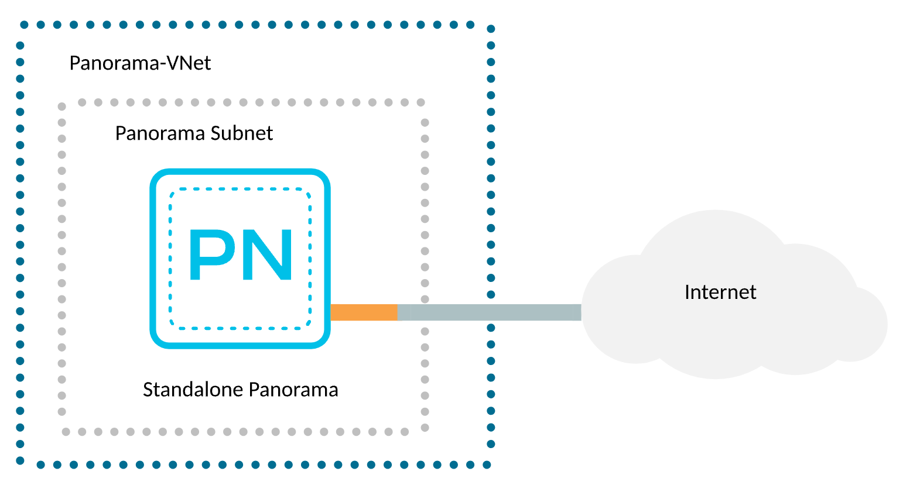

# Standalone Panorama Deployment

Panorama is a centralized management system that provides global visibility and control over multiple Palo Alto Networks Next
Generation Firewalls through an easy to use web-based interface. Panorama enables administrators to view aggregate or
device-specific application, user, and content data and manage multiple Palo Alto Networks firewalls — all from a central
location.

The Terraform code presented here will deploy Palo Alto Networks Panorama management platform in Azure in management only mode
(without additional logging disks). For option on how to add additional logging disks - please refer to panorama
[module documentation](../../modules/panorama#input_logging_disks).

[](https://github.com/PaloAltoNetworks/terraform-azurerm-swfw-modules/tree/main/examples/standalone_panorama) [](https://registry.terraform.io/modules/PaloAltoNetworks/swfw-modules/azurerm/latest/examples/standalone_panorama)

## Topology

This is a non zonal deployment. The deployed infrastructure consists of:

- a VNET containing:
  - one subnet dedicated to host Panorama appliances
  - a Network Security Group to give access to Panorama's public interface
- a Panorama appliance with a public IP assigned to the management interface



## Prerequisites

A list of requirements might vary depending on the platform used to deploy the infrastructure but a minimum one includes:

- _(in case of non cloud shell deployment)_ credentials and (optionally) tools required to authenticate against Azure Cloud, see
  [AzureRM provider documentation for details](https://registry.terraform.io/providers/hashicorp/azurerm/latest/docs#authenticating-to-azure)
- [supported](#requirements) version of [`Terraform`](<https://developer.hashicorp.com/terraform/downloads>)
- if you have not run Palo Alto Networks Panorama images in a subscription it might be necessary to accept the license first
  ([see this note](../../modules/panorama#accept-azure-marketplace-terms))

**Note!**

- after the deployment Panorama remains not licensed and not configured.
- keep in mind that **this code** is **only an example**. It's main purpose is to introduce the Terraform modules.

## Usage

### Deployment Steps

- checkout the code locally (if you haven't done so yet)
- copy the [`example.tfvars`](./example.tfvars) file, rename it to `terraform.tfvars` and adjust it to your needs (take a closer
  look at the `TODO` markers)
- _(optional)_ authenticate to AzureRM, switch to the Subscription of your choice if necessary
- initialize the Terraform module:

  ```bash
  terraform init
  ```

- _(optional)_ plan you infrastructure to see what will be actually deployed:

  ```bash
  terraform plan
  ```

- deploy the infrastructure (you will have to confirm it with typing in `yes`):

  ```bash
  terraform apply
  ```

  The deployment takes couple of minutes. Observe the output. At the end you should see a summary similar to this:

  ```console
  Apply complete! Resources: 10 added, 0 changed, 0 destroyed.

  Outputs:

<<<<<<< HEAD
  panorama_mgmt_ips = {
    "pn-1" = "1.2.3.4"
  }
  password = <sensitive>
  username = "panadmin"
  ```
=======
      panorama_mgmt_ips = \{
        "pn-1" = "1.2.3.4"
      \}
      password = [sensitive]
      username = "panadmin"
>>>>>>> 940c9e38 (first pass at fixing all mdx compilation/syntax errors)

- at this stage you have to wait couple of minutes for the Panorama to bootstrap.

### Post deploy

Panorama in this example is configured with password authentication. To retrieve the initial credentials run:

- for username:

  ```bash
  terraform output username
  ```

- for password:

  ```bash
  terraform output password
  ```

The management public IP addresses are available in the `panorama_mgmt_ips`:

```bash
terraform output panorama_mgmt_ips
```

You can now login to the devices using either:

- cli - ssh client is required
- Web UI (https) - any modern web browser, note that initially the traffic is encrypted with a self-signed certificate.

You can now proceed with licensing and configuring the devices.

### Cleanup

To remove the deployed infrastructure run:

```bash
terraform destroy
```

## Reference

### Requirements

- `terraform`, version: >= 1.5, < 2.0

### Providers

- `random`
- `azurerm`

### Modules
Name | Version | Source | Description
--- | --- | --- | ---
`vnet` | - | ../../modules/vnet | 
`panorama` | - | ../../modules/panorama | 

### Resources

- `availability_set` (managed)
- `resource_group` (managed)
- `password` (managed)
- `resource_group` (data)

### Required Inputs

<<<<<<< HEAD
Name | Type | Description
--- | --- | ---
[`resource_group_name`](#resource_group_name) | `string` | Name of the Resource Group.
[`region`](#region) | `string` | The Azure region to use.
[`vnets`](#vnets) | `map` | A map defining VNETs.

### Optional Inputs

Name | Type | Description
--- | --- | ---
[`name_prefix`](#name_prefix) | `string` | A prefix that will be added to all created resources.
[`create_resource_group`](#create_resource_group) | `bool` | When set to `true` it will cause a Resource Group creation.
[`tags`](#tags) | `map` | Map of tags to assign to the created resources.
[`availability_sets`](#availability_sets) | `map` | A map defining availability sets.
[`panoramas`](#panoramas) | `map` | A map defining Azure Virtual Machine based on Palo Alto Networks Panorama image.
=======
| Name | Description | Type | Default | Required |
|------|-------------|------|---------|:--------:|
| <a name="input_tags"></a> [tags](#input\_tags) | Map of tags to assign to the created resources. | `map(string)` | `\{\}` | no |
| <a name="input_location"></a> [location](#input\_location) | The Azure region to use. | `string` | n/a | yes |
| <a name="input_name_prefix"></a> [name\_prefix](#input\_name\_prefix) | A prefix that will be added to all created resources.<br />There is no default delimiter applied between the prefix and the resource name. Please include the delimiter in the actual prefix.<br /><br />Example:<pre>name\_prefix = "test-"</pre>NOTICE. This prefix is not applied to existing resources. If you plan to reuse i.e. a VNET please specify it's full name, even if it is also prefixed with the same value as the one in this property. | `string` | `""` | no |
| <a name="input_create_resource_group"></a> [create\_resource\_group](#input\_create\_resource\_group) | When set to `true` it will cause a Resource Group creation. Name of the newly specified RG is controlled by `resource_group_name`.<br />When set to `false` the `resource_group_name` parameter is used to specify a name of an existing Resource Group. | `bool` | `true` | no |
| <a name="input_resource_group_name"></a> [resource\_group\_name](#input\_resource\_group\_name) | Name of the Resource Group to . | `string` | n/a | yes |
| <a name="input_enable_zones"></a> [enable\_zones](#input\_enable\_zones) | If `true`, enable zone support for resources. | `bool` | `true` | no |
| <a name="input_vnets"></a> [vnets](#input\_vnets) | A map defining VNETs. A key is the VNET name, value is a set of properties like described below.<br /><br />For detailed documentation on each property refer to [module documentation](../../modules/vnet)<br /><br />- `name` : a name of a Virtual Network<br />- `create_virtual_network` : (default: `true`) when set to `true` will create a VNET, `false` will source an existing VNET<br />- `address_space` : a list of CIDRs for VNET<br />- `resource_group_name` :  (default: current RG) a name of a Resource Group in which the VNET will reside<br /><br />- `create_subnets` : (default: `true`) if true, create the Subnets inside the Virtual Network, otherwise use pre-existing subnets<br />- `subnets` : map of Subnets to create<br /><br />- `network_security_groups` : map of Network Security Groups to create<br />- `route_tables` : map of Route Tables to create. | `any` | n/a | yes |
| <a name="input_vmseries_username"></a> [vmseries\_username](#input\_vmseries\_username) | Initial administrative username to use for all systems. | `string` | `"panadmin"` | no |
| <a name="input_vmseries_password"></a> [vmseries\_password](#input\_vmseries\_password) | Initial administrative password to use for all systems. Set to null for an auto-generated password. | `string` | `null` | no |
| <a name="input_panorama_version"></a> [panorama\_version](#input\_panorama\_version) | Panorama PanOS version. It's also possible to specify the Pan-OS version per Panorama (in case you would like to deploy more than one), see `var.panoramas` variable. | `string` | n/a | yes |
| <a name="input_panorama_sku"></a> [panorama\_sku](#input\_panorama\_sku) | Panorama SKU, basically a type of licensing used in Azure. | `string` | `"byol"` | no |
| <a name="input_panorama_size"></a> [panorama\_size](#input\_panorama\_size) | A size of a VM that will run Panorama. It's also possible to specify the the VM size per Panorama, see `var.panoramas` variable. | `string` | `"Standard_D5_v2"` | no |
| <a name="input_panoramas"></a> [panoramas](#input\_panoramas) | A map containing Panorama definitions.<br /><br />All definitions share a VM size, SKU and PanOS version (`panorama_size`, `panorama_sku`, `panorama_version` respectively). Defining more than one Panorama makes sense when creating for example HA pairs. <br /><br />Following properties are available:<br /><br />- `name` : a name of a Panorama VM<br />- `size` : size of the Panorama virtual machine, when specified overrides `var.panorama_size`.<br />- `version` : PanOS version, when specified overrides `var.panorama_version`.<br />- `vnet_key`: a VNET used to host Panorama VM, this is a key from a VNET definition stored in `vnets` variable<br />- `subnet_key`: a Subnet inside a VNET used to host Panorama VM, this is a key from a Subnet definition stored inside a VNET definition references by the `vnet_key` property<br />- `avzone`: when `enable_zones` is `true` this specifies the zone in which Panorama will be deployed<br />- `avzones`: when `enable_zones` is `true` these are availability zones used by Panorama's public IPs<br />- `custom_image_id`: a custom build of Panorama to use, overrides the stock image version.<br /><br />- `interfaces` : configuration of all NICs assigned to a VM. A list of maps, each map is a NIC definition. Notice that the order DOES matter. NICs are attached to VMs in Azure in the order they are defined in this list, therefore the management interface has to be defined first. Following properties are available:<br />  - `name`: string that will form the NIC name<br />  - `subnet_key` : (string) a key of a subnet as defined in `var.vnets`<br />  - `create_pip` : (boolean) flag to create Public IP for an interface, defaults to `false`<br />  - `public_ip_name` : (string) when `create_pip` is set to `false` a name of a Public IP resource that should be associated with this Network Interface<br />  - `public_ip_resource_group` : (string) when associating an existing Public IP resource, name of the Resource Group the IP is placed in, defaults to the `var.resource_group_name`<br />  - `private_ip_address` : (string) a static IP address that should be assigned to an interface, defaults to `null` (in that case DHCP is used)<br /><br />- `logging_disks` : a map containing configuration of additional disks that should be attached to a Panorama appliance. Following properties are available:<br />  - `size` : size of a disk, 2TB by default<br />  - `lun` : slot to which the disk should be attached<br />  - `disk_type` : type of a disk, determines throughput, `Standard_LRS` by default.<br /><br />Example:<pre>\{<br />    "pn-1" = \{<br />      name     = "panorama01"<br />      vnet\_key = "vnet"<br />      interfaces = [<br />        \{<br />          name               = "management"<br />          subnet\_key         = "panorama"<br />          private\_ip\_address = "10.1.0.10"<br />          create\_pip         = true<br />        \},<br />      ]<br />    \}<br />  \}</pre> | `any` | `\{\}` | no |
>>>>>>> 940c9e38 (first pass at fixing all mdx compilation/syntax errors)

### Outputs

Name |  Description
--- | ---
`username` | Initial administrative username to use for VM-Series.
`password` | Initial administrative password to use for VM-Series.
`panorama_mgmt_ips` | 

### Required Inputs details

#### resource_group_name

Name of the Resource Group.

Type: string

<sup>[back to list](#modules-required-inputs)</sup>

#### region

The Azure region to use.

Type: string

<sup>[back to list](#modules-required-inputs)</sup>

#### vnets

A map defining VNETs.
  
For detailed documentation on each property refer to [module documentation](../../modules/vnet)

- `create_virtual_network`  - (`bool`, optional, defaults to `true`) when set to `true` will create a VNET, `false` will source
                              an existing VNET.
- `name`                    - (`string`, required) a name of a VNET. In case `create_virtual_network = false` this should be a
                              full resource name, including prefixes.
- `address_space`           - (`list`, required when `create_virtual_network = false`) a list of CIDRs for a newly created VNET.
- `vnet_encryption`         - (`string`, optional, defaults to module default) enables Azure Virtual Network Encryption when
                              set, only possible value at the moment is `AllowUnencrypted`. When set to `null`, the feature is 
                              disabled.
- `resource_group_name`     - (`string`, optional, defaults to current RG) a name of an existing Resource Group in which the
                              VNET will reside or is sourced from.
- `create_subnets`          - (`bool`, optional, defaults to `true`) if `true`, create Subnets inside the Virtual Network,
                              otherwise use source existing subnets.
- `subnets`                 - (`map`, optional) map of Subnets to create or source, for details see
                              [VNET module documentation](../../modules/vnet#subnets).
- `network_security_groups` - (`map`, optional) map of Network Security Groups to create, for details see
                              [VNET module documentation](../../modules/vnet#network_security_groups).
- `route_tables`            - (`map`, optional) map of Route Tables to create, for details see
                              [VNET module documentation](../../modules/vnet#route_tables).


Type: 

```hcl
map(object({
    name                   = string
    resource_group_name    = optional(string)
    create_virtual_network = optional(bool, true)
    address_space          = optional(list(string))
    vnet_encryption        = optional(string)
    network_security_groups = optional(map(object({
      name = string
      rules = optional(map(object({
        name                         = string
        priority                     = number
        direction                    = string
        access                       = string
        protocol                     = string
        source_port_range            = optional(string)
        source_port_ranges           = optional(list(string))
        destination_port_range       = optional(string)
        destination_port_ranges      = optional(list(string))
        source_address_prefix        = optional(string)
        source_address_prefixes      = optional(list(string))
        destination_address_prefix   = optional(string)
        destination_address_prefixes = optional(list(string))
      })), {})
    })), {})
    route_tables = optional(map(object({
      name                          = string
      disable_bgp_route_propagation = optional(bool)
      routes = map(object({
        name                = string
        address_prefix      = string
        next_hop_type       = string
        next_hop_ip_address = optional(string)
      }))
    })), {})
    create_subnets = optional(bool, true)
    subnets = optional(map(object({
      name                            = string
      address_prefixes                = optional(list(string), [])
      network_security_group_key      = optional(string)
      route_table_key                 = optional(string)
      enable_storage_service_endpoint = optional(bool, false)
    })), {})
  }))
```


<sup>[back to list](#modules-required-inputs)</sup>

### Optional Inputs details

#### name_prefix

A prefix that will be added to all created resources.
There is no default delimiter applied between the prefix and the resource name.
Please include the delimiter in the actual prefix.

Example:
```
name_prefix = "test-"
```
  
**Note!** \
This prefix is not applied to existing resources. If you plan to reuse i.e. a VNET please specify it's full name,
even if it is also prefixed with the same value as the one in this property.


Type: string

Default value: ``

<sup>[back to list](#modules-optional-inputs)</sup>

#### create_resource_group

When set to `true` it will cause a Resource Group creation.
Name of the newly specified RG is controlled by `resource_group_name`.
  
When set to `false` the `resource_group_name` parameter is used to specify a name of an existing Resource Group.


Type: bool

Default value: `true`

<sup>[back to list](#modules-optional-inputs)</sup>

#### tags

Map of tags to assign to the created resources.

Type: map(string)

Default value: `map[]`

<sup>[back to list](#modules-optional-inputs)</sup>

#### availability_sets

A map defining availability sets. Can be used to provide infrastructure high availability when zones cannot be used.

Following properties are supported:

- `name`                - (`string`, required) name of the Application Insights.
- `update_domain_count` - (`number`, optional, defaults to Azure default) specifies the number of update domains that are used.
- `fault_domain_count`  - (`number`, optional, defaults to Azure default) specifies the number of fault domains that are used.
  
**Note!** \
Please keep in mind that Azure defaults are not working for every region (especially the small ones, without any Availability
Zones). Please verify how many update and fault domain are supported in a region before deploying this resource.


Type: 

```hcl
map(object({
    name                = string
    update_domain_count = optional(number)
    fault_domain_count  = optional(number)
  }))
```


Default value: `map[]`

<sup>[back to list](#modules-optional-inputs)</sup>

#### panoramas

A map defining Azure Virtual Machine based on Palo Alto Networks Panorama image.
  
For details and defaults for available options please refer to the [`panorama`](../../modules/panorama) module.

The basic Panorama VM configuration properties are as follows:

- `name`            - (`string`, required) name of the VM, will be prefixed with the value of `var.name_prefix`.
- `vnet_key`        - (`string`, required) a key of a VNET defined in `var.vnets`. This is the VNET that hosts subnets used to
                      deploy network interfaces for deployed VM.
- `authentication`  - (`map`, optional, defaults to example defaults) authentication settings for the deployed VM.

  The `authentication` property is optional and holds the firewall admin access details. By default, standard username
  `panadmin` will be set and a random password will be auto-generated for you (available in Terraform outputs).

  **Note!** \
  The `disable_password_authentication` property is by default `false` in this example. When using this value, you don't have
  to specify anything but you can still additionally pass SSH keys for authentication. You can however set this property to 
  `true`, then you have to specify `ssh_keys` property.

  For all properties and their default values see [module's documentation](../../modules/panorama#authentication).

- `image`           - (`map`, required) properties defining a base image used by the deployed VM. The `image` property is
                      required but there are only 2 properties (mutually exclusive) that have to be set, either:

  - `version`   - (`string`, optional) describes the PAN-OS image version from Azure Marketplace.
  - `custom_id` - (`string`, optional) absolute ID of your own custom PAN-OS image.

  For details on all properties refer to [module's documentation](../../modules/panorama#image).

- `virtual_machine` - (`map`, optional, defaults to module defaults) a map that groups most common VM configuration options. 
                      Most common properties are:

  - `size`      - (`string`, optional, defaults to module defaults) Azure VM size (type). Consult the *VM-Series Deployment
                  Guide* as only a few selected sizes are supported.
  - `zone`      - (`string`, optional, defaults to module defaults) the Availability Zone in which the VM will be created.
  - `disk_type` - (`string`, optional, defaults to module defaults) type of a Managed Disk which should be created, possible
                  values are `Standard_LRS`, `StandardSSD_LRS` or `Premium_LRS` (works only for selected `size` values).
      
  For details on all properties refer to [module's documentation](../../modules/panorama#virtual_machine).

- `interfaces`      - (`list`, required) configuration of all network interfaces, order does matter - the 1<sup>st</sup>
                      interface should be the management one. Most common properties are:

  - `name`             - (`string`, required) name of the network interface (will be prefixed with `var.name_prefix`).
  - `subnet_key`       - (`string`, required) a key of a subnet to which the interface will be assigned as defined in
                         `var.vnets`.
  - `create_public_ip` - (`bool`, optional, defaults to module defaults) create a Public IP for an interface.

  For details on all properties refer to [module's documentation](../../modules/panorama#interfaces).

- `logging_disks`   - (`map`, optional, defaults to `null`) configuration of additional data disks for Panorama logs. Most
                      common properties are:

  - `name` - (`string`, required) the Managed Disk name.
  - `lun`  - (`string`, required) the Logical Unit Number of the Data Disk, which needs to be unique within the VM.

  For details on all properties refer to [module's documentation](../../modules/panorama#logging_disks).


Type: 

```hcl
map(object({
    name     = string
    vnet_key = string
    authentication = object({
      username                        = optional(string, "panadmin")
      password                        = optional(string)
      disable_password_authentication = optional(bool, false)
      ssh_keys                        = optional(list(string), [])
    })
    image = object({
      version                 = optional(string)
      publisher               = optional(string)
      offer                   = optional(string)
      sku                     = optional(string)
      enable_marketplace_plan = optional(bool)
      custom_id               = optional(string)
    })
    virtual_machine = object({
      size                          = optional(string)
      zone                          = string
      disk_type                     = optional(string)
      disk_name                     = optional(string)
      avset_key                     = optional(string)
      capacity_reservation_group_id = optional(string)
      allow_extension_operations    = optional(bool)
      encryption_at_host_enabled    = optional(bool)
      disk_encryption_set_id        = optional(string)
      enable_boot_diagnostics       = optional(bool)
      boot_diagnostics_storage_uri  = optional(string)
      identity_type                 = optional(string)
      identity_ids                  = optional(list(string))
    })
    interfaces = list(object({
      name                          = string
      subnet_key                    = string
      private_ip_address            = optional(string)
      create_public_ip              = optional(bool, false)
      public_ip_name                = optional(string)
      public_ip_resource_group_name = optional(string)
    }))
    logging_disks = optional(map(object({
      name      = string
      size      = optional(string)
      lun       = string
      disk_type = optional(string)
    })), {})
  }))
```


Default value: `map[]`

<sup>[back to list](#modules-optional-inputs)</sup>