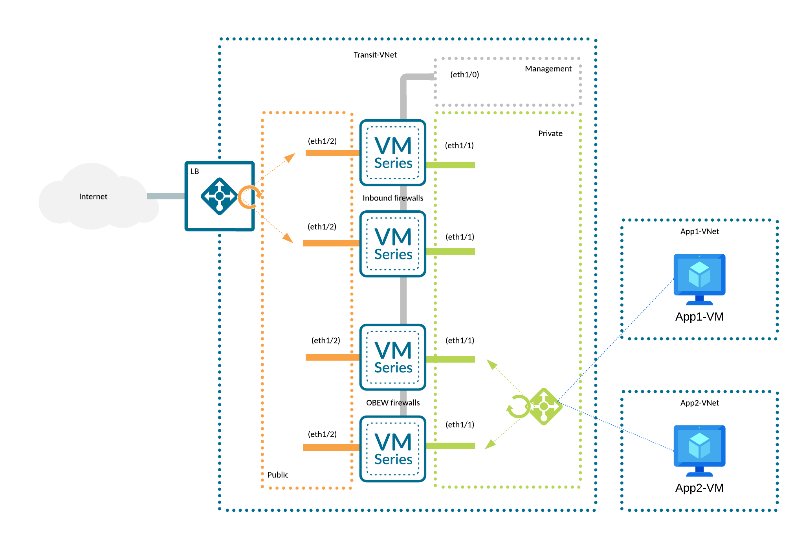

# Reference Architecture with Terraform: VM-Series in Azure, Centralized Architecture, Dedicated Inbound NGFW Option

Palo Alto Networks produces several
[validated reference architecture design and deployment documentation guides](https://www.paloaltonetworks.com/resources/reference-architectures),
which describe well-architected and tested deployments. When deploying VM-Series in a public cloud, the reference architectures
guide users toward the best security outcomes, whilst reducing rollout time and avoiding common integration efforts.

The Terraform code presented here will deploy Palo Alto Networks VM-Series firewalls in Azure based on a centralized design with
dedicated-inbound VM-Series; for a discussion of other options, please see the design guide from
[the reference architecture guides](https://www.paloaltonetworks.com/resources/reference-architectures).

[](https://github.com/PaloAltoNetworks/terraform-azurerm-swfw-modules/tree/main/examples/dedicated_vmseries) [](https://registry.terraform.io/modules/PaloAltoNetworks/swfw-modules/azurerm/latest/examples/dedicated_vmseries)

## Reference Architecture Design


This code implements:

- a *centralized design*, a hub-and-spoke topology with a Transit VNet containing VM-Series to inspect all inbound, outbound,
  east-west, and enterprise traffic
- the *dedicated inbound option*, which separates inbound traffic flows onto a separate set of VM-Series.

## Detailed Architecture and Design

### Centralized Design

This design uses a Transit VNet. Application functions and resources are deployed across multiple VNets that are connected in
a hub-and-spoke topology. The hub of the topology, or transit VNet, is the central point of connectivity for all inbound,
outbound, east-west, and enterprise traffic. You deploy all VM-Series firewalls within the transit VNet.

### Dedicated Inbound Option

The dedicated inbound option separates traffic flows across two separate sets of VM-Series firewalls. One set of VM-Series
firewalls is dedicated to inbound traffic flows, allowing for greater flexibility and scaling of inbound traffic loads.
The second set of VM-Series firewalls services all outbound, east-west, and enterprise network traffic flows. This deployment
choice offers increased scale and operational resiliency and reduces the chances of high bandwidth use from the inbound traffic
flows affecting other traffic flows within the deployment.



This reference architecture consists of:

- a VNET containing:
  - 3 subnets dedicated to the firewalls: management, private and public
  - Route Tables and Network Security Groups
- 2 Load Balancers:
  - public - with a public IP address assigned, in front of the firewalls public interfaces, for incoming traffic
  - private - in front of the firewalls private interfaces, for outgoing and east-west traffic
- a Storage Account used to keep bootstrap packages containing `DAY0` configuration for the firewalls
- 4 firewalls:
  - deployed in different zones
  - 2 pairs, one for inbound, the other for outbound and east-west traffic
  - with 3 network interfaces each: management, public, private
  - with public IP addresses assigned to:
    - management interface
    - public interface
- _(optional)_ test workloads with accompanying infrastructure:
  - 2 Spoke VNETs with Route Tables and Network Security Groups
  - 2 Spoke VMs serving as WordPress-based web servers
  - 2 Azure Bastion managed jump hosts

**NOTE!**
- In order to deploy the architecture without test workloads described above, empty the `test_infrastructure` map in
  `example.tfvars` file.

## Prerequisites

A list of requirements might vary depending on the platform used to deploy the infrastructure but a minimum one includes:

- _(in case of non cloud shell deployment)_ credentials and (optionally) tools required to authenticate against Azure Cloud, see
  [AzureRM provider documentation for details](https://registry.terraform.io/providers/hashicorp/azurerm/latest/docs#authenticating-to-azure)
- [supported](#requirements) version of [`Terraform`](<https://developer.hashicorp.com/terraform/downloads>)
- if you have not run Palo Alto NGFW images in a subscription it might be necessary to accept the license first
  ([see this note](../../modules/vmseries#accept-azure-marketplace-terms))

**Note!**
- after the deployment the firewalls remain not licensed, they do however contain minimum `DAY0` configuration (required NIC, VR,
  routes configuration).
- this example contains some **files** that **can contain sensitive data**. Keep in mind that **this code** is
  **only an example**. It's main purpose is to introduce the Terraform modules.

## Usage

### Deployment Steps

- checkout the code locally (if you haven't done so yet)
- copy the [`example.tfvars`](./example.tfvars) file, rename it to `terraform.tfvars` and adjust it to your needs (take a closer
  look at the `TODO` markers)
- copy the [`init-cfg.sample.txt`](./files/init-cfg.sample.txt) to `init-cfg.txt` and fill it out with required bootstrap
  parameters (see this [documentation](https://docs.paloaltonetworks.com/vm-series/9-1/vm-series-deployment/bootstrap-the-vm-series-firewall/create-the-init-cfgtxt-file/init-cfgtxt-file-components#id07933d91-15be-414d-bc8d-f2a5f3d8df6b) for details)
- _(optional)_ authenticate to AzureRM, switch to the Subscription of your choice if necessary
- initialize the Terraform module:

  ```bash
  terraform init
  ```

- _(optional)_ plan you infrastructure to see what will be actually deployed:

  ```bash
  terraform plan
  ```

- deploy the infrastructure (you will have to confirm it with typing in `yes`):

  ```bash
  terraform apply
  ```

  The deployment takes couple of minutes. Observe the output. At the end you should see a summary similar to this:

<<<<<<< HEAD
  ```console
  bootstrap_storage_urls = <sensitive>
  lb_frontend_ips = {
    "private" = {
      "ha-ports" = "1.2.3.4"
    }
    "public" = {
      "palo-lb-app1-pip" = "1.2.3.4"
    }
  }
  password = <sensitive>
  username = "panadmin"
  vmseries_mgmt_ips = {
    "fw-in-1" = "1.2.3.4"
    "fw-in-2" = "1.2.3.4"
    "fw-obew-1" = "1.2.3.4"
    "fw-obew-2" = "1.2.3.4"
  }
  ```
=======
      bootstrap_storage_urls = \<sensitive\>
      lb_frontend_ips = \{
        "private" = \{
          "ha-ports" = "1.2.3.4"
        \}
        "public" = \{
          "palo-lb-app1-pip" = "1.2.3.4"
        \}
      \}
      password = \<sensitive\>
      username = "panadmin"
      vmseries_mgmt_ips = \{
        "fw-in-1" = "1.2.3.4"
        "fw-in-2" = "1.2.3.4"
        "fw-obew-1" = "1.2.3.4"
        "fw-obew-2" = "1.2.3.4"
      \}
>>>>>>> 940c9e38 (first pass at fixing all mdx compilation/syntax errors)

- at this stage you have to wait couple of minutes for the firewalls to bootstrap.

### Post deploy

Firewalls in this example are configured with password authentication. To retrieve the initial credentials run:

- for username:

  ```bash
  terraform output username
  ```

- for password:

  ```bash
  terraform output password
  ```

The management public IP addresses are available in the `vmseries_mgmt_ips`:

```bash
terraform output vmseries_mgmt_ips
```

You can now login to the devices using either:

- cli - ssh client is required
- Web UI (https) - any modern web browser, note that initially the traffic is encrypted with a self-signed certificate.

As mentioned, the devices already contain `DAY0` configuration, so all network interfaces should be configured and Azure Load
Balancer should already report that the devices are healthy.

You can now proceed with licensing the devices and configuring your first rules.

Please also refer to [this repository](https://github.com/PaloAltoNetworks/iron-skillet) for `DAY1` configuration
(security hardening).

### Cleanup

To remove the deployed infrastructure run:

```bash
terraform destroy
```

## Reference

### Requirements

- `terraform`, version: >= 1.5, < 2.0

### Providers

- `random`
- `azurerm`
- `local`

### Modules
Name | Version | Source | Description
--- | --- | --- | ---
`vnet` | - | ../../modules/vnet | 
`vnet_peering` | - | ../../modules/vnet_peering | 
`natgw` | - | ../../modules/natgw | 
`load_balancer` | - | ../../modules/loadbalancer | 
`appgw` | - | ../../modules/appgw | 
`ngfw_metrics` | - | ../../modules/ngfw_metrics | 
`bootstrap` | - | ../../modules/bootstrap | 
`vmseries` | - | ../../modules/vmseries | 
`test_infrastructure` | - | ../../modules/test_infrastructure | 

### Resources

- `availability_set` (managed)
- `resource_group` (managed)
- `file` (managed)
- `password` (managed)
- `resource_group` (data)

### Required Inputs

<<<<<<< HEAD
Name | Type | Description
--- | --- | ---
[`resource_group_name`](#resource_group_name) | `string` | Name of the Resource Group.
[`region`](#region) | `string` | The Azure region to use.
[`vnets`](#vnets) | `map` | A map defining VNETs.

### Optional Inputs

Name | Type | Description
--- | --- | ---
[`name_prefix`](#name_prefix) | `string` | A prefix that will be added to all created resources.
[`create_resource_group`](#create_resource_group) | `bool` | When set to `true` it will cause a Resource Group creation.
[`tags`](#tags) | `map` | Map of tags to assign to the created resources.
[`vnet_peerings`](#vnet_peerings) | `map` | A map defining VNET peerings.
[`natgws`](#natgws) | `map` | A map defining NAT Gateways.
[`load_balancers`](#load_balancers) | `map` | A map containing configuration for all (both private and public) Load Balancers.
[`appgws`](#appgws) | `map` | A map defining all Application Gateways in the current deployment.
[`availability_sets`](#availability_sets) | `map` | A map defining availability sets.
[`ngfw_metrics`](#ngfw_metrics) | `object` | A map controlling metrics-relates resources.
[`bootstrap_storages`](#bootstrap_storages) | `map` | A map defining Azure Storage Accounts used to host file shares for bootstrapping NGFWs.
[`vmseries_universal`](#vmseries_universal) | `object` | A map defining common settings for all created VM-Series instances.
[`vmseries`](#vmseries) | `map` | A map defining Azure Virtual Machines based on Palo Alto Networks Next Generation Firewall image.
[`test_infrastructure`](#test_infrastructure) | `map` | A map defining test infrastructure including test VMs and Azure Bastion hosts.
=======
| Name | Description | Type | Default | Required |
|------|-------------|------|---------|:--------:|
| <a name="input_tags"></a> [tags](#input\_tags) | Map of tags to assign to the created resources. | `map(string)` | `\{\}` | no |
| <a name="input_location"></a> [location](#input\_location) | The Azure region to use. | `string` | n/a | yes |
| <a name="input_name_prefix"></a> [name\_prefix](#input\_name\_prefix) | A prefix that will be added to all created resources.<br />There is no default delimiter applied between the prefix and the resource name. Please include the delimiter in the actual prefix.<br /><br />Example:<pre>name\_prefix = "test-"</pre>NOTICE. This prefix is not applied to existing resources. If you plan to reuse i.e. a VNET please specify it's full name, even if it is also prefixed with the same value as the one in this property. | `string` | `""` | no |
| <a name="input_create_resource_group"></a> [create\_resource\_group](#input\_create\_resource\_group) | When set to `true` it will cause a Resource Group creation. Name of the newly specified RG is controlled by `resource_group_name`.<br />When set to `false` the `resource_group_name` parameter is used to specify a name of an existing Resource Group. | `bool` | `true` | no |
| <a name="input_resource_group_name"></a> [resource\_group\_name](#input\_resource\_group\_name) | Name of the Resource Group. | `string` | n/a | yes |
| <a name="input_enable_zones"></a> [enable\_zones](#input\_enable\_zones) | If `true`, enable zone support for resources. | `bool` | `true` | no |
| <a name="input_vnets"></a> [vnets](#input\_vnets) | A map defining VNETs.<br /><br />For detailed documentation on each property refer to [module documentation](../../modules/vnet)<br /><br />- `name` :  A name of a VNET.<br />- `create_virtual_network` : (default: `true`) when set to `true` will create a VNET, `false` will source an existing VNET, in both cases the name of the VNET is specified with `name`<br />- `address_space` : a list of CIDRs for VNET<br />- `resource_group_name` :  (default: current RG) a name of a Resource Group in which the VNET will reside<br /><br />- `create_subnets` : (default: `true`) if true, create the Subnets inside the Virtual Network, otherwise use pre-existing subnets<br />- `subnets` : map of Subnets to create<br /><br />- `network_security_groups` : map of Network Security Groups to create<br />- `route_tables` : map of Route Tables to create. | `any` | n/a | yes |
| <a name="input_natgws"></a> [natgws](#input\_natgws) | A map defining Nat Gateways. <br /><br />Please note that a NatGW is a zonal resource, this means it's always placed in a zone (even when you do not specify one explicitly). Please refer to Microsoft documentation for notes on NatGW's zonal resiliency. <br /><br />Following properties are supported:<br /><br />- `name` : a name of the newly created NatGW.<br />- `create_natgw` : (default: `true`) create or source (when `false`) an existing NatGW. Created or sourced: the NatGW will be assigned to a subnet created by the `vnet` module.<br />- `resource_group_name : name of a Resource Group hosting the NatGW (newly create or the existing one).<br />- `zone` : Availability Zone in which the NatGW will be placed, when skipped AzureRM will pick a zone.<br />- `idle\_timeout` : connection IDLE timeout in minutes, for newly created resources<br />- `vnet\_key` : a name (key value) of a VNET defined in `var.vnets` that hosts a subnet this NatGW will be assigned to.<br />- `subnet\_keys` : a list of subnets (key values) the NatGW will be assigned to, defined in `var.vnets` for a VNET described by `vnet\_name`.<br />- `create\_pip` : (default: `true`) create a Public IP that will be attached to a NatGW<br />- `existing\_pip\_name` : when `create\_pip` is set to `false`, source and attach and existing Public IP to the NatGW<br />- `existing\_pip\_resource\_group\_name` : when `create\_pip` is set to `false`, name of the Resource Group hosting the existing Public IP<br />- `create\_pip\_prefix` : (default: `false`) create a Public IP Prefix that will be attached to the NatGW.<br />- `pip\_prefix\_length` : length of the newly created Public IP Prefix, can bet between 0 and 31 but this actually supported value depends on the Subscription.<br />- `existing\_pip\_prefix\_name` : when `create\_pip\_prefix` is set to `false`, source and attach and existing Public IP Prefix to the NatGW<br />- `existing\_pip\_prefix\_resource\_group\_name` : when `create\_pip\_prefix` is set to `false`, name of the Resource Group hosting the existing Public IP Prefix.<br /><br />Example:<br />`<pre>natgws = \{<br />  "natgw" = \{<br />    name         = "public-natgw"<br />    vnet\_key     = "transit-vnet"<br />    subnet\_keys  = ["public"]<br />    zone         = 1<br />  \}<br />\}</pre> | `any` | `\{\}` | no |
| <a name="input_load_balancers"></a> [load\_balancers](#input\_load\_balancers) | A map containing configuration for all (private and public) Load Balancer that will be created in this deployment.<br /><br />Following properties are available (for details refer to module's documentation):<br /><br />- `name`: name of the Load Balancer resource.<br />- `nsg_vnet_key`: (public LB) defaults to `null`, a key describing a vnet (as defined in `vnet` variable) that hold an NSG we will update with an ingress rule for each listener.<br />- `nsg_key`: (public LB) defaults to `null`, a key describing an NSG (as defined in `vnet` variable, under `nsg_vnet_key`) we will update with an ingress rule for each listener.<br />- `network_security_group_name`: (public LB) defaults to `null`, in case of a brownfield deployment (no possibility to depend on `vnet` variable), a name of a security group, an ingress rule will be created in that NSG for each listener. **NOTE** this is the FULL NAME of the NSG (including prefixes).<br />- `network_security_group_rg_name`: (public LB) defaults to `null`, in case of a brownfield deployment (no possibility to depend on `vnet` variable), a name of a resource group for the security group, to be used when the NSG is hosted in a different RG than the one described in `var.resource_group_name`.<br />- `network_security_allow_source_ips`: (public LB) a list of IP addresses that will used in the ingress rules.<br />- `avzones`: (both) for regional Load Balancers, a list of supported zones (this has different meaning for public and private LBs - please refer to module's documentation for details).<br />- `frontend_ips`: (both) a map configuring both a listener and a load balancing rule, key is the name that will be used as an application name inside LB config as well as to create a rule in NSG (for public LBs), value is an object with the following properties:<br />  - `create_public_ip`: (public LB) defaults to `false`, when set to `true` a Public IP will be created and associated with a listener<br />  - `public_ip_name`: (public LB) defaults to `null`, when `create_public_ip` is set to `false` this property is used to reference an existing Public IP object in Azure<br />  - `public_ip_resource_group`: (public LB) defaults to `null`, when using an existing Public IP created in a different Resource Group than the currently used use this property is to provide the name of that RG<br />  - `private_ip_address`: (private LB) defaults to `null`, specify a static IP address that will be used by a listener<br />  - `vnet_key`: (private LB) defaults to `null`, when `private_ip_address` is set specifies a vnet's key (as defined in `vnet` variable). This will be the VNET hosting this Load Balancer<br />  - `subnet_key`: (private LB) defaults to `null`, when `private_ip_address` is set specifies a subnet's key (as defined in `vnet` variable) to which the LB will be attached, in case of VMSeries this should be a internal/trust subnet<br />  - `rules` - a map configuring the actual rules load balancing rules, a key is a rule name, a value is an object with the following properties:<br />    - `protocol`: protocol used by the rule, can be one the following: `TCP`, `UDP` or `All` when creating an HA PORTS rule<br />    - `port`: port used by the rule, for HA PORTS rule set this to `0`<br /><br />Example of a public Load Balancer:<pre>"public\_lb" = \{<br />  name                              = "https\_app\_lb"<br />  network\_security\_group\_name       = "untrust\_nsg"<br />  network\_security\_allow\_source\_ips = ["1.2.3.4"]<br />  avzones                           = ["1", "2", "3"]<br />  frontend\_ips = \{<br />    "https\_app\_1" = \{<br />      create\_public\_ip = true<br />      rules = \{<br />        "balanceHttps" = \{<br />          protocol = "Tcp"<br />          port     = 443<br />        \}<br />      \}<br />    \}<br />  \}<br />\}</pre>Example of a private Load Balancer with HA PORTS rule:<pre>"private\_lb" = \{<br />  name = "ha\_ports\_internal\_lb<br />  frontend\_ips = \{<br />    "ha-ports" = \{<br />      vnet\_key           = "trust\_vnet"<br />      subnet\_key         = "trust\_snet"<br />      private\_ip\_address = "10.0.0.1"<br />      rules = \{<br />        HA\_PORTS = \{<br />          port     = 0<br />          protocol = "All"<br />        \}<br />      \}<br />    \}<br />  \}<br />\}</pre> | `map` | `\{\}` | no |
| <a name="input_vmseries_version"></a> [vmseries\_version](#input\_vmseries\_version) | VM-Series PAN-OS version - list available with `az vm image list -o table --all --publisher paloaltonetworks`. It's also possible to specify the Pan-OS version per firewall, see `var.vmseries` variable. | `string` | n/a | yes |
| <a name="input_vmseries_vm_size"></a> [vmseries\_vm\_size](#input\_vmseries\_vm\_size) | Azure VM size (type) to be created. Consult the *VM-Series Deployment Guide* as only a few selected sizes are supported. It's also possible to specify the the VM size per firewall, see `var.vmseries` variable. | `string` | n/a | yes |
| <a name="input_vmseries_sku"></a> [vmseries\_sku](#input\_vmseries\_sku) | VM-Series SKU - list available with `az vm image list -o table --all --publisher paloaltonetworks` | `string` | `"byol"` | no |
| <a name="input_vmseries_username"></a> [vmseries\_username](#input\_vmseries\_username) | Initial administrative username to use for all systems. | `string` | `"panadmin"` | no |
| <a name="input_vmseries_password"></a> [vmseries\_password](#input\_vmseries\_password) | Initial administrative password to use for all systems. Set to null for an auto-generated password. | `string` | `null` | no |
| <a name="input_availability_sets"></a> [availability\_sets](#input\_availability\_sets) | A map defining availability sets. Can be used to provide infrastructure high availability when zones cannot be used.<br /><br />Following properties are supported:<br />- `name` - name of the Application Insights.<br />- `update_domain_count` - specifies the number of update domains that are used, defaults to 5 (Azure defaults).<br />- `fault_domain_count` - specifies the number of fault domains that are used, defaults to 3 (Azure defaults).<br /><br />Please keep in mind that Azure defaults are not working for each region (especially the small ones, w/o any Availability Zones). Please verify how many update and fault domain are supported in a region before deploying this resource. | `any` | `\{\}` | no |
| <a name="input_application_insights"></a> [application\_insights](#input\_application\_insights) | A map defining Azure Application Insights. There are three ways to use this variable:<br /><br />* when the value is set to `null` (default) no AI is created<br />* when the value is a map containing `name` key (other keys are optional) a single AI instance will be created under the name that is the value of the `name` key<br />* when the value is an empty map or a map w/o the `name` key, an AI instance per each VMSeries VM will be created. All instances will share the same configuration. All instances will have names corresponding to their VM name.<br /><br />Names for all AI instances are prefixed with `var.name_prefix`.<br /><br />Properties supported (for details on each property see [modules documentation](../../modules/application\_insights)):<br /><br />- `name` : (optional, string) a name of a single AI instance<br />- `workspace_mode` : (optional, bool) defaults to `true`, use AI Workspace mode instead of the Classical (deprecated)<br />- `workspace_name` : (optional, string) defaults to AI name suffixed with `-wrkspc`, name of the Log Analytics Workspace created when AI is deployed in Workspace mode<br />- `workspace_sku` : (optional, string) defaults to PerGB2018, SKU used by WAL, see module documentation for details<br />- `metrics_retention_in_days` : (optional, number) defaults to current Azure default value, see module documentation for details<br /><br />Example of an AIs created per VM, in Workspace mode, with metrics retention set to 1 year:<pre>vmseries = \{<br />  'vm-1' = \{<br />    ....<br />  \}<br />  'vm-2' = \{<br />    ....<br />  \}<br />\}<br /><br />application\_insights = \{<br />  metrics\_retention\_in\_days = 365<br />\}</pre> | `map(string)` | `null` | no |
| <a name="input_bootstrap_storage"></a> [bootstrap\_storage](#input\_bootstrap\_storage) | A map defining Azure Storage Accounts used to host file shares for bootstrapping NGFWs. This variable defines only Storage Accounts, file shares are defined per each VM. See `vmseries` variable, `bootstrap_storage` property.<br /><br />Following properties are supported (except for name, all are optional):<br /><br />- `name` : name of the Storage Account. Please keep in mind that storage account name has to be globally unique. This name will not be prefixed with the value of `var.name_prefix`.<br />- `create_storage_account` : (defaults to `true`) create or source (when `false`) an existing Storage Account.<br />- `resource_group_name` : (defaults to `var.resource_group_name`) name of the Resource Group hosting the Storage Account (existing or newly created). The RG has to exist.<br />- `storage_acl` : (defaults to `false`) enables network ACLs on the Storage Account. If this is enabled - `storage_allow_vnet_subnets` and `storage_allow_inbound_public_ips` options become available. The ACL defaults to default `Deny`.<br />- `storage_allow_vnet_subnets` : (defaults to `[]`) whitelist containing the allowed vnet and associated subnets that are allowed to access the Storage Account. Note that the respective subnets require `enable_storage_service_endpoint` set to `true` to work properly.<br />- `storage_allow_inbound_public_ips` : (defaults to `[]`) whitelist containing the allowed public IP subnets that can access the Storage Account. Note that the code automatically tried to query https://ifconfig.me/ip to obtain the public IP address of the machine executing the code so that the bootstrap files are successfully uploaded to the Storage Account.<br /><br /><br />The properties below do not directly change anything in the Storage Account settings. They can be used to control common parts of the `DAY0` configuration (used only when full bootstrap is used). These properties can also be specified per firewall, but when specified here they tak higher precedence:<br />- `public_snet_key` : required, name of the key in `var.vnets` map defining a public subnet, required to calculate the Azure router IP for the public subnet.<br />- `private_snet_key` : required, name of the key in `var.vnets` map defining a private subnet, required to calculate the Azure router IP for the private subnet.<br />- `intranet_cidr` : optional, CIDR of the private networks required to build a general static route to resources protected by this firewall, when skipped the 1st CIDR from `vnet_name` address space will be used.<br />- `ai_update_interval` : if Application Insights are used this property can override the default metrics update interval (in minutes). | `any` | `\{\}` | no |
| <a name="input_vmseries"></a> [vmseries](#input\_vmseries) | Map of virtual machines to create to run VM-Series - inbound firewalls. Following properties are supported:<br /><br />- `name` : name of the VMSeries virtual machine.<br />- `vm_size` : size of the VMSeries virtual machine, when specified overrides `var.vmseries_vm_size`.<br />- `version` : PanOS version, when specified overrides `var.vmseries_version`.<br />- `vnet_key` : a key of a VNET defined in the `var.vnets` map. This value will be used during network interfaces creation.<br />- `add_to_appgw_backend` : bool, `false` by default, set this to `true` to add this backend to an Application Gateway.<br />- `avzone`: the Azure Availability Zone identifier ("1", "2", "3"). Default is "1".<br />- `availability_set_key` : a key of an Availability Set as declared in `availability_sets` property. Specify when HA is required but cannot go for zonal deployment.<br /><br />- `bootstrap_options` : string, optional bootstrap options to pass to VM-Series instances, semicolon separated values. When defined this precedence over `bootstrap_storage`<br />- `bootstrap_storage` : a map containing definition of the bootstrap package content. When present triggers a creation of a File Share in an existing Storage Account, following properties supported:<br />  - `name` : a name of a key in `var.bootstrap_storage` variable defining a Storage Account<br />  - `static_files` : a map where key is a path to a file, value is the location of the file in the bootstrap package (file share). All files in this map are copied 1:1 to the bootstrap package<br />  - `template_bootstrap_xml` : path to the `bootstrap.xml` template. When defined it will trigger creation of the `bootstrap.xml` file and the file will be uploaded to the storage account. This is a simple `day 0` configuration file that should set up only basic networking. Specifying this property forces additional properties that are required to properly template the file. They can be defined per each VM or globally for all VMs (in this case place them in the bootstrap storage definition). The properties are listed below.<br />  - `public_snet_key` : required, name of the key in `var.vnets` map defining a public subnet, required to calculate the Azure router IP for the public subnet.<br />  - `private_snet_key` : required, name of the key in `var.vnets` map defining a private subnet, required to calculate the Azure router IP for the private subnet.<br />  - `intranet_cidr` : optional, CIDR of the private networks required to build a general static route to resources protected by this firewall, when skipped the 1st CIDR from `vnet_name` address space will be used.<br />  - `ai_update_interval` : if Application Insights are used this property can override the default metrics update interval (in minutes).<br /><br />- `interfaces` : configuration of all NICs assigned to a VM. A list of maps, each map is a NIC definition. Notice that the order DOES matter. NICs are attached to VMs in Azure in the order they are defined in this list, therefore the management interface has to be defined first. Following properties are available:<br />  - `name`: string that will form the NIC name<br />  - `subnet_key` : (string) a key of a subnet as defined in `var.vnets`<br />  - `create_pip` : (boolean) flag to create Public IP for an interface, defaults to `false`<br />  - `public_ip_name` : (string) when `create_pip` is set to `false` a name of a Public IP resource that should be associated with this Network Interface<br />  - `public_ip_resource_group` : (string) when associating an existing Public IP resource, name of the Resource Group the IP is placed in, defaults to the `var.resource_group_name`<br />  - `load_balancer_key` : (string) key of a Load Balancer defined in the `var.loadbalancers`  variable, defaults to `null`<br />  - `private_ip_address` : (string) a static IP address that should be assigned to an interface, defaults to `null` (in that case DHCP is used)<br /><br />Example:<pre>\{<br />  "fw01" = \{<br />    name = "firewall01"<br />    bootstrap\_storage = \{<br />      name                   = "storageaccountname"<br />      static\_files           = \{ "files/init-cfg.txt" = "config/init-cfg.txt" \}<br />      template\_bootstrap\_xml = "templates/bootstrap\_common.tmpl"<br />      public\_snet\_key        = "public"<br />      private\_snet\_key       = "private"<br />    \}<br />    avzone   = 1<br />    vnet\_key = "trust"<br />    interfaces = [<br />      \{<br />        name               = "mgmt"<br />        subnet\_key         = "mgmt"<br />        create\_pip         = true<br />        private\_ip\_address = "10.0.0.1"<br />      \},<br />      \{<br />        name                 = "trust"<br />        subnet\_key           = "private"<br />        private\_ip\_address   = "10.0.1.1"<br />        load\_balancer\_key    = "private\_lb"<br />      \},<br />      \{<br />        name                 = "untrust"<br />        subnet\_key           = "public"<br />        private\_ip\_address   = "10.0.2.1"<br />        load\_balancer\_key    = "public\_lb"<br />        public\_ip\_name       = "existing\_public\_ip"<br />      \}<br />    ]<br />  \}<br />\}</pre> | `any` | n/a | yes |
| <a name="input_appgws"></a> [appgws](#input\_appgws) | A map defining all Application Gateways in the current deployment.<br /><br />For detailed documentation on how to configure this resource, for available properties, especially for the defaults and the `rules` property refer to [module documentation](../../modules/appgw).<br /><br />Following properties are supported:<br />- `name` : name of the Application Gateway.<br />- `vnet_key` : a key of a VNET defined in the `var.vnets` map.<br />- `subnet_key` : a key of a subnet as defined in `var.vnets`. This has to be a subnet dedicated to Application Gateways v2.<br />- `zones` : for zonal deployment this is a list of all zones in a region - this property is used by both: the Application Gateway and the Public IP created in front of the AppGW.<br />- `capacity` : (optional) number of Application Gateway instances, not used when autoscalling is enabled (see `capacity_min`)<br />- `capacity_min` : (optional) when set enables autoscaling and becomes the minimum capacity<br />- `capacity_max` : (optional) maximum capacity for autoscaling<br />- `enable_http2` : enable HTTP2 support on the Application Gateway<br />- `waf_enabled` : (optional) enables WAF Application Gateway, defining WAF rules is not supported, defaults to `false`<br />- `vmseries_public_nic_name` : name of the public VMSeries interface as defined in `interfaces` property.<br />- `managed_identities` : (optional) a list of existing User-Assigned Managed Identities, which Application Gateway uses to retrieve certificates from Key Vault<br />- `ssl_policy_type` : (optional) type of an SSL policy, defaults to `Predefined`<br />- `ssl_policy_name` : (optional) name of an SSL policy, for `ssl_policy_type` set to `Predefined`<br />- `ssl_policy_min_protocol_version` : (optional) minimum version of the TLS protocol for SSL Policy, for `ssl_policy_type` set to `Custom`<br />- `ssl_policy_cipher_suites` : (optional) a list of accepted cipher suites, for `ssl_policy_type` set to `Custom`<br />- `ssl_profiles` : (optional) a map of SSL profiles that can be later on referenced in HTTPS listeners by providing a name of the profile in the `ssl_profile_name` property | `map` | `\{\}` | no |
>>>>>>> 940c9e38 (first pass at fixing all mdx compilation/syntax errors)

### Outputs

Name |  Description
--- | ---
`usernames` | Initial administrative username to use for VM-Series.
`passwords` | Initial administrative password to use for VM-Series.
`natgw_public_ips` | Nat Gateways Public IP resources.
`metrics_instrumentation_keys` | The Instrumentation Key of the created instance(s) of Azure Application Insights.
`lb_frontend_ips` | IP Addresses of the load balancers.
`vmseries_mgmt_ips` | IP addresses for the VM-Series management interface.
`bootstrap_storage_urls` | 
`test_vms_usernames` | Initial administrative username to use for test VMs.
`test_vms_passwords` | Initial administrative password to use for test VMs.
`test_vms_ips` | IP Addresses of the test VMs.
`app_lb_frontend_ips` | IP Addresses of the load balancers.

### Required Inputs details

#### resource_group_name

Name of the Resource Group.

Type: string

<sup>[back to list](#modules-required-inputs)</sup>

#### region

The Azure region to use.

Type: string

<sup>[back to list](#modules-required-inputs)</sup>

#### vnets

A map defining VNETs.
  
For detailed documentation on each property refer to [module documentation](../../modules/vnet)

- `create_virtual_network`  - (`bool`, optional, defaults to `true`) when set to `true` will create a VNET, `false` will source
                              an existing VNET.
- `name`                    - (`string`, required) a name of a VNET. In case `create_virtual_network = false` this should be a
                              full resource name, including prefixes.
- `address_space`           - (`list`, required when `create_virtual_network = false`) a list of CIDRs for a newly created VNET.
- `vnet_encryption`         - (`string`, optional, defaults to module default) enables Azure Virtual Network Encryption when
                              set, only possible value at the moment is `AllowUnencrypted`. When set to `null`, the feature is 
                              disabled.
- `resource_group_name`     - (`string`, optional, defaults to current RG) a name of an existing Resource Group in which the
                              VNET will reside or is sourced from.
- `create_subnets`          - (`bool`, optional, defaults to `true`) if `true`, create Subnets inside the Virtual Network,
                              otherwise use source existing subnets.
- `subnets`                 - (`map`, optional) map of Subnets to create or source, for details see
                              [VNET module documentation](../../modules/vnet#subnets).
- `network_security_groups` - (`map`, optional) map of Network Security Groups to create, for details see
                              [VNET module documentation](../../modules/vnet#network_security_groups).
- `route_tables`            - (`map`, optional) map of Route Tables to create, for details see
                              [VNET module documentation](../../modules/vnet#route_tables).


Type: 

```hcl
map(object({
    name                   = string
    resource_group_name    = optional(string)
    create_virtual_network = optional(bool, true)
    address_space          = optional(list(string))
    vnet_encryption        = optional(string)
    network_security_groups = optional(map(object({
      name = string
      rules = optional(map(object({
        name                         = string
        priority                     = number
        direction                    = string
        access                       = string
        protocol                     = string
        source_port_range            = optional(string)
        source_port_ranges           = optional(list(string))
        destination_port_range       = optional(string)
        destination_port_ranges      = optional(list(string))
        source_address_prefix        = optional(string)
        source_address_prefixes      = optional(list(string))
        destination_address_prefix   = optional(string)
        destination_address_prefixes = optional(list(string))
      })), {})
    })), {})
    route_tables = optional(map(object({
      name                          = string
      disable_bgp_route_propagation = optional(bool)
      routes = map(object({
        name                = string
        address_prefix      = string
        next_hop_type       = string
        next_hop_ip_address = optional(string)
      }))
    })), {})
    create_subnets = optional(bool, true)
    subnets = optional(map(object({
      name                            = string
      address_prefixes                = optional(list(string), [])
      network_security_group_key      = optional(string)
      route_table_key                 = optional(string)
      enable_storage_service_endpoint = optional(bool, false)
    })), {})
  }))
```


<sup>[back to list](#modules-required-inputs)</sup>

### Optional Inputs details

#### name_prefix

A prefix that will be added to all created resources.
There is no default delimiter applied between the prefix and the resource name.
Please include the delimiter in the actual prefix.

Example:
```
name_prefix = "test-"
```
  
**Note!** \
This prefix is not applied to existing resources. If you plan to reuse i.e. a VNET please specify it's full name,
even if it is also prefixed with the same value as the one in this property.


Type: string

Default value: ``

<sup>[back to list](#modules-optional-inputs)</sup>

#### create_resource_group

When set to `true` it will cause a Resource Group creation.
Name of the newly specified RG is controlled by `resource_group_name`.
  
When set to `false` the `resource_group_name` parameter is used to specify a name of an existing Resource Group.


Type: bool

Default value: `true`

<sup>[back to list](#modules-optional-inputs)</sup>

#### tags

Map of tags to assign to the created resources.

Type: map(string)

Default value: `map[]`

<sup>[back to list](#modules-optional-inputs)</sup>

#### vnet_peerings

A map defining VNET peerings.

Following properties are supported:
- `local_vnet_name`            - (`string`, required) name of the local VNET.
- `local_resource_group_name`  - (`string`, optional) name of the resource group, in which local VNET exists.
- `remote_vnet_name`           - (`string`, required) name of the remote VNET.
- `remote_resource_group_name` - (`string`, optional) name of the resource group, in which remote VNET exists.


Type: 

```hcl
map(object({
    local_vnet_name            = string
    local_resource_group_name  = optional(string)
    remote_vnet_name           = string
    remote_resource_group_name = optional(string)
  }))
```


Default value: `map[]`

<sup>[back to list](#modules-optional-inputs)</sup>

#### natgws

A map defining NAT Gateways. 

Please note that a NAT Gateway is a zonal resource, this means it's always placed in a zone (even when you do not specify one
explicitly). Please refer to Microsoft documentation for notes on NAT Gateway's zonal resiliency.
For detailed documentation on each property refer to [module documentation](../../modules/natgw).
  
Following properties are supported:
- `name`                - (`string`, required) a name of a NAT Gateway. In case `create_natgw = false` this should be a full
                          resource name, including prefixes.
- `vnet_key`            - (`string`, required) a name (key value) of a VNET defined in `var.vnets` that hosts a subnet this
                          NAT Gateway will be assigned to.
- `subnet_keys`         - (`list(string)`, required) a list of subnets (key values) the NAT Gateway will be assigned to,
                          defined in `var.vnets` for a VNET described by `vnet_name`.
- `create_natgw`        - (`bool`, optional, defaults to `true`) create (`true`) or source an existing NAT Gateway (`false`),
                          created or sourced: the NAT Gateway will be assigned to a subnet created by the `vnet` module.
- `resource_group_name` - (`string`, optional) name of a Resource Group hosting the NAT Gateway (newly created or the existing
                          one).
- `zone`                - (`string`, optional) an Availability Zone in which the NAT Gateway will be placed, when skipped
                          Azure will pick a zone.
- `idle_timeout`        - (`number`, optional, defults to 4) connection IDLE timeout in minutes, for newly created resources.
- `public_ip`           - (`object`, optional) an object defining a public IP resource attached to the NAT Gateway.
- `public_ip_prefix`    - (`object`, optional) an object defining a public IP prefix resource attached to the NAT Gatway.

Example:
```
natgws = {
  "natgw" = {
    name        = "natgw"
    vnet_key    = "transit-vnet"
    subnet_keys = ["management"]
    public_ip = {
      create = true
      name   = "natgw-pip"
    }
  }
}
```


Type: 

```hcl
map(object({
    name                = string
    vnet_key            = string
    subnet_keys         = list(string)
    create_natgw        = optional(bool, true)
    resource_group_name = optional(string)
    zone                = optional(string)
    idle_timeout        = optional(number, 4)
    public_ip = optional(object({
      create              = bool
      name                = string
      resource_group_name = optional(string)
    }))
    public_ip_prefix = optional(object({
      create              = bool
      name                = string
      resource_group_name = optional(string)
      length              = optional(number)
    }))
  }))
```


Default value: `map[]`

<sup>[back to list](#modules-optional-inputs)</sup>

#### load_balancers

A map containing configuration for all (both private and public) Load Balancers.

This is a brief description of available properties. For a detailed one please refer to
[module documentation](../../modules/loadbalancer).

Following properties are available:

- `name`                    - (`string`, required) a name of the Load Balancer.
- `vnet_key`                - (`string`, optional, defaults to `null`) a key pointing to a VNET definition in the `var.vnets`
                              map that stores the Subnet described by `subnet_key`.
- `zones`                   - (`list`, optional, defaults to module default) a list of zones for Load Balancer's frontend IP
                              configurations.
- `backend_name`            - (`string`, optional, defaults to "vmseries_backend") a name of the backend pool to create.
- `health_probes`           - (`map`, optional, defaults to `null`) a map defining health probes that will be used by load
                              balancing rules, please refer to
                              [module documentation](../../modules/loadbalancer#health_probes) for more specific use
                              cases and available properties.
- `nsg_auto_rules_settings` - (`map`, optional, defaults to `null`) a map defining a location of an existing NSG rule that will
                              be populated with `Allow` rules for each load balancing rule (`in_rules`), please refer to
                              [module documentation](../../modules/loadbalancer#nsg_auto_rules_settings) for
                              available properties. 
                                
  Please note that in this example two additional properties are available:

  - `nsg_vnet_key` - (`string`, optional, mutually exclusive with `nsg_name`) a key pointing to a VNET definition in the
                     `var.vnets` map that stores the NSG described by `nsg_key`.
  - `nsg_key`      - (`string`, optional, mutually exclusive with `nsg_name`) a key pointing to an NSG definition in the
                     `var.vnets` map.

- `frontend_ips`            - (`map`, optional, defaults to `{}`) a map containing frontend IP configuration with respective
                              `in_rules` and `out_rules`, please refer to
                              [module documentation](../../modules/loadbalancer#frontend_ips) for available
                              properties.

  **Note!** \
  In this example the `subnet_id` is not available directly, another property has been introduced instead:

  - `subnet_key` - (`string`, optional, defaults to `null`) a key pointing to a Subnet definition in the `var.vnets` map.


Type: 

```hcl
map(object({
    name         = string
    vnet_key     = optional(string)
    zones        = optional(list(string))
    backend_name = optional(string, "vmseries_backend")
    health_probes = optional(map(object({
      name                = string
      protocol            = string
      port                = optional(number)
      probe_threshold     = optional(number)
      interval_in_seconds = optional(number)
      request_path        = optional(string)
    })))
    nsg_auto_rules_settings = optional(object({
      nsg_name                = optional(string)
      nsg_vnet_key            = optional(string)
      nsg_key                 = optional(string)
      nsg_resource_group_name = optional(string)
      source_ips              = list(string)
      base_priority           = optional(number)
    }))
    frontend_ips = optional(map(object({
      name                          = string
      subnet_key                    = optional(string)
      public_ip_name                = optional(string)
      create_public_ip              = optional(bool, false)
      public_ip_resource_group_name = optional(string)
      private_ip_address            = optional(string)
      gwlb_key                      = optional(string)
      in_rules = optional(map(object({
        name                = string
        protocol            = string
        port                = number
        backend_port        = optional(number)
        health_probe_key    = optional(string)
        floating_ip         = optional(bool)
        session_persistence = optional(string)
        nsg_priority        = optional(number)
      })), {})
      out_rules = optional(map(object({
        name                     = string
        protocol                 = string
        allocated_outbound_ports = optional(number)
        enable_tcp_reset         = optional(bool)
        idle_timeout_in_minutes  = optional(number)
      })), {})
    })), {})
  }))
```


Default value: `map[]`

<sup>[back to list](#modules-optional-inputs)</sup>

#### appgws

A map defining all Application Gateways in the current deployment.

For detailed documentation on how to configure this resource, for available properties, especially for the defaults,
refer to [module documentation](../../modules/appgw).

**Note!** \
The `rules` property is meant to bind together `backend_setting`, `redirect` or `url_path_map` (all 3 are mutually exclusive). 
It represents the Rules section of an Application Gateway in Azure Portal.

Below you can find a brief list of most important properties:

- `name`             - (`string`, required) the name of the Application Gateway, will be prefixed with `var.name_prefix`.
- `vnet_key`         - (`string`, required) a key pointing to a VNET definition in the `var.vnets` map that stores the Subnet
                       described by `subnet_key`.
- `subnet_key`       - (`string`, required) a key pointing to a Subnet definition in the `var.vnets` map, this has to be an
                       Application Gateway V2 dedicated subnet.
- `zones`            - (`list`, optional, defaults to module default) parameter controlling if this is a zonal, or a non-zonal
                       deployment.
- `public_ip`        - (`map`, required) defines a Public IP resource used by the Application Gateway instance, a newly created
                       Public IP will have it's name prefixes with `var.name_prefix`.
- `listeners`        - (`map`, required) defines Application Gateway's Listeners, see
                       [module's documentation](../../modules/appgw#listeners) for details.
- `backend_pool`     - (`map`, optional, defaults to module default) backend pool definition, when skipped an empty backend
                       will be created.
- `backend_settings` - (`map`, optional, mutually exclusive with `redirects` and `url_path_maps`) defines HTTP backend
                       settings, see [module's documentation](../../modules/appgw#backend_settings) for details.
- `probes`           - (`map`, optional, defaults to module default) defines backend probes used check health of backends, see
                       [module's documentation](../../modules/appgw#probes) for details.
- `rewrites`         - (`map`, optional, defaults to module default) defines rewrite rules, see 
                       [module's documentation](../../modules/appgw#rewrites) for details.
- `redirects`        - (`map`, optional, mutually exclusive with `backend_settings` and `url_path_maps`) static redirects 
                       definition, see [module's documentation](../../modules/appgw#redirects) for details.
- `url_path_maps`    - (`map`, optional, mutually exclusive with `backend_settings` and `redirects`) URL path maps definition, 
                       see [module's documentation](../../modules/appgw#url_path_maps) for details.
- `rules`            - (`map`, required) Application Gateway Rules definition, bind together a `listener` with either
                       `backend_setting`, `redirect` or `url_path_map`, see
                       [module's documentation](../../modules/appgw#rules) for details.


Type: 

```hcl
map(object({
    name       = string
    vnet_key   = string
    subnet_key = string
    zones      = optional(list(string))
    public_ip = object({
      name                = string
      create              = optional(bool, true)
      resource_group_name = optional(string)
    })
    domain_name_label = optional(string)
    capacity = optional(object({
      static = optional(number)
      autoscale = optional(object({
        min = number
        max = number
      }))
    }))
    enable_http2 = optional(bool)
    waf = optional(object({
      prevention_mode  = bool
      rule_set_type    = optional(string)
      rule_set_version = optional(string)
    }))
    managed_identities = optional(list(string))
    global_ssl_policy = optional(object({
      type                 = optional(string)
      name                 = optional(string)
      min_protocol_version = optional(string)
      cipher_suites        = optional(list(string))
    }))
    ssl_profiles = optional(map(object({
      name                            = string
      ssl_policy_name                 = optional(string)
      ssl_policy_min_protocol_version = optional(string)
      ssl_policy_cipher_suites        = optional(list(string))
    })))
    frontend_ip_configuration_name = optional(string, "public_ipconfig")
    listeners = map(object({
      name                     = string
      port                     = number
      protocol                 = optional(string)
      host_names               = optional(list(string))
      ssl_profile_name         = optional(string)
      ssl_certificate_path     = optional(string)
      ssl_certificate_pass     = optional(string)
      ssl_certificate_vault_id = optional(string)
      custom_error_pages       = optional(map(string))
    }))
    backend_pool = optional(object({
      name         = optional(string)
      vmseries_ips = optional(list(string))
    }))
    backend_settings = optional(map(object({
      name                      = string
      port                      = number
      protocol                  = string
      path                      = optional(string)
      hostname_from_backend     = optional(string)
      hostname                  = optional(string)
      timeout                   = optional(number)
      use_cookie_based_affinity = optional(bool)
      affinity_cookie_name      = optional(string)
      probe                     = optional(string)
      root_certs = optional(map(object({
        name = string
        path = string
      })))
    })))
    probes = optional(map(object({
      name       = string
      path       = string
      host       = optional(string)
      port       = optional(number)
      protocol   = optional(string)
      interval   = optional(number)
      timeout    = optional(number)
      threshold  = optional(number)
      match_code = optional(list(number))
      match_body = optional(string)
    })))
    rewrites = optional(map(object({
      name = optional(string)
      rules = optional(map(object({
        name     = string
        sequence = number
        conditions = optional(map(object({
          pattern     = string
          ignore_case = optional(bool)
          negate      = optional(bool)
        })))
        request_headers  = optional(map(string))
        response_headers = optional(map(string))
      })))
    })))
    redirects = optional(map(object({
      name                 = string
      type                 = string
      target_listener_key  = optional(string)
      target_url           = optional(string)
      include_path         = optional(bool)
      include_query_string = optional(bool)
    })))
    url_path_maps = optional(map(object({
      name        = string
      backend_key = string
      path_rules = optional(map(object({
        paths        = list(string)
        backend_key  = optional(string)
        redirect_key = optional(string)
      })))
    })))
    rules = map(object({
      name             = string
      priority         = number
      backend_key      = optional(string)
      listener_key     = string
      rewrite_key      = optional(string)
      url_path_map_key = optional(string)
      redirect_key     = optional(string)
    }))
  }))
```


Default value: `map[]`

<sup>[back to list](#modules-optional-inputs)</sup>

#### availability_sets

A map defining availability sets. Can be used to provide infrastructure high availability when zones cannot be used.

Following properties are supported:

- `name`                - (`string`, required) name of the Application Insights.
- `update_domain_count` - (`number`, optional, defaults to Azure default) specifies the number of update domains that are used.
- `fault_domain_count`  - (`number`, optional, defaults to Azure default) specifies the number of fault domains that are used.
  
**Note!** \
Please keep in mind that Azure defaults are not working for every region (especially the small ones, without any Availability
Zones). Please verify how many update and fault domain are supported in a region before deploying this resource.


Type: 

```hcl
map(object({
    name                = string
    update_domain_count = optional(number)
    fault_domain_count  = optional(number)
  }))
```


Default value: `map[]`

<sup>[back to list](#modules-optional-inputs)</sup>

#### ngfw_metrics

A map controlling metrics-relates resources.

When set to explicit `null` (default) it will disable any metrics resources in this deployment.

When defined it will either create or source a Log Analytics Workspace and create Application Insights instances (one per each
Scale Set). All instances will be automatically connected to the workspace. The name of the Application Insights instance will
be derived from the Scale Set name and suffixed with `-ai`.

All the settings available below are common to the Log Analytics Workspace and Application Insight instances.

Following properties are available:

- `name`                      - (`string`, required) name of the (common) Log Analytics Workspace.
- `create_workspace`          - (`bool`, optional, defaults to `true`) controls whether we create or source an existing Log
                                Analytics Workspace.
- `resource_group_name`       - (`string`, optional, defaults to `var.resource_group_name`) name of the Resource Group hosting
                                the Log Analytics Workspace.
- `sku`                       - (`string`, optional, defaults to module default) the SKU of the Log Analytics Workspace.
- `metrics_retention_in_days` - (`number`, optional, defaults to module default) workspace and insights data retention in days,
                                possible values are between 30 and 730. For sourced Workspaces this applies only to the
                                Application Insights instances.


Type: 

```hcl
object({
    name                      = string
    create_workspace          = optional(bool, true)
    resource_group_name       = optional(string)
    sku                       = optional(string)
    metrics_retention_in_days = optional(number)
  })
```


Default value: `&{}`

<sup>[back to list](#modules-optional-inputs)</sup>

#### bootstrap_storages

A map defining Azure Storage Accounts used to host file shares for bootstrapping NGFWs.

You can create or re-use an existing Storage Account and/or File Share. For details on all available properties please refer to
[module's documentation](../../modules/bootstrap). Following is just an extract of the most important ones:

- `name`                      - (`string`, required) name of the Storage Account that will be created or sourced.

  **Note** \
  For new Storage Accounts this name will not be prefixed with `var.name_prefix`. \
  Please note the limitations on naming. This has to be a globally unique name, between 3 and 63 chars, only lower-case letters
  and numbers.

- `resource_group_name`       - (`string`, optional, defaults to `null`) name of the Resource Group that hosts (sourced) or
                                will host (created) a Storage Account. When skipped the code will fall back to
                                `var.resource_group_name`.
- `storage_account`           - (`map`, optional, defaults to `{}`) a map controlling basic Storage Account configuration.
                                  
  The property you should pay attention to is:

  - `create` - (`bool`, optional, defaults to module default) controls if the Storage Account specified in the `name` property
               will be created or sourced.

  For detailed documentation see [module's documentation](../../modules/bootstrap#storage_account).

- `storage_network_security`  - (`map`, optional, defaults to `{}`) a map defining network security settings for a **new**
                                storage account. 
                                  
  The properties you should pay attention to are:

  - `allowed_subnet_keys` - (`list`, optional, defaults to `[]`) a list of keys pointing to Subnet definitions in the
                            `var.vnets` map. These Subnets will have dedicated access to the Storage Account. For this to work
                            they also need to have the Storage Account Service Endpoint enabled.
  - `vnet_key`            - (`string`, optional) a key pointing to a VNET definition in the `var.vnets` map that stores the
                            Subnets described in `allowed_subnet_keys`.

  For detailed documentation see [module's documentation](../../modules/bootstrap#storage_network_security).
                            
- `file_shares_configuration` - (`map`, optional, defaults to `{}`) a map defining common File Share setting.
                                  
  The properties you should pay attention to are:

  - `create_file_shares`            - (`bool`, optional, defaults to module default) controls if the File Shares defined in the
                                      `file_shares` property will be created or sourced.
  - `disable_package_dirs_creation` - (`bool`, optional, defaults to module default) for sourced File Shares, controls if the
                                      bootstrap package folder structure will be created.

  For detailed documentation see [module's documentation](../../modules/bootstrap#file_shares_configuration).

- `file_shares`               - (`map`, optional, defaults to `{}`) a map that holds File Shares and bootstrap package
                                configuration. For detailed description see
                                [module's documentation](../../modules/bootstrap#file_shares).


Type: 

```hcl
map(object({
    name                = string
    resource_group_name = optional(string)
    storage_account = optional(object({
      create           = optional(bool)
      replication_type = optional(string)
      kind             = optional(string)
      tier             = optional(string)
      blob_retention   = optional(number)
    }), {})
    storage_network_security = optional(object({
      min_tls_version     = optional(string)
      allowed_public_ips  = optional(list(string))
      vnet_key            = optional(string)
      allowed_subnet_keys = optional(list(string), [])
    }), {})
    file_shares_configuration = optional(object({
      create_file_shares            = optional(bool)
      disable_package_dirs_creation = optional(bool)
      quota                         = optional(number)
      access_tier                   = optional(string)
    }), {})
    file_shares = optional(map(object({
      name                   = string
      bootstrap_package_path = optional(string)
      bootstrap_files        = optional(map(string))
      bootstrap_files_md5    = optional(map(string))
      quota                  = optional(number)
      access_tier            = optional(string)
    })), {})
  }))
```


Default value: `map[]`

<sup>[back to list](#modules-optional-inputs)</sup>

#### vmseries_universal

A map defining common settings for all created VM-Series instances. 
  
It duplicates popular properties from `vmseries` variable, specifically `vmseries.image` and `vmseries.virtual_machine` maps.
However, if values are set in those maps, they still take precedence over the ones set within this variable. As a result, all
universal properties can be overriden on a per-VM basis.

Following properties are supported:
  
- `version`           - (`string`, optional) describes the PAN-OS image version from Azure Marketplace.
- `size`              - (`string`, optional, defaults to module default) Azure VM size (type). Consult the *VM-Series
                        Deployment Guide* as only a few selected sizes are supported.
- `bootstrap_options` - (`string`, optional, mutually exclusive with `bootstrap_package`) bootstrap options passed to PAN-OS
                        when launched for the 1st time, for details see module documentation.
- `bootstrap_package` - (`map`, optional, mutually exclusive with `bootstrap_options`) a map defining content of the bootstrap
                        package. For details and available properties refer to `vmseries` variable.


Type: 

```hcl
object({
    version           = optional(string)
    size              = optional(string)
    bootstrap_options = optional(string)
    bootstrap_package = optional(object({
      bootstrap_storage_key  = string
      static_files           = optional(map(string), {})
      bootstrap_package_path = optional(string)
      bootstrap_xml_template = optional(string)
      private_snet_key       = optional(string)
      public_snet_key        = optional(string)
      ai_update_interval     = optional(number, 5)
      intranet_cidr          = optional(string)
    }))
  })
```


Default value: `map[]`

<sup>[back to list](#modules-optional-inputs)</sup>

#### vmseries

A map defining Azure Virtual Machines based on Palo Alto Networks Next Generation Firewall image.

For details and defaults for available options please refer to the [`vmseries`](../../modules/vmseries) module.

The most basic properties are as follows:

- `name`            - (`string`, required) name of the VM, will be prefixed with the value of `var.name_prefix`.
- `vnet_key`        - (`string`, required) a key of a VNET defined in `var.vnets`. This is the VNET that hosts subnets used to
                      deploy network interfaces for deployed VM.
- `authentication`  - (`map`, optional, defaults to example defaults) authentication settings for the deployed VM.

  The `authentication` property is optional and holds the firewall admin access details. By default, standard username
  `panadmin` will be set and a random password will be auto-generated for you (available in Terraform outputs).

  **Note!** \
  The `disable_password_authentication` property is by default `false` in this example. When using this value, you don't have
  to specify anything but you can still additionally pass SSH keys for authentication. You can however set this property to
  `true`, then you have to specify `ssh_keys` property.

  For all properties and their default values see [module's documentation](../../modules/vmseries#authentication).

- `image`           - (`map`, optional) properties defining a base image used by the deployed VM. The `image` property is
                      required (if no common properties were set within `vmseries_universal` variable) but there are only 2 
                      properties (mutually exclusive) that have to be set, either:

  - `version`   - (`string`, optional) describes the PAN-OS image version from Azure Marketplace.
  - `custom_id` - (`string`, optional) absolute ID of your own custom PAN-OS image.

  For details on all properties refer to [module's documentation](../../modules/vmseries#image).

- `virtual_machine` - (`map`, optional, defaults to module default) a map that groups most common VM configuration options.
                      Most common properties are:

  - `size`              - (`string`, optional, defaults to module default) Azure VM size (type). Consult the *VM-Series
                          Deployment Guide* as only a few selected sizes are supported.
  - `zone`              - (`string`, required) the Availability Zone in which the VM and (if deployed) public IP addresses will
                          be created.
  - `disk_type`         - (`string`, optional, defaults to module default) type of a Managed Disk which should be created,
                          possible values are `Standard_LRS`, `StandardSSD_LRS` or `Premium_LRS` (works only for selected
                          `size` values).
  - `bootstrap_options` - (`string`, optional, mutually exclusive with `bootstrap_package`) bootstrap options passed to PAN-OS
                          when launched for the 1st time, for details see module documentation.
  - `bootstrap_package` - (`map`, optional, mutually exclusive with `bootstrap_options`) a map defining content of the
                          bootstrap package.

    **Note!** \
    At least one of `static_files`, `bootstrap_xml_template` or `bootstrap_package_path` is required. You can use a combination
    of all 3. The `bootstrap_package_path` is the less important. For details on this mechanism and for details on the other
    properties see the [`bootstrap` module documentation](../../modules/bootstrap).

    Following properties are available:

    - `bootstrap_storage_key`  - (`string`, required) a key of a bootstrap storage defined in `var.bootstrap_storages` that
                                 will host bootstrap packages. Each package will be hosted on a separate File Share. The File
                                 Shares will be created automatically, one for each firewall.
    - `static_files`           - (`map`, optional, defaults to `{}`) a map containing files that will be copied to a File
                                 Share, see [`file_shares.bootstrap_files`](../../modules/bootstrap#file_shares)
                                 property documentation for details.
    - `bootstrap_package_path` - (`string`, optional, defaults to `null`) a path to a folder containing a full bootstrap
                                 package.
    - `bootstrap_xml_template` - (`string`, optional, defaults to `null`) a path to a `bootstrap.xml` template. If this example
                                 is using full bootstrap method, the sample templates are in [`templates`](./templates) folder.

      The templates are used to provide `day0` like configuration which consists of:

      - network interfaces configuration.
      - one or more (depending on the architecture) Virtual Routers configurations. This config contains static routes
        required for the Load Balancer (and Application Gateway, if defined) health checks to work and routes that allow
        Inbound and OBEW traffic.
      - *any-any* security rule.
      - an outbound NAT rule that will allow the Outbound traffic to flow to the Internet.

      **Note!** \
      Day0 configuration is **not meant** to be **secure**. It's here merely to help with the basic firewall setup. When
      `bootstrap_xml_template` is set, one of the following properties might be required.

    - `private_snet_key`       - (`string`, required only when `bootstrap_xml_template` is set, defaults to `null`) a key
                                 pointing to a private Subnet definition in `var.vnets` (the `vnet_key` property is used to
                                 identify a VNET). The Subnet definition is used to calculate static routes for a private
                                 Load Balancer health checks and for Inbound traffic.
    - `public_snet_key`        - (`string`, required only when `bootstrap_xml_template` is set, defaults to `null`) a key
                                 pointing to a public Subnet definition in `var.vnets` (the `vnet_key` property is used to
                                 identify a VNET). The Subnet definition is used to calculate static routes for a public
                                 Load Balancer health checks and for Outbound traffic.
    - `ai_update_interval`     - (`number`, optional, defaults to `5`) Application Insights update interval, used only when
                                 `ngfw_metrics` module is defined and used in this example. The Application Insights
                                 Instrumentation Key will be populated automatically.
    - `intranet_cidr`          - (`string`, optional, defaults to `null`) a CIDR of the Intranet - combined CIDR of all
                                 private networks. When set it will override the private Subnet CIDR for inbound traffic
                                 static routes.

    For details on all properties refer to [module's documentation](../../modules/panorama#virtual_machine).

- `interfaces`      - (`list`, required) configuration of all network interfaces. Order of the interfaces does matter - the
                      1<sup>st</sup> interface is the management one. Most common properties are:

  - `name`                    - (`string`, required) name of the network interface (will be prefixed with `var.name_prefix`).
  - `subnet_key`              - (`string`, required) a key of a subnet to which the interface will be assigned as defined in
                                `var.vnets`. Key identifying the VNET is defined in `virtual_machine.vnet_key` property.
  - `create_public_ip`        - (`bool`, optional, defaults to `false`) create a Public IP for an interface.
  - `load_balancer_key`       - (`string`, optional, defaults to `null`) key of a Load Balancer defined in `var.loadbalancers`
                                variable, network interface that has this property defined will be added to the Load Balancer's
                                backend pool.
  - `application_gateway_key` - (`string`, optional, defaults to `null`) key of an Application Gateway defined in `var.appgws`
                                variable, network interface that has this property defined will be added to the Application
                                Gateway's backend pool.

  For details on all properties refer to [module's documentation](../../modules/panorama#interfaces).


Type: 

```hcl
map(object({
    name     = string
    vnet_key = string
    authentication = optional(object({
      username                        = optional(string, "panadmin")
      password                        = optional(string)
      disable_password_authentication = optional(bool, false)
      ssh_keys                        = optional(list(string), [])
    }), {})
    image = optional(object({
      version                 = optional(string)
      publisher               = optional(string)
      offer                   = optional(string)
      sku                     = optional(string)
      enable_marketplace_plan = optional(bool)
      custom_id               = optional(string)
    }))
    virtual_machine = object({
      size              = optional(string)
      bootstrap_options = optional(string)
      bootstrap_package = optional(object({
        bootstrap_storage_key  = string
        static_files           = optional(map(string), {})
        bootstrap_package_path = optional(string)
        bootstrap_xml_template = optional(string)
        private_snet_key       = optional(string)
        public_snet_key        = optional(string)
        ai_update_interval     = optional(number, 5)
        intranet_cidr          = optional(string)
      }))
      zone                          = string
      disk_type                     = optional(string)
      disk_name                     = optional(string)
      avset_key                     = optional(string)
      capacity_reservation_group_id = optional(string)
      accelerated_networking        = optional(bool)
      allow_extension_operations    = optional(bool)
      encryption_at_host_enabled    = optional(bool)
      disk_encryption_set_id        = optional(string)
      enable_boot_diagnostics       = optional(bool, true)
      boot_diagnostics_storage_uri  = optional(string)
      identity_type                 = optional(string)
      identity_ids                  = optional(list(string))
    })
    interfaces = list(object({
      name                          = string
      subnet_key                    = string
      create_public_ip              = optional(bool, false)
      public_ip_name                = optional(string)
      public_ip_resource_group_name = optional(string)
      private_ip_address            = optional(string)
      load_balancer_key             = optional(string)
      application_gateway_key       = optional(string)
    }))
  }))
```


Default value: `map[]`

<sup>[back to list](#modules-optional-inputs)</sup>

#### test_infrastructure

A map defining test infrastructure including test VMs and Azure Bastion hosts.

For details and defaults for available options please refer to the
[`test_infrastructure`](../../modules/test_infrastructure) module.

Following properties are supported:

- `create_resource_group`  - (`bool`, optional, defaults to `true`) when set to `true`, a new Resource Group is created. When
                             set to `false`, an existing Resource Group is sourced.
- `resource_group_name`    - (`string`, optional) name of the Resource Group to be created or sourced.
- `vnets`                  - (`map`, required) a map defining VNETs and peerings for the test environment. The most basic
                             properties are as follows:

  - `create_virtual_network`  - (`bool`, optional, defaults to `true`) when set to `true` will create a VNET,
                                `false` will source an existing VNET.
  - `name`                    - (`string`, required) a name of a VNET. In case `create_virtual_network = `false` this should be
                                a full resource name, including prefixes.
  - `address_space`           - (`list(string)`, required when `create_virtual_network = `false`) a list of CIDRs for a newly
                                created VNET.
  - `create_subnets`          - (`bool`, optional, defaults to `true`) if `true`, create Subnets inside the Virtual Network,
                                otherwise use source existing subnets.
  - `subnets`                 - (`map`, optional) map of Subnets to create or source, for details see
                                [VNET module documentation](../../modules/vnet#subnets).
  - `network_security_groups` - (`map`, optional) map of Network Security Groups to create, for details see
                                [VNET module documentation](../../modules/vnet#network_security_groups).
  - `route_tables`            - (`map`, optional) map of Route Tables to create, for details see
                                [VNET module documentation](../../modules/vnet#route_tables).
  - `local_peer_config`       - (`map`, optional) a map that contains local peer configuration parameters. This value allows to 
                                set `allow_virtual_network_access`, `allow_forwarded_traffic`, `allow_gateway_transit` and 
                                `use_remote_gateways` parameters on the local VNet peering. 
  - `remote_peer_config`      - (`map`, optional) a map that contains remote peer configuration parameters. This value allows to
                                set `allow_virtual_network_access`, `allow_forwarded_traffic`, `allow_gateway_transit` and 
                                `use_remote_gateways` parameters on the remote VNet peering.  

  For all properties and their default values see [module's documentation](../../modules/test_infrastructure#vnets).

- `load_balancers`         - (`map`, optional) a map containing configuration for all (both private and public) Load Balancers.
                             The most basic properties are as follows:

  - `name`                    - (`string`, required) a name of the Load Balancer.
  - `vnet_key`                - (`string`, optional, defaults to `null`) a key pointing to a VNET definition in the `var.vnets`
                                map that stores the Subnet described by `subnet_key`.
  - `zones`                   - (`list`, optional, defaults to module default) a list of zones for Load Balancer's frontend IP
                                configurations.
  - `backend_name`            - (`string`, optional) a name of the backend pool to create.
  - `health_probes`           - (`map`, optional, defaults to `null`) a map defining health probes that will be used by load
                                balancing rules, please refer to
                                [loadbalancer module documentation](../../modules/loadbalancer#health_probes) for
                                more specific use cases and available properties.
  - `nsg_auto_rules_settings` - (`map`, optional, defaults to `null`) a map defining a location of an existing NSG rule that
                                will be populated with `Allow` rules for each load balancing rule (`in_rules`), please refer to
                                [loadbalancer module documentation](../../modules/loadbalancer#nsg_auto_rules_settings)
                                for available properties.

  Please note that in this example two additional properties are available:

    - `nsg_vnet_key` - (`string`, optional, mutually exclusive with `nsg_name`) a key pointing to a VNET definition in the
                       `var.vnets` map that stores the NSG described by `nsg_key`.
    - `nsg_key`      - (`string`, optional, mutually exclusive with `nsg_name`) a key pointing to an NSG definition in the
                       `var.vnets` map.

  - `frontend_ips`            - (`map`, optional, defaults to `{}`) a map containing frontend IP configuration with respective
                                `in_rules` and `out_rules`, please refer to
                                [loadbalancer module documentation](../../modules/loadbalancer#frontend_ips) for
                                available properties.

    **Note!** \
    In this example the `subnet_id` is not available directly, another property has been introduced instead:

    - `subnet_key` - (`string`, optional, defaults to `null`) a key pointing to a Subnet definition in the `var.vnets` map.

  For all properties and their default values see
  [module's documentation](../../modules/test_infrastructure#load_balancers).

- `authentication`         - (`map`, optional, defaults to example defaults) authentication settings for the deployed VMs.
- `spoke_vms`              - (`map`, required) a map defining test VMs. The most basic properties are as follows:

  - `name`              - (`string`, required) a name of the VM.
  - `vnet_key`          - (`string`, required) a key describing a VNET defined in `vnets` property.
  - `subnet_key`        - (`string`, required) a key describing a Subnet found in a VNET definition.
  - `load_balancer_key` - (`string`, optional) a key describing a Load Balancer defined in `load_balancers` property.

  For all properties and their default values see
  [module's documentation](../../modules/test_infrastructure#test_vms).

- `bastions`               - (`map`, required) a map containing Azure Bastion definitions. The most basic properties are as
                             follows:

  - `name`       - (`string`, required) an Azure Bastion name.
  - `vnet_key`   - (`string`, required) a key describing a VNET defined in `vnets` property. This VNET should already have an
                   existing subnet called `AzureBastionSubnet` (the name is hardcoded by Microsoft).
  - `subnet_key` - (`string`, required) a key pointing to a Subnet dedicated to a Bastion deployment.

  For all properties and their default values see
  [module's documentation](../../modules/test_infrastructure#bastions).


Type: 

```hcl
map(object({
    create_resource_group = optional(bool, true)
    resource_group_name   = optional(string)
    vnets = map(object({
      name                    = string
      create_virtual_network  = optional(bool, true)
      address_space           = optional(list(string))
      hub_resource_group_name = optional(string)
      hub_vnet_name           = string
      network_security_groups = optional(map(object({
        name = string
        rules = optional(map(object({
          name                         = string
          priority                     = number
          direction                    = string
          access                       = string
          protocol                     = string
          source_port_range            = optional(string)
          source_port_ranges           = optional(list(string))
          destination_port_range       = optional(string)
          destination_port_ranges      = optional(list(string))
          source_address_prefix        = optional(string)
          source_address_prefixes      = optional(list(string))
          destination_address_prefix   = optional(string)
          destination_address_prefixes = optional(list(string))
        })), {})
      })), {})
      route_tables = optional(map(object({
        name                          = string
        disable_bgp_route_propagation = optional(bool)
        routes = map(object({
          name                = string
          address_prefix      = string
          next_hop_type       = string
          next_hop_ip_address = optional(string)
        }))
      })), {})
      create_subnets = optional(bool, true)
      subnets = optional(map(object({
        name                            = string
        address_prefixes                = optional(list(string), [])
        network_security_group_key      = optional(string)
        route_table_key                 = optional(string)
        enable_storage_service_endpoint = optional(bool, false)
      })), {})
      local_peer_config = optional(object({
        allow_virtual_network_access = optional(bool, true)
        allow_forwarded_traffic      = optional(bool, true)
        allow_gateway_transit        = optional(bool, false)
        use_remote_gateways          = optional(bool, false)
      }), {})
      remote_peer_config = optional(object({
        allow_virtual_network_access = optional(bool, true)
        allow_forwarded_traffic      = optional(bool, true)
        allow_gateway_transit        = optional(bool, false)
        use_remote_gateways          = optional(bool, false)
      }), {})
    }))
    load_balancers = optional(map(object({
      name         = string
      vnet_key     = optional(string)
      zones        = optional(list(string))
      backend_name = optional(string)
      health_probes = optional(map(object({
        name                = string
        protocol            = string
        port                = optional(number)
        probe_threshold     = optional(number)
        interval_in_seconds = optional(number)
        request_path        = optional(string)
      })))
      nsg_auto_rules_settings = optional(object({
        nsg_name                = optional(string)
        nsg_vnet_key            = optional(string)
        nsg_key                 = optional(string)
        nsg_resource_group_name = optional(string)
        source_ips              = list(string)
        base_priority           = optional(number)
      }))
      frontend_ips = optional(map(object({
        name                          = string
        subnet_key                    = optional(string)
        public_ip_name                = optional(string)
        create_public_ip              = optional(bool, false)
        public_ip_resource_group_name = optional(string)
        private_ip_address            = optional(string)
        gwlb_key                      = optional(string)
        in_rules = optional(map(object({
          name                = string
          protocol            = string
          port                = number
          backend_port        = optional(number)
          health_probe_key    = optional(string)
          floating_ip         = optional(bool)
          session_persistence = optional(string)
          nsg_priority        = optional(number)
        })), {})
        out_rules = optional(map(object({
          name                     = string
          protocol                 = string
          allocated_outbound_ports = optional(number)
          enable_tcp_reset         = optional(bool)
          idle_timeout_in_minutes  = optional(number)
        })), {})
      })), {})
    })), {})
    authentication = optional(object({
      username = optional(string, "bitnami")
      password = optional(string)
    }), {})
    spoke_vms = map(object({
      name               = string
      interface_name     = optional(string)
      disk_name          = optional(string)
      vnet_key           = string
      subnet_key         = string
      load_balancer_key  = optional(string)
      private_ip_address = optional(string)
      size               = optional(string)
      image = optional(object({
        publisher               = optional(string)
        offer                   = optional(string)
        sku                     = optional(string)
        version                 = optional(string)
        enable_marketplace_plan = optional(bool)
      }), {})
      custom_data = optional(string)
    }))
    bastions = map(object({
      name           = string
      public_ip_name = optional(string)
      vnet_key       = string
      subnet_key     = string
    }))
  }))
```


Default value: `map[]`

<sup>[back to list](#modules-optional-inputs)</sup>