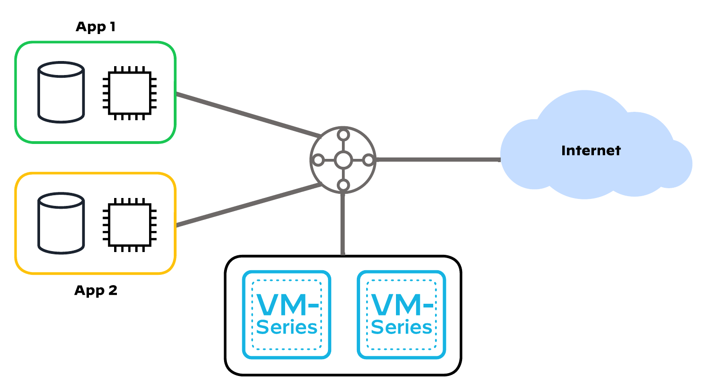

# Reference Architecture with Terraform: VM-Series in Azure, Centralized Architecture, Dedicated Inbound NGFW Option with Autoscaling

Palo Alto Networks produces several
[validated reference architecture design and deployment documentation guides](https://www.paloaltonetworks.com/resources/reference-architectures),
which describe well-architected and tested deployments. When deploying VM-Series in a public cloud, the reference architectures
guide users toward the best security outcomes, whilst reducing rollout time and avoiding common integration efforts.

The Terraform code presented here will deploy Palo Alto Networks VM-Series firewalls in Azure based on a centralized design with
dedicated-inbound VM-Series with autoscaling(Virtual Machine Scale Sets); for a discussion of other options, please see the design
guide from [the reference architecture guides](https://www.paloaltonetworks.com/resources/reference-architectures).

Virtual Machine Scale Sets (VMSS) are used for autoscaling to run the Next Generation Firewalls, with custom data plane oriented
metrics published by PanOS it is possible to adjust the number of firewall appliances to the current workload (data plane
utilization). Since firewalls are added or removed automatically, they cannot be managed in a classic way. Therefore they are not
assigned with public IP addresses. To ease licensing, management and updates a Panorama appliance is suggested. Deployment of a
Panorama instance is not covered in this example, but a [dedicated one exists](../standalone_panorama).

[](https://github.com/PaloAltoNetworks/terraform-azurerm-swfw-modules/tree/main/examples/dedicated_vmseries_and_autoscale) [](https://registry.terraform.io/modules/PaloAltoNetworks/swfw-modules/azurerm/latest/examples/dedicated_vmseries_and_autoscale)

## Reference Architecture Design



This code implements:

- a *centralized design*, a hub-and-spoke topology with a Transit VNet containing VM-Series to inspect all inbound, outbound,
  east-west, and enterprise traffic
- the *dedicated inbound option*, which separates inbound traffic flows onto a separate set of VM-Series
- *auto scaling* for the VM-Series, where Virtual Machine Scale Sets (VMSS) are used to provision VM-Series that will scale in and
  out dynamically, as workload demands fluctuate

## Detailed Architecture and Design

### Centralized Design

This design uses a Transit VNet. Application functions and resources are deployed across multiple VNets that are connected in a
hub-and-spoke topology. The hub of the topology, or transit VNet, is the central point of connectivity for all inbound, outbound,
east-west, and enterprise traffic. You deploy all VM-Series firewalls within the transit VNet.

### Dedicated Inbound Option

The dedicated inbound option separates traffic flows across two separate sets of VM-Series firewalls. One set of VM-Series
firewalls is dedicated to inbound traffic flows, allowing for greater flexibility and scaling of inbound traffic loads. The second
set of VM-Series firewalls services all outbound, east-west, and enterprise network traffic flows. This deployment choice offers
increased scale and operational resiliency and reduces the chances of high bandwidth use from the inbound traffic flows affecting
other traffic flows within the deployment.


This reference architecture consists of:

- a VNET containing:
  - 4 subnets:
    - 3 of them dedicated to the firewalls: management, private and public
    - one dedicated to an Application Gateway
  - Route Tables and Network Security Groups
- 2 Virtual Machine Scale Sets:
  - one for inbound, one for outbound and east-west traffic
  - with 3 network interfaces: management, public, private
  - no public addresses are assigned to firewalls' interfaces
- 2 Load Balancers:
  - public - with a public IP address assigned, in front of the public interfaces of the inbound VMSS, for incoming traffic
  - private - in front of the firewalls private interfaces of the OBEW VMSS, for outgoing and east-west traffic
- a NAT Gateway responsible for handling the outgoing traffic for the management (updates) and public (outbound traffic in OBEW
- firewalls mainly) interfaces
- 2 Application Insights, one per each scale set, used to store the custom PanOS metrics
- an Application Gateway, serving as a reverse proxy for incoming traffic, with a sample rule setting the XFF header properly
- _(optional)_ test workloads with accompanying infrastructure:
  - 2 Spoke VNETs with Route Tables and Network Security Groups
  - 2 Spoke VMs serving as WordPress-based web servers
  - 2 Azure Bastion managed jump hosts

**NOTE!**
- In order to deploy the architecture without test workloads described above, empty the `test_infrastructure` map in
  `example.tfvars` file.
- This is an example of a non-zonal deployment. Resiliency is maintained by using fault domains (Scale Set's default mechanism).

### Auto Scaling VM-Series

Auto scaling: Public-cloud environments focus on scaling out a deployment instead of scaling up. This architectural difference
stems primarily from the capability of public-cloud environments to dynamically increase or decrease the number of resources
allocated to your environment. Using native Azure services like Virtual Machine Scale Sets (VMSS), Application Insights and
VM-Series automation features, the guide implements VM-Series that will scale in and out dynamically, as your protected workload
demands fluctuate. The VM-Series firewalls are deployed in separate Virtual Machine Scale Sets for inbound and outbound/east-west
firewalls, and are automatically registered to Azure Load Balancers.

## Prerequisites

A list of requirements might vary depending on the platform used to deploy the infrastructure but a minimum one includes:

- _(in case of non cloud shell deployment)_ credentials and (optionally) tools required to authenticate against Azure Cloud, see
  [AzureRM provider documentation for details](https://registry.terraform.io/providers/hashicorp/azurerm/latest/docs#authenticating-to-azure)
- [supported](#requirements) version of [`Terraform`](<https://developer.hashicorp.com/terraform/downloads>)
- if you have not run Palo Alto NGFW images in a subscription it might be necessary to accept the license first
  ([see this note](../../modules/vmseries#accept-azure-marketplace-terms))

A non-platform requirement would be a running Panorama instance. For full automation you might want to consider the following
requirements:

- a template and a template stack with `DAY0` configuration
- a device group with security configuration (`DAY1` [iron skillet](https://github.com/PaloAltoNetworks/iron-skillet) for example)
  and any security and NAT rules of your choice
- a [Panorama Software Firewall License](https://docs.paloaltonetworks.com/vm-series/9-1/vm-series-deployment/license-the-vm-series-firewall/use-panorama-based-software-firewall-license-management) plugin to automatically manage licenses on newly created devices
- a [VM-Series](https://docs.paloaltonetworks.com/panorama/9-1/panorama-admin/panorama-plugins/plugins-types/install-the-vm-series-plugin-on-panorama)
  plugin to enable additional template options (custom metrics)

**Note!**

- after the deployment the firewalls remain not configured and not licensed.
- this example contains some **files** that **can contain sensitive data**. Keep in mind that **this code** is
  **only an example**. It's main purpose is to introduce the Terraform modules.

## Usage

### Deployment Steps

- checkout the code locally (if you haven't done so yet)
- copy the [`example.tfvars`](./example.tfvars) file, rename it to `terraform.tfvars` and adjust it to your needs (take a closer
  look at the `TODO` markers). If you already have a configured Panorama (with at least minimum configuration described above) you
  might want to also adjust the `bootstrap_options` for each scale set ([inbound](./example.tfvars#L205) and
  [obew](./example.tfvars#L249) separately).
- _(optional)_ authenticate to AzureRM, switch to the Subscription of your choice if necessary
- initialize the Terraform module:

  ```bash
  terraform init
  ```

- _(optional)_ plan you infrastructure to see what will be actually deployed:

  ```bash
  terraform plan
  ```

- deploy the infrastructure (you will have to confirm it with typing in `yes`):

  ```bash
  terraform apply
  ```

  The deployment takes couple of minutes. Observe the output. At the end you should see a summary similar to this:

  ```console
  Apply complete! Resources: 52 added, 0 changed, 0 destroyed.

  Outputs:

  lb_frontend_ips = {
    "private" = {
      "ha-ports" = "1.2.3.4"
    }
    "public" = {
      "palo-lb-app1-pip" = "1.2.3.4"
    }
  }
  metrics_instrumentation_keys = <sensitive>
  password = <sensitive>
  username = "panadmin"
  ```

- at this stage you have to wait couple of minutes for the firewalls to bootstrap.

### Post deploy

The most important post-deployment action is (for deployments with auto scaling and Panorama) to retrieve the Application Insights
instrumentation keys. This can be done by looking up the AI resources in the Azure portal, or directly from Terraform outputs:

```bash
terraform output metrics_instrumentation_keys
```

The retrieved keys should be put into appropriate templates in Panorama and pushed to the devices. From this moment on, custom
metrics are being sent to Application Insights and retrieved by Virtual Machine Scale Sets to trigger scale-in and scale-out
operations.

Although firewalls in a Scale Set are not meant to be managed directly, they are still configured with password authentication.
To retrieve the initial credentials run:

- for username:

  ```bash
  terraform output username
  ```

- for password:

  ```bash
  terraform output password
  ```

### Cleanup

To remove the deployed infrastructure run:

```bash
terraform destroy
```

## Reference

### Requirements

- `terraform`, version: >= 1.5, < 2.0

### Providers

- `random`
- `azurerm`

### Modules
Name | Version | Source | Description
--- | --- | --- | ---
`vnet` | - | ../../modules/vnet | 
`vnet_peering` | - | ../../modules/vnet_peering | 
`natgw` | - | ../../modules/natgw | 
`load_balancer` | - | ../../modules/loadbalancer | 
`appgw` | - | ../../modules/appgw | 
`ngfw_metrics` | - | ../../modules/ngfw_metrics | 
`vmss` | - | ../../modules/vmss | 
`test_infrastructure` | - | ../../modules/test_infrastructure | 

### Resources

- `resource_group` (managed)
- `password` (managed)
- `resource_group` (data)

### Required Inputs

Name | Type | Description
--- | --- | ---
[`resource_group_name`](#resource_group_name) | `string` | Name of the Resource Group.
[`region`](#region) | `string` | The Azure region to use.
[`vnets`](#vnets) | `map` | A map defining VNETs.

### Optional Inputs

Name | Type | Description
--- | --- | ---
[`name_prefix`](#name_prefix) | `string` | A prefix that will be added to all created resources.
[`create_resource_group`](#create_resource_group) | `bool` | When set to `true` it will cause a Resource Group creation.
[`tags`](#tags) | `map` | Map of tags to assign to the created resources.
[`vnet_peerings`](#vnet_peerings) | `map` | A map defining VNET peerings.
[`natgws`](#natgws) | `map` | A map defining NAT Gateways.
[`load_balancers`](#load_balancers) | `map` | A map containing configuration for all (both private and public) Load Balancers.
[`appgws`](#appgws) | `map` | A map defining all Application Gateways in the current deployment.
[`ngfw_metrics`](#ngfw_metrics) | `object` | A map controlling metrics-relates resources.
[`scale_sets_universal`](#scale_sets_universal) | `object` | A map defining common settings for all created VM-Series Scale Sets.
[`scale_sets`](#scale_sets) | `map` | A map defining Azure Virtual Machine Scale Sets based on Palo Alto Networks Next Generation Firewall image.
[`test_infrastructure`](#test_infrastructure) | `map` | A map defining test infrastructure including test VMs and Azure Bastion hosts.

### Outputs

Name |  Description
--- | ---
`usernames` | Initial firewall administrative usernames for all deployed Scale Sets.
`passwords` | Initial firewall administrative passwords for all deployed Scale Sets.
`metrics_instrumentation_keys` | The Instrumentation Key of the created instance(s) of Azure Application Insights.
`lb_frontend_ips` | IP Addresses of the load balancers.
`test_vms_usernames` | Initial administrative username to use for test VMs.
`test_vms_passwords` | Initial administrative password to use for test VMs.
`test_vms_ips` | IP Addresses of the test VMs.
`app_lb_frontend_ips` | IP Addresses of the load balancers.

### Required Inputs details

#### resource_group_name

Name of the Resource Group.

Type: string

<sup>[back to list](#modules-required-inputs)</sup>

#### region

The Azure region to use.

Type: string

<sup>[back to list](#modules-required-inputs)</sup>

#### vnets

A map defining VNETs.
  
For detailed documentation on each property refer to [module documentation](../../modules/vnet)

- `create_virtual_network`  - (`bool`, optional, defaults to `true`) when set to `true` will create a VNET, `false` will source
                              an existing VNET.
- `name`                    - (`string`, required) a name of a VNET. In case `create_virtual_network = false` this should be a
                              full resource name, including prefixes.
- `address_space`           - (`list`, required when `create_virtual_network = false`) a list of CIDRs for a newly created VNET.
- `vnet_encryption`         - (`string`, optional, defaults to module default) enables Azure Virtual Network Encryption when
                              set, only possible value at the moment is `AllowUnencrypted`. When set to `null`, the feature is 
                              disabled.
- `resource_group_name`     - (`string`, optional, defaults to current RG) a name of an existing Resource Group in which the
                              VNET will reside or is sourced from.
- `create_subnets`          - (`bool`, optional, defaults to `true`) if `true`, create Subnets inside the Virtual Network,
                              otherwise use source existing subnets.
- `subnets`                 - (`map`, optional) map of Subnets to create or source, for details see
                              [VNET module documentation](../../modules/vnet#subnets).
- `network_security_groups` - (`map`, optional) map of Network Security Groups to create, for details see
                              [VNET module documentation](../../modules/vnet#network_security_groups).
- `route_tables`            - (`map`, optional) map of Route Tables to create, for details see
                              [VNET module documentation](../../modules/vnet#route_tables).


Type: 

```hcl
map(object({
    name                   = string
    resource_group_name    = optional(string)
    create_virtual_network = optional(bool, true)
    address_space          = optional(list(string))
    vnet_encryption        = optional(string)
    network_security_groups = optional(map(object({
      name = string
      rules = optional(map(object({
        name                         = string
        priority                     = number
        direction                    = string
        access                       = string
        protocol                     = string
        source_port_range            = optional(string)
        source_port_ranges           = optional(list(string))
        destination_port_range       = optional(string)
        destination_port_ranges      = optional(list(string))
        source_address_prefix        = optional(string)
        source_address_prefixes      = optional(list(string))
        destination_address_prefix   = optional(string)
        destination_address_prefixes = optional(list(string))
      })), {})
    })), {})
    route_tables = optional(map(object({
      name                          = string
      disable_bgp_route_propagation = optional(bool)
      routes = map(object({
        name                = string
        address_prefix      = string
        next_hop_type       = string
        next_hop_ip_address = optional(string)
      }))
    })), {})
    create_subnets = optional(bool, true)
    subnets = optional(map(object({
      name                            = string
      address_prefixes                = optional(list(string), [])
      network_security_group_key      = optional(string)
      route_table_key                 = optional(string)
      enable_storage_service_endpoint = optional(bool, false)
    })), {})
  }))
```


<sup>[back to list](#modules-required-inputs)</sup>

### Optional Inputs details

#### name_prefix

A prefix that will be added to all created resources.
There is no default delimiter applied between the prefix and the resource name.
Please include the delimiter in the actual prefix.

Example:
```
name_prefix = "test-"
```
  
**Note!** \
This prefix is not applied to existing resources. If you plan to reuse i.e. a VNET please specify it's full name,
even if it is also prefixed with the same value as the one in this property.


Type: string

Default value: ``

<sup>[back to list](#modules-optional-inputs)</sup>

#### create_resource_group

When set to `true` it will cause a Resource Group creation.
Name of the newly specified RG is controlled by `resource_group_name`.
  
When set to `false` the `resource_group_name` parameter is used to specify a name of an existing Resource Group.


Type: bool

Default value: `true`

<sup>[back to list](#modules-optional-inputs)</sup>

#### tags

Map of tags to assign to the created resources.

Type: map(string)

Default value: `map[]`

<sup>[back to list](#modules-optional-inputs)</sup>

#### vnet_peerings

A map defining VNET peerings.

Following properties are supported:
- `local_vnet_name`            - (`string`, required) name of the local VNET.
- `local_resource_group_name`  - (`string`, optional) name of the resource group, in which local VNET exists.
- `remote_vnet_name`           - (`string`, required) name of the remote VNET.
- `remote_resource_group_name` - (`string`, optional) name of the resource group, in which remote VNET exists.


Type: 

```hcl
map(object({
    local_vnet_name            = string
    local_resource_group_name  = optional(string)
    remote_vnet_name           = string
    remote_resource_group_name = optional(string)
  }))
```


Default value: `map[]`

<sup>[back to list](#modules-optional-inputs)</sup>

#### natgws

A map defining NAT Gateways. 

Please note that a NAT Gateway is a zonal resource, this means it's always placed in a zone (even when you do not specify one
explicitly). Please refer to Microsoft documentation for notes on NAT Gateway's zonal resiliency.
For detailed documentation on each property refer to [module documentation](../../modules/natgw).
  
Following properties are supported:
- `name`                - (`string`, required) a name of a NAT Gateway. In case `create_natgw = false` this should be a full
                          resource name, including prefixes.
- `vnet_key`            - (`string`, required) a name (key value) of a VNET defined in `var.vnets` that hosts a subnet this
                          NAT Gateway will be assigned to.
- `subnet_keys`         - (`list(string)`, required) a list of subnets (key values) the NAT Gateway will be assigned to,
                          defined in `var.vnets` for a VNET described by `vnet_name`.
- `create_natgw`        - (`bool`, optional, defaults to `true`) create (`true`) or source an existing NAT Gateway (`false`),
                          created or sourced: the NAT Gateway will be assigned to a subnet created by the `vnet` module.
- `resource_group_name` - (`string`, optional) name of a Resource Group hosting the NAT Gateway (newly created or the existing
                          one).
- `zone`                - (`string`, optional) an Availability Zone in which the NAT Gateway will be placed, when skipped
                          Azure will pick a zone.
- `idle_timeout`        - (`number`, optional, defults to 4) connection IDLE timeout in minutes, for newly created resources.
- `public_ip`           - (`object`, optional) an object defining a public IP resource attached to the NAT Gateway.
- `public_ip_prefix`    - (`object`, optional) an object defining a public IP prefix resource attached to the NAT Gatway.

Example:
```
natgws = {
  "natgw" = {
    name        = "natgw"
    vnet_key    = "transit-vnet"
    subnet_keys = ["management"]
    public_ip = {
      create = true
      name   = "natgw-pip"
    }
  }
}
```


Type: 

```hcl
map(object({
    name                = string
    vnet_key            = string
    subnet_keys         = list(string)
    create_natgw        = optional(bool, true)
    resource_group_name = optional(string)
    zone                = optional(string)
    idle_timeout        = optional(number, 4)
    public_ip = optional(object({
      create              = bool
      name                = string
      resource_group_name = optional(string)
    }))
    public_ip_prefix = optional(object({
      create              = bool
      name                = string
      resource_group_name = optional(string)
      length              = optional(number)
    }))
  }))
```


Default value: `map[]`

<sup>[back to list](#modules-optional-inputs)</sup>

#### load_balancers

A map containing configuration for all (both private and public) Load Balancers.

This is a brief description of available properties. For a detailed one please refer to
[module documentation](../../modules/loadbalancer).

Following properties are available:

- `name`                    - (`string`, required) a name of the Load Balancer.
- `vnet_key`                - (`string`, optional, defaults to `null`) a key pointing to a VNET definition in the `var.vnets`
                              map that stores the Subnet described by `subnet_key`.
- `zones`                   - (`list`, optional, defaults to module default) a list of zones for Load Balancer's frontend IP
                              configurations.
- `backend_name`            - (`string`, optional, defaults to "vmseries_backend") a name of the backend pool to create.
- `health_probes`           - (`map`, optional, defaults to `null`) a map defining health probes that will be used by load
                              balancing rules, please refer to
                              [module documentation](../../modules/loadbalancer#health_probes) for more specific use
                              cases and available properties.
- `nsg_auto_rules_settings` - (`map`, optional, defaults to `null`) a map defining a location of an existing NSG rule that will
                              be populated with `Allow` rules for each load balancing rule (`in_rules`), please refer to
                              [module documentation](../../modules/loadbalancer#nsg_auto_rules_settings) for
                              available properties. 
                                
  Please note that in this example two additional properties are available:

  - `nsg_vnet_key` - (`string`, optional, mutually exclusive with `nsg_name`) a key pointing to a VNET definition in the
                     `var.vnets` map that stores the NSG described by `nsg_key`.
  - `nsg_key`      - (`string`, optional, mutually exclusive with `nsg_name`) a key pointing to an NSG definition in the
                     `var.vnets` map.

- `frontend_ips`            - (`map`, optional, defaults to `{}`) a map containing frontend IP configuration with respective
                              `in_rules` and `out_rules`, please refer to
                              [module documentation](../../modules/loadbalancer#frontend_ips) for available
                              properties.

  **Note!** \
  In this example the `subnet_id` is not available directly, another property has been introduced instead:

  - `subnet_key` - (`string`, optional, defaults to `null`) a key pointing to a Subnet definition in the `var.vnets` map.


Type: 

```hcl
map(object({
    name         = string
    vnet_key     = optional(string)
    zones        = optional(list(string))
    backend_name = optional(string, "vmseries_backend")
    health_probes = optional(map(object({
      name                = string
      protocol            = string
      port                = optional(number)
      probe_threshold     = optional(number)
      interval_in_seconds = optional(number)
      request_path        = optional(string)
    })))
    nsg_auto_rules_settings = optional(object({
      nsg_name                = optional(string)
      nsg_vnet_key            = optional(string)
      nsg_key                 = optional(string)
      nsg_resource_group_name = optional(string)
      source_ips              = list(string)
      base_priority           = optional(number)
    }))
    frontend_ips = optional(map(object({
      name                          = string
      subnet_key                    = optional(string)
      public_ip_name                = optional(string)
      create_public_ip              = optional(bool, false)
      public_ip_resource_group_name = optional(string)
      private_ip_address            = optional(string)
      gwlb_key                      = optional(string)
      in_rules = optional(map(object({
        name                = string
        protocol            = string
        port                = number
        backend_port        = optional(number)
        health_probe_key    = optional(string)
        floating_ip         = optional(bool)
        session_persistence = optional(string)
        nsg_priority        = optional(number)
      })), {})
      out_rules = optional(map(object({
        name                     = string
        protocol                 = string
        allocated_outbound_ports = optional(number)
        enable_tcp_reset         = optional(bool)
        idle_timeout_in_minutes  = optional(number)
      })), {})
    })), {})
  }))
```


Default value: `map[]`

<sup>[back to list](#modules-optional-inputs)</sup>

#### appgws

A map defining all Application Gateways in the current deployment.

For detailed documentation on how to configure this resource, for available properties, especially for the defaults,
refer to [module documentation](../../modules/appgw).

**Note!** \
The `rules` property is meant to bind together `backend_setting`, `redirect` or `url_path_map` (all 3 are mutually exclusive). 
It represents the Rules section of an Application Gateway in Azure Portal.

Below you can find a brief list of most important properties:

- `name`             - (`string`, required) the name of the Application Gateway, will be prefixed with `var.name_prefix`.
- `vnet_key`         - (`string`, required) a key pointing to a VNET definition in the `var.vnets` map that stores the Subnet
                       described by `subnet_key`.
- `subnet_key`       - (`string`, required) a key pointing to a Subnet definition in the `var.vnets` map, this has to be an
                       Application Gateway V2 dedicated subnet.
- `zones`            - (`list`, optional, defaults to module default) parameter controlling if this is a zonal, or a non-zonal
                       deployment.
- `public_ip`        - (`map`, required) defines a Public IP resource used by the Application Gateway instance, a newly created
                       Public IP will have it's name prefixes with `var.name_prefix`.
- `listeners`        - (`map`, required) defines Application Gateway's Listeners, see
                       [module's documentation](../../modules/appgw#listeners) for details.
- `backend_pool`     - (`map`, optional, defaults to module default) backend pool definition, when skipped an empty backend
                       will be created.
- `backend_settings` - (`map`, optional, mutually exclusive with `redirects` and `url_path_maps`) defines HTTP backend
                       settings, see [module's documentation](../../modules/appgw#backend_settings) for details.
- `probes`           - (`map`, optional, defaults to module default) defines backend probes used check health of backends, see
                       [module's documentation](../../modules/appgw#probes) for details.
- `rewrites`         - (`map`, optional, defaults to module default) defines rewrite rules, see 
                       [module's documentation](../../modules/appgw#rewrites) for details.
- `redirects`        - (`map`, optional, mutually exclusive with `backend_settings` and `url_path_maps`) static redirects 
                       definition, see [module's documentation](../../modules/appgw#redirects) for details.
- `url_path_maps`    - (`map`, optional, mutually exclusive with `backend_settings` and `redirects`) URL path maps definition, 
                       see [module's documentation](../../modules/appgw#url_path_maps) for details.
- `rules`            - (`map`, required) Application Gateway Rules definition, bind together a `listener` with either
                       `backend_setting`, `redirect` or `url_path_map`, see
                       [module's documentation](../../modules/appgw#rules) for details.


Type: 

```hcl
map(object({
    name       = string
    vnet_key   = string
    subnet_key = string
    zones      = optional(list(string))
    public_ip = object({
      name                = string
      create              = optional(bool, true)
      resource_group_name = optional(string)
    })
    domain_name_label = optional(string)
    capacity = optional(object({
      static = optional(number)
      autoscale = optional(object({
        min = number
        max = number
      }))
    }))
    enable_http2 = optional(bool)
    waf = optional(object({
      prevention_mode  = bool
      rule_set_type    = optional(string)
      rule_set_version = optional(string)
    }))
    managed_identities = optional(list(string))
    global_ssl_policy = optional(object({
      type                 = optional(string)
      name                 = optional(string)
      min_protocol_version = optional(string)
      cipher_suites        = optional(list(string))
    }))
    ssl_profiles = optional(map(object({
      name                            = string
      ssl_policy_name                 = optional(string)
      ssl_policy_min_protocol_version = optional(string)
      ssl_policy_cipher_suites        = optional(list(string))
    })))
    frontend_ip_configuration_name = optional(string, "public_ipconfig")
    listeners = map(object({
      name                     = string
      port                     = number
      protocol                 = optional(string)
      host_names               = optional(list(string))
      ssl_profile_name         = optional(string)
      ssl_certificate_path     = optional(string)
      ssl_certificate_pass     = optional(string)
      ssl_certificate_vault_id = optional(string)
      custom_error_pages       = optional(map(string))
    }))
    backend_pool = optional(object({
      name         = optional(string)
      vmseries_ips = optional(list(string))
    }))
    backend_settings = optional(map(object({
      name                      = string
      port                      = number
      protocol                  = string
      path                      = optional(string)
      hostname_from_backend     = optional(string)
      hostname                  = optional(string)
      timeout                   = optional(number)
      use_cookie_based_affinity = optional(bool)
      affinity_cookie_name      = optional(string)
      probe                     = optional(string)
      root_certs = optional(map(object({
        name = string
        path = string
      })))
    })))
    probes = optional(map(object({
      name       = string
      path       = string
      host       = optional(string)
      port       = optional(number)
      protocol   = optional(string)
      interval   = optional(number)
      timeout    = optional(number)
      threshold  = optional(number)
      match_code = optional(list(number))
      match_body = optional(string)
    })))
    rewrites = optional(map(object({
      name = optional(string)
      rules = optional(map(object({
        name     = string
        sequence = number
        conditions = optional(map(object({
          pattern     = string
          ignore_case = optional(bool)
          negate      = optional(bool)
        })))
        request_headers  = optional(map(string))
        response_headers = optional(map(string))
      })))
    })))
    redirects = optional(map(object({
      name                 = string
      type                 = string
      target_listener_key  = optional(string)
      target_url           = optional(string)
      include_path         = optional(bool)
      include_query_string = optional(bool)
    })))
    url_path_maps = optional(map(object({
      name        = string
      backend_key = string
      path_rules = optional(map(object({
        paths        = list(string)
        backend_key  = optional(string)
        redirect_key = optional(string)
      })))
    })))
    rules = map(object({
      name             = string
      priority         = number
      backend_key      = optional(string)
      listener_key     = string
      rewrite_key      = optional(string)
      url_path_map_key = optional(string)
      redirect_key     = optional(string)
    }))
  }))
```


Default value: `map[]`

<sup>[back to list](#modules-optional-inputs)</sup>

#### ngfw_metrics

A map controlling metrics-relates resources.

When set to explicit `null` (default) it will disable any metrics resources in this deployment.

When defined it will either create or source a Log Analytics Workspace and create Application Insights instances (one per each
Scale Set). All instances will be automatically connected to the workspace. The name of the Application Insights instance will
be derived from the Scale Set name and suffixed with `-ai`.

All the settings available below are common to the Log Analytics Workspace and Application Insight instances.

Following properties are available:

- `name`                      - (`string`, required) name of the (common) Log Analytics Workspace.
- `create_workspace`          - (`bool`, optional, defaults to `true`) controls whether we create or source an existing Log
                                Analytics Workspace.
- `resource_group_name`       - (`string`, optional, defaults to `var.resource_group_name`) name of the Resource Group hosting
                                the Log Analytics Workspace.
- `sku`                       - (`string`, optional, defaults to module default) the SKU of the Log Analytics Workspace.
- `metrics_retention_in_days` - (`number`, optional, defaults to module default) workspace and insights data retention in days,
                                possible values are between 30 and 730. For sourced Workspaces this applies only to the
                                Application Insights instances.


Type: 

```hcl
object({
    name                      = string
    create_workspace          = optional(bool, true)
    resource_group_name       = optional(string)
    sku                       = optional(string)
    metrics_retention_in_days = optional(number)
  })
```


Default value: `&{}`

<sup>[back to list](#modules-optional-inputs)</sup>

#### scale_sets_universal

A map defining common settings for all created VM-Series Scale Sets. 
  
It duplicates popular properties from `scale_sets` variable, specifically `scale_sets.image` and 
`scale_sets.virtual_machine_scale_set` maps. However, if values are set in those maps, they still take precedence over the ones
set within this variable. As a result, all universal properties can be overriden on a per-VMSS basis.

Following properties are supported:
  
- `version`           - (`string`, optional) describes the PAN-OS image version from Azure Marketplace.
- `size`              - (`string`, optional, defaults to module default) Azure VM size (type). Consult the *VM-Series
                        Deployment Guide* as only a few selected sizes are supported.
- `bootstrap_options` - (`string`, optional, mutually exclusive with `bootstrap_package`) bootstrap options passed to PAN-OS
                        when launched for the 1st time, for details see module documentation.


Type: 

```hcl
object({
    version           = optional(string)
    size              = optional(string)
    bootstrap_options = optional(string)
  })
```


Default value: `map[]`

<sup>[back to list](#modules-optional-inputs)</sup>

#### scale_sets

A map defining Azure Virtual Machine Scale Sets based on Palo Alto Networks Next Generation Firewall image.

For details and defaults for available options please refer to the [`vmss`](../../modules/vmss) module.

The basic Scale Set configuration properties are as follows:

- `name`                      - (`string`, required) name of the scale set, will be prefixed with the value of
                                `var.name_prefix`.
- `vnet_key`                  - (`string`, required) a key of a VNET defined in `var.vnets`. This is the VNET that hosts
                                subnets used to deploy network interfaces for VMs in this Scale Set.
- `authentication`            - (`map`, required) authentication setting for VMs deployed in this scale set.

    This map holds the firewall admin password. When this property is not set, the password will be autogenerated for you and
    available in the Terraform outputs.

    **Note!** \
    The `disable_password_authentication` property is by default true. When using this value you have to specify at least one
    SSH key. You can however set this property to `true`. Then you have 2 options, either:

    - do not specify anything else, a random password will be generated for you.
    - specify at least one of `password` or `ssh_keys` properties.

    For all properties and their default values refer to [module's documentation](../../modules/vmss#authentication).

- `image`                     - (`map`, optional) properties defining a base image used to spawn VMs in this Scale Set. The
                                `image` property is required (if no common properties were set within `scale_sets_universal` 
                                variable) but there are only 2 properties (mutually exclusive) that have to be set up, either:

    - `version`   - (`string`, optional) describes the PAN-OS image version from Azure Marketplace.
    - `custom_id` - (`string`, optional) absolute ID of your own custom PAN-OS image.

    For details on all properties refer to [module's documentation](../../modules/vmss#image).

- `virtual_machine_scale_set` - (`map`, optional, defaults to module default) a map that groups most common Scale Set
                                configuration options:

    - `size`              - (`string`, optional, defaults to module default) Azure VM size (type). Consult the *VM-Series
                            Deployment Guide* as only a few selected sizes are supported.
    - `zones`             - (`list`, optional, defaults to module default) a list of Availability Zones in which VMs from
                            this Scale Set will be created.
    - `disk_type`         - (`string`, optional, defaults to module default) type of Managed Disk which should be created,
                            possible values are `Standard_LRS`, `StandardSSD_LRS` or `Premium_LRS` (works only for selected
                            `vm_size` values).
    - `bootstrap_options` - (`string`, optional, defaults to module default) bootstrap options to pass to VM-Series instance.

    For details on all properties refer to [module's documentation](../../modules/vmss#virtual_machine_scale_set).

- `autoscaling_configuration` - (`map`, optional, defaults to `{}`) a map that groups common autoscaling configuration, but not
                                the scaling profiles (metrics, thresholds, etc.). Most common properties are:

    - `default_count`   - (`number`, optional, defaults to module default) minimum number of instances that should be present
                          in the scale set when the autoscaling engine cannot read the metrics or is otherwise unable to
                          compare the metrics to the thresholds.

    For details on all properties refer to [module's documentation](../../modules/vmss#autoscaling_configuration).

- `interfaces`                - (`list`, required) configuration of all network interfaces, order does matter - the
                                1<sup>st</sup> interface should be the management one. Following properties are available:

  - `name`                    - (`string`, required) name of the network interface (will be prefixed with `var.name_prefix`).
  - `subnet_key`              - (`string`, required) a key of a subnet to which the interface will be assigned as defined in
                                `var.vnets`.
  - `create_public_ip`        - (`bool`, optional, defaults to module default) create Public IP for an interface.
  - `load_balancer_key`       - (`string`, optional, defaults to `null`) key of a Load Balancer defined in the
                                `var.loadbalancers` variable, network interface that has this property defined will be added to
                                the Load Balancer's backend pool.
  - `application_gateway_key` - (`string`, optional, defaults to `null`) key of an Application Gateway defined in the
                                `var.appgws`, network interface that has this property defined will be added to the Application
                                Gateways's backend pool.
  - `pip_domain_name_label`   - (`string`, optional, defaults to `null`) prefix which should be used for the Domain Name Label
                                for each VM instance.

- `autoscaling_profiles`      - (`list`, optional, defaults to `[]`) a list of autoscaling profiles, for details on available
                                properties please refer to
                                [module's documentation](../../modules/vmss#autoscaling_profiles).


Type: 

```hcl
map(object({
    name     = string
    vnet_key = string
    authentication = object({
      username                        = optional(string)
      password                        = optional(string)
      disable_password_authentication = optional(bool, true)
      ssh_keys                        = optional(list(string), [])
    })
    image = optional(object({
      version                 = optional(string)
      publisher               = optional(string)
      offer                   = optional(string)
      sku                     = optional(string)
      enable_marketplace_plan = optional(bool)
      custom_id               = optional(string)
    }))
    virtual_machine_scale_set = optional(object({
      size                          = optional(string)
      bootstrap_options             = optional(string)
      zones                         = optional(list(string))
      disk_type                     = optional(string)
      accelerated_networking        = optional(bool)
      allow_extension_operations    = optional(bool)
      encryption_at_host_enabled    = optional(bool)
      overprovision                 = optional(bool)
      platform_fault_domain_count   = optional(number)
      single_placement_group        = optional(bool)
      capacity_reservation_group_id = optional(string)
      disk_encryption_set_id        = optional(string)
      enable_boot_diagnostics       = optional(bool, true)
      boot_diagnostics_storage_uri  = optional(string)
      identity_type                 = optional(string)
      identity_ids                  = optional(list(string), [])
    }))
    autoscaling_configuration = optional(object({
      default_count           = optional(number)
      scale_in_policy         = optional(string)
      scale_in_force_deletion = optional(bool)
      notification_emails     = optional(list(string), [])
      webhooks_uris           = optional(map(string), {})
    }), {})
    interfaces = list(object({
      name                    = string
      subnet_key              = string
      create_public_ip        = optional(bool)
      load_balancer_key       = optional(string)
      application_gateway_key = optional(string)
      pip_domain_name_label   = optional(string)
    }))
    autoscaling_profiles = optional(list(object({
      name          = string
      minimum_count = optional(number)
      default_count = number
      maximum_count = optional(number)
      recurrence = optional(object({
        timezone   = optional(string)
        days       = list(string)
        start_time = string
        end_time   = string
      }))
      scale_rules = optional(list(object({
        name = string
        scale_out_config = object({
          threshold                  = number
          operator                   = optional(string)
          grain_window_minutes       = number
          grain_aggregation_type     = optional(string)
          aggregation_window_minutes = number
          aggregation_window_type    = optional(string)
          cooldown_window_minutes    = number
          change_count_by            = optional(number)
        })
        scale_in_config = object({
          threshold                  = number
          operator                   = optional(string)
          grain_window_minutes       = optional(number)
          grain_aggregation_type     = optional(string)
          aggregation_window_minutes = optional(number)
          aggregation_window_type    = optional(string)
          cooldown_window_minutes    = number
          change_count_by            = optional(number)
        })
      })), [])
    })), [])
  }))
```


Default value: `map[]`

<sup>[back to list](#modules-optional-inputs)</sup>

#### test_infrastructure

A map defining test infrastructure including test VMs and Azure Bastion hosts.

For details and defaults for available options please refer to the
[`test_infrastructure`](../../modules/test_infrastructure) module.

Following properties are supported:

- `create_resource_group`  - (`bool`, optional, defaults to `true`) when set to `true`, a new Resource Group is created. When
                             set to `false`, an existing Resource Group is sourced.
- `resource_group_name`    - (`string`, optional) name of the Resource Group to be created or sourced.
- `vnets`                  - (`map`, required) a map defining VNETs and peerings for the test environment. The most basic
                             properties are as follows:

  - `create_virtual_network`  - (`bool`, optional, defaults to `true`) when set to `true` will create a VNET,
                                `false` will source an existing VNET.
  - `name`                    - (`string`, required) a name of a VNET. In case `create_virtual_network = `false` this should be
                                a full resource name, including prefixes.
  - `address_space`           - (`list(string)`, required when `create_virtual_network = `false`) a list of CIDRs for a newly
                                created VNET.
  - `create_subnets`          - (`bool`, optional, defaults to `true`) if `true`, create Subnets inside the Virtual Network,
                                otherwise use source existing subnets.
  - `subnets`                 - (`map`, optional) map of Subnets to create or source, for details see
                                [VNET module documentation](../../modules/vnet#subnets).
  - `network_security_groups` - (`map`, optional) map of Network Security Groups to create, for details see
                                [VNET module documentation](../../modules/vnet#network_security_groups).
  - `route_tables`            - (`map`, optional) map of Route Tables to create, for details see
                                [VNET module documentation](../../modules/vnet#route_tables).
  - `local_peer_config`       - (`map`, optional) a map that contains local peer configuration parameters. This value allows to 
                                set `allow_virtual_network_access`, `allow_forwarded_traffic`, `allow_gateway_transit` and 
                                `use_remote_gateways` parameters on the local VNet peering. 
  - `remote_peer_config`      - (`map`, optional) a map that contains remote peer configuration parameters. This value allows to
                                set `allow_virtual_network_access`, `allow_forwarded_traffic`, `allow_gateway_transit` and 
                                `use_remote_gateways` parameters on the remote VNet peering. 

  For all properties and their default values see [module's documentation](../../modules/test_infrastructure#vnets).

- `load_balancers`         - (`map`, optional) a map containing configuration for all (both private and public) Load Balancers.
                             The most basic properties are as follows:

  - `name`                    - (`string`, required) a name of the Load Balancer.
  - `vnet_key`                - (`string`, optional, defaults to `null`) a key pointing to a VNET definition in the `var.vnets`
                                map that stores the Subnet described by `subnet_key`.
  - `zones`                   - (`list`, optional, defaults to module default) a list of zones for Load Balancer's frontend IP
                                configurations.
  - `backend_name`            - (`string`, optional) a name of the backend pool to create.
  - `health_probes`           - (`map`, optional, defaults to `null`) a map defining health probes that will be used by load
                                balancing rules, please refer to
                                [loadbalancer module documentation](../../modules/loadbalancer#health_probes) for
                                more specific use cases and available properties.
  - `nsg_auto_rules_settings` - (`map`, optional, defaults to `null`) a map defining a location of an existing NSG rule that
                                will be populated with `Allow` rules for each load balancing rule (`in_rules`), please refer to
                                [loadbalancer module documentation](../../modules/loadbalancer#nsg_auto_rules_settings)
                                for available properties.

  Please note that in this example two additional properties are available:

    - `nsg_vnet_key` - (`string`, optional, mutually exclusive with `nsg_name`) a key pointing to a VNET definition in the
                       `var.vnets` map that stores the NSG described by `nsg_key`.
    - `nsg_key`      - (`string`, optional, mutually exclusive with `nsg_name`) a key pointing to an NSG definition in the
                       `var.vnets` map.

  - `frontend_ips`            - (`map`, optional, defaults to `{}`) a map containing frontend IP configuration with respective
                                `in_rules` and `out_rules`, please refer to
                                [loadbalancer module documentation](../../modules/loadbalancer#frontend_ips) for
                                available properties.

    **Note!** \
    In this example the `subnet_id` is not available directly, another property has been introduced instead:

    - `subnet_key` - (`string`, optional, defaults to `null`) a key pointing to a Subnet definition in the `var.vnets` map.

  For all properties and their default values see
  [module's documentation](../../modules/test_infrastructure#load_balancers).

- `authentication`         - (`map`, optional, defaults to example defaults) authentication settings for the deployed VMs.
- `spoke_vms`              - (`map`, required) a map defining test VMs. The most basic properties are as follows:

  - `name`              - (`string`, required) a name of the VM.
  - `vnet_key`          - (`string`, required) a key describing a VNET defined in `vnets` property.
  - `subnet_key`        - (`string`, required) a key describing a Subnet found in a VNET definition.
  - `load_balancer_key` - (`string`, optional) a key describing a Load Balancer defined in `load_balancers` property.

  For all properties and their default values see
  [module's documentation](../../modules/test_infrastructure#test_vms).

- `bastions`               - (`map`, required) a map containing Azure Bastion definitions. The most basic properties are as
                             follows:

  - `name`       - (`string`, required) an Azure Bastion name.
  - `vnet_key`   - (`string`, required) a key describing a VNET defined in `vnets` property. This VNET should already have an
                   existing subnet called `AzureBastionSubnet` (the name is hardcoded by Microsoft).
  - `subnet_key` - (`string`, required) a key pointing to a Subnet dedicated to a Bastion deployment.

  For all properties and their default values see
  [module's documentation](../../modules/test_infrastructure#bastions).


Type: 

```hcl
map(object({
    create_resource_group = optional(bool, true)
    resource_group_name   = optional(string)
    vnets = map(object({
      name                    = string
      create_virtual_network  = optional(bool, true)
      address_space           = optional(list(string))
      hub_resource_group_name = optional(string)
      hub_vnet_name           = string
      network_security_groups = optional(map(object({
        name = string
        rules = optional(map(object({
          name                         = string
          priority                     = number
          direction                    = string
          access                       = string
          protocol                     = string
          source_port_range            = optional(string)
          source_port_ranges           = optional(list(string))
          destination_port_range       = optional(string)
          destination_port_ranges      = optional(list(string))
          source_address_prefix        = optional(string)
          source_address_prefixes      = optional(list(string))
          destination_address_prefix   = optional(string)
          destination_address_prefixes = optional(list(string))
        })), {})
      })), {})
      route_tables = optional(map(object({
        name                          = string
        disable_bgp_route_propagation = optional(bool)
        routes = map(object({
          name                = string
          address_prefix      = string
          next_hop_type       = string
          next_hop_ip_address = optional(string)
        }))
      })), {})
      create_subnets = optional(bool, true)
      subnets = optional(map(object({
        name                            = string
        address_prefixes                = optional(list(string), [])
        network_security_group_key      = optional(string)
        route_table_key                 = optional(string)
        enable_storage_service_endpoint = optional(bool, false)
      })), {})
      local_peer_config = optional(object({
        allow_virtual_network_access = optional(bool, true)
        allow_forwarded_traffic      = optional(bool, true)
        allow_gateway_transit        = optional(bool, false)
        use_remote_gateways          = optional(bool, false)
      }), {})
      remote_peer_config = optional(object({
        allow_virtual_network_access = optional(bool, true)
        allow_forwarded_traffic      = optional(bool, true)
        allow_gateway_transit        = optional(bool, false)
        use_remote_gateways          = optional(bool, false)
      }), {})
    }))
    load_balancers = optional(map(object({
      name         = string
      vnet_key     = optional(string)
      zones        = optional(list(string))
      backend_name = optional(string)
      health_probes = optional(map(object({
        name                = string
        protocol            = string
        port                = optional(number)
        probe_threshold     = optional(number)
        interval_in_seconds = optional(number)
        request_path        = optional(string)
      })))
      nsg_auto_rules_settings = optional(object({
        nsg_name                = optional(string)
        nsg_vnet_key            = optional(string)
        nsg_key                 = optional(string)
        nsg_resource_group_name = optional(string)
        source_ips              = list(string)
        base_priority           = optional(number)
      }))
      frontend_ips = optional(map(object({
        name                          = string
        subnet_key                    = optional(string)
        public_ip_name                = optional(string)
        create_public_ip              = optional(bool, false)
        public_ip_resource_group_name = optional(string)
        private_ip_address            = optional(string)
        gwlb_key                      = optional(string)
        in_rules = optional(map(object({
          name                = string
          protocol            = string
          port                = number
          backend_port        = optional(number)
          health_probe_key    = optional(string)
          floating_ip         = optional(bool)
          session_persistence = optional(string)
          nsg_priority        = optional(number)
        })), {})
        out_rules = optional(map(object({
          name                     = string
          protocol                 = string
          allocated_outbound_ports = optional(number)
          enable_tcp_reset         = optional(bool)
          idle_timeout_in_minutes  = optional(number)
        })), {})
      })), {})
    })), {})
    authentication = optional(object({
      username = optional(string, "bitnami")
      password = optional(string)
    }), {})
    spoke_vms = map(object({
      name               = string
      interface_name     = optional(string)
      disk_name          = optional(string)
      vnet_key           = string
      subnet_key         = string
      load_balancer_key  = optional(string)
      private_ip_address = optional(string)
      size               = optional(string)
      image = optional(object({
        publisher               = optional(string)
        offer                   = optional(string)
        sku                     = optional(string)
        version                 = optional(string)
        enable_marketplace_plan = optional(bool)
      }), {})
      custom_data = optional(string)
    }))
    bastions = map(object({
      name           = string
      public_ip_name = optional(string)
      vnet_key       = string
      subnet_key     = string
    }))
  }))
```


Default value: `map[]`

<sup>[back to list](#modules-optional-inputs)</sup>