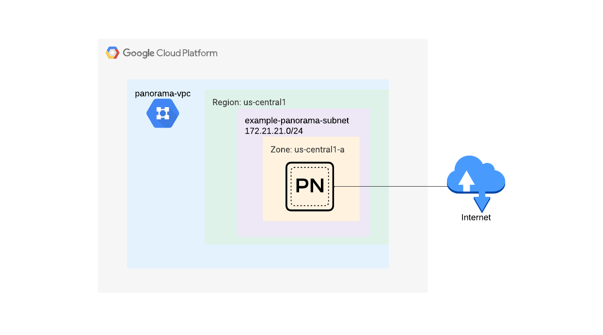

# Palo Alto Panorama deployment example

The scope of this code is to deploy one or more vpc networks and subnetworks along with one or more panorama instances in a single project and region in Google Cloud. The example deploys panorama to be used in management only mode (without additional logging disks). For option on how to add additional logging disks - please refer to panorama [module documentation](https://github.com/PaloAltoNetworks/terraform-google-swfw-modules/tree/main/modules/panorama#inputs)

[](https://github.com/PaloAltoNetworks/terraform-google-swfw-modules/tree/main/examples/panorama_standalone) [](https://registry.terraform.io/modules/PaloAltoNetworks/swfw-modules/google/latest/examples/panorama_standalone)

## Topology

The topology consists of :
 - A VPC network and a subnetwork
 - A panorama instance with a Public IP address attached to the created vpc network and subnetwork
 - Firewall rules that allow access to the panorama management interface



## Prerequisites

1. Prepare [panorama license](https://support.paloaltonetworks.com/)

2. Configure the terraform [google provider](https://registry.terraform.io/providers/hashicorp/google/latest/docs/guides/getting_started#configuring-the-provider)

## Build

1. Access Google Cloud Shell or any other environment which has access to your GCP project

2. Clone the repository and fill out any modifications to tfvars file (`example.tfvars` - at least `project`, `ssh_keys` and `source_ranges` should be filled in for successful deployment and access to the instance after deployment)

```
git clone https://github.com/PaloAltoNetworks/terraform-google-swfw-modules
cd terraform-google-swfw-modules/examples/panorama
```

3. Apply the terraform code

```
terraform init
terraform apply -var-file=example.tfvars
```

4. Check the output plan and confirm the apply

5. Check the successful application and outputs of the resulting infrastructure:

```
Apply complete! Resources: 8 added, 0 changed, 0 destroyed. (Number of resources can vary based on how many instances you push through tfvars)

Outputs:

panorama_private_ips = {
  "panorama-01" = "172.21.21.2"
}
panorama_public_ips = {
  "panorama-01" = "x.x.x.x"
}
```

## Post build

### Connect to Panorama directly via SSH

Connect to the Panorama instance(s) via SSH using your associated private key and set a password:

```
ssh admin@x.x.x.x -i /PATH/TO/YOUR/KEY/id_rsa
Welcome admin.
admin@Panorama> configure
Entering configuration mode
[edit]                                                                                                                                                                                  
admin@Panorama# set mgt-config users admin password
Enter password   :
Confirm password :

[edit]                                                                                                                                                                                  
admin@Panorama# commit
Configuration committed successfully
```

#### Check access via web UI

Use a web browser to access https://x.x.x.x and login with admin and your previously configured password

### Connect to Panorama via GCP IAP

>**Note**: This connection method is required when Panorama doesn't have a public IP address attached to the network interface and there is no IP connectivity from the management workstation to the Panorama's private IP address.

>**Note**: First time access provisioning takes some time. Please run the following command once again if it gets stuck while connecting.

```
gcloud compute ssh --zone "<ZONE>" "admin@<PANORAMA_VM_INSTANCE_NAME>" --tunnel-through-iap --project "<PROJECT_ID>" -- -i /PATH/TO/YOUR/KEY/id_rsa

To increase the performance of the tunnel, consider installing NumPy. For instructions,
please see https://cloud.google.com/iap/docs/using-tcp-forwarding#increasing_the_tcp_upload_bandwidth

Welcome admin.
admin@Panorama> configure
Entering configuration mode
[edit]                                                                                                                                                                                  
admin@Panorama# set mgt-config users admin password
Enter password   :
Confirm password :

[edit]                                                                                                                                                                                  
admin@Panorama# commit
Configuration committed successfully
```

#### Check access via web UI

Start IAP TCP forwarding:

```
gcloud compute start-iap-tunnel <PANORAMA_VM_INSTANCE_NAME> 443 --local-host-port=localhost:4443 --zone=<ZONE> --project <PROJECT_ID>
```

Use a web browser to access https://localhost:4443 and login with admin and your previously configured password.

>**Note**: Because IAP TCP forwarding is using multiple source IP addresses, you might see a connection reset right after successful Panorama login. In that case, reestablish IAP TCP forwarding and try logging in again.

## Reference

### Requirements

- `terraform`, version: >= 1.3, < 2.0


### Modules
Name | Version | Source | Description
--- | --- | --- | ---
`vpc` | - | ../../modules/vpc | 
`panorama` | - | ../../modules/panorama | 


### Required Inputs

Name | Type | Description
--- | --- | ---
[`networks`](#networks) | `any` | A map containing each network setting.
[`panoramas`](#panoramas) | `any` | A map containing each panorama setting.

### Optional Inputs

Name | Type | Description
--- | --- | ---
[`project`](#project) | `string` | The project name to deploy the infrastructure in to.
[`region`](#region) | `string` | The region into which to deploy the infrastructure in to.
[`name_prefix`](#name_prefix) | `string` | A string to prefix resource namings.

### Outputs

Name |  Description
--- | ---
`panorama_private_ips` | Private IP address of the Panorama instance.
`panorama_public_ips` | Public IP address of the Panorama instance.

### Required Inputs details

#### networks

A map containing each network setting.

Example of variable deployment :

```
networks = {
  "panorama-vpc" = {
    vpc_name                        = "firewall-vpc"
    create_network                  = true
    delete_default_routes_on_create = "false"
    mtu                             = "1460"
    routing_mode                    = "REGIONAL"
    subnetworks = {
      "panorama-sub" = {
        name              = "panorama-subnet"
        create_subnetwork = true
        ip_cidr_range     = "172.21.21.0/24"
        region            = "us-central1"
      }
    }
    firewall_rules = {
      "allow-panorama-ingress" = {
        name             = "panorama-mgmt"
        source_ranges    = ["1.1.1.1/32", "2.2.2.2/32"]
        priority         = "1000"
        allowed_protocol = "all"
        allowed_ports    = []
      }
    }
  }
```

For a full list of available configuration items - please refer to [module documentation](https://github.com/PaloAltoNetworks/terraform-google-swfw-modules/tree/main/modules/vpc#input_networks)

Multiple keys can be added and will be deployed by the code


Type: any

<sup>[back to list](#modules-required-inputs)</sup>

#### panoramas

A map containing each panorama setting.

Example of variable deployment :

```
panoramas = {
  "panorama-01" = {
    panorama_name     = "panorama-01"
    panorama_vpc      = "panorama-vpc"
    panorama_subnet   = "panorama-subnet"
    panorama_version  = "panorama-byol-1000"
    ssh_keys          = "admin:PUBLIC-KEY"
    attach_public_ip  = true
    private_static_ip = "172.21.21.2"
  }
}
```
  
For a full list of available configuration items - please refer to [module documentation](https://github.com/PaloAltoNetworks/terraform-google-swfw-modules/tree/main/modules/panorama#inputs)

Multiple keys can be added and will be deployed by the code


Type: any

<sup>[back to list](#modules-required-inputs)</sup>

### Optional Inputs details

#### project

The project name to deploy the infrastructure in to.

Type: string

Default value: `&{}`

<sup>[back to list](#modules-optional-inputs)</sup>

#### region

The region into which to deploy the infrastructure in to

Type: string

Default value: `us-central1`

<sup>[back to list](#modules-optional-inputs)</sup>

#### name_prefix

A string to prefix resource namings

Type: string

Default value: ``

<sup>[back to list](#modules-optional-inputs)</sup>