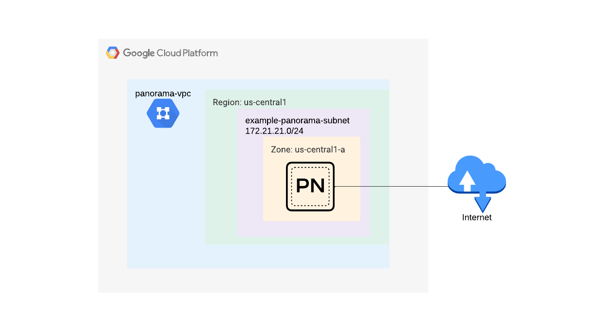

# Palo Alto Panorama deployment example

The scope of this code is to deploy one or more vpc networks and subnetworks along with one or more panorama instances in a single project and region in Google Cloud. The example deploys panorama to be used in management only mode (without additional logging disks). For option on how to add additional logging disks - please refer to panorama [module documentation](https://github.com/PaloAltoNetworks/terraform-google-vmseries-modules/tree/main/modules/panorama#inputs)


[](https://github.com/PaloAltoNetworks/terraform-google-vmseries-modules/tree/main/examples/panorama_standalone) [](https://registry.terraform.io/modules/PaloAltoNetworks/vmseries-modules/google/latest/examples/panorama_standalone)

## Topology

The topology consists of :
 - A VPC network and a subnetwork
 - A panorama instance with a Public IP address attached to the created vpc network and subnetwork
 - Firewall rules that allow access to the panorama management interface



## Prerequisites

1. Prepare [panorama license](https://support.paloaltonetworks.com/)

2. Configure the terraform [google provider](https://registry.terraform.io/providers/hashicorp/google/latest/docs/guides/getting_started#configuring-the-provider)

## Build

1. Access Google Cloud Shell or any other environment which has access to your GCP project

2. Clone the repository and fill out any modifications to tfvars file (`example.tfvars` - at least `project`, `ssh_keys` and `allowed_sources` should be filled in for successful deployment and access to the instance after deployment)

```
git clone https://github.com/PaloAltoNetworks/terraform-google-vmseries-modules
cd terraform-google-vmseries-modules/examples/panorama
```

3. Apply the terraform code

```
terraform init
terraform apply -var-file=example.tfvars
```

4. Check the output plan and confirm the apply

5. Check the successful application and outputs of the resulting infrastructure:

```
Apply complete! Resources: 8 added, 0 changed, 0 destroyed. (Number of resources can vary based on how many instances you push through tfvars)

Outputs:

panorama_private_ips = {
  "panorama-01" = "172.21.21.2"
}
panorama_public_ips = {
  "panorama-01" = "x.x.x.x"
}
```


## Post build

Connect to the panorama instance(s) via SSH using your associated private key and set a password :

```
ssh admin@x.x.x.x -i /PATH/TO/YOUR/KEY/id_rsa
Welcome admin.
admin@Panorama> configure
Entering configuration mode
[edit]                                                                                                                                                                                  
admin@Panorama# set mgt-config users admin password
Enter password   : 
Confirm password : 

[edit]                                                                                                                                                                                  
admin@Panorama# commit
Configuration committed successfully
```

## Check access via web UI

Use a web browser to access https://x.x.x.x and login with admin and your previously configured password

## Reference
<!-- BEGINNING OF PRE-COMMIT-TERRAFORM DOCS HOOK -->
### Requirements

| Name | Version |
|------|---------|
| <a name="requirement_terraform"></a> [terraform](#requirement\_terraform) | >= 1.2, < 2.0 |

### Providers

No providers.

### Modules

| Name | Source | Version |
|------|--------|---------|
| <a name="module_panorama"></a> [panorama](#module\_panorama) | ../../modules/panorama | n/a |
| <a name="module_vpc"></a> [vpc](#module\_vpc) | ../../modules/vpc | n/a |

### Resources

No resources.

### Inputs

| Name | Description | Type | Default | Required |
|------|-------------|------|---------|:--------:|
| <a name="input_name_prefix"></a> [name\_prefix](#input\_name\_prefix) | A string to prefix resource namings | `string` | `""` | no |
| <a name="input_networks"></a> [networks](#input\_networks) | A map containing each network setting.<br /><br />Example of variable deployment :<pre>vpcs = {<br />  "panorama-vpc" = {<br />    vpc\_name          = "panorama-vpc"<br />    subnet\_name       = "panorama-subnet"<br />    cidr              = "172.21.21.0/24"<br />    allowed\_sources   = ["1.1.1.1/32" , "2.2.2.2/32"]<br />    create\_network    = true<br />    create\_subnetwork = true<br />  }<br />}</pre>For a full list of available configuration items - please refer to [module documentation](https://github.com/PaloAltoNetworks/terraform-google-vmseries-modules/tree/main/modules/vpc#input_networks)<br /><br />Multiple keys can be added and will be deployed by the code | `any` | n/a | yes |
| <a name="input_panoramas"></a> [panoramas](#input\_panoramas) | A map containing each panorama setting.<br /><br />Example of variable deployment :<pre>panoramas = {<br />  "panorama-01" = {<br />    panorama\_name     = "panorama-01"<br />    panorama\_vpc      = "panorama-vpc"<br />    panorama\_subnet   = "panorama-subnet"<br />    panorama\_version  = "panorama-byol-1000"<br />    ssh\_keys          = "admin:<PUBLIC-KEY>"<br />    attach\_public\_ip  = true<br />    private\_static\_ip = "172.21.21.2"<br />  }<br />}</pre>For a full list of available configuration items - please refer to [module documentation](https://github.com/PaloAltoNetworks/terraform-google-vmseries-modules/tree/main/modules/panorama#inputs)<br /><br />Multiple keys can be added and will be deployed by the code | `any` | n/a | yes |
| <a name="input_project"></a> [project](#input\_project) | The project name to deploy the infrastructure in to. | `string` | `null` | no |
| <a name="input_region"></a> [region](#input\_region) | The region into which to deploy the infrastructure in to | `string` | `"us-central1"` | no |

### Outputs

| Name | Description |
|------|-------------|
| <a name="output_panorama_private_ips"></a> [panorama\_private\_ips](#output\_panorama\_private\_ips) | Private IP address of the Panorama instance. |
| <a name="output_panorama_public_ips"></a> [panorama\_public\_ips](#output\_panorama\_public\_ips) | Public IP address of the Panorama instance. |
<!-- END OF PRE-COMMIT-TERRAFORM DOCS HOOK -->