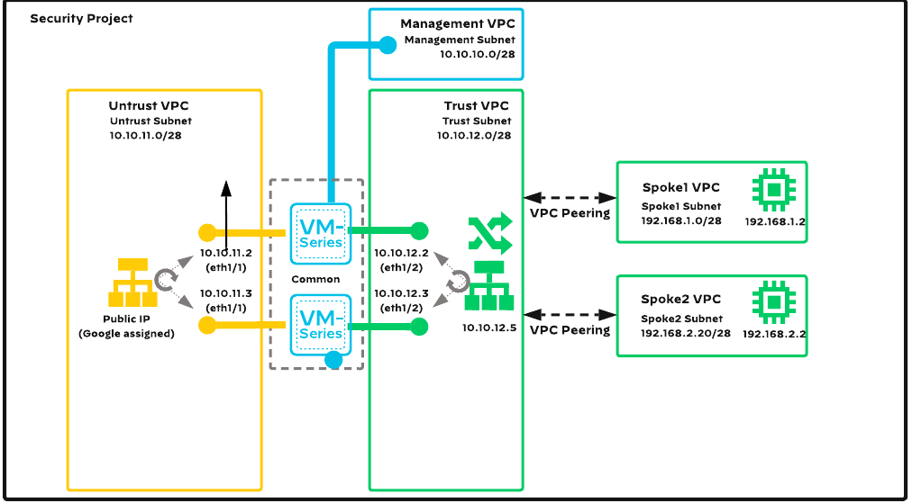

# Reference Architecture with Terraform: VM-Series in GCP, Centralized Architecture, Common NGFW Option

Palo Alto Networks produces several [validated reference architecture design and deployment documentation guides](https://www.paloaltonetworks.com/resources/reference-architectures), which describe well-architected and tested deployments. When deploying VM-Series in a public cloud, the reference architectures guide users toward the best security outcomes, whilst reducing rollout time and avoiding common integration efforts.
The Terraform code presented here will deploy Palo Alto Networks VM-Series firewalls in GCP based on a centralized design with common VM-Series for all traffic; for a discussion of other options, please see the design guide from [the reference architecture guides](https://www.paloaltonetworks.com/resources/reference-architectures).

[](https://github.com/PaloAltoNetworks/terraform-google-swfw-modules/tree/main/examples/vpc_peering_common) [](https://registry.terraform.io/modules/PaloAltoNetworks/swfw-modules/google/latest/examples/vpc_peering_common)

## Reference Architecture Design


This code implements:
- a _centralized design_, a hub-and-spoke topology with a shared VPC containing VM-Series to inspect all inbound, outbound, east-west, and enterprise traffic
- the _common option_, which routes all traffic flows onto a single set of VM-Series

## Detailed Architecture and Design

### Centralized Design

This design uses a VPC Peering. Application functions are distributed across multiple projects that are connected in a logical hub-and-spoke topology. A security project acts as the hub, providing centralized connectivity and control for multiple application projects. You deploy all VM-Series firewalls within the security project. The spoke projects contain the workloads and necessary services to support the application deployment.
This design model integrates multiple methods to interconnect and control your application project VPC networks with resources in the security project. VPC Peering enables the private VPC network in the security project to peer with, and share routing information to, each application project VPC network. Using Shared VPC, the security project administrators create and share VPC network resources from within the security project to the application projects. The application project administrators can select the network resources and deploy the application workloads.

### Common Option

The common firewall option leverages a single set of VM-Series firewalls. The sole set of firewalls operates as a shared resource and may present scale limitations with all traffic flowing through a single set of firewalls due to the performance degradation that occurs when traffic crosses virtual routers. This option is suitable for proof-of-concepts and smaller scale deployments because the number of firewalls is low. However, the technical integration complexity is high.




The scope of this code is to deploy an example of the [VM-Series Common Firewall Option](https://www.paloaltonetworks.com/apps/pan/public/downloadResource?pagePath=/content/pan/en_US/resources/guides/gcp-architecture-guide#Design%20Model) architecture within a GCP project.

The example makes use of VM-Series full [bootstrap process](https://docs.paloaltonetworks.com/vm-series/10-2/vm-series-deployment/bootstrap-the-vm-series-firewall/bootstrap-the-vm-series-firewall-on-google) using XML templates to properly parametrize the initial Day 0 configuration.

With default variable values the topology consists of :
 - 5 VPC networks :
   - Management VPC
   - Untrust (outside) VPC
   - Trust (inside/security) VPC
   - Spoke-1 VPC
   - Spoke-2 VPC
 - 2 VM-Series firewalls
 - 2 Linux Ubuntu VMs (inside Spoke VPCs - for testing purposes)
 - one internal network loadbalancer (for outbound/east-west traffic)
 - one external regional network loadbalancer (for inbound traffic)

## Prerequisites

The following steps should be followed before deploying the Terraform code presented here.

1. Prepare [VM-Series licenses](https://support.paloaltonetworks.com/)
2. Configure the terraform [google provider](https://registry.terraform.io/providers/hashicorp/google/latest/docs/guides/provider_reference#authentication-configuration)

## Usage

1. Access Google Cloud Shell or any other environment that has access to your GCP project

2. Clone the repository:

```
git clone https://github.com/PaloAltoNetworks/terraform-google-swfw-modules
cd terraform-google-swfw-modules/examples/vpc-peering-common
```

3. Copy the `example.tfvars` to `terraform.tfvars`.

`project`, `ssh_keys` and `source_ranges` should be modified for successful deployment and access to the instance. 

There are also a few variables that have some default values but which should also be changed as per deployment requirements

 - `region`
 - `vmseries.<fw-name>.bootstrap_options`
 - `linux_vms.<vm-name>.linux_disk_size`

1. Apply the terraform code:

```
terraform init
terraform apply 
```

4. Check the output plan and confirm the apply.

5. Check the successful application and outputs of the resulting infrastructure:

```
Apply complete! Resources: 96 added, 0 changed, 0 destroyed. (Number of resources can vary based on how many instances you push through tfvars)

Outputs:

lbs_internal_ips = \{
  "external-lb" = "<EXTERNAL_LB_PUBLIC_IP>"
\}
lbs_internal_ips = \{
  "internal-lb" = "10.10.12.5"
\}
linux_vm_ips = \{
  "spoke1-vm" = "192.168.1.2"
  "spoke2-vm" = "192.168.2.2"
\}
vmseries_private_ips = \{
  "fw-vmseries-01" = \{
    "0" = "10.10.11.2"
    "1" = "10.10.10.2"
    "2" = "10.10.12.2"
  \}
  "fw-vmseries-02" = \{
    "0" = "10.10.11.3"
    "1" = "10.10.10.3"
    "2" = "10.10.12.3"
  \}
\}
vmseries_public_ips = \{
  "fw-vmseries-01" = \{
    "0" = "<UNTRUST_PUBLIC_IP>"
    "1" = "<MGMT_PUBLIC_IP>"
  \}
  "fw-vmseries-02" = \{
    "0" = "<UNTRUST_PUBLIC_IP>"
    "1" = "<MGMT_PUBLIC_IP>"
  \}
\}
```


## Post build

Connect to the VM-Series instance(s) via SSH using your associated private key and check if the bootstrap process if finished successfuly and then set a password :
  - Please allow for up to 10-15 minutes for the bootstrap process to finish
  - The key output you should check for is "Auto-commit Successful"

```
ssh admin@x.x.x.x -i /PATH/TO/YOUR/KEY/id_rsa
Welcome admin.
admin@PA-VM> show system bootstrap status

Bootstrap Phase               Status         Details
===============               ======         =======
Media Detection               Success        Media detected successfully
Media Sanity Check            Success        Media sanity check successful
Parsing of Initial Config     Successful     
Auto-commit                   Successful

admin@PA-VM> configure
Entering configuration mode
[edit]                                                                                                                                                                                  
admin@PA-VM# set mgt-config users admin password
Enter password   : 
Confirm password : 

[edit]                                                                                                                                                                                  
admin@PA-VM# commit
Configuration committed successfully
```

## Check access via web UI

Use a web browser to access `https://<MGMT_PUBLIC_IP>` and login with admin and your previously configured password.

## Change the public Loopback public IP Address

For the VM-Series that are backend instance group members of the public-facing loadbalancer - go to Network -> Interfaces -> Loopback and change the value of `1.1.1.1` with the value from the `EXTERNAL_LB_PUBLIC_IP` from the terraform outputs.

## Check traffic from spoke VMs

The firewalls are bootstrapped with a generic `allow any` policy just for demo purposes along with an outboud SNAT policy to allow Inernet access from spoke VMs.

SSH to one of the spoke VMs using GCP IAP and gcloud command and test connectivity :


```
gcloud compute ssh spoke1-vm
No zone specified. Using zone [us-east1-b] for instance: [spoke1-vm].
External IP address was not found; defaulting to using IAP tunneling.
WARNING: 

To increase the performance of the tunnel, consider installing NumPy. For instructions,
please see https://cloud.google.com/iap/docs/using-tcp-forwarding#increasing_the_tcp_upload_bandwidth

<USERNAME>@spoke1-vm:~$ping 8.8.8.8
<USERNAME>@spoke1-vm:~$ping 192.168.2.2
```

## Reference
<!-- BEGINNING OF PRE-COMMIT-TERRAFORM DOCS HOOK -->
### Requirements

| Name | Version |
|------|---------|
| <a name="requirement_terraform"></a> [terraform](#requirement\_terraform) | >= 1.3, < 2.0 |

### Providers

| Name | Version |
|------|---------|
| <a name="provider_google"></a> [google](#provider\_google) | n/a |
| <a name="provider_local"></a> [local](#provider\_local) | n/a |

### Modules

| Name | Source | Version |
|------|--------|---------|
| <a name="module_bootstrap"></a> [bootstrap](#module\_bootstrap) | ../../modules/bootstrap | n/a |
| <a name="module_iam_service_account"></a> [iam\_service\_account](#module\_iam\_service\_account) | ../../modules/iam_service_account | n/a |
| <a name="module_lb_external"></a> [lb\_external](#module\_lb\_external) | ../../modules/lb_external | n/a |
| <a name="module_lb_internal"></a> [lb\_internal](#module\_lb\_internal) | ../../modules/lb_internal | n/a |
| <a name="module_vmseries"></a> [vmseries](#module\_vmseries) | ../../modules/vmseries | n/a |
| <a name="module_vpc"></a> [vpc](#module\_vpc) | ../../modules/vpc | n/a |
| <a name="module_vpc_peering"></a> [vpc\_peering](#module\_vpc\_peering) | ../../modules/vpc-peering | n/a |

### Resources

| Name | Type |
|------|------|
| [google_compute_instance.linux_vm](https://registry.terraform.io/providers/hashicorp/google/latest/docs/resources/compute_instance) | resource |
| [google_compute_route.this](https://registry.terraform.io/providers/hashicorp/google/latest/docs/resources/compute_route) | resource |
| [local_file.bootstrap_xml](https://registry.terraform.io/providers/hashicorp/local/latest/docs/resources/file) | resource |
| [local_file.init_cfg](https://registry.terraform.io/providers/hashicorp/local/latest/docs/resources/file) | resource |
| [google_compute_image.my_image](https://registry.terraform.io/providers/hashicorp/google/latest/docs/data-sources/compute_image) | data source |

### Inputs

| Name | Description | Type | Default | Required |
|------|-------------|------|---------|:--------:|
| <a name="input_bootstrap_buckets"></a> [bootstrap\_buckets](#input\_bootstrap\_buckets) | A map containing each bootstrap bucket setting.<br /><br />Example of variable deployment:<pre>bootstrap\_buckets = \{<br />  vmseries-bootstrap-bucket-01 = \{<br />    bucket\_name\_prefix  = "bucket-01-"<br />    location            = "us"<br />    service\_account\_key = "sa-vmseries-01"<br />  \}<br />\}</pre>For a full list of available configuration items - please refer to [module documentation](https://github.com/PaloAltoNetworks/terraform-google-swfw-modules/tree/main/modules/bootstrap#Inputs)<br /><br />Multiple keys can be added and will be deployed by the code. | `map(any)` | `\{\}` | no |
| <a name="input_lbs_external"></a> [lbs\_external](#input\_lbs\_external) | A map containing each external loadbalancer setting.<br /><br />Example of variable deployment :<pre>lbs\_external = \{<br />  "external-lb" = \{<br />    name     = "external-lb"<br />    backends = ["fw-vmseries-01", "fw-vmseries-02"]<br />    rules = \{<br />      "all-ports" = \{<br />        ip\_protocol = "L3\_DEFAULT"<br />      \}<br />    \}<br />    http\_health\_check\_port         = "80"<br />    http\_health\_check\_request\_path = "/php/login.php"<br />  \}<br />\}</pre>For a full list of available configuration items - please refer to [module documentation](https://github.com/PaloAltoNetworks/terraform-google-swfw-modules/tree/main/modules/lb_external#inputs)<br /><br />Multiple keys can be added and will be deployed by the code. | `map(any)` | `\{\}` | no |
| <a name="input_lbs_internal"></a> [lbs\_internal](#input\_lbs\_internal) | A map containing each internal loadbalancer setting.<br /><br />Example of variable deployment :<pre>lbs\_internal = \{<br />  "internal-lb" = \{<br />    name              = "internal-lb"<br />    health\_check\_port = "80"<br />    backends          = ["fw-vmseries-01", "fw-vmseries-02"]<br />    ip\_address        = "10.10.12.5"<br />    subnetwork\_key    = "fw-trust-sub"<br />    vpc\_network\_key   = "fw-trust-vpc"<br />  \}<br />\}</pre>For a full list of available configuration items - please refer to [module documentation](https://github.com/PaloAltoNetworks/terraform-google-swfw-modules/tree/main/modules/lb_internal#inputs)<br /><br />Multiple keys can be added and will be deployed by the code. | `map(any)` | `\{\}` | no |
| <a name="input_linux_vms"></a> [linux\_vms](#input\_linux\_vms) | A map containing each Linux VM configuration that will be placed in SPOKE VPCs for testing purposes.<br /><br />Example of varaible deployment:<pre>linux\_vms = \{<br />  spoke1-vm = \{<br />    linux\_machine\_type = "n2-standard-4"<br />    zone               = "us-east1-b"<br />    linux\_disk\_size    = "50" # Modify this value as per deployment requirements<br />    vpc\_network\_key    = "fw-spoke1-vpc"<br />    subnetwork\_key     = "fw-spoke1-sub"<br />    private\_ip         = "192.168.1.2"<br />    scopes = [<br />      "https://www.googleapis.com/auth/compute.readonly",<br />      "https://www.googleapis.com/auth/cloud.useraccounts.readonly",<br />      "https://www.googleapis.com/auth/devstorage.read\_only",<br />      "https://www.googleapis.com/auth/logging.write",<br />      "https://www.googleapis.com/auth/monitoring.write",<br />    ]<br />    service\_account\_key = "sa-linux-01"<br />  \}<br />\}</pre> | `map(any)` | `\{\}` | no |
| <a name="input_name_prefix"></a> [name\_prefix](#input\_name\_prefix) | A string to prefix resource namings. | `string` | `"example-"` | no |
| <a name="input_networks"></a> [networks](#input\_networks) | A map containing each network setting.<br /><br />Example of variable deployment :<pre>networks = \{<br />  fw-mgmt-vpc = \{<br />    vpc\_name = "fw-mgmt-vpc"<br />    create\_network = true<br />    delete\_default\_routes\_on\_create = false<br />    mtu = "1460"<br />    routing\_mode = "REGIONAL"<br />    subnetworks = \{<br />      fw-mgmt-sub = \{<br />        name = "fw-mgmt-sub"<br />        create\_subnetwork = true<br />        ip\_cidr\_range = "10.10.10.0/28"<br />        region = "us-east1"<br />      \}<br />    \}<br />    firewall\_rules = \{<br />      allow-mgmt-ingress = \{<br />        name = "allow-mgmt-vpc"<br />        source\_ranges = ["10.10.10.0/24", "1.1.1.1/32"] # Replace 1.1.1.1/32 with your own souurce IP address for management purposes.<br />        priority = "1000"<br />        allowed\_protocol = "all"<br />        allowed\_ports = []<br />      \}<br />    \}<br />  \}<br />\}</pre>For a full list of available configuration items - please refer to [module documentation](https://github.com/PaloAltoNetworks/terraform-google-swfw-modules/tree/main/modules/vpc#input_networks)<br /><br />Multiple keys can be added and will be deployed by the code. | `any` | n/a | yes |
| <a name="input_project"></a> [project](#input\_project) | The project name to deploy the infrastructure in to. | `string` | `null` | no |
| <a name="input_region"></a> [region](#input\_region) | The region into which to deploy the infrastructure in to. | `string` | `"us-central1"` | no |
| <a name="input_routes"></a> [routes](#input\_routes) | A map containing each route setting. Note that you can only add routes using a next-hop type of internal load-balance rule.<br /><br />Example of variable deployment :<pre>routes = \{<br />  "default-route-trust" = \{<br />    name = "fw-default-trust"<br />    destination\_range = "0.0.0.0/0"<br />    vpc\_network\_key = "fw-trust-vpc"<br />    lb\_internal\_name = "internal-lb"<br />  \}<br />\}</pre>Multiple keys can be added and will be deployed by the code. | `map(any)` | `\{\}` | no |
| <a name="input_service_accounts"></a> [service\_accounts](#input\_service\_accounts) | A map containing each service account setting.<br /><br />Example of variable deployment :<pre>service\_accounts = \{<br />  "sa-vmseries-01" = \{<br />    service\_account\_id = "sa-vmseries-01"<br />    display\_name       = "VM-Series SA"<br />    roles = [<br />      "roles/compute.networkViewer",<br />      "roles/logging.logWriter",<br />      "roles/monitoring.metricWriter",<br />      "roles/monitoring.viewer",<br />      "roles/viewer"<br />    ]<br />  \}<br />\}</pre>For a full list of available configuration items - please refer to [module documentation](https://github.com/PaloAltoNetworks/terraform-google-swfw-modules/tree/main/modules/iam_service_account#Inputs)<br /><br />Multiple keys can be added and will be deployed by the code. | `map(any)` | `\{\}` | no |
| <a name="input_vmseries"></a> [vmseries](#input\_vmseries) | A map containing each individual vmseries setting.<br /><br />Example of variable deployment :<pre>vmseries = \{<br />  "fw-vmseries-01" = \{<br />    name             = "fw-vmseries-01"<br />    zone             = "us-east1-b"<br />    machine\_type     = "n2-standard-4"<br />    min\_cpu\_platform = "Intel Cascade Lake"<br />    tags                 = ["vmseries"]<br />    service\_account\_key  = "sa-vmseries-01"<br />    scopes = [<br />      "https://www.googleapis.com/auth/compute.readonly",<br />      "https://www.googleapis.com/auth/cloud.useraccounts.readonly",<br />      "https://www.googleapis.com/auth/devstorage.read\_only",<br />      "https://www.googleapis.com/auth/logging.write",<br />      "https://www.googleapis.com/auth/monitoring.write",<br />    ]<br />    bootstrap\_bucket\_key = "vmseries-bootstrap-bucket-01"<br />    bootstrap\_options = \{<br />      panorama-server = "1.1.1.1"<br />      dns-primary     = "8.8.8.8"<br />      dns-secondary   = "8.8.4.4"<br />    \}<br />    bootstrap\_template\_map = \{<br />      trust\_gcp\_router\_ip   = "10.10.12.1"<br />      untrust\_gcp\_router\_ip = "10.10.11.1"<br />      private\_network\_cidr  = "192.168.0.0/16"<br />      untrust\_loopback\_ip   = "1.1.1.1/32" #This is placeholder IP - you must replace it on the vmseries config with the LB public IP address after the infrastructure is deployed<br />      trust\_loopback\_ip     = "10.10.12.5/32"<br />    \}<br />    named\_ports = [<br />      \{<br />        name = "http"<br />        port = 80<br />      \},<br />      \{<br />        name = "https"<br />        port = 443<br />      \}<br />    ]<br />    network\_interfaces = [<br />      \{<br />        vpc\_network\_key  = "fw-untrust-vpc"<br />        subnetwork\_key       = "fw-untrust-sub"<br />        private\_ip       = "10.10.11.2"<br />        create\_public\_ip = true<br />      \},<br />      \{<br />        vpc\_network\_key  = "fw-mgmt-vpc"<br />        subnetwork\_key       = "fw-mgmt-sub"<br />        private\_ip       = "10.10.10.2"<br />        create\_public\_ip = true<br />      \},<br />      \{<br />        vpc\_network\_key = "fw-trust-vpc"<br />        subnetwork\_key = "fw-trust-sub"<br />        private\_ip = "10.10.12.2"<br />      \},<br />    ]<br />  \}<br />\}</pre>For a full list of available configuration items - please refer to [module documentation](https://github.com/PaloAltoNetworks/terraform-google-swfw-modules/tree/main/modules/vmseries#inputs)<br /><br />The bootstrap\_template\_map contains variables that will be applied to the bootstrap template. Each firewall Day 0 bootstrap will be parametrised based on these inputs.<br />Multiple keys can be added and will be deployed by the code. | `any` | n/a | yes |
| <a name="input_vmseries_common"></a> [vmseries\_common](#input\_vmseries\_common) | A map containing common vmseries setting.<br /><br />Example of variable deployment :<pre>vmseries\_common = \{<br />  ssh\_keys            = "admin:AAAABBBB..."<br />  vmseries\_image      = "vmseries-flex-byol-1022h2"<br />  machine\_type        = "n2-standard-4"<br />  min\_cpu\_platform    = "Intel Cascade Lake"<br />  service\_account\_key = "sa-vmseries-01"<br />  bootstrap\_options = \{<br />    type                = "dhcp-client"<br />    mgmt-interface-swap = "enable"<br />  \}<br />\}</pre>Bootstrap options can be moved between vmseries individual instance variable (`vmseries`) and this common vmserie variable (`vmseries_common`). | `any` | n/a | yes |
| <a name="input_vpc_peerings"></a> [vpc\_peerings](#input\_vpc\_peerings) | A map containing each VPC peering setting.<br /><br />Example of variable deployment :<pre>vpc\_peerings = \{<br />  "trust-to-spoke1" = \{<br />    local\_network\_key = "fw-trust-vpc"<br />    peer\_network\_key  = "fw-spoke1-vpc"<br /><br />    local\_export\_custom\_routes                = true<br />    local\_import\_custom\_routes                = true<br />    local\_export\_subnet\_routes\_with\_public\_ip = true<br />    local\_import\_subnet\_routes\_with\_public\_ip = true<br /><br />    peer\_export\_custom\_routes                = true<br />    peer\_import\_custom\_routes                = true<br />    peer\_export\_subnet\_routes\_with\_public\_ip = true<br />    peer\_import\_subnet\_routes\_with\_public\_ip = true<br />  \}<br />\}</pre>For a full list of available configuration items - please refer to [module documentation](https://github.com/PaloAltoNetworks/terraform-google-swfw-modules/tree/main/modules/vpc-peering#inputs)<br /><br />Multiple keys can be added and will be deployed by the code. | `map(any)` | `\{\}` | no |

### Outputs

| Name | Description |
|------|-------------|
| <a name="output_lbs_external_ips"></a> [lbs\_external\_ips](#output\_lbs\_external\_ips) | Public IP addresses of external network loadbalancers. |
| <a name="output_lbs_internal_ips"></a> [lbs\_internal\_ips](#output\_lbs\_internal\_ips) | Private IP addresses of internal network loadbalancers. |
| <a name="output_linux_vm_ips"></a> [linux\_vm\_ips](#output\_linux\_vm\_ips) | Private IP addresses of Linux VMs. |
| <a name="output_vmseries_private_ips"></a> [vmseries\_private\_ips](#output\_vmseries\_private\_ips) | Private IP addresses of the vmseries instances. |
| <a name="output_vmseries_public_ips"></a> [vmseries\_public\_ips](#output\_vmseries\_public\_ips) | Public IP addresses of the vmseries instances. |
<!-- END OF PRE-COMMIT-TERRAFORM DOCS HOOK -->