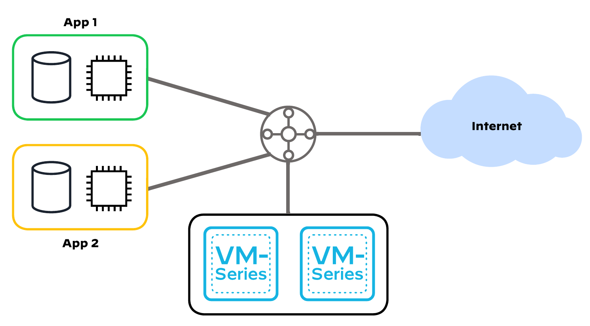
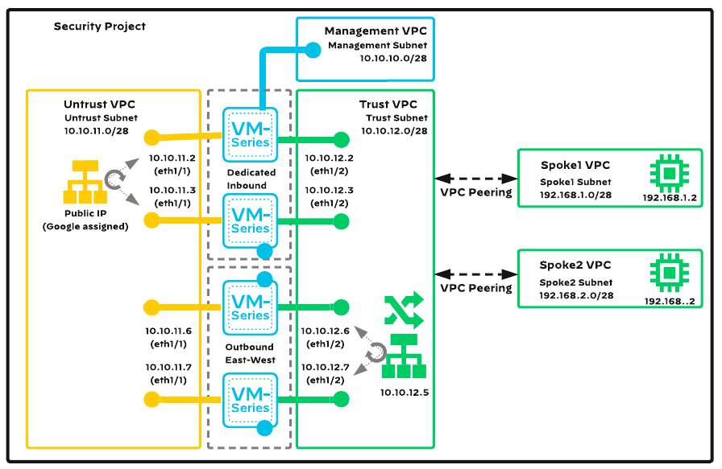

# Reference Architecture with Terraform: VM-Series in GCP, Centralized Architecture, Dedicated Inbound NGFW Option

Palo Alto Networks produces several [validated reference architecture design and deployment documentation guides](https://www.paloaltonetworks.com/resources/reference-architectures), which describe well-architected and tested deployments. When deploying VM-Series in a public cloud, the reference architectures guide users toward the best security outcomes, whilst reducing rollout time and avoiding common integration efforts.
The Terraform code presented here will deploy Palo Alto Networks VM-Series firewalls in GCP based on a centralized design with dedicated-inbound VM-Series; for a discussion of other options, please see the design guide from [the reference architecture guides](https://www.paloaltonetworks.com/resources/reference-architectures).

[](https://github.com/PaloAltoNetworks/terraform-google-swfw-modules/tree/main/examples/vpc_peering_dedicated) [](https://registry.terraform.io/modules/PaloAltoNetworks/swfw-modules/google/latest/examples/vpc_peering_dedicated)

## Reference Architecture Design



This code implements:
- a _centralized design_, a hub-and-spoke topology with a shared VPC containing VM-Series to inspect all inbound, outbound, east-west, and enterprise traffic
- the _dedicated inbound option_, which separates inbound traffic flows onto a separate set of VM-Series

## Detailed Architecture and Design

### Centralized Design

This design uses a VPC Peering. Application functions are distributed across multiple projects that are connected in a logical hub-and-spoke topology. A security project acts as the hub, providing centralized connectivity and control for multiple application projects. You deploy all VM-Series firewalls within the security project. The spoke projects contain the workloads and necessary services to support the application deployment.
This design model integrates multiple methods to interconnect and control your application project VPC networks with resources in the security project. VPC Peering enables the private VPC network in the security project to peer with, and share routing information to, each application project VPC network. Using Shared VPC, the security project administrators create and share VPC network resources from within the security project to the application projects. The application project administrators can select the network resources and deploy the application workloads.

### Dedicated Inbound Option

The dedicated inbound option separates traffic flows across two separate sets of VM-Series firewalls. One set of VM-Series firewalls is dedicated to inbound traffic flows, allowing for greater flexibility and scaling of inbound traffic loads. The second set of VM-Series firewalls services all outbound, east-west, and enterprise network traffic flows. This deployment choice offers increased scale and operational resiliency and reduces the chances of high bandwidth use from the inbound traffic flows affecting other traffic flows within the deployment.



With default variable values the topology consists of :
 - 5 VPC networks :
   - Management VPC
   - Untrust (outside) VPC
   - Trust (inside/security) VPC
   - Spoke-1 VPC
   - Spoke-2 VPC
 - 4 VM-Series firewalls
 - 2 Linux Ubuntu VMs (inside Spoke VPCs - for testing purposes)
 - one internal network loadbalancer (for outbound/east-west traffic)
 - one Global HTTP loadbalancer (for inbound traffic)

## Prerequisites

The following steps should be followed before deploying the Terraform code presented here.

1. Prepare [VM-Series licenses](https://support.paloaltonetworks.com/)
2. Configure the terraform [google provider](https://registry.terraform.io/providers/hashicorp/google/latest/docs/guides/provider_reference#authentication-configuration)

## Build

1. Access Google Cloud Shell or any other environment which has access to your GCP project

2. Clone the repository:

```
git clone https://github.com/PaloAltoNetworks/terraform-google-swfw-modules
cd terraform-google-swfw-modules/examples/vpc-peering-dedicated
```

3. Copy the `example.tfvars` to `terraform.tfvars`.

`project`, `ssh_keys` and `source_ranges` should be modified for successful deployment and access to the instance.

There are also a few variables that have some default values but which should also be changed as per deployment requirements

 - `region`
 - `vmseries.<fw-name>.bootstrap_options`
 - `linux_vms.<vm-name>.linux_disk_size`

4. Apply the terraform code:

```
terraform init
terraform apply -var-file=example.tfvars
```

4. Check the output plan and confirm the apply.

5. Check the successful application and outputs of the resulting infrastructure:

```
Apply complete! Resources: 104 added, 0 changed, 0 destroyed. (Number of resources can vary based on how many instances you push through tfvars)

Outputs:

lbs_global_http = {
  "global-http" = "<GLOBAL_HTTP_LB_PUBLIC_IP>"
}
lbs_internal_ips = {
  "internal-lb" = "10.10.12.5"
}
linux_vm_ips = {
  "spoke1-vm" = "192.168.1.2"
  "spoke2-vm" = "192.168.2.2"
}
vmseries_private_ips = {
  "fw-vmseries-01" = {
    "0" = "10.10.11.2"
    "1" = "10.10.10.2"
    "2" = "10.10.12.2"
  }
  "fw-vmseries-02" = {
    "0" = "10.10.11.3"
    "1" = "10.10.10.3"
    "2" = "10.10.12.3"
  }
  "fw-vmseries-03" = {
    "0" = "10.10.11.6"
    "1" = "10.10.10.6"
    "2" = "10.10.12.6"
  }
  "fw-vmseries-04" = {
    "0" = "10.10.11.7"
    "1" = "10.10.10.7"
    "2" = "10.10.12.7"
  }
}
vmseries_public_ips = {
  "fw-vmseries-01" = {
    "0" = "<UNTRUST_PUBLIC_IP>"
    "1" = "<MGMT_PUBLIC_IP>"
  }
  "fw-vmseries-02" = {
    "0" = "<UNTRUST_PUBLIC_IP>"
    "1" = "<MGMT_PUBLIC_IP>"
  }
  "fw-vmseries-03" = {
    "0" = "<UNTRUST_PUBLIC_IP>"
    "1" = "<MGMT_PUBLIC_IP>"
  }
  "fw-vmseries-04" = {
    "0" = "<UNTRUST_PUBLIC_IP>"
    "1" = "<MGMT_PUBLIC_IP>"
  }
}
```

## Post build

Connect to the VM-Series instance(s) via SSH using your associated private key and check if the bootstrap process if finished successfuly and then set a password :
  - Please allow for up to 10-15 minutes for the bootstrap process to finish
  - The key output you should check for is "Auto-commit Successful"

```
ssh admin@x.x.x.x -i /PATH/TO/YOUR/KEY/id_rsa
Welcome admin.
admin@PA-VM> show system bootstrap status

Bootstrap Phase               Status         Details
===============               ======         =======
Media Detection               Success        Media detected successfully
Media Sanity Check            Success        Media sanity check successful
Parsing of Initial Config     Successful     
Auto-commit                   Successful

admin@PA-VM> configure
Entering configuration mode
[edit]                                                                                                                                                                                  
admin@PA-VM# set mgt-config users admin password
Enter password   :
Confirm password :

[edit]                                                                                                                                                                                  
admin@PA-VM# commit
Configuration committed successfully
```

## Check access via web UI

Use a web browser to access `https://<MGMT_PUBLIC_IP>` and login with admin and your previously configured password.

## Check traffic from spoke VMs

The firewalls are bootstrapped with a generic `allow any` policy just for demo purposes along with an outboud SNAT policy to allow Inernet access from spoke VMs.

SSH to one of the spoke VMs using GCP IAP and gcloud command and test connectivity :

```
gcloud compute ssh spoke1-vm
No zone specified. Using zone [us-east1-b] for instance: [spoke1-vm].
External IP address was not found; defaulting to using IAP tunneling.
WARNING:

To increase the performance of the tunnel, consider installing NumPy. For instructions,
please see https://cloud.google.com/iap/docs/using-tcp-forwarding#increasing_the_tcp_upload_bandwidth

<USERNAME>@spoke1-vm:~$ping 8.8.8.8
<USERNAME>@spoke1-vm:~$ping 192.168.2.2
```

## Global HTTP Loadbalancer

The GCP Global HTTP LB acts as a proxy and sends traffic to the VM-Series `Untrust` interfaces. In order to properly route traffic - configure a DNAT + SNAT Policy on the dedicated inbound firewall pair to send traffic towards a VM inside your network (SNAT is also required to properly route return traffic back to the proper firewall).

## Reference

### Requirements

- `terraform`, version: >= 1.3, < 2.0

### Providers

- `local`
- `google`

### Modules
Name | Version | Source | Description
--- | --- | --- | ---
`iam_service_account` | - | ../../modules/iam_service_account | 
`bootstrap` | - | ../../modules/bootstrap | 
`vpc` | - | ../../modules/vpc | 
`vpc_peering` | - | ../../modules/vpc-peering | 
`vmseries` | - | ../../modules/vmseries | 
`lb_internal` | - | ../../modules/lb_internal | 
`glb` | - | ../../modules/lb_http_ext_global | 

### Resources

- `compute_instance` (managed)
- `compute_route` (managed)
- `file` (managed)
- `sensitive_file` (managed)
- `compute_image` (data)

### Required Inputs

Name | Type | Description
--- | --- | ---
[`networks`](#networks) | `any` | A map containing each network setting.

### Optional Inputs

Name | Type | Description
--- | --- | ---
[`project`](#project) | `string` | The project name to deploy the infrastructure in to.
[`region`](#region) | `string` | The region into which to deploy the infrastructure in to.
[`name_prefix`](#name_prefix) | `string` | A string to prefix resource namings.
[`service_accounts`](#service_accounts) | `map` | A map containing each service account setting.
[`bootstrap_buckets`](#bootstrap_buckets) | `map` | A map containing each bootstrap bucket setting.
[`vpc_peerings`](#vpc_peerings) | `map` | A map containing each VPC peering setting.
[`routes`](#routes) | `map` | A map containing each route setting.
[`vmseries_common`](#vmseries_common) | `object` | A map containing common vmseries settings.
[`vmseries`](#vmseries) | `map` | A map containing each individual vmseries setting.
[`lbs_internal`](#lbs_internal) | `map` | A map containing each internal loadbalancer setting.
[`lbs_global_http`](#lbs_global_http) | `map` | A map containing each Global HTTP loadbalancer setting.
[`linux_vms`](#linux_vms) | `map` | A map containing each Linux VM configuration that will be placed in SPOKE VPCs for testing purposes.

### Outputs

Name |  Description
--- | ---
`vmseries_private_ips` | Private IP addresses of the vmseries instances.
`vmseries_public_ips` | Public IP addresses of the vmseries instances.
`lbs_internal_ips` | Private IP addresses of internal network loadbalancers.
`lbs_global_http` | Public IP addresses of external Global HTTP(S) loadbalancers.
`linux_vm_ips` | Private IP addresses of Linux VMs.

### Required Inputs details

#### networks

A map containing each network setting.

Example of variable deployment :

```
networks = {
  fw-mgmt-vpc = {
    vpc_name = "fw-mgmt-vpc"
    create_network = true
    delete_default_routes_on_create = false
    mtu = "1460"
    routing_mode = "REGIONAL"
    subnetworks = {
      fw-mgmt-sub = {
        name = "fw-mgmt-sub"
        create_subnetwork = true
        ip_cidr_range = "10.10.10.0/28"
        region = "us-east1"
      }
    }
    firewall_rules = {
      allow-mgmt-ingress = {
        name = "allow-mgmt-ingress"
        source_ranges = ["10.10.10.0/24"]
        priority = "1000"
        allowed_protocol = "all"
        allowed_ports = []
      }
    }
  }
}
```

For a full list of available configuration items - please refer to [module documentation](https://github.com/PaloAltoNetworks/terraform-google-swfw-modules/tree/main/modules/vpc#input_networks)

Multiple keys can be added and will be deployed by the code.


Type: any

<sup>[back to list](#modules-required-inputs)</sup>

### Optional Inputs details

#### project

The project name to deploy the infrastructure in to.

Type: string

Default value: `&{}`

<sup>[back to list](#modules-optional-inputs)</sup>

#### region

The region into which to deploy the infrastructure in to.

Type: string

Default value: `us-central1`

<sup>[back to list](#modules-optional-inputs)</sup>

#### name_prefix

A string to prefix resource namings.

Type: string

Default value: `example-`

<sup>[back to list](#modules-optional-inputs)</sup>

#### service_accounts

A map containing each service account setting.

Example of variable deployment :
  ```
service_accounts = {
  "sa-vmseries-01" = {
    service_account_id = "sa-vmseries-01"
    display_name       = "VM-Series SA"
    roles = [
      "roles/compute.networkViewer",
      "roles/logging.logWriter",
      "roles/monitoring.metricWriter",
      "roles/monitoring.viewer",
      "roles/viewer"
    ]
  }
}
```
For a full list of available configuration items - please refer to [module documentation](https://github.com/PaloAltoNetworks/terraform-google-swfw-modules/tree/main/modules/iam_service_account#Inputs)

Multiple keys can be added and will be deployed by the code.


Type: map(any)

Default value: `map[]`

<sup>[back to list](#modules-optional-inputs)</sup>

#### bootstrap_buckets

A map containing each bootstrap bucket setting.

Example of variable deployment:

```
bootstrap_buckets = {
  vmseries-bootstrap-bucket-01 = {
    bucket_name_prefix  = "bucket-01-"
    location            = "us"
    service_account_key = "sa-vmseries-01"
  }
}
```

For a full list of available configuration items - please refer to [module documentation](https://github.com/PaloAltoNetworks/terraform-google-swfw-modules/tree/main/modules/bootstrap#Inputs)

Multiple keys can be added and will be deployed by the code.


Type: map(any)

Default value: `map[]`

<sup>[back to list](#modules-optional-inputs)</sup>

#### vpc_peerings

A map containing each VPC peering setting.

Example of variable deployment :

```
vpc_peerings = {
  "trust-to-spoke1" = {
    local_network_key = "fw-trust-vpc"
    peer_network_key  = "fw-spoke1-vpc"

    local_export_custom_routes                = true
    local_import_custom_routes                = true
    local_export_subnet_routes_with_public_ip = true
    local_import_subnet_routes_with_public_ip = true

    peer_export_custom_routes                = true
    peer_import_custom_routes                = true
    peer_export_subnet_routes_with_public_ip = true
    peer_import_subnet_routes_with_public_ip = true
  }
}
```
For a full list of available configuration items - please refer to [module documentation](https://github.com/PaloAltoNetworks/terraform-google-swfw-modules/tree/main/modules/vpc-peering#inputs)

Multiple keys can be added and will be deployed by the code.


Type: map(any)

Default value: `map[]`

<sup>[back to list](#modules-optional-inputs)</sup>

#### routes

A map containing each route setting. Note that you can only add routes using a next-hop type of internal load-balance rule.

Example of variable deployment :

```
routes = {
  "default-route-trust" = {
    name = "fw-default-trust"
    destination_range = "0.0.0.0/0"
    vpc_network_key = "fw-trust-vpc"
    lb_internal_name = "internal-lb"
  }
}
```

Multiple keys can be added and will be deployed by the code.


Type: map(any)

Default value: `map[]`

<sup>[back to list](#modules-optional-inputs)</sup>

#### vmseries_common

A map containing common vmseries settings.

Example of variable deployment :

```
vmseries_common = {
  ssh_keys            = "admin:AAABBB..."
  vmseries_image      = "vmseries-flex-byol-10210h9"
  machine_type        = "n2-standard-4"
  min_cpu_platform    = "Intel Cascade Lake"
  service_account_key = "sa-vmseries-01"
  bootstrap_options = {
    type                = "dhcp-client"
    mgmt-interface-swap = "enable"
  }
}
``` 

Majority of settings can be moved between this common and individual instance (ie. `var.vmseries`) variables. If values for the same item are specified in both of them, one from the latter will take precedence.


Type: 

```hcl
object({
    ssh_keys            = optional(string)
    vmseries_image      = optional(string)
    machine_type        = optional(string)
    min_cpu_platform    = optional(string)
    tags                = optional(list(string))
    service_account_key = optional(string)
    scopes              = optional(list(string))
    bootstrap_options = optional(object({
      type                                  = optional(string)
      mgmt-interface-swap                   = optional(string)
      plugin-op-commands                    = optional(string)
      panorama-server                       = optional(string)
      auth-key                              = optional(string)
      dgname                                = optional(string)
      tplname                               = optional(string)
      dhcp-send-hostname                    = optional(string)
      dhcp-send-client-id                   = optional(string)
      dhcp-accept-server-hostname           = optional(string)
      dhcp-accept-server-domain             = optional(string)
      authcodes                             = optional(string)
      vm-series-auto-registration-pin-id    = optional(string)
      vm-series-auto-registration-pin-value = optional(string)
    }))
  })
```


Default value: `map[]`

<sup>[back to list](#modules-optional-inputs)</sup>

#### vmseries

A map containing each individual vmseries setting.

Example of variable deployment :

```
vmseries = {
  "fw-vmseries-01" = {
    name             = "fw-vmseries-01"
    zone             = "us-east1-b"
    machine_type     = "n2-standard-4"
    min_cpu_platform = "Intel Cascade Lake"
    tags                 = ["vmseries"]
    service_account_key  = "sa-vmseries-01"
    scopes = [
      "https://www.googleapis.com/auth/compute.readonly",
      "https://www.googleapis.com/auth/cloud.useraccounts.readonly",
      "https://www.googleapis.com/auth/devstorage.read_only",
      "https://www.googleapis.com/auth/logging.write",
      "https://www.googleapis.com/auth/monitoring",
    ]
    bootstrap_bucket_key = "vmseries-bootstrap-bucket-01"
    bootstrap_options = {
      panorama-server = "1.1.1.1"
      dns-primary     = "8.8.8.8"
      dns-secondary   = "8.8.4.4"
    }
    bootstrap_template_map = {
      trust_gcp_router_ip   = "10.10.12.1"
      untrust_gcp_router_ip = "10.10.11.1"
      private_network_cidr  = "192.168.0.0/16"
      untrust_loopback_ip   = "1.1.1.1/32" #This is placeholder IP - you must replace it on the vmseries config with the LB public IP address after the infrastructure is deployed
      trust_loopback_ip     = "10.10.12.5/32"
    }
    named_ports = [
      {
        name = "http"
        port = 80
      },
      {
        name = "https"
        port = 443
      }
    ]
    network_interfaces = [
      {
        vpc_network_key  = "fw-untrust-vpc"
        subnetwork_key       = "fw-untrust-sub"
        private_ip       = "10.10.11.2"
        create_public_ip = true
      },
      {
        vpc_network_key  = "fw-mgmt-vpc"
        subnetwork_key       = "fw-mgmt-sub"
        private_ip       = "10.10.10.2"
        create_public_ip = true
      },
      {
        vpc_network_key = "fw-trust-vpc"
        subnetwork_key = "fw-trust-sub"
        private_ip = "10.10.12.2"
      },
    ]
  }
}
```
For a full list of available configuration items - please refer to [module documentation](https://github.com/PaloAltoNetworks/terraform-google-swfw-modules/tree/main/modules/vmseries#inputs)

The bootstrap_template_map contains variables that will be applied to the bootstrap template. Each firewall Day 0 bootstrap will be parametrised based on these inputs.
Multiple keys can be added and will be deployed by the code.


Type: 

```hcl
map(object({
    name = string
    zone = string
    network_interfaces = optional(list(object({
      vpc_network_key  = string
      subnetwork_key   = string
      private_ip       = string
      create_public_ip = optional(bool, false)
      public_ip        = optional(string)
    })))
    ssh_keys            = optional(string)
    vmseries_image      = optional(string)
    machine_type        = optional(string)
    min_cpu_platform    = optional(string)
    tags                = optional(list(string))
    service_account_key = optional(string)
    service_account     = optional(string)
    scopes              = optional(list(string))
    bootstrap_options = optional(object({
      type                                  = optional(string)
      mgmt-interface-swap                   = optional(string)
      plugin-op-commands                    = optional(string)
      panorama-server                       = optional(string)
      auth-key                              = optional(string)
      dgname                                = optional(string)
      tplname                               = optional(string)
      dhcp-send-hostname                    = optional(string)
      dhcp-send-client-id                   = optional(string)
      dhcp-accept-server-hostname           = optional(string)
      dhcp-accept-server-domain             = optional(string)
      authcodes                             = optional(string)
      vm-series-auto-registration-pin-id    = optional(string)
      vm-series-auto-registration-pin-value = optional(string)
    }))
  }))
```


Default value: `map[]`

<sup>[back to list](#modules-optional-inputs)</sup>

#### lbs_internal

A map containing each internal loadbalancer setting.

Example of variable deployment :

```
lbs_internal = {
  "internal-lb" = {
    name              = "internal-lb"
    health_check_port = "80"
    backends          = ["fw-vmseries-01", "fw-vmseries-02"]
    ip_address        = "10.10.12.5"
    subnetwork_key    = "fw-trust-sub"
    vpc_network_key   = "fw-trust-vpc"
  }
}
```
For a full list of available configuration items - please refer to [module documentation](https://github.com/PaloAltoNetworks/terraform-google-swfw-modules/tree/main/modules/lb_internal#inputs)

Multiple keys can be added and will be deployed by the code.


Type: map(any)

Default value: `map[]`

<sup>[back to list](#modules-optional-inputs)</sup>

#### lbs_global_http

A map containing each Global HTTP loadbalancer setting.

Example of variable deployment:

```
lbs_global_http = {
  "global-http" = {
    name                  = "global-http"
    backends              = ["fw-vmseries-01", "fw-vmseries-02"]
    max_rate_per_instance = 5000
    backend_port_name     = "http"
    backend_protocol      = "HTTP"
    health_check_port     = 80
  }
}
```
For a full list of available configuration items - please refer to [module documentation](https://github.com/PaloAltoNetworks/terraform-google-swfw-modules/tree/main/modules/lb_http_ext_global#inputs)

Multiple keys can be added and will be deployed by the code.


Type: map(any)

Default value: `map[]`

<sup>[back to list](#modules-optional-inputs)</sup>

#### linux_vms

A map containing each Linux VM configuration that will be placed in SPOKE VPCs for testing purposes.

Example of variable deployment:

```
linux_vms = {
  spoke1-vm = {
    linux_machine_type = "n2-standard-4"
    zone               = "us-east1-b"
    linux_disk_size    = "50" # Modify this value as per deployment requirements
    subnetwork         = "spoke1-sub"
    private_ip         = "192.168.1.2"
    scopes = [
      "https://www.googleapis.com/auth/compute.readonly",
      "https://www.googleapis.com/auth/cloud.useraccounts.readonly",
      "https://www.googleapis.com/auth/devstorage.read_only",
      "https://www.googleapis.com/auth/logging.write",
      "https://www.googleapis.com/auth/monitoring",
    ]
    service_account_key = "sa-linux-01"
  }
}
```


Type: map(any)

Default value: `map[]`

<sup>[back to list](#modules-optional-inputs)</sup>