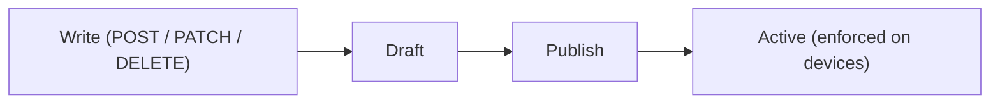

Prisma Browser policy is **versioned configuration**. Your changes do not go live the moment you make them. Instead, every change lands in a **draft**, and you make the draft live by **publishing** it, which creates a new **active** version. This is the single most important concept for writing automation safely.

If you have used "staging then deploy", or git "working copy then commit", this will feel familiar:

| Prisma Browser | git analogy |
|---|---|
| draft | working copy (uncommitted edits) |
| publish | commit |
| active version | the committed, live revision |

**On this page:** the two versions, writes always target the draft, publishing, check pending changes, typical write flow, example, verify changes before publishing, common pitfalls.

---

## The two versions

Every configuration entity (policy rules, sections, controls) has two states you work with day to day, selected with the `configurationVersion` query parameter on `GET` requests:

| `configurationVersion` | Reads |
|---|---|
| `draft` (default) | Your pending, unpublished edits |
| `active` | The live configuration enforced on devices |

```bash
# Read pending edits (default)
curl -sS "$PB_API_BASE/policy/security/rules/$RULE_ID" -H "Authorization: Bearer $PB_TOKEN"

# Read what is actually live
curl -sS "$PB_API_BASE/policy/security/rules/$RULE_ID?configurationVersion=active" \
  -H "Authorization: Bearer $PB_TOKEN"
```

:::caution[Reading a past version is not supported]
The parameter's schema also accepts a version number (`73`) or a version ID (`0CV...`), but **previous versions do not retain their configuration**, so these values do not return the configuration as it was at that version. Do not build automation on them. Use `active` to read what is live, and `GET /configuration-management/draft/pending-changes` to see what is staged.

To keep a record of past configuration, export it yourself after each publish.
:::

---

## Writes always target the draft

**All mutations (`POST`, `PATCH`, `PUT`, `DELETE`) act on the draft only.** They do not accept a `configurationVersion`; if you send one, it is ignored. There is no way to write directly to the active configuration. This means you can stage as many changes as you like, review them, and only then make them live in one atomic publish.



---

## Publishing

Two separate endpoints publish the draft:

```
POST /seb-api/v1/configuration-management/draft/publish
POST /seb-api/v1/configuration-management/draft/partial-publish
```

**Full publish** promotes every change currently in the draft at once. It takes a `description` and nothing else; there is no way to narrow its scope.

**Partial publish** promotes only the objects you name in `entityIds`. The rest of the draft stays pending.

:::caution
**Partial publish is not in the public API yet.** The endpoint is implemented but gated per tenant, so it is absent from the published API reference. Confirm it is enabled on your tenant before relying on it.
:::

:::note
**Non-policy objects only.** Partial publish supports user groups, application groups, applications, device groups, and tags. Naming a rule (`0RL`) or a section (`0SR`) returns `501 PARTIAL_PUBLISH_POLICY_UNSUPPORTED`. Publish policy changes with a full publish.
:::

### Full publish

```bash
curl -sS -X POST "$PB_API_BASE/configuration-management/draft/publish" \
  -H "Authorization: Bearer $PB_TOKEN" \
  -H "Content-Type: application/json" \
  -d '{"description": "CHG-00123: block developer tools on extensions"}'
```

A `201` means a new active version was created and everything staged in the draft is now live.

### Partial publish

```bash
curl -sS -X POST "$PB_API_BASE/configuration-management/draft/partial-publish" \
  -H "Authorization: Bearer $PB_TOKEN" \
  -H "Content-Type: application/json" \
  -d '{
        "entityIds": [ "0UG01PILOTXXXXXXXXXXXXXXXXXXX" ],
        "description": "CHG-00124: add pilot user group"
      }'
```

Response (`201`):

```json
{
  "configurationVersion": { "id": "0CV01EXAMPLEXXXXXXXXXXXXXXXXX", "number": 74 },
  "publishedEntityIds": [ "0UG01PILOTXXXXXXXXXXXXXXXXXXX" ]
}
```

`entityIds` takes 1 to 1000 unique IDs, each a 29-character prefixed ID whose prefix determines the object type, so no type parameter is needed. A body that carries only `description` is rejected with `400`. The publish is atomic: if any named ID is rejected, nothing is published and the draft is left unchanged.

:::note
Always include a `description` that references your internal ticket or change-request ID (for example `"CHG-00124: add pilot user group"`). This populates the version history with a searchable label and provides an audit trail for compliance reviews. Where no ticket reference exists, use a stable identifier for the automation and its run, for example `"Identity sync job 2026-08-06T02:00Z"`.
:::

### Full publish responses

| HTTP | Meaning | What to do |
|---|---|---|
| 201 | A new active version was created | Done. Your changes are live. |
| 409 | The draft has no changes | Nothing to publish; usually safe to ignore |
| 403 | Service account lacks write permission | Use a Super User account |
| 501 | Draft mode is not supported for this tenant | Contact your account team |

### Partial publish responses

A `201` returns the new version and the IDs that went live, as shown above. Errors share one envelope. Where present, `details[]` identifies the offending items, and `field` gives the position in the request, for example `entityIds[2]`:

```json
{
  "error": {
    "code": "NOT_FOUND",
    "message": "No pending change found for one or more of the specified entities.",
    "timestamp": "2026-08-06T09:15:00Z",
    "details": []
  }
}
```

| HTTP | `code` | Condition | What to do |
|---|---|---|---|
| 400 | `VALIDATION_ERROR` | An ID is malformed or duplicated, the list is empty or exceeds 1000 items, or the body carries only `description` | Correct the request. This is a defect in the caller; do not retry unchanged |
| 403 | `FORBIDDEN` | The service account cannot publish configuration changes | Use a Super User account |
| 404 | `NOT_FOUND` | A valid, supported ID has no pending change in the draft. `details[]` lists every affected ID | Usually the write made no material change, or the object was already published. Do not retry unchanged |
| 409 | `CONFLICT` | A named object depends on an unpublished change you did not include. `details[].ids` lists the blockers | Include the blocking IDs and retry, or escalate. Reports the first conflict found |
| 500 | `INTERNAL_ERROR` | Unexpected server-side failure | Retry with bounded exponential backoff. Nothing was published |
| 501 | `PARTIAL_PUBLISH_POLICY_UNSUPPORTED` | The request named a rule or section | Publish policy objects with a full publish |
| 501 | `UNSUPPORTED_OPERATION` | The request named an unsupported object type, or partial publish is not enabled for the tenant | Use a full publish |

Two of these deserve explicit handling in automation:

- **`404` after an apparently successful write.** A `PUT` that changes nothing, such as adding a user who is already a member, stages no pending change for the publish to promote. Decide whether your automation treats this as success or as an exception.
- **`409` from an unpublished dependency.** When an administrator has an unpublished rule that references the object you are publishing, both must be published together. This most often appears when deleting an object a rule still uses. Escalation is usually more appropriate than an automated retry.

---

## Check pending changes

The draft is shared per tenant. Before publishing, confirm exactly what changes are staged so nothing unexpected goes live.

```
GET /seb-api/v1/configuration-management/draft/pending-changes
```

```bash
curl -sS "$PB_API_BASE/configuration-management/draft/pending-changes" \
  -H "Authorization: Bearer $PB_TOKEN"
```

Response (`200`):

```json
{
  "pageInfo": { "hasNextPage": false, "cursor": "", "totalCount": 1 },
  "data": [
    {
      "entityId": "0UG01PILOTXXXXXXXXXXXXXXXXXXX",
      "entityType": "userGroup",
      "name": "Pilot - DevTools block",
      "operation": "created",
      "lastUpdatedBy": "0UR01EXAMPLEADMINXXXXXXXXXXXX"
    }
    // ... more pending changes
  ]
}
```

Each item in the `data` array describes one pending change:

| Field | Type | Description |
|---|---|---|
| `entityId` | string | ID of the changed entity |
| `entityType` | string | Type of the entity: `securityRule`, `userGroup`, `applicationGroup`, `customApplication`, and so on |
| `name` | string | Name of the entity (for deleted entities, the name it had before deletion) |
| `operation` | string | `created`, `updated`, or `deleted` |
| `lastUpdatedBy` | string | Who last modified this entity in the draft: an administrator's email or a service-account identifier |

An empty draft returns `200` with an empty `data` array, not `404`. Paginate with `limit` (1-1000, default 100) and `cursor`.

### Publish patterns

**Pattern 1: You know what you changed.** Your script just modified a specific object and you have its ID. Partial publish it directly, naming only that object:

```bash
curl -sS -X POST "$PB_API_BASE/configuration-management/draft/partial-publish" \
  -H "Authorization: Bearer $PB_TOKEN" \
  -H "Content-Type: application/json" \
  -d '{"entityIds": ["0UG01PILOTXXXXXXXXXXXXXXXXXXX"], "description": "CHG-00124: add pilot user group"}'
```

Where one run modifies several objects, collect the IDs and submit them in a single partial publish rather than one call per object.

**Pattern 2: You are not sure what is in the draft.** List pending changes first, review them, then publish everything or a targeted subset:

```bash
# Step 1: see what is staged
curl -sS "$PB_API_BASE/configuration-management/draft/pending-changes" \
  -H "Authorization: Bearer $PB_TOKEN"

# Step 2a: publish the entire draft if all changes look correct
curl -sS -X POST "$PB_API_BASE/configuration-management/draft/publish" \
  -H "Authorization: Bearer $PB_TOKEN" \
  -H "Content-Type: application/json" \
  -d '{"description": "CHG-00124: weekly policy sync"}'

# Step 2b: or publish only the specific objects you want
curl -sS -X POST "$PB_API_BASE/configuration-management/draft/partial-publish" \
  -H "Authorization: Bearer $PB_TOKEN" \
  -H "Content-Type: application/json" \
  -d '{"entityIds": ["0UG01PILOTXXXXXXXXXXXXXXXXXXX"], "description": "CHG-00124: add pilot user group"}'
```

---

## Typical write flow

1. **Read** the current state (draft or active) to know what you are changing.
2. **Write** one or more edits (they accumulate in the draft).
3. **Check** pending changes with `GET /configuration-management/draft/pending-changes` to confirm what will go live.
4. **Publish** with a description referencing your change ticket.

---

## Example: create, verify, and publish

A compact version of the full loop. [Getting started](/prisma-browser/guide/getting-started) runs the same loop end to end with cleanup; this is the concept in three calls.

Create a rule (lands on the draft):

```bash
RULE_ID="$(curl -sS -X POST "$PB_API_BASE/policy/security/rules" \
  -H "Authorization: Bearer $PB_TOKEN" -H "Content-Type: application/json" \
  -d '{"name":"Block developer tools","mode":"active","controls":{"developerToolsForExtensions":{"action":"block"}}}' \
  | python3 -c 'import sys,json; print(json.load(sys.stdin)["id"])')"
```

Verify it exists on the **draft** but not yet on **active** (the second read returns `404` until you publish):

```bash
curl -sS "$PB_API_BASE/policy/security/rules/$RULE_ID" -H "Authorization: Bearer $PB_TOKEN"
curl -sS "$PB_API_BASE/policy/security/rules/$RULE_ID?configurationVersion=active" -H "Authorization: Bearer $PB_TOKEN"
```

Publish to promote the whole draft to a new active version:

```bash
curl -sS -X POST "$PB_API_BASE/configuration-management/draft/publish" \
  -H "Authorization: Bearer $PB_TOKEN" -H "Content-Type: application/json" \
  -d '{"description": "CHG-00123: block developer tools on extensions"}'
```

---

## Verify changes before publishing

Because the draft is shared per tenant, it pays to confirm exactly what is about to go live before promoting it. `GET /configuration-management/draft/pending-changes` gives you the complete list. For a more targeted check on a specific resource, compare the draft and active versions directly:

1. **Stage** your change on the draft (create, update, or delete).
2. **Compare** draft and active by reading the same resource twice: once with `?configurationVersion=draft` and once with `?configurationVersion=active`. This shows exactly what will change for that object, including anything else staged in the shared draft.
3. **Decide.** If the changes match your intent, publish. If the result contains unexpected edits, coordinate before publishing.
4. **Publish** with a description referencing your change ticket.

```python
import os, requests

base = os.environ["PB_API_BASE"]
headers = {"Authorization": f"Bearer {os.environ['PB_TOKEN']}"}

def get_rule(rule_id, version):
    return requests.get(f"{base}/policy/security/rules/{rule_id}",
                        headers=headers, params={"configurationVersion": version}, timeout=30).json()

draft = get_rule(os.environ["RULE_ID"], "draft")
active = get_rule(os.environ["RULE_ID"], "active")
print("changed:", draft != active)   # inspect the difference before publishing
```

:::note
To stage a change without enforcing it immediately, create rules with `"mode": "disabled"`, then enable them in a later publish once you have validated them.
:::

---

## Common pitfalls

- **"I created a rule but it isn't enforced."** You created it on the draft. Publish to make it active.
- **"My GET doesn't show my change."** You probably read `?configurationVersion=active`. Remove it (or use `draft`) to see pending edits.
- **"Publish returned 409."** The draft is identical to active. There was nothing to publish.
- **"I passed a version number and got a response, but it isn't that version's configuration."** Previous versions do not retain their configuration. Only `draft` and `active` return meaningful results.
- **Concurrent editors.** The draft is shared per tenant. If multiple automations (or a human in Strata Cloud Manager) edit at once, a publish promotes everyone's staged changes together. Use `GET /configuration-management/draft/pending-changes` to check what is staged before publishing.

---

## Related

- Concepts: [Delta patch](/prisma-browser/guide/delta-patch)
- Use cases: [Publish a single object (partial publish)](/prisma-browser/guide/automate-with-partial-publish), [Gradual rollout with a user group](/prisma-browser/guide/gradual-rollout-with-user-group)

