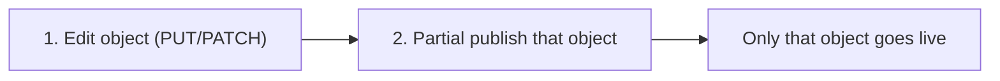

:::caution
**Partial publish is not in the public API yet.** The endpoint is implemented but gated per tenant, so it is absent from the published API reference. Confirm it is enabled on your tenant before relying on it.
:::

When automation changes one object, you usually want to publish only that object, not whatever else happens to be sitting in the shared draft. [Partial publish](/prisma-browser/guide/draft-and-publish#partial-publish) makes this a clean two-call pattern: edit the object, then publish only that object by ID.

**Use this when:**

- A script makes frequent, narrow changes (add a user to a group, add an application) and must not ship unrelated draft edits.
- Multiple processes or an administrator share the tenant draft.

**Prerequisites:** a Super User service account and the environment variables from [Getting started](/prisma-browser/guide/getting-started). Read [Partial publish](/prisma-browser/guide/draft-and-publish#partial-publish) and [Draft and publish](/prisma-browser/guide/draft-and-publish) first.

:::note
**Non-policy objects only.** This phase supports user groups (`0UG`), application groups (`0AG`), applications (`0AP`), device groups (`0DG`), and tags (`0TG`). Naming a rule or section returns `501`. For policy changes, use a normal full publish.
:::

---

## The two-call pattern



### 1. Edit the object

For example, add a user to a group:

```bash
export UG_ID='0UG01TEAMXXXXXXXXXXXXXXXXXXXX'

curl -sS -X PUT "$PB_API_BASE/user-groups/$UG_ID" \
  -H "Authorization: Bearer $PB_TOKEN" \
  -H "Content-Type: application/json" \
  -d '{ "users": [ { "userId": "0UR01NEWXXXXXXXXXXXXXXXXXXXXX", "action": "add" } ] }'
```

Response (`200`):

```json
{ "id": "0UG01TEAMXXXXXXXXXXXXXXXXXXXX", "userGroupId": "0UG01TEAMXXXXXXXXXXXXXXXXXXXX" }
```

The `id` you need for the next call comes back in this response, so no extra lookup is required.

### 2. Publish only that object

```bash
curl -sS -X POST "$PB_API_BASE/configuration-management/draft/partial-publish" \
  -H "Authorization: Bearer $PB_TOKEN" \
  -H "Content-Type: application/json" \
  -d '{ "entityIds": ["'"$UG_ID"'"], "description": "ServiceNow INC0042311: contractor offboarding" }'
```

Response (`201`):

```json
{
  "configurationVersion": { "id": "0CV01EXAMPLEXXXXXXXXXXXXXXXXX", "number": 73 },
  "publishedEntityIds": ["0UG01TEAMXXXXXXXXXXXXXXXXXXXX"]
}
```

Everything else still pending in the draft stays pending. Only the group you named went live.

Creating and deleting objects follow the same pattern: perform the write, then publish the `id` it returned.

:::note
Put the originating ticket, request, or event reference in `description`. It is stored with the configuration version and shown as the change reason in the configuration log, which lets you trace any published change back to what triggered it. Where no ticket reference exists, use a stable identifier for the automation and its run, for example `"Identity sync job 2026-08-06T02:00Z"`.
:::

---

## Publish several objects at once

Where one automation run modifies several objects, collect the IDs and submit them in a single request rather than one call per object. The publish is atomic: all named entities are promoted, or none are.

```bash
curl -sS -X POST "$PB_API_BASE/configuration-management/draft/partial-publish" \
  -H "Authorization: Bearer $PB_TOKEN" \
  -H "Content-Type: application/json" \
  -d '{
        "entityIds": [
          "0UG01TEAMXXXXXXXXXXXXXXXXXXXX",
          "0AG01DESIGNXXXXXXXXXXXXXXXXXX"
        ],
        "description": "ServiceNow INC0042311: contractor offboarding"
      }'
```

`entityIds` takes 1 to 1000 unique IDs. The object type comes from the ID prefix, so no type parameter is needed.

---

## Check what is pending before you publish

To see what your process (or others) have staged, list pending changes:

```bash
curl -sS "$PB_API_BASE/configuration-management/draft/pending-changes" \
  -H "Authorization: Bearer $PB_TOKEN"
```

Response (`200`):

```json
{
  "pageInfo": { "hasNextPage": false, "cursor": "", "totalCount": 1 },
  "data": [
    {
      "entityId": "0UG01TEAMXXXXXXXXXXXXXXXXXXXX",
      "entityType": "userGroup",
      "name": "Team group",
      "lastUpdatedBy": "0UR01EXAMPLEADMINXXXXXXXXXXXX",
      "operation": "updated"
    }
    // ... more pending changes
  ]
}
```

Each row reports `entityId`, `entityType`, `name`, `lastUpdatedBy`, and `operation` (`created` / `updated` / `deleted`). Filter by `lastUpdatedBy` client-side to see only your own edits. An empty draft returns `200` with an empty list.

:::note
In a multi-writer environment, publish by the exact IDs you changed rather than doing a full publish. This is the safest way to avoid shipping a colleague's half-finished edit.
:::

---

## Full script (Python)

```python
import os, requests

base = os.environ["PB_API_BASE"]
headers = {"Authorization": f"Bearer {os.environ['PB_TOKEN']}"}

def edit_and_publish_group(ug_id, add=(), remove=(), reason=None):
    # 1. Edit the object
    users = [{"userId": u, "action": "add"} for u in add] + \
            [{"userId": u, "action": "remove"} for u in remove]
    if users:
        requests.put(f"{base}/user-groups/{ug_id}", headers=headers,
                     json={"users": users}, timeout=30).raise_for_status()

    # 2. Publish only that object
    resp = requests.post(f"{base}/configuration-management/draft/partial-publish", headers=headers,
        json={"entityIds": [ug_id], "description": reason or f"Update {ug_id}"}, timeout=30)
    resp.raise_for_status()
    return resp.json()

result = edit_and_publish_group("0UG01TEAMXXXXXXXXXXXXXXXXXXXX",
                                add=["0UR01NEWXXXXXXXXXXXXXXXXXXXXX"],
                                reason="ServiceNow INC0042311: contractor offboarding")
print("published:", result["publishedEntityIds"], "version:", result["configurationVersion"]["number"])
```

---

## Error cases

Errors share one envelope. Where present, `details[]` identifies the offending items, and `field` gives the position in the request, for example `entityIds[2]`:

```json
{
  "error": {
    "code": "NOT_FOUND",
    "message": "No pending change found for one or more of the specified entities.",
    "timestamp": "2026-08-06T09:15:00Z",
    "details": []
  }
}
```

| HTTP | `code` | Condition | What to do |
|---|---|---|---|
| 400 | `VALIDATION_ERROR` | An ID is malformed or duplicated, the list is empty or exceeds 1000 items, or the body carries only `description` | Correct the request. This is a defect in the caller; do not retry unchanged |
| 403 | `FORBIDDEN` | The service account cannot publish configuration changes | Use a Super User account |
| 404 | `NOT_FOUND` | A valid, supported ID has no pending change in the draft. `details[]` lists every affected ID | Usually the write made no material change, or the object was already published. Do not retry unchanged |
| 409 | `CONFLICT` | A named object depends on an unpublished change you did not include. `details[].ids` lists the blockers | Include the blocking IDs and retry, or escalate. Reports the first conflict found |
| 500 | `INTERNAL_ERROR` | Unexpected server-side failure | Retry with bounded exponential backoff. Nothing was published |
| 501 | `PARTIAL_PUBLISH_POLICY_UNSUPPORTED` | You named a rule or section (`0RL` / `0SR`) | Publish policy changes with a full publish |
| 501 | `UNSUPPORTED_OPERATION` | The entity type is not partially publishable, or partial publish is not enabled for the tenant | Use a full publish |

Two of these deserve explicit handling:

- **`404` after an apparently successful write.** A `PUT` that changes nothing, such as adding a user who is already a member or removing one who is not, stages no pending change for the publish to promote. Decide whether your automation treats this as success or as an exception.
- **`409` from an unpublished dependency.** When an administrator has an unpublished rule that references the object you are publishing, both must be published together. This most often appears when deleting an object a rule still uses. Escalation is usually more appropriate than an automated retry.

---

## Related

- Concepts: [Partial publish](/prisma-browser/guide/draft-and-publish#partial-publish), [Draft and publish](/prisma-browser/guide/draft-and-publish)
- Building blocks: [User groups](/prisma-browser/guide/user-groups), [Application groups](/prisma-browser/guide/application-groups)
- Related use cases: [Gradual rollout with a user group](/prisma-browser/guide/gradual-rollout-with-user-group), [Manage an allow / block list](/prisma-browser/guide/manage-allow-block-list)
