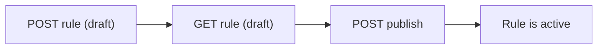

A complete, copy-pasteable walkthrough: authenticate, create a rule on the draft, verify it, then publish it so it goes live. The example creates a security rule, but the same create -> verify -> publish flow applies to every policy type (see [Policy overview](/prisma-browser/guide/rules)). By the end you will have an enforced rule that blocks developer tools on browser extensions for all users.

**Prerequisites:** a Super User service account (writes require it) and the environment variables from [Getting started](/prisma-browser/guide/getting-started): `PB_API_BASE`, `PB_TOKEN`. New here? Read [Authentication](/prisma-browser/guide/authentication) and [Draft and publish](/prisma-browser/guide/draft-and-publish) first.



---

## 1. Create the rule (on the draft)

A security rule needs a `name` and a `mode` (`active` or `disabled`); add a `controls` object with at least one control to make it enforce something. `scope` (who it applies to) is optional, but you should always set it: a rule with no scope applies to everyone. Here we deliberately apply to all users (`scope.users.isAny = true`) and block DevTools on extensions.

The create endpoint:

```
POST /seb-api/v1/policy/security/rules
```

```bash
curl -sS -X POST "$PB_API_BASE/policy/security/rules" \
  -H "Authorization: Bearer $PB_TOKEN" \
  -H "Content-Type: application/json" \
  -d '{
        "name": "Block developer tools on extensions",
        "description": "Prevent inspection of browser extensions via DevTools",
        "mode": "active",
        "scope": { "users": { "isAny": true } },
        "controls": {
          "developerToolsForExtensions": { "action": "block" }
        }
      }'
```

### Response

`201 Created` with the resolved rule: the scope, mode and controls you sent, plus every server-side default filled in, and the new rule's `id`. References come back as IDs rather than enriched with names.

:::note
The rule now exists in the **draft**. It is not enforced yet. Capture the ID for the next steps:
```bash
export RULE_ID='0RLEXAMPLERULEXXXXXXXXXXXXXX'
```
:::

---

## 2. Verify it (read the draft)

Fetch the full rule back from the draft to confirm it looks right. (Reads default to `draft`, so no version parameter is needed.)

```bash
curl -sS "$PB_API_BASE/policy/security/rules/$RULE_ID" \
  -H "Authorization: Bearer $PB_TOKEN"
```

You should see your `name`, `mode: "active"`, and the `developerToolsForExtensions` control set to `block`. The `metadata.configurationVersion.status` will be `draft`.

---

## 3. Publish (make it live)

Promote the draft to a new active version. Add a description so the version history is readable.

```bash
curl -sS -X POST "$PB_API_BASE/configuration-management/draft/publish" \
  -H "Authorization: Bearer $PB_TOKEN" \
  -H "Content-Type: application/json" \
  -d '{"description": "Add: block DevTools on extensions"}'
```

`201` means a new active version was created and your rule is now enforced. If you get `409`, the draft had no changes (did step 1 succeed?). See [Draft and publish](/prisma-browser/guide/draft-and-publish#full-publish-responses) for all publish responses.

---

## 4. Confirm it is live

Read the rule from the **active** version:

```bash
curl -sS "$PB_API_BASE/policy/security/rules/$RULE_ID?configurationVersion=active" \
  -H "Authorization: Bearer $PB_TOKEN"
```

`metadata.configurationVersion.status` should now be `active`.

---

## Full script (Python)

```python
import os, requests

base = os.environ["PB_API_BASE"]
headers = {"Authorization": f"Bearer {os.environ['PB_TOKEN']}"}

# 1. Create on the draft
body = {
    "name": "Block developer tools on extensions",
    "description": "Prevent inspection of browser extensions via DevTools",
    "mode": "active",
    "scope": {"users": {"isAny": True}},
    "controls": {"developerToolsForExtensions": {"action": "block"}},
}
rule_id = requests.post(f"{base}/policy/security/rules", headers=headers, json=body, timeout=30).json()["id"]

# 2. Verify
rule = requests.get(f"{base}/policy/security/rules/{rule_id}", headers=headers, timeout=30).json()
assert rule["controls"]["developerToolsForExtensions"]["action"] == "block"

# 3. Publish
pub = requests.post(
    f"{base}/configuration-management/draft/publish",
    headers=headers,
    json={"description": "Add: block DevTools on extensions"},
    timeout=30,
)
print("publish:", pub.status_code, "rule:", rule_id)
```

---

## Variations

- **Stage without enforcing:** create with `"mode": "disabled"`, or do not publish yet.
- **Scope to specific groups:** replace `scope.users.isAny` with `{"users": {"userGroups": ["0UG..."]}}`.
- **Other controls:** the `controls` object accepts many keys (for example `cast`, `thirdPartyCookies`, `printPreview`), each typically `{"action": "allow" | "block"}` or `{"action": "enable" | "disable"}`.
- **Update later:** use `PATCH /policy/security/rules/{id}` with only the fields to change.

## Cleanup

```bash
curl -sS -X DELETE "$PB_API_BASE/policy/security/rules/$RULE_ID" \
  -H "Authorization: Bearer $PB_TOKEN"
# then publish again to make the deletion live
```

The `DELETE` returns `204` with an empty body.

