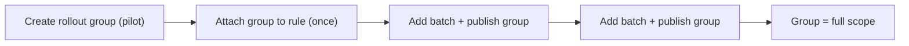

Roll a rule out to more and more people over time without ever editing the rule again. Attach a [local user group](/prisma-browser/guide/user-groups) to the rule once, then expand the group in batches. Each publish widens the rule's reach. When the rollout is complete, the group covers your entire intended scope.

**Use this when:**

- You want to ship a new control to a pilot first, then 10%, then everyone.
- You want the rule to stay fixed while the audience grows on a schedule.

**Prerequisites:** a Super User service account and the environment variables from [Getting started](/prisma-browser/guide/getting-started). Read [User groups](/prisma-browser/guide/user-groups) and [Partial publish](/prisma-browser/guide/draft-and-publish#partial-publish) first.



---

## 1. Create the rollout group with the first batch

Start with the pilot users:

```bash
curl -sS -X POST "$PB_API_BASE/user-groups" \
  -H "Authorization: Bearer $PB_TOKEN" \
  -H "Content-Type: application/json" \
  -d '{ "name": "Rollout - DevTools block", "userIds": ["0UR01PILOT1XXXXXXXXXXXXXXXXXX", "0UR01PILOT2XXXXXXXXXXXXXXXXXX"] }'
```

```json
{ "id": "0UG01ROLLOUTXXXXXXXXXXXXXXXXX" }
```

```bash
export UG_ID='0UG01ROLLOUTXXXXXXXXXXXXXXXXX'
export RULE_ID='0RLEXAMPLERULEXXXXXXXXXXXXXX'
```

---

## 2. Attach the group to the rule (once)

```bash
curl -sS -X PATCH "$PB_API_BASE/policy/security/rules/$RULE_ID" \
  -H "Authorization: Bearer $PB_TOKEN" \
  -H "Content-Type: application/json" \
  -d '{ "scope": { "users": { "addUserGroups": ["'"$UG_ID"'"] } } }'
```

Response (`200`):

```json
{ "id": "0RLEXAMPLERULEXXXXXXXXXXXXXX" }
```

Publish once so the rule is live but scoped only to the pilot:

```bash
curl -sS -X POST "$PB_API_BASE/configuration-management/draft/publish" \
  -H "Authorization: Bearer $PB_TOKEN" \
  -H "Content-Type: application/json" \
  -d '{"description": "DevTools block: pilot"}'
```

Returns `201` (a new active version is created).

:::note
The rule is now fixed. Every later step touches only the group, never the rule.
:::

---

## 3. Expand in batches

Each rollout wave: add the next batch of users to the group, then publish only the group with [partial publish](/prisma-browser/guide/draft-and-publish#partial-publish) so the wave does not carry unrelated draft edits.

```bash
# Add the next wave
curl -sS -X PUT "$PB_API_BASE/user-groups/$UG_ID" \
  -H "Authorization: Bearer $PB_TOKEN" \
  -H "Content-Type: application/json" \
  -d '{ "users": [ { "userId": "0UR01WAVE2AXXXXXXXXXXXXXXXXXX", "action": "add" }, { "userId": "0UR01WAVE2BXXXXXXXXXXXXXXXXXX", "action": "add" } ] }'

# Publish only the group
curl -sS -X POST "$PB_API_BASE/configuration-management/draft/partial-publish" \
  -H "Authorization: Bearer $PB_TOKEN" \
  -H "Content-Type: application/json" \
  -d '{"entityIds": ["'"$UG_ID"'"], "description": "DevTools block: wave 2"}'
```

The `PUT` returns the group ID, and the partial-publish publish returns `201`:

```json
{ "id": "0UG01ROLLOUTXXXXXXXXXXXXXXXXX", "userGroupId": "0UG01ROLLOUTXXXXXXXXXXXXXXXXX" }
```

Repeat on your cadence (hourly, daily) until the group holds everyone in scope.

---

## 4. Converge on one group

At the end of the rollout the single group represents your full intended scope. Keep it as the rule's permanent scope; no migration needed. If you piloted with users directly and a group separately, remove the stragglers and let the group be the sole source of truth.

:::note
If you ever need to pause or roll back a wave, remove that batch from the group and publish the group again. The rule itself never has to change.
:::

---

## Full script (Python)

```python
import os, time, requests

base = os.environ["PB_API_BASE"]
headers = {"Authorization": f"Bearer {os.environ['PB_TOKEN']}"}
rule_id = os.environ["RULE_ID"]

waves = [
    ["0UR01PILOT1XXXXXXXXXXXXXXXXXX", "0UR01PILOT2XXXXXXXXXXXXXXXXXX"],
    ["0UR01WAVE2AXXXXXXXXXXXXXXXXXX", "0UR01WAVE2BXXXXXXXXXXXXXXXXXX"],
    ["0UR01WAVE3AXXXXXXXXXXXXXXXXXX"],
]

# 1. Create the group with the first wave
ug_id = requests.post(f"{base}/user-groups", headers=headers,
    json={"name": "Rollout - DevTools block", "userIds": waves[0]}, timeout=30).json()["id"]

# 2. Attach to the rule once, publish the pilot
requests.patch(f"{base}/policy/security/rules/{rule_id}", headers=headers,
    json={"scope": {"users": {"addUserGroups": [ug_id]}}}, timeout=30).raise_for_status()
requests.post(f"{base}/configuration-management/draft/publish", headers=headers,
    json={"description": "DevTools block: pilot"}, timeout=30)

# 3. Expand wave by wave, publishing only the group
for i, wave in enumerate(waves[1:], start=2):
    requests.put(f"{base}/user-groups/{ug_id}", headers=headers,
        json={"users": [{"userId": u, "action": "add"} for u in wave]}, timeout=30).raise_for_status()
    requests.post(f"{base}/configuration-management/draft/partial-publish", headers=headers,
        json={"entityIds": [ug_id], "description": f"DevTools block: wave {i}"}, timeout=30)
    time.sleep(0)  # replace with your cadence (e.g. one wave per day)
```

---

## Related
- Building blocks: [User groups](/prisma-browser/guide/user-groups), [Rules](/prisma-browser/guide/rules)
- Concepts: [Partial publish](/prisma-browser/guide/draft-and-publish#partial-publish), [Draft and publish](/prisma-browser/guide/draft-and-publish)
- Related use cases: [Add or remove users on a rule](/prisma-browser/guide/manage-users-on-a-rule), [Change a rule's scope](/prisma-browser/guide/change-a-rule-scope)

