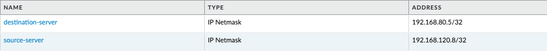
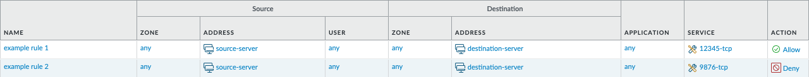

import Assumptions from "../_assumptions.md";
import LabGuidance from "/products/shared/_lab-guidance.md";
import ClosingNotes from "../_closingnotes.md";

# Configuration Tasks

With this playbook, you will create items in a PAN-OS next-generation firewall, in order to perform configuration of PAN-OS "as-code". This is one of the most common use case for Ansible in relation to PAN-OS.

<Assumptions />

<LabGuidance />

## Security policies and address objects

In this tutorial, you will create a number of items related to security policies (firewall rules). This will include address objects, service objects, and the rules themselves. Then you will commit the configuration to make the changes live.

## Create address objects

1. Create a file called `create-address-objects.yml` and paste in the following content:

```yaml
---
- name: Create address objects
  hosts: "firewall"
  connection: local

  vars:
    device:
      ip_address: "{{ ip_address }}"
      username: "{{ username }}"
      password: "{{ password }}"

  collections:
    - paloaltonetworks.panos

  tasks:
    - name: Create source address object
      paloaltonetworks.panos.panos_address_object:
        provider: "{{ device }}"
        name: "source-server"
        value: "192.168.120.8/32"
        description: "Address object 1 from Ansible"

    - name: Create destination address object
      paloaltonetworks.panos.panos_address_object:
        provider: "{{ device }}"
        name: "destination-server"
        value: "192.168.80.5/32"
        description: "Address object 2 from Ansible"
```

2. Execute the playbook with the following command:

```
ansible-playbook -i inventory.txt --ask-vault-pass create-address-objects.yml
```

3. The output should be something similar to this:

```
PLAY [Create address objects] ****************************************************************************************************************************

TASK [Gathering Facts] ***********************************************************************************************************************************
ok: [firewall]

TASK [Create source address object] **********************************************************************************************************************
changed: [firewall]

TASK [Create destination address object] *****************************************************************************************************************
changed: [firewall]

PLAY RECAP ***********************************************************************************************************************************************
firewall                   : ok=3    changed=2    unreachable=0    failed=0    skipped=0    rescued=0    ignored=0
```

4. Login to the PAN-OS GUI and confirm that the two new address objects `source-server` and `destination-server` have been created.



## Create service objects

5. Create a file called `create-service-objects.yml` and paste in the following content:

```yaml
---
- name: Create service objects
  hosts: "firewall"
  connection: local

  vars:
    device:
      ip_address: "{{ ip_address }}"
      username: "{{ username }}"
      password: "{{ password }}"

  collections:
    - paloaltonetworks.panos

  tasks:
    - name: Create service object 'tcp-12345'
      paloaltonetworks.panos.panos_service_object:
        provider: "{{ device }}"
        name: "tcp-12345"
        protocol: "tcp"
        destination_port: "12345"
        description: "Service object 1 from Ansible"

    - name: Create service object 'tcp-9876'
      paloaltonetworks.panos.panos_service_object:
        provider: "{{ device }}"
        name: "tcp-9876"
        protocol: "tcp"
        destination_port: "9876"
        description: "Service object 2 from Ansible"
```

6. Execute the playbook with the following command:

```
ansible-playbook -i inventory.txt --ask-vault-pass create-service-objects.yml
```

7. The output should be something similar to this:

```
PLAY [Create service objects] ****************************************************************************************************************************

TASK [Gathering Facts] ***********************************************************************************************************************************
ok: [firewall]

TASK [Create service object 'tcp-12345'] *****************************************************************************************************************
changed: [firewall]

TASK [Create service object 'tcp-9876'] ******************************************************************************************************************
changed: [firewall]

PLAY RECAP ***********************************************************************************************************************************************
firewall                   : ok=3    changed=2    unreachable=0    failed=0    skipped=0    rescued=0    ignored=0
```

8. Login to the PAN-OS GUI and confirm that the two new address objects `tcp-12345` and `tcp-9876` have been created.


## Create security policies

9. Create a file called `create-security-policies.yml` and paste in the following content:

```yaml
---
- name: Create security policies
  hosts: "firewall"
  connection: local

  vars:
    device:
      ip_address: "{{ ip_address }}"
      username: "{{ username }}"
      password: "{{ password }}"

  collections:
    - paloaltonetworks.panos

  tasks:
    - name: Add example rule 1
      paloaltonetworks.panos.panos_security_rule:
        provider: "{{ device }}"
        rule_name: "example rule 1"
        source_zone: ["any"]
        source_ip: ["source-server"]
        destination_zone: ["any"]
        destination_ip: ["destination-server"]
        application: ["ssh"]
        service: ["tcp-12345"]
        action: "allow"

    - name: Add example rule 2
      paloaltonetworks.panos.panos_security_rule:
        provider: "{{ device }}"
        rule_name: "example rule 2"
        source_zone: ["any"]
        source_ip: ["source-server"]
        destination_zone: ["any"]
        destination_ip: ["destination-server"]
        application: ["ssh"]
        service: ["tcp-9876"]
        action: "deny"
```

10. Execute the playbook with the following command:

```
ansible-playbook -i inventory.txt --ask-vault-pass create-security-policies.yml
```

11. The output should be something similar to this:

```
PLAY [Create security policies] ****************************************************************************************************************************************************

TASK [Gathering Facts] *************************************************************************************************************************************************************
ok: [firewall]

TASK [Add example rule 1] **********************************************************************************************************************************************************
changed: [firewall]

TASK [Add example rule 2] **********************************************************************************************************************************************************
changed: [firewall]

PLAY RECAP *************************************************************************************************************************************************************************
firewall                   : ok=3    changed=2    unreachable=0    failed=0    skipped=0    rescued=0    ignored=0
```

12. Login to the PAN-OS GUI and confirm that the two new address objects `example rule 1` and `example rule 2` have been created.



## Commit the configuration

13. Create a file called `commit-firewall.yml` and paste in the following content:

```yaml
---
- name: Commit firewall candidate configuration
  hosts: "firewall"
  connection: local

  vars:
    device:
      ip_address: "{{ ip_address }}"
      username: "{{ username }}"
      password: "{{ password }}"

  collections:
    - paloaltonetworks.panos

  tasks:
    - name: Commit candidate configuration
      paloaltonetworks.panos.panos_commit_firewall:
        provider: "{{ device }}"
      register: results
    - debug:
        msg: "Commit with Job ID: {{ results.jobid }} had output: {{ results.details }}"
```

14. Execute the playbook with the following command:

```
ansible-playbook -i inventory.txt --ask-vault-pass commit-firewall.yml
```

15. The output should be something similar to this:

```
PLAY [Commit firewall candidate configuration] *************************************************************************************************************************************

TASK [Gathering Facts] *************************************************************************************************************************************************************
ok: [firewall]

TASK [Commit candidate configuration] **********************************************************************************************************************************************
changed: [firewall]

TASK [debug] ***********************************************************************************************************************************************************************
ok: [firewall] => {
    "msg": "Commit with Job ID: 5410 had output: ['Configuration committed successfully']"
}

PLAY RECAP *************************************************************************************************************************************************************************
firewall                   : ok=3    changed=1    unreachable=0    failed=0    skipped=0    rescued=0    ignored=0
```

<ClosingNotes />
