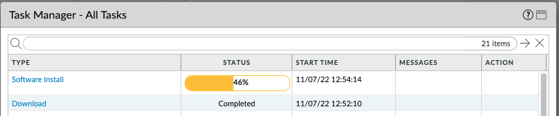

import Assumptions from "../_assumptions.md";
import LabGuidance from "/products/shared/_lab-guidance.md";
import ClosingNotes from "../_closingnotes.md";

# Operations Tasks

With this playbook, you will perform operations on a PAN-OS next-generation firewall. These are common operational tasks that would otherwise need to be performed manually.

<Assumptions />

<LabGuidance />

## The "upgrade firewall" playbook

This playbook upgrades the software on a PAN-OS next-generation firewall. The playbook initiates a download of the new version of software, installs it, reboots the NGFW to make the new version live, and checks to ensure the reboot is complete and the firewall is ready again.

1. Create a file called `upgrade-firewall.yml` and paste in the following content:

```yaml
---
- name: Upgrade firewall
  hosts: "firewall"
  connection: local

  vars:
    device:
      ip_address: "{{ ip_address }}"
      username: "{{ username }}"
      password: "{{ password }}"

  collections:
    - paloaltonetworks.panos

  tasks:
    - name: Install target PAN-OS version
      paloaltonetworks.panos.panos_software:
        provider: "{{ device }}"
        version: "{{ version }}"
        download: true
        install: true
        restart: true

    - name: Pause for restart
      pause:
        seconds: 30

    - name: Check if PAN-OS appliance is ready
      paloaltonetworks.panos.panos_check:
        provider: "{{ device }}"
      changed_when: false
      register: result
      until: result is not failed and result.msg == 'Device is ready.'
      retries: 100
      delay: 15

    - name: Display output
      debug:
        msg: "{{ result.msg }}"
```

2. Decide on the target version of PAN-OS you are going to upgrade to. To keep this tutorial simple, we suggest you choose the next maintenance release above the currently operating version, by incrementing the final digit of the current version by one. For example, if you are running `10.1.5`, choose `10.1.6`; if you are running `10.2.1`, choose `10.2.2`. Ensure that the target version exists by checking the release notes for the major version you are currently running, for example check [here](https://docs.paloaltonetworks.com/pan-os/10-1/pan-os-release-notes) for 10.1 and check [here](https://docs.paloaltonetworks.com/pan-os/10-2/pan-os-release-notes) for 10.2.

3. Execute the playbook with the following command, including the target version of PAN-OS:

```
ansible-playbook -i inventory.txt --ask-vault-pass upgrade-firewall.yml -e "version=10.2.2"
```

4. The playbook will upgrade the firewall. Note that the entire execution time for this playbook will be several minutes, and will vary depending upon the speed of Internet connection for the firewall to download the new version, and the speed at which the firewall installs the new version and reboots. You can observe the progress of the download and installation by logging in to the PAN-OS GUI using the `Tasks` button in the bottom right, it should look something like this:



5. The playbook output should be something similar to this:

```
PLAY [Upgrade firewall] *******************************************************************************************************************

TASK [Gathering Facts] ********************************************************************************************************************
ok: [firewall]

TASK [Install target PAN-OS version] ******************************************************************************************************
changed: [firewall]

TASK [Pause for restart] ******************************************************************************************************************
Pausing for 30 seconds
(ctrl+C then 'C' = continue early, ctrl+C then 'A' = abort)
ok: [firewall]

TASK [Check if PAN-OS appliance is ready] *************************************************************************************************
FAILED - RETRYING: [firewall]: Check if PAN-OS appliance is ready (100 retries left).
FAILED - RETRYING: [firewall]: Check if PAN-OS appliance is ready (99 retries left).
FAILED - RETRYING: [firewall]: Check if PAN-OS appliance is ready (98 retries left).
FAILED - RETRYING: [firewall]: Check if PAN-OS appliance is ready (97 retries left).
FAILED - RETRYING: [firewall]: Check if PAN-OS appliance is ready (96 retries left).
FAILED - RETRYING: [firewall]: Check if PAN-OS appliance is ready (95 retries left).
FAILED - RETRYING: [firewall]: Check if PAN-OS appliance is ready (94 retries left).
ok: [firewall]

TASK [Display output] *********************************************************************************************************************
ok: [firewall] => {
    "msg": "Device is ready."
}

PLAY RECAP ********************************************************************************************************************************
firewall                   : ok=5    changed=1    unreachable=0    failed=0    skipped=0    rescued=0    ignored=0
```

6. Login to the PAN-OS GUI and confirm that the firewall is now running the target version of PAN-OS

<ClosingNotes />
