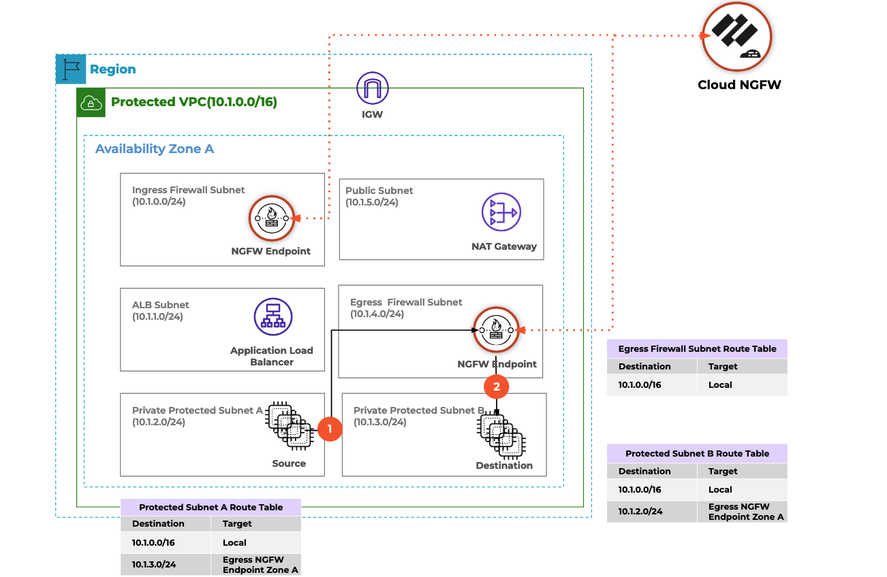

# Prepare AWS Environment

:::important
This is a multi-section tutorial, with dependencies between each section. Please perform each section in order, per the links on the left-hand sidebar.
:::

## Objective

This is the first part of the tutorial, where the objective is to create cloud infrastructure in AWS, into which you will deploy Cloud NGFW. The cloud infrastructure is intentionally basic in design, scoped to provide an easy environment for deploying Cloud NGFW into. You will deploy the AWS infrastructure using Terraform.

Recapping from the [introduction section](/terraform/docs/cloudngfw/aws/tutorials/intro), you will deploy Cloud NGFW into a single VPC in a single availability zone, and protect traffic between two hosts deployed into two separate DMZ subnets.


As well as creating the AWS infrastructure into which Cloud NGFW will be deployed, this section of the tutorial also creates an AWS IAM role. Your AWS account will then "assume" this role in order to perform Cloud NGFW operations.

## Assumptions and Lab Guidance

Please ensure you have read and understood the [assumptions](/terraform/docs/cloudngfw/aws/tutorials/intro/#assumptions) and [lab guideance](terraform/docs/cloudngfw/aws/tutorials/intro/#important---work-in-a-lab-environment-first) at the start of this multi-section tutorial.

## Select and configure Terraform Providers

First, create a `providers.tf` file, in a directory called `00_aws_infra`; the name of this directory will be important later in this tutorial. This file defines any Terraform providers you will use, and configures them appropriately. Here we define just the AWS provider.

Note that you are authenticating to AWS with parameters in the provider configuration. This is just one of [many options for the AWS provider](https://registry.terraform.io/providers/hashicorp/aws/latest/docs#authentication-and-configuration), and care should be taken to ensure that this method is appropriate for your environment. Per the lab guidance above, ideally this tutorial would be performed in a non-production AWS account which contains no production assets or data.

Also please note that Terraform will create and store an SSH key in the local directory, which is to be used for logging in to the test hosts later in the the tutorial.

```hcl title="00_aws_infra/providers.tf"
# Select AWS provider
terraform {
  required_providers {
    aws = {
      source  = "hashicorp/aws"
      version = "~> 4.5"
    }
  }
}

# Configure AWS Provider
provider "aws" {
  region     = var.aws_region
  access_key = var.aws_access_key
  secret_key = var.aws_secret_key
}
```

## Define input variables

Create a `variables.tf` file in the `00_aws_infra` directory, where all the variables for the AWS infrastructure are defined; you will populate values for the variables later.

```hcl title="00_aws_infra/variables.tf"
# Project Variables
variable "projectname" {
  type = string
}

# AWS Provider Variables
variable "aws_region" {
  type = string
}

variable "aws_access_key" {
  type = string
}

variable "aws_secret_key" {
  type = string
}

# VPC Variables
variable "vpc_supernet" {
  type = string
}

variable "dmz1_subnet" {
  type = string
}

variable "dmz2_subnet" {
  type = string
}

variable "cloudngfw_subnet" {
  type = string
}

variable "vpc_availability_zone" {
  type = string
}

# Host variables
variable "host1_ip" {
  type = string
}

variable "host2_ip" {
  type = string
}

variable "host_instance_type" {
  type = string
}
```

## Define input variable values

Next, create a `terraform.tfvars` file in the `00_aws_infra` directory. This file defines values for all the variables defined in the `variables.tf` file.

There is a non-functional variable named `projectname`, which is used as an identifying prefix for the name of infrastructure elements created during this tutorial. This can be changed within the bounds of AWS naming restrictions, so ideally do not make the value of the variable long and do not includ special characters.

Note that you are authenticating to AWS with credentials stored in this `terraform.tfvars` file. This is just one of [many options for the AWS provider](https://registry.terraform.io/providers/hashicorp/aws/latest/docs#authentication-and-configuration), and care should be taken to ensure that this method is appropriate for your environment. Per the lab guidance above, ideally this tutorial would be performed in a non-production AWS account which contains no production assets or data. An alternative to storing the credentials in this file would be to [provide them via environment variables](https://registry.terraform.io/providers/hashicorp/aws/latest/docs#authentication-and-configuration).

```hcl title="00_aws_infra/terraform.tfvars"
# Project Variables
projectname             = "Lab"

# AWS Provider Variables
aws_region              = "us-east-1"
aws_access_key          = "ABC123"
aws_secret_key          = "abc123abc123"

# VPC Variables
vpc_supernet            = "10.1.0.0/16"
dmz1_subnet             = "10.1.2.0/24"
dmz2_subnet             = "10.1.3.0/24"
cloudngfw_subnet        = "10.1.4.0/24"
vpc_availability_zone   = "us-east-1c"

# Host variables
host1_ip                = "10.1.2.10"
host2_ip                = "10.1.3.20"
host_instance_type      = "t3.micro"
```

## Define AWS infrastructure

The next file, `main.tf`, defines all the AWS infrastructure required to create the lab environment into which we will deploy Cloud NGFW. This includes everything from the VPC, to the subnets, two Linux hosts which will be either side of Cloud NGFW, and much more.

```hcl title="00_aws_infra/main.tf"
# Retrieve AWS Account ID
data "aws_caller_identity" "current" {}

# Create a VPC
resource "aws_vpc" "the_vpc" {
  cidr_block = var.vpc_supernet

  tags = {
    name = "${var.projectname}_VPC"
  }
}

# Create subnets
resource "aws_subnet" "the_dmz1" {
  vpc_id            = aws_vpc.the_vpc.id
  cidr_block        = var.dmz1_subnet
  availability_zone = var.vpc_availability_zone

  tags = {
    name = "${var.projectname}_DMZ1"
  }
}

resource "aws_subnet" "the_dmz2" {
  vpc_id            = aws_vpc.the_vpc.id
  cidr_block        = var.dmz2_subnet
  availability_zone = var.vpc_availability_zone

  tags = {
    name = "${var.projectname}_DMZ2"
  }
}

resource "aws_subnet" "the_cloudngfw_subnet" {
  vpc_id            = aws_vpc.the_vpc.id
  cidr_block        = var.cloudngfw_subnet
  availability_zone = var.vpc_availability_zone

  tags = {
    name = "${var.projectname}_CloudNGFW"
  }
}

# Create internet gateway
resource "aws_internet_gateway" "igw" {
  vpc_id = aws_vpc.the_vpc.id

  tags = {
    name = "${var.projectname}_IGW"
  }
}

# Create route tables
resource "aws_route_table" "dmz1_rt" {
  vpc_id = aws_vpc.the_vpc.id
  route {
    cidr_block = "0.0.0.0/0"
    gateway_id = aws_internet_gateway.igw.id
  }

  tags = {
    name = "${var.projectname}_DMZ1_RouteTable"
  }
}

resource "aws_route_table" "dmz2_rt" {
  vpc_id = aws_vpc.the_vpc.id
  route {
    cidr_block = "0.0.0.0/0"
    gateway_id = aws_internet_gateway.igw.id
  }

  tags = {
    name = "${var.projectname}_DMZ2_RouteTable"
  }
}

resource "aws_route_table" "cloudngfw_rt" {
  vpc_id = aws_vpc.the_vpc.id

  tags = {
    name = "${var.projectname}_CloudNGFW_RouteTable"
  }
}

# Assign the route tables to subnets
resource "aws_route_table_association" "rt_association_dmz1" {
  subnet_id      = aws_subnet.the_dmz1.id
  route_table_id = aws_route_table.dmz1_rt.id
}

resource "aws_route_table_association" "rt_association_dmz2" {
  subnet_id      = aws_subnet.the_dmz2.id
  route_table_id = aws_route_table.dmz2_rt.id
}

resource "aws_route_table_association" "rt_association_cloudngfw" {
  subnet_id      = aws_subnet.the_cloudngfw_subnet.id
  route_table_id = aws_route_table.cloudngfw_rt.id
}

# Retrieve AMI ID for latest Ubuntu 20.04
data "aws_ami" "ubuntu_2004" {
  most_recent = true
  owners      = ["099720109477"] # Canonical

  filter {
    name   = "name"
    values = ["ubuntu/images/hvm-ssd/ubuntu-focal-20.04-amd64-server-*"]
  }

  filter {
    name   = "virtualization-type"
    values = ["hvm"]
  }
}

# Generate a Key
resource "tls_private_key" "private_key" {
  algorithm = "RSA"
  rsa_bits  = 4096
}

# Create a Key Pair
resource "aws_key_pair" "key_pair" {
  key_name   = "key_pair"
  public_key = tls_private_key.private_key.public_key_openssh
}
# Save file
resource "local_file" "ssh_key" {
  filename = "ssh_private_key.pem"
  content  = tls_private_key.private_key.private_key_pem
}

# Create hosts
resource "aws_instance" "the_host1" {
  ami                         = data.aws_ami.ubuntu_2004.id
  instance_type               = var.host_instance_type
  subnet_id                   = aws_subnet.the_dmz1.id
  private_ip                  = var.host1_ip
  associate_public_ip_address = true
  vpc_security_group_ids      = [aws_security_group.dmz_sg.id]
  key_name                    = aws_key_pair.key_pair.key_name

  tags = {
    name = "${var.projectname}_Host1"
  }
}

resource "aws_instance" "the_host2" {
  ami                         = data.aws_ami.ubuntu_2004.id
  instance_type               = var.host_instance_type
  subnet_id                   = aws_subnet.the_dmz2.id
  private_ip                  = var.host2_ip
  associate_public_ip_address = true
  vpc_security_group_ids      = [aws_security_group.dmz_sg.id]
  key_name                    = aws_key_pair.key_pair.key_name

  tags = {
    name = "${var.projectname}_Host2"
  }
}

# Create Elastic IPs for the hosts
resource "aws_eip" "host1_eip" {
  vpc = true
  tags = {
    name = "${var.projectname}_Host1_EIP"
  }
}

resource "aws_eip" "host2_eip" {
  vpc = true
  tags = {
    name = "${var.projectname}_Host1_EIP"
  }
}

# Associate Elastic IPs to hosts
resource "aws_eip_association" "host1_eip_association" {
  instance_id   = aws_instance.the_host1.id
  allocation_id = aws_eip.host1_eip.id
}

resource "aws_eip_association" "host2_eip_association" {
  instance_id   = aws_instance.the_host2.id
  allocation_id = aws_eip.host2_eip.id
}

# Create security group for the hosts
resource "aws_security_group" "dmz_sg" {
  name   = "${var.projectname}_dmz_sg"
  vpc_id = aws_vpc.the_vpc.id
  ingress {
    from_port   = 22
    to_port     = 22
    protocol    = "tcp"
    cidr_blocks = ["0.0.0.0/0"]
    description = "Allow incoming SSH connections"
  }
  ingress {
    from_port   = -1
    to_port     = -1
    protocol    = "icmp"
    cidr_blocks = ["0.0.0.0/0"]
    description = "Allow incoming ping"
  }
  egress {
    from_port   = 0
    to_port     = 0
    protocol    = "-1"
    cidr_blocks = ["0.0.0.0/0"]
    description = "Allow all outbound"
  }
}

# Create CloudWatch Log Group for Cloud NGFW logging
resource "aws_cloudwatch_log_group" "cloudngfw_log_group" {
  # The name must be PaloAltoCloudNGFW to ensure Cloud NGFW has permissions to write logs to CloudWatch
  name = "PaloAltoCloudNGFW"

  tags = {
    name = "${var.projectname}_Log_Group"
  }
}

# Create IAM role for Cloud NGFW's operations
resource "aws_iam_role" "ngfw_role" {
  name = "CloudNGFWOpsRole"

  inline_policy {
    name = "apigateway_policy"

    # A policy that allows access to AWS API...
    policy = jsonencode({
      "Version" : "2012-10-17",
      "Statement" : [
        {
          "Effect" : "Allow",
          "Action" : [
            "execute-api:Invoke",
            "execute-api:ManageConnections"
          ],
          "Resource" : "arn:aws:execute-api:*:*:*"
        }
      ]
    })
  }

  # ...and the policy above can be assumed, via this role, only by...
  assume_role_policy = jsonencode({
    "Version" : "2012-10-17",
    "Statement" : [
      {
        "Sid" : "",
        "Effect" : "Allow",
        "Principal" : {
          # ...AWS API Gateway itself...
          "Service" : "apigateway.amazonaws.com"
        },
        "Action" : "sts:AssumeRole"
      },
      {
        "Sid" : "",
        "Effect" : "Allow",
        "Principal" : {
          # ...and the AWS user account(s) specified here:
          "AWS" : [
            # For simplicity, use the account currently executing Terraform
            data.aws_caller_identity.current.arn
          ]
        },
        "Action" : "sts:AssumeRole"
      }
    ]
  })

  tags = {
    CloudNGFWRulestackAdmin = "Yes"
    CloudNGFWFirewallAdmin  = "Yes"
  }
}
```

## Define required outputs

The final file for this section, `outputs.tf`, defines which values Terraform should present and make available at the end of the `apply` phase. You will use these values in later sections of this tutorial.

```hcl title="00_aws_infra/outputs.tf"
# Project Details
output "projectname" {
  value = var.projectname
}

# AWS Account details
output "aws_account_id" {
  value = data.aws_caller_identity.current.account_id
}

output "aws_region" {
  value = var.aws_region
}

# VPC ID
output "vpc_id" {
  value = aws_vpc.the_vpc.id
}

# Subnet IDs
output "dmz1_subnet_id" {
  value = aws_subnet.the_dmz1.id
}
output "dmz2_subnet_id" {
  value = aws_subnet.the_dmz2.id
}
output "cloudngfw_subnet_id" {
  value = aws_subnet.the_cloudngfw_subnet.id
}

# Subnet CIDR blocks
output "dmz1_subnet_cidr_block" {
  value = aws_subnet.the_dmz1.cidr_block
}
output "dmz2_subnet_cidr_block" {
  value = aws_subnet.the_dmz2.cidr_block
}

# Route Table IDs
output "dmz1_routetable_id" {
  value = aws_route_table.dmz1_rt.id
}
output "dmz2_routetable_id" {
  value = aws_route_table.dmz2_rt.id
}
output "cloudngfw_routetable_id" {
  value = aws_route_table.cloudngfw_rt.id
}

# Host IPs
output "host1_public_ip" {
  value = aws_instance.the_host1.public_ip
}
output "host1_private_ip" {
  value = aws_instance.the_host1.private_ip
}
output "host2_public_ip" {
  value = aws_instance.the_host2.public_ip
}
output "host2_private_ip" {
  value = aws_instance.the_host2.private_ip
}

# CloudWatch Log Group
output "cloudwatch_log_group" {
  value = aws_cloudwatch_log_group.cloudngfw_log_group.name
}

# Cloud NGFW Role's ARN
output "cloudngfw_role_arn" {
  value = aws_iam_role.ngfw_role.arn
}
```

## Terraform init

With all the files above in place, ensure you are in the `00_aws_infra` directory, then execute `terraform init` to initialize the Terraform working directory and download the required providers. Your output should look similar to this:

```hcl
Initializing the backend...

Initializing provider plugins...
- Finding latest version of hashicorp/local...
- Finding hashicorp/aws versions matching "~> 4.5"...
- Finding latest version of hashicorp/tls...
- Installing hashicorp/local v2.3.0...
- Installed hashicorp/local v2.3.0 (signed by HashiCorp)
- Installing hashicorp/aws v4.52.0...
- Installed hashicorp/aws v4.52.0 (signed by HashiCorp)
- Installing hashicorp/tls v4.0.4...
- Installed hashicorp/tls v4.0.4 (signed by HashiCorp)

Terraform has created a lock file .terraform.lock.hcl to record the provider
selections it made above. Include this file in your version control repository
so that Terraform can guarantee to make the same selections by default when
you run "terraform init" in the future.

Terraform has been successfully initialized!
```

## Terraform plan

Next, run `terraform plan` to view the upcoming changes Terraform would make next. The output here will be substantial, it should look similar to this, truncated for brevity:

```hcl
Terraform used the selected providers to generate the following execution plan. Resource actions are indicated with the following symbols:
  + create

Terraform will perform the following actions:

  # aws_eip.host1_eip will be created
  + resource "aws_eip" "host1_eip" {
      + allocation_id        = (known after apply)
      + association_id       = (known after apply)
      + carrier_ip           = (known after apply)
      + customer_owned_ip    = (known after apply)
      + domain               = (known after apply)
      + id                   = (known after apply)
      + instance             = (known after apply)
      + network_border_group = (known after apply)
      + network_interface    = (known after apply)
      + private_dns          = (known after apply)
      + private_ip           = (known after apply)
      + public_dns           = (known after apply)
.
.
.
.
.
  # tls_private_key.private_key will be created
  + resource "tls_private_key" "private_key" {
      + algorithm                     = "RSA"
      + ecdsa_curve                   = "P224"
      + id                            = (known after apply)
      + private_key_openssh           = (sensitive value)
      + private_key_pem               = (sensitive value)
      + private_key_pem_pkcs8         = (sensitive value)
      + public_key_fingerprint_md5    = (known after apply)
      + public_key_fingerprint_sha256 = (known after apply)
      + public_key_openssh            = (known after apply)
      + public_key_pem                = (known after apply)
      + rsa_bits                      = 4096
    }

Plan: 22 to add, 0 to change, 0 to destroy.

Changes to Outputs:
  + aws_account_id          = "1234567890"
  + aws_region              = "us-east-1"
  + cloudngfw_role_arn      = (known after apply)
  + cloudngfw_routetable_id = (known after apply)
  + cloudngfw_subnet_id     = (known after apply)
  + dmz1_routetable_id      = (known after apply)
  + dmz1_subnet_cidr_block  = "10.0.1.0/24"
  + dmz1_subnet_id          = (known after apply)
  + dmz2_routetable_id      = (known after apply)
  + dmz2_subnet_cidr_block  = "10.0.2.0/24"
  + dmz2_subnet_id          = (known after apply)
  + host1_private_ip        = "10.0.1.10"
  + host1_public_ip         = (known after apply)
  + host2_private_ip        = "10.0.2.20"
  + host2_public_ip         = (known after apply)
  + projectname             = "Lab"
  + vpc_id                  = (known after apply)
```

## Terraform apply

If you are happy with the plan, as described in the output from the previous step, instruct Terraform to create the AWS infrastructure with `terraform apply --auto-approve`. The output will look like this, again truncated for brevity:

```hcl
tls_private_key.private_key: Creating...
aws_vpc.the_vpc: Creating...
aws_eip.host2_eip: Creating...
aws_eip.host1_eip: Creating...
.
.
.
.
Apply complete! Resources: 22 added, 0 changed, 0 destroyed.

Outputs:

aws_account_id = "1234567890"
aws_region = "us-east-1"
cloudngfw_role_arn = "arn:aws:iam::1234567890:role/CloudNGFWOpsRole"
cloudngfw_routetable_id = "rtb-0d324b3b04057230b"
cloudngfw_subnet_id = "subnet-0580adba4c2668cd1"
dmz1_routetable_id = "rtb-0eef162c27e233c0e"
dmz1_subnet_cidr_block = "10.0.1.0/24"
dmz1_subnet_id = "subnet-07623bc97e1bd6c42"
dmz2_routetable_id = "rtb-050fb3bb70d239747"
dmz2_subnet_cidr_block = "10.0.2.0/24"
dmz2_subnet_id = "subnet-0d2a7c9a997a57ad0"
host1_private_ip = "10.0.1.10"
host1_public_ip = "54.152.107.139"
host2_private_ip = "10.0.2.20"
host2_public_ip = "3.94.107.227"
projectname = "Lab"
vpc_id = "vpc-058a94a8c109bbde9"
```
