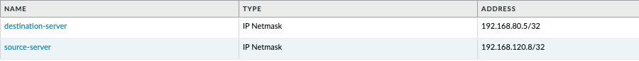
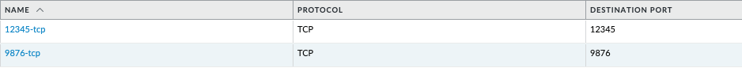
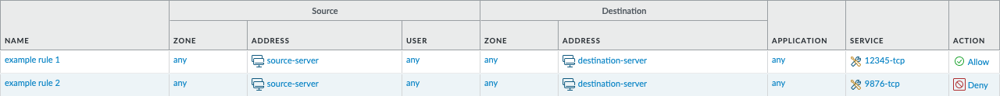

import Assumptions from "../_assumptions.md";
import LabGuidance from "/products/shared/_lab-guidance.md";
import ClosingNotes from "../_closingnotes.md";
import TutorialInit from "./_tutorial-init.md";

# Configuring Security Policy (Firewall) Rules and Objects

With this Terraform code, you will configure a number of items on a PAN-OS next-generation firewall related to security policies (firewall rules). This will include address objects, service objects, and the rules themselves.

<Assumptions />

<LabGuidance />

## Get Terraform ready for configuration

In the first section, you will create a Terraform file, and initialize Terraform so it is ready to perform configuration operations.

1. Create a file called `security-policies.tf` and paste in the following content:

<TutorialInit />

## Address Objects

This Terraform code will configure address objects items to be used later in the security policies.

1. Add the following code to the bottom of the existing `security-policies.tf` file:

```hcl
resource "panos_address_object" "destination-server" {
  name        = "destination-server"
  value       = "192.168.80.5/32"
  description = "Address object 1 from Terraform"

  lifecycle {
    create_before_destroy = true
  }
}

resource "panos_address_object" "source-server" {
  name        = "source-server"
  value       = "192.168.120.8/32"
  description = "Address object 2 from Terraform"

  lifecycle {
    create_before_destroy = true
  }
}
```

2. Instruct Terraform to inspect the firewall, and calculate the changes it will need to make in future, based on the Terraform code:

```
terraform plan
```

3. Assuming you did not already have address objects with the same names as those in the Terraform code, the output should look something like this:

```hcl
Terraform used the selected providers to generate the following execution plan. Resource actions are indicated with the following symbols:
  + create

Terraform will perform the following actions:

  # panos_address_object.destination-server will be created
  + resource "panos_address_object" "destination-server" {
      + description  = "Address object 1 from Terraform"
      + device_group = "shared"
      + id           = (known after apply)
      + name         = "destination-server"
      + type         = "ip-netmask"
      + value        = "192.168.80.5/32"
      + vsys         = "vsys1"
    }

  # panos_address_object.source-server will be created
  + resource "panos_address_object" "source-server" {
      + description  = "Address object 2 from Terraform"
      + device_group = "shared"
      + id           = (known after apply)
      + name         = "source-server"
      + type         = "ip-netmask"
      + value        = "192.168.120.8/32"
      + vsys         = "vsys1"
    }

Plan: 2 to add, 0 to change, 0 to destroy.
```

4. Instruct Terraform to inspect the firewall, calculate the changes it will need to make (based on the Terraform code), and execute the changes:

```
terraform apply
```

5. When prompted, say `yes` to confirm you are happy to make these changes

```
Do you want to perform these actions?
  Terraform will perform the actions described above.
  Only 'yes' will be accepted to approve.

  Enter a value:
```

6. The output should look something like this:

```hcl
panos_address_object.source-server: Creating...
panos_address_object.destination-server: Creating...
panos_address_object.source-server: Creation complete after 1s [id=vsys1:source-server]
panos_address_object.destination-server: Creation complete after 1s [id=vsys1:destination-server]

Apply complete! Resources: 2 added, 0 changed, 0 destroyed.
```

7. Login to the PAN-OS GUI and confirm that the two new address objects `source-server` and `destination-server` have been created.



## Service Objects

This Terraform code will configure service objects items to be used later in the security policies.

1. Add the following code to the bottom of the existing `security-policies.tf` file:

```hcl
resource "panos_service_object" "tcp-12345" {
  name             = "12345-tcp"
  protocol         = "tcp"
  description      = "Service object 1 from Terraform"

  lifecycle {
    create_before_destroy = true
  }
  destination_port = "12345"
}

resource "panos_service_object" "tcp-9876" {
  name             = "9876-tcp"
  protocol         = "tcp"
  description      = "Service object 2 from Terraform"

  lifecycle {
    create_before_destroy = true
  }
  destination_port = "9876"
}
```

2. Instruct Terraform to inspect the firewall, and calculate the changes it will need to make in future, based on the Terraform code:

```
terraform plan
```

3. Assuming you did not already have address objects with the same names as those in the Terraform code, the output should look something like this:

```hcl
Terraform used the selected providers to generate the following execution plan. Resource actions are indicated with the following symbols:
  + create

Terraform will perform the following actions:

  # panos_service_object.tcp-12345 will be created
  + resource "panos_service_object" "tcp-12345" {
      + description      = "Service object 1 from Terraform"
      + destination_port = "12345"
      + id               = (known after apply)
      + name             = "12345-tcp"
      + protocol         = "tcp"
      + vsys             = "vsys1"
    }

  # panos_service_object.tcp-9876 will be created
  + resource "panos_service_object" "tcp-9876" {
      + description      = "Service object 2 from Terraform"
      + destination_port = "9876"
      + id               = (known after apply)
      + name             = "9876-tcp"
      + protocol         = "tcp"
      + vsys             = "vsys1"
    }

Plan: 2 to add, 0 to change, 0 to destroy.
```

4. Instruct Terraform to inspect the firewall, calculate the changes it will need to make (based on the Terraform code), and execute the changes:

```
terraform apply
```

5. When prompted, say `yes` to confirm you are happy to make these changes

```
Do you want to perform these actions?
  Terraform will perform the actions described above.
  Only 'yes' will be accepted to approve.

  Enter a value:
```

6. The output should look something like this:

```hcl
panos_service_object.tcp-9876: Creating...
panos_service_object.tcp-12345: Creating...
panos_service_object.tcp-9876: Creation complete after 0s [id=vsys1:tcp-9876]
panos_service_object.tcp-12345: Creation complete after 0s [id=vsys1:tcp-12345]

Apply complete! Resources: 2 added, 0 changed, 0 destroyed.
```

7. Login to the PAN-OS GUI and confirm that the two new address objects `tcp-12345` and `tcp-9876` have been created.



## Security Policy (Firewall) Rules

This Terraform code will configure security policies, referencing the address and service objects previously created.

1. Add the following code to the bottom of the existing `security-policies.tf` file:

```hcl
resource "panos_security_rule_group" "example_ruleset" {
  position_keyword = "bottom"
  rule {
    name                  = "example rule 1"
    source_zones          = ["any"]
    source_addresses      = [panos_address_object.source-server.name]
    source_users          = ["any"]
    destination_zones     = ["any"]
    destination_addresses = [panos_address_object.destination-server.name]
    applications          = ["ssh"]
    services              = [panos_service_object.tcp-12345.name]
    categories            = ["any"]
    action                = "allow"
  }
  rule {
    name                  = "example rule 2"
    source_zones          = ["any"]
    source_addresses      = [panos_address_object.source-server.name]
    source_users          = ["any"]
    destination_zones     = ["any"]
    destination_addresses = [panos_address_object.destination-server.name]
    applications          = ["any"]
    services              = [panos_service_object.tcp-9876.name]
    categories            = ["any"]
    action                = "deny"
  }

  lifecycle {
    create_before_destroy = true
  }
}
```

2. Instruct Terraform to inspect the firewall, and calculate the changes it will need to make in future, based on the Terraform code:

```
terraform plan
```

3. The output should look something like this:

```hcl
Terraform used the selected providers to generate the following execution plan. Resource actions are indicated with the following symbols:
  + create

Terraform will perform the following actions:

  # panos_security_rule_group.example_ruleset will be created
  + resource "panos_security_rule_group" "example_ruleset" {
      + device_group     = "shared"
      + id               = (known after apply)
      + position_keyword = "bottom"
      + rulebase         = "pre-rulebase"
      + vsys             = "vsys1"

      + rule {
          + action                = "allow"
          + applications          = [
              + "ssh",
            ]
          + categories            = [
              + "any",
            ]
          + destination_addresses = [
              + "destination-server",
            ]
          + destination_zones     = [
              + "any",
            ]
          + log_end               = true
          + name                  = "example rule 1"
          + services              = [
              + "tcp-12345",
            ]
          + source_addresses      = [
              + "source-server",
            ]
          + source_users          = [
              + "any",
            ]
          + source_zones          = [
              + "any",
            ]
          + type                  = "universal"
          + uuid                  = (known after apply)
        }
      + rule {
          + action                = "deny"
          + applications          = [
              + "any",
            ]
          + categories            = [
              + "any",
            ]
          + destination_addresses = [
              + "destination-server",
            ]
          + destination_zones     = [
              + "any",
            ]
          + log_end               = true
          + name                  = "example rule 2"
          + services              = [
              + "tcp-9876",
            ]
          + source_addresses      = [
              + "source-server",
            ]
          + source_users          = [
              + "any",
            ]
          + source_zones          = [
              + "any",
            ]
          + type                  = "universal"
          + uuid                  = (known after apply)
        }
    }

Plan: 1 to add, 0 to change, 0 to destroy.
```

4. Instruct Terraform to inspect the firewall, calculate the changes it will need to make (based on the Terraform code), and execute the changes:

```
terraform apply
```

5. When prompted, say `yes` to confirm you are happy to make these changes

```
Do you want to perform these actions?
  Terraform will perform the actions described above.
  Only 'yes' will be accepted to approve.

  Enter a value:
```

6. The output should look something like this:

```hcl
panos_security_rule_group.example_ruleset: Creating...
panos_security_rule_group.example_ruleset: Creation complete after 1s [id=shared:pre-rulebase:vsys1:6::ZXhhbXBsZSBydWxlIDEKZXhhbXBsZSBydWxlIDI=]

Apply complete! Resources: 1 added, 0 changed, 0 destroyed.
```

7. Login to the PAN-OS GUI and confirm that the two new address objects `example rule 1` and `example rule 2` have been created.



## Committing Configuration Changes

Please note that, due to how Terraform operates, in-band commits for PAN-OS are currently not possible. Therefore the changes you made with the steps above will be present only in the candidate configuration. A commit can performed out of band, either manually or through the approach discussed [here](/terraform/docs/panos/guides/commits).

## Final code

Putting all the sections together, the code in entirety looks like this:

```hcl
# Define required Terraform providers
terraform {
  required_providers {
    panos = {
      source  = "paloaltonetworks/panos"
      version = "~> 1.11.0"
    }
  }
}

# Configure the PAN-OS provider for Terraform
provider "panos" {
  hostname = var.panos_hostname
  username = var.panos_username
  password = var.panos_password
}

variable "panos_hostname" {
  type    = string
  default = "192.168.1.1"
}

variable "panos_username" {
  type    = string
  default = "admin"
}

variable "panos_password" {
  type    = string
  default = "admin"
}

# Create address objects
resource "panos_address_object" "destination-server" {
  name        = "destination-server"
  value       = "192.168.80.5/32"
  description = "Address object 1 from Terraform"

  lifecycle {
    create_before_destroy = true
  }
}

resource "panos_address_object" "source-server" {
  name        = "source-server"
  value       = "192.168.120.8/32"
  description = "Address object 2 from Terraform"

  lifecycle {
    create_before_destroy = true
  }
}

# Create service objects
resource "panos_service_object" "tcp-12345" {
  name        = "12345-tcp"
  protocol    = "tcp"
  description = "Service object 1 from Terraform"

  lifecycle {
    create_before_destroy = true
  }
  destination_port = "12345"
}

resource "panos_service_object" "tcp-9876" {
  name        = "9876-tcp"
  protocol    = "tcp"
  description = "Service object 2 from Terraform"

  lifecycle {
    create_before_destroy = true
  }
  destination_port = "9876"
}

# Create security rules
resource "panos_security_rule_group" "example_ruleset" {
  position_keyword = "bottom"
  rule {
    name                  = "example rule 1"
    source_zones          = ["any"]
    source_addresses      = [panos_address_object.source-server.name]
    source_users          = ["any"]
    destination_zones     = ["any"]
    destination_addresses = [panos_address_object.destination-server.name]
    applications          = ["ssh"]
    services              = [panos_service_object.tcp-12345.name]
    categories            = ["any"]
    action                = "allow"
  }
  rule {
    name                  = "example rule 2"
    source_zones          = ["any"]
    source_addresses      = [panos_address_object.source-server.name]
    source_users          = ["any"]
    destination_zones     = ["any"]
    destination_addresses = [panos_address_object.destination-server.name]
    applications          = ["any"]
    services              = [panos_service_object.tcp-9876.name]
    categories            = ["any"]
    action                = "deny"
  }

  lifecycle {
    create_before_destroy = true
  }
}
```

<ClosingNotes />
